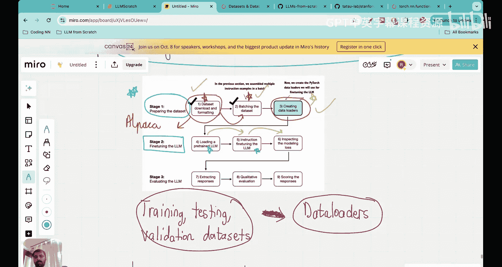

# 37：指令微调中的数据加载器

在本节课中，我们将学习如何为指令微调数据集创建数据加载器。数据加载器是高效访问和处理数据批次的关键工具，对于训练大型语言模型至关重要。

## 概述

在上一节中，我们完成了指令微调的第一步（数据下载与格式化）和第二步（数据分批）。本节我们将专注于第三步：创建数据加载器。数据加载器可以看作是一种高效的方式，能在需要时按顺序收集不同的数据批次，从而简化大语言模型的训练过程。

## 数据加载器简介

数据加载器围绕数据集包装了一个可迭代对象。这意味着我们可以使用数据加载器以迭代（即顺序）的方式访问我们创建的批次。它本质上使得访问不同的数据样本变得非常容易。

我们使用数据集和数据加载器的主要目的是为了提高数据访问的效率。这在训练像大语言模型这样拥有超过1亿参数的巨大模型时，会产生巨大的影响。

## 前期步骤回顾

在深入数据加载器之前，让我们快速回顾一下已完成的工作。

**第一步：数据集下载与格式化**
我们使用了指令微调数据集，其中包含1100对指令、输入和输出。例如，指令可能是“编辑以下句子的语法”，输入是“he go to the park every day”，正确的输出是“he goes to the park every day”。我们的目标是通过这些数据教会大语言模型如何更好地遵循指令并有效响应。我们使用了一种名为 **Alpaca格式** 的特定模板来格式化这些数据，将每条指令-响应对转换为一个完整的提示词，作为模型的输入。

**第二步：数据分批**
数据分批并非简单地创建批次，而是涉及多个步骤，可以归纳为五个主要组成部分：
1.  使用提示词模板格式化数据。
2.  将格式化后的数据**标记化**，转换为标记ID。
3.  **填充**数据，确保一个批次内所有样本的标记ID数量相同。具体做法是找到该批次中最长的样本，然后用结束文本标记（如50256）填充其他较短的样本。
4.  创建**输入-目标对**。目标是输入向右移动一位，并在末尾添加一个结束文本标记。这是微调中最重要的步骤，模型通过“下一个标记预测”任务来学习。
5.  将填充用的标记（除了最后一个表示序列结束的标记）替换为 **`-100`**。这是因为在PyTorch的交叉熵损失函数中，`-100` 被指定为忽略索引，这些位置的损失不会被计算。

理解批次是如何创建的对后续理解数据加载器至关重要。

## 创建数据加载器

现在，让我们开始今天课程的核心内容：为指令数据集创建数据加载器。

我们拥有训练、测试和验证数据集，并且已经将它们分批。接下来，我们将把这些数据集传递给数据加载器，创建对应的训练、测试和验证数据加载器。

### 设备转移优化

在创建数据加载器之前，需要了解一个优化点：**设备转移**。在我们的自定义整理函数中，包含了将输入和目标张量转移到特定设备（如CPU或GPU）的代码。这样做的好处是，设备转移过程可以作为后台进程在训练循环之外执行，从而防止在模型训练期间阻塞GPU，提高了训练效率。

### 使用 `partial` 函数预设参数

我们将使用Python `functools` 标准库中的 `partial` 函数来创建一个新版本的函数，并预先填充设备参数。例如，我们将设备预设为CPU，并将允许的最大上下文长度设置为1024。

### 设置数据加载器

以下是设置数据加载器的关键步骤：

1.  我们有一个之前定义的 `InstructionDataset` 类，它负责加载数据并将其转换为标记ID。
2.  我们创建这个数据集类的实例（例如 `train_dataset`），它包含了85%的训练数据。
3.  我们使用PyTorch的 `DataLoader` 函数，并传入训练数据集实例。
4.  最关键的是，我们指定使用自定义的 `collate_fn`（整理函数）。这个函数封装了之前回顾的所有批次创建逻辑（格式化、标记化、填充、创建输入-目标对、替换填充标记）。
5.  我们设置批次大小（例如 `batch_size=8`），这意味着每个批次将包含8个提示词。

我们以同样的方式创建验证加载器和测试加载器。

### 理解数据加载器的输出

运行代码后，打印训练加载器，你会看到类似以下的输出：
第一个批次输入张量的形状是 `(8, 61)`，目标张量的形状也是 `(8, 61)`。这里的 `8` 代表批次大小，`61` 代表该批次中每个样本的标记数量（由该批次中最长的样本决定）。

第二个批次的形状可能是 `(8, 76)`。这是因为每个批次是独立处理的，其长度取决于该批次内最长样本的标记数量。因此，不同批次的序列长度可能不同。

通过数据加载器，我们可以轻松地按顺序访问这些批次。例如，要访问第二个批次的第二个样本，只需定位到对应的行即可。

## 总结

本节课中，我们一起学习了如何为指令微调创建数据加载器。我们回顾了数据准备的核心步骤，并详细讲解了如何利用PyTorch的 `DataLoader` 和自定义整理函数来高效地组织和管理数据批次。理解数据加载器的维度和工作原理，是顺利进行后续模型训练的基础。

在指令微调乃至所有机器学习项目中，数据准备步骤至关重要。一个优秀的工程师需要花费大量时间在数据预处理和清洗上。至此，我们已经完成了指令微调的第一阶段——数据准备。

在下一讲中，我们将进入第二阶段：加载预训练的大语言模型并开始实际的微调过程，观察其性能变化。

