# 38：加载预训练大语言模型权重 🧠

在本节课中，我们将学习指令微调实践项目的第四步：加载一个预训练的大语言模型。

## 概述

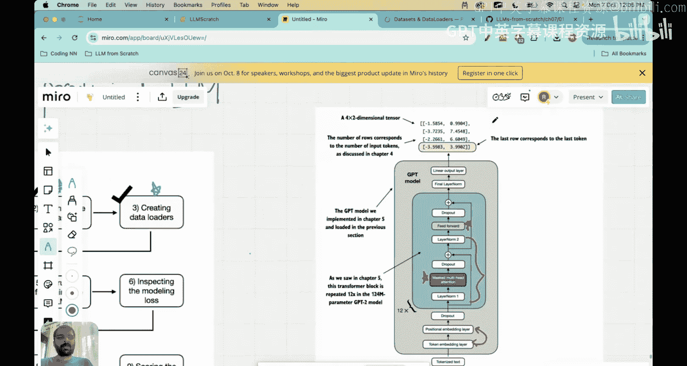

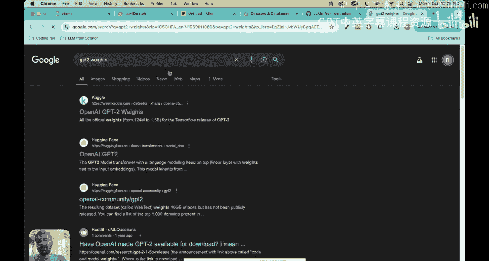

上一节我们介绍了如何为数据集创建数据加载器。本节中，我们来看看如何加载一个预训练的大语言模型，并理解其重要性。加载预训练权重是微调过程的关键一步，它能让模型从一个“有知识”的状态开始学习，而不是从随机初始化开始，从而大大节省计算资源和时间。

## 加载预训练模型的意义

我们之前构建的LLM架构包含许多可训练参数，例如多头注意力中的查询、键、值权重矩阵，前馈神经网络中的神经元权重，层归一化中的缩放和偏移参数，以及词嵌入层和位置嵌入层的权重。这些参数的总和可能超过1亿个。

在预训练过程中，这些参数在大量数据上进行了训练和优化。例如，OpenAI公开了GPT-2在不同参数量级（如1.24亿、3.55亿、7.74亿）上训练好的权重。我们下载并重用这些权重的主要目的是让模型从一个**有知识的状态**开始，而不是从**随机初始化**开始。

这样做的好处是，模型已经掌握了语言的基本规律和语义信息。当我们在此基础上，使用我们特定的指令数据集进行微调时，模型只需要针对新任务进行小幅调整，训练过程将更加高效，所需时间和计算资源也更少。

## 选择模型规模

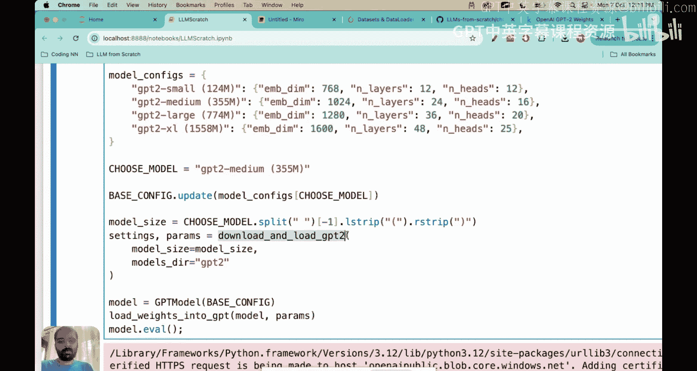

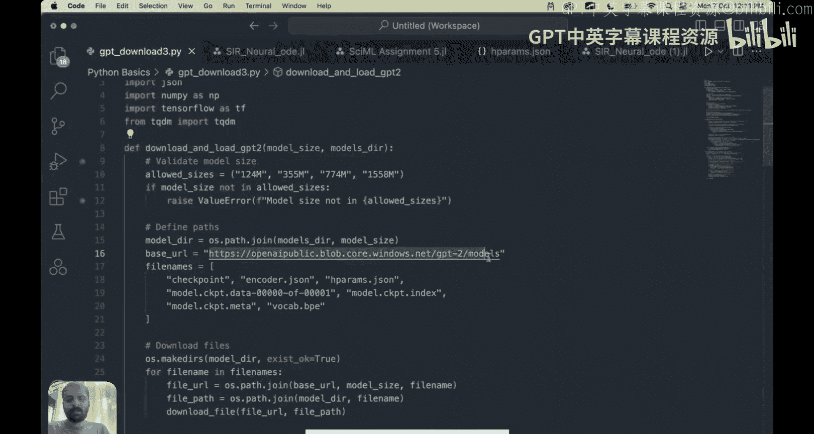

在之前的垃圾邮件分类项目中，我们使用了1.17亿参数的小模型。但对于指令微调任务，我们发现小模型表现不佳，因此需要选择更大的模型。本节我们将加载GPT-2 Medium模型，它拥有**3.55亿**个参数，需要大约1.42GB的存储空间。请确保你的本地机器有足够的空间。

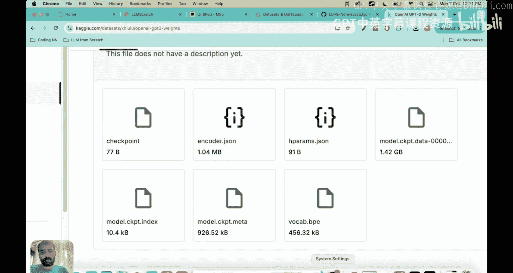

以下是该模型的关键配置：
*   **词汇表大小**：`50257`
*   **上下文长度**：`1024`
*   **Transformer块数量**：`24`
*   **注意力头数量**：`16`

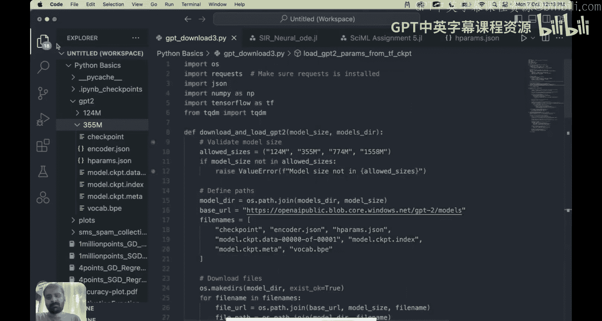

## 下载与加载权重的步骤

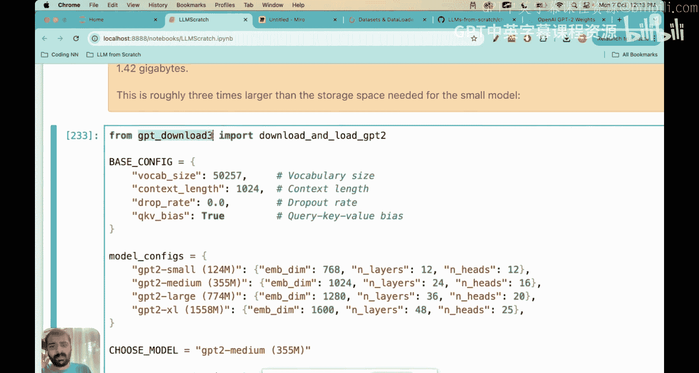

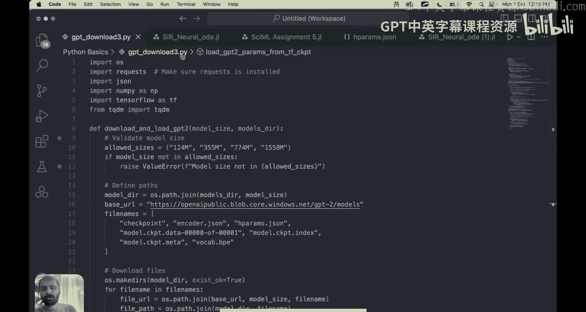

以下是加载预训练权重的核心步骤：

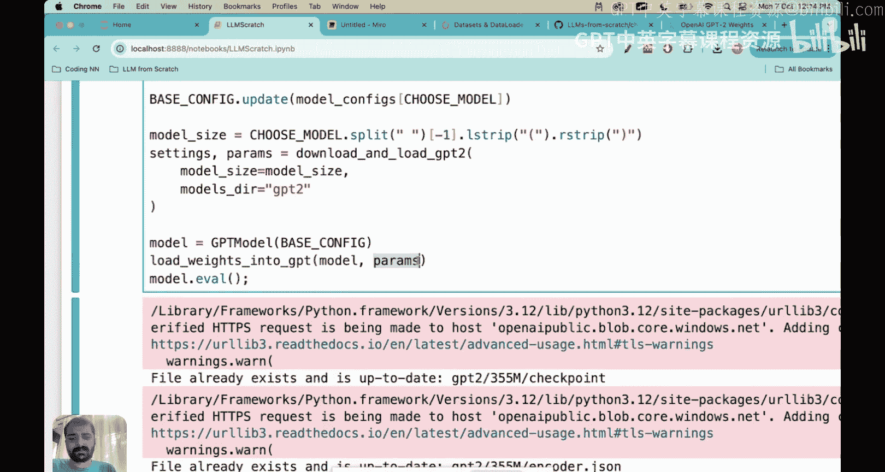

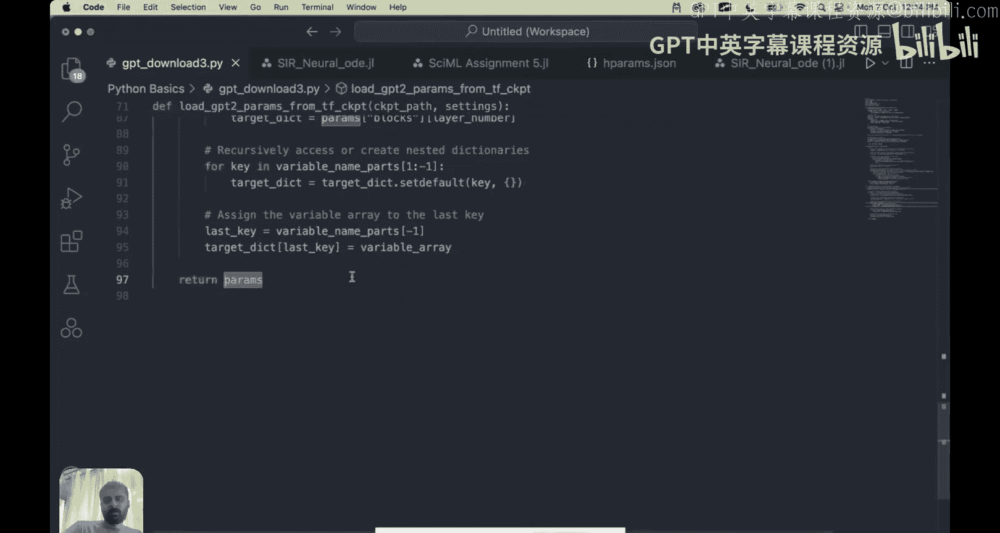

1.  **下载权重文件**：代码会从指定URL下载GPT-2 Medium模型的7个权重文件到本地。
2.  **转换权重格式**：下载的原始文件需要经过预处理，转换成一个结构化的参数字典（`params dictionary`），以便于我们后续的代码访问和集成。
3.  **将权重载入模型**：通过 `load_weights_into_gpt` 函数，将参数字典中的权重精确地映射到我们之前构建的GPT模型架构的对应层中。

> 注：关于下载和加载权重的详细代码逻辑，我们在之前的“使用GPT-2权重进行预训练”课程中已深入讲解。本课中，你只需按顺序执行代码即可完成加载。

## 验证预训练模型的初始表现

在开始微调之前，我们可以先检验一下仅加载了预训练权重的模型在指令任务上的表现。我们从验证集中选取一个例子：

*   **指令**：将主动语态句子转换为被动语态。
*   **输入**：厨师每天做饭。
*   **期望输出**：饭每天由厨师做。

我们使用模型的生成函数，输入指令和句子，并设定生成新token的最大数量。然后，我们提取模型生成的响应部分（排除输入的指令）。

**模型生成的响应**：厨师每天做饭。（模型只是原样重复了输入句子）

分析表明，**未经微调的预训练模型无法正确遵循指令**。它只是重复了输入的文本，甚至可能包含一些无关的格式字符，完全没有执行“转换为被动语态”的任务。这清晰地说明了为什么我们需要指令微调：预训练模型擅长续写文本，但不擅长理解并执行具体的指令。

## 总结

本节课中我们一起学习了如何加载预训练的大语言模型权重。我们理解了重用预训练权重可以让模型从一个知识丰富的起点开始，从而高效地进行后续的指令微调。通过一个简单的测试，我们也亲眼看到了未经微调的模型在遵循指令方面的局限性。

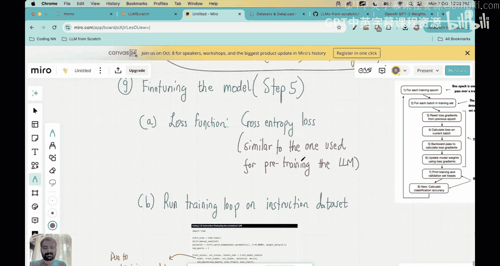

下一节，我们将正式进入指令微调过程，通过训练来调整模型的权重，使其学会理解并正确响应我们数据集中各种指令。