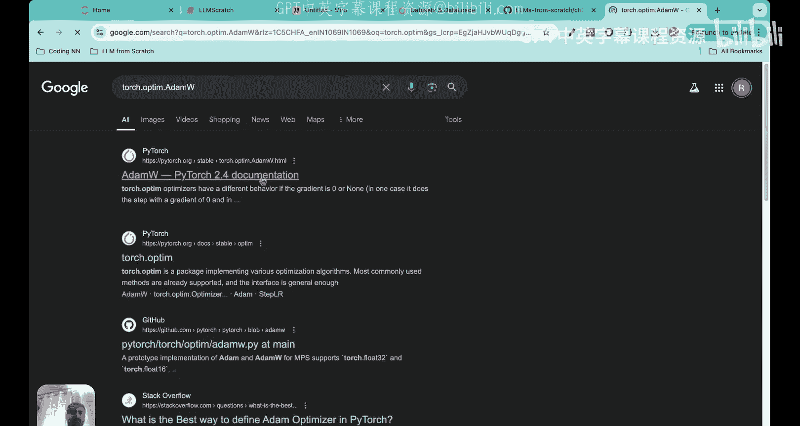
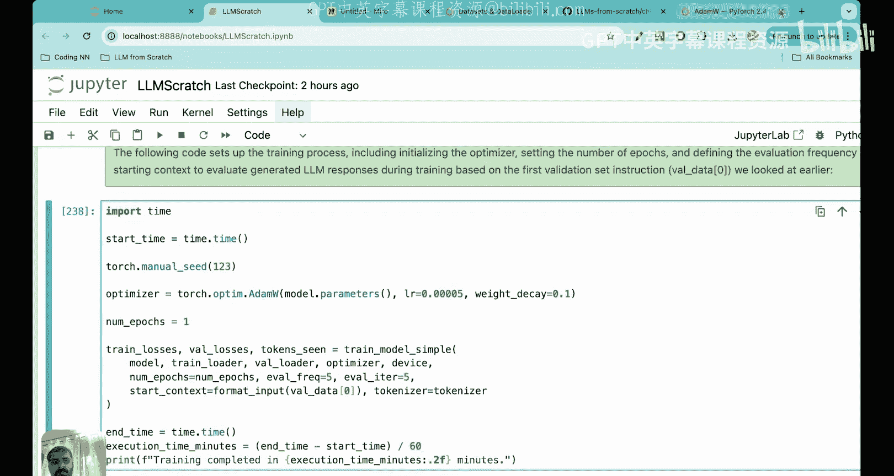
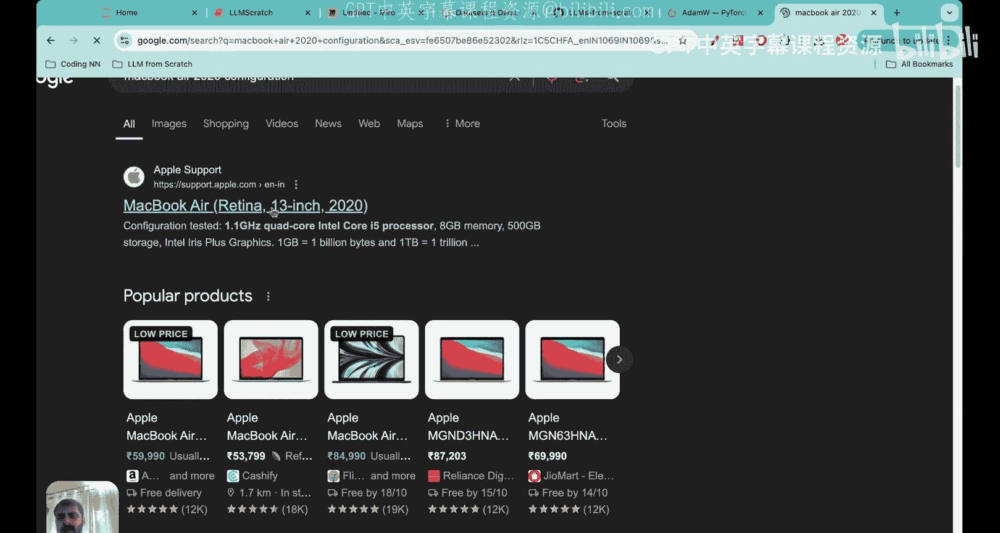
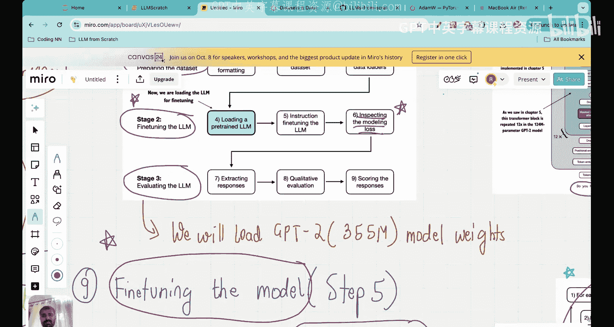

# 39：LLM 微调训练循环实战

在本节课中，我们将学习如何对我们过去几节课中开发的大语言模型进行微调。我们将实现一个完整的训练循环，使用指令数据集来优化模型权重，使其能够更好地理解和遵循指令。

## 概述

我们一直在研究一个示例：我们有一个预训练好的大语言模型，但它并不擅长理解和遵循指令。因此，我们需要进行指令微调。这个过程分为三个阶段：
1.  准备数据集。
2.  微调大语言模型。
3.  评估大语言模型。

在前几节课中，我们已经完成了第一阶段：下载数据、使用 Alpaca 提示格式格式化数据、将数据划分为多个批次，并创建了训练、测试和验证数据加载器。

在第二阶段，我们加载了 GPT-2 的预训练权重，搭建好了模型架构。现在，我们将使用包含 1100 条指令-输入-输出对的数据集来微调这个模型，目标是让模型学会如何响应指令。

## 微调前的模型状态

在上一节课结束时，我们测试了未经微调的预训练模型。我们给出指令“将主动句转换为被动句”和句子“厨师每天做饭”。模型的输出是“厨师每天做饭”，它只是重复了输入内容，未能完成转换任务。这表明模型目前无法遵循指令。

## 微调的原理

我们的模型架构中有许多可训练参数，包括词嵌入、位置嵌入、层归一化中的缩放和偏移参数、多头注意力中的查询/键/值权重矩阵以及前馈神经网络中的权重。

微调意味着我们将在这个特定的指令数据集上再次训练这些权重，使它们得到优化，从而使模型能够很好地回答指令。

你可能会问，既然我们要在这个特定数据集上再次训练，为什么还要进行预训练？原因是预训练让模型从一个“有知识”的状态开始，而不是从随机状态开始。预训练使模型理解了语言的语义、单词之间的关系等基础知识，这为后续在特定数据上的微调奠定了坚实的基础。微调总是在预训练之后进行。

## 训练循环与损失函数

在开始微调之前，我们需要理解两个核心概念：训练循环和损失函数。它们与我们在预训练阶段使用的完全相同。

以下是训练循环的基本步骤：
1.  遍历数据中的每个批次。
2.  计算损失梯度（在每个新周期开始时重置梯度）。
3.  计算当前批次的损失。
4.  执行反向传播，计算损失相对于所有参数的梯度（我们的模型有 3.55 亿个参数）。
5.  使用基于梯度下降的优化器更新参数，其基本公式为：
    **`w_new = w_old - α * (∂Loss/∂w)`**
    其中 `α` 是学习率。
6.  多次重复此过程，目标是使损失函数最小化。

损失函数基于输入和目标对计算。我们的数据加载器中的每个样本都包含输入和目标。对于下一个词预测任务，目标就是输入序列向右移动一位，并添加文本结束标记。

预测值由模型的生成函数产生。输入序列通过 GPT 架构后，会输出一个逻辑张量，该张量被转换为概率张量，从而得到模型的预测输出。

基于真实值（目标）和预测值，我们计算损失函数，这里使用的是**交叉熵损失**。其核心思想是希望正确预测的概率尽可能接近 1，从而使损失函数的值尽可能接近 0。

## 代码实现：复用与准备

我们已经完成了数据处理、分批和数据加载器创建等繁重工作。现在，我们可以复用之前在预训练中实现的损失计算和训练函数。

以下是关键函数：
*   `calc_loss_batch`: 计算一个批次数据的交叉熵损失。
*   `calc_loss_loader`: 计算整个数据加载器的总损失（对批次损失求和后除以批次数量）。

训练循环代码的核心部分是反向传播（计算损失梯度）和优化器步骤。我们将使用 **AdamW** 优化器（Adam with weight decay），这是目前机器学习中最常用的优化器之一，它能跟踪损失函数的梯度及其平方，有助于避免陷入局部最小值并加速收敛。

在开始训练前，我们先计算初始的训练损失和验证损失。此时模型尚未在指令数据集上训练，因此损失值会很高（训练损失约 3.82，验证损失约 3.76）。我们的目标是通过训练降低这些损失。

## 配置与启动训练

现在，我们配置训练过程：
*   **优化器**: `torch.optim.AdamW`，学习率设为 `0.00005`，权重衰减设为 `0.1`。这些都是可以调整的超参数。
*   **训练周期**: 设为 `1`。由于计算资源限制（使用 2020 款 MacBook Air，8GB 内存，CPU 运行），增加周期数会导致训练时间过长或系统崩溃。建议有 GPU 资源的用户尝试更多周期。
*   **评估频率**: 每处理 5 个批次后计算并打印一次验证损失。
*   **起始上下文**: 使用验证集中的第一个样本（“将主动句转换为被动句：厨师每天做饭”）作为评估生成响应的起点，以便直观对比微调效果。

启动训练。在所述配置下，一个训练周期（共 115 个批次）大约需要 2 小时。训练过程中，可以观察到训练损失和验证损失都在持续下降。

## 微调结果分析

训练完成后，我们再次使用相同的起始上下文测试模型。指令依然是“将主动句转换为被动句：厨师每天做饭”。

**模型输出**：“这顿饭每天由厨师准备。`<|endoftext|>`”

这个结果非常出色！它几乎完全正确。正确的被动语态答案可以是“这顿饭每天由厨师烹饪”或“准备”。而未经微调的模型只会重复输入内容。这表明，仅在一个周期、没有 GPU 的机器上训练两小时，模型就学会了遵循指令进行转换。

如果增加训练周期（例如在更好的硬件上运行 2 个周期），模型甚至能输出更精确的“这顿饭每天由厨师烹饪”。损失曲线图也显示，训练初期损失迅速下降，随后下降速度放缓，表明模型正在收敛。

## 总结与展望

本节课中，我们一起学习并实现了大语言模型的微调训练循环。我们成功地在自定义指令数据集上微调了预训练模型，显著提升了其遵循指令的能力。通过对比微调前后的输出，我们直观地看到了微调的效果。

虽然损失曲线表明模型训练有效，但评估模型性能最关键的是其生成响应的质量和正确性。目前我们只是进行了定性评估。在下一阶段（阶段三），我们将专门探讨如何定量和定性地评估大语言模型，这是一个当前活跃的研究领域。

至此，我们已经完成了流程图中的前两个阶段：准备数据集和微调 LLM。下节课，我们将进入第三阶段：评估 LLM。

