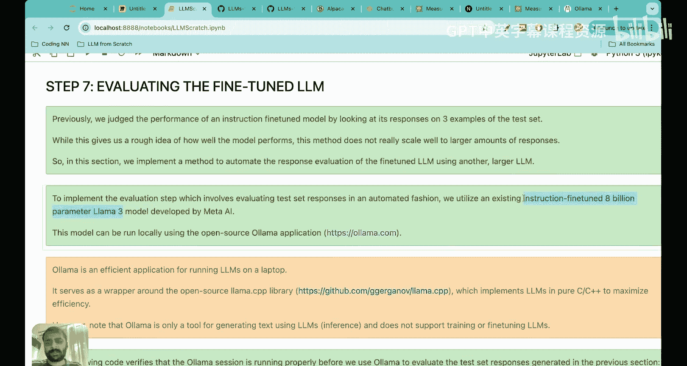
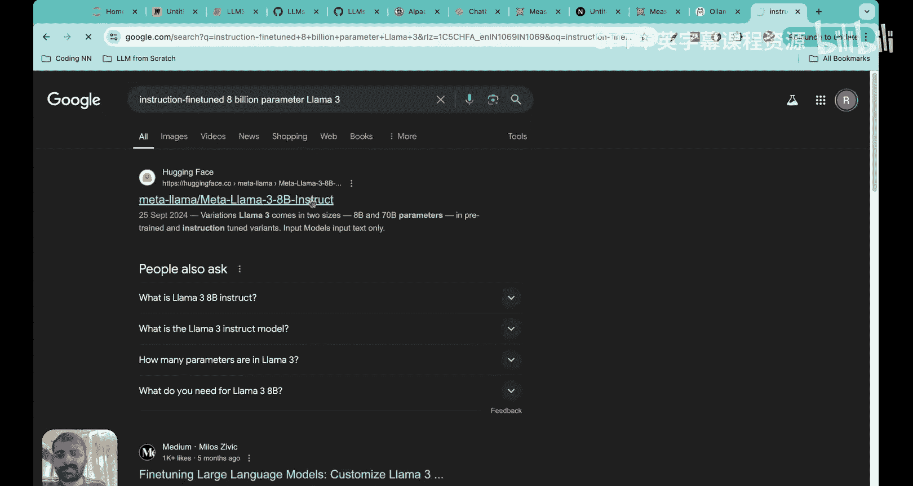
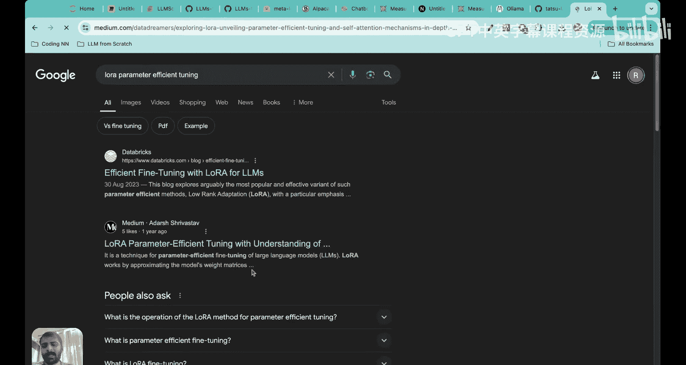
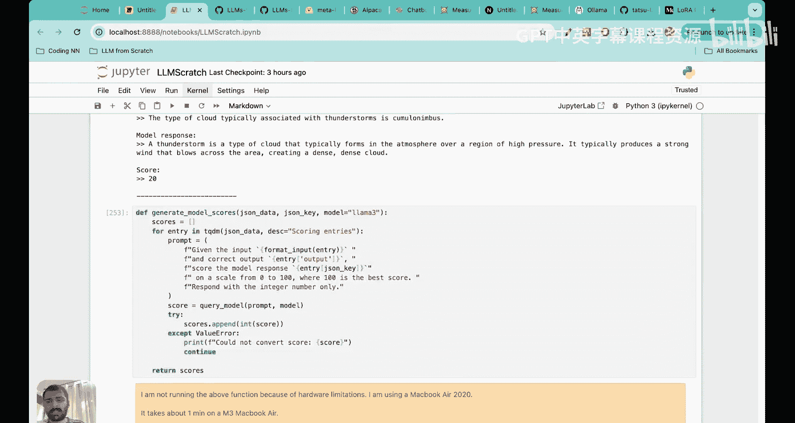

# 40：使用Ollama评估微调后的大语言模型 🧪


在本节课中，我们将完成指令微调项目，并学习如何评估微调后的大语言模型（LLM）的性能。我们将从测试集中提取模型生成的响应，并利用另一个更强大的LLM（通过Ollama运行）来自动为这些响应打分，从而获得一个量化的性能指标。

## 概述：我们当前所处的位置

上一节我们介绍了如何对预训练的大语言模型进行指令微调。我们使用了一个包含1100条指令-输入-输出对的数据集，并证明了微调后的模型在响应指令方面表现更佳。

现在，我们已经完成了微调流程的前两个阶段：
1.  **数据准备**：下载、批处理数据并创建数据加载器。
2.  **模型微调**：加载预训练的GPT-2模型（3.55亿参数），并基于指令数据集对其进行再次训练。

本节中，我们将进入至关重要的第三阶段：**评估微调后的大语言模型**。我们将学习如何提取模型在测试集上的响应，并探索几种评估LLM性能的方法，最终实现一种自动化的评分方案。

## 评估的必要性与挑战

在展示单个测试样本的结果时，我们发现模型响应“The meal is prepared by the chef every day”与标准答案“The meal is cooked by the chef every day”存在差异。这引出了一个核心问题：**如何衡量LLM的性能？**

与简单的二分类任务（如垃圾邮件检测）不同，LLM的评估涉及比较两个句子（模型输出与标准答案）的相似性或正确性，这并非易事。我们需要一个系统化的方法来评分。

## 大语言模型评估的三种主要方法

以下是研究人员常用的三种评估指令微调后LLM的方法：

1.  **通用知识测试与基准评估（MMLU）**：这种方法通过让模型回答涵盖STEM、人文、社科等57个不同领域的多项选择题，来测试其通用知识水平。**MMLU分数**已成为衡量模型知识广度的流行指标。
2.  **人工偏好比较**：由人类评估者直接查看并比较不同LLM对同一指令的响应，从而判断哪个模型的输出更优。这种方法依赖人类的主观判断。
3.  **使用另一个LLM进行自动评估**：利用一个已经过良好训练、知识渊博的大型语言模型（例如Llama 3）作为“裁判”，来比较标准答案与待评估LLM的响应，并给出评分。这种方法自动化程度高，节省人力。

考虑到任务的规模，我们将在本节中实现第三种方法，即使用另一个LLM来自动评估我们微调后模型的响应质量。

## 第一步：提取并保存模型响应

在开始评估之前，我们需要收集微调后模型在整个测试数据集上的所有响应。

以下是实现步骤：
*   加载我们微调后的模型。
*   遍历测试数据集中的每一个指令-输入对。
*   使用模型生成响应。
*   将生成的响应与原始的指令、输入、标准答案一起，保存到一个新的JSON文件中（例如 `instruction_data_with_responses.json`）。

这样，我们就拥有了一个包含完整信息（指令、输入、标准输出、模型响应）的文件，为后续的自动化评估做好了准备。

**重要提示**：完成此步骤后，请务必保存微调后的模型权重，以便后续使用，避免重复进行耗时的微调过程。保存和加载模型的代码如下：
```python
# 保存模型
torch.save(model.state_dict(), 'gpt2_medium_355m_sft.pth')



# 在未来会话中加载模型
model.load_state_dict(torch.load('gpt2_medium_355m_sft.pth'))
```



## 第二步：使用Ollama和Llama 3进行自动化评估

现在，我们将使用Ollama工具来运行一个更强大的LLM（Meta的Llama 3 8B指令微调版），作为我们模型的“裁判”。

### 安装与运行Ollama

1.  访问 [ollama.com](https://ollama.com) 并下载适用于您操作系统（MacOS、Linux、Windows）的安装包。
2.  安装完成后，打开终端（或命令提示符）。
3.  运行命令以下载并启动Llama 3模型：
    ```bash
    # 对于MacOS/Linux
    ollama run llama3

    # 对于Windows，可能需要先运行
    ollama serve
    # 然后在新的终端窗口运行
    ollama run llama3
    ```
4.  等待模型下载完成（约4.7GB）。当终端出现 `>>>` 提示符时，表示模型已成功加载，您可以开始与之对话。

### 构建评估提示与查询函数

我们将通过Python代码与Ollama的API进行交互，而不是直接在终端中操作。核心是构建一个 `query_model` 函数，它向Ollama管理的Llama 3模型发送请求并获取响应。

评估提示（Prompt）的格式如下：
> “给定以下指令和输入：`[指令]` `[输入]`，以及标准答案：`[标准输出]`。请为以下模型响应评分：`[模型响应]`。评分范围为0到100分，100分为最佳。请仅返回一个整数分数。”

我们将对测试数据集中的每一个样本，构造这样的提示，发送给Llama 3，并收集返回的分数。

### 执行评估并分析结果

由于在CPU上运行大型模型推理非常耗时，我们首先在少量测试样本上演示评估过程。

以下是三个测试样本的评估结果示例：
1.  **指令**：使用明喻重写句子“The car is very fast”。
    *   **标准答案**：The car is as fast as lightning.
    *   **模型响应**：The car is as fast as a bullet.
    *   **Llama 3评分**：85/100。理由：响应正确使用了明喻，比喻恰当，但“lightning”可能比“bullet”更具戏剧性。
2.  **指令**：哪种云通常与雷暴有关？
    *   **标准答案**：Cumulonimbus.
    *   **模型响应**：（一段关于雷暴一般性描述的不相关文本）
    *   **Llama 3评分**：20/100。理由：未直接回答问题，且包含不准确信息。
3.  **指令**：《傲慢与偏见》的作者是谁？
    *   **标准答案**：Jane Austen.
    *   **模型响应**：George Bernard Shaw.
    *   **Llama 3评分**：0/100。理由：事实性错误。

从这些例子可以看出，作为评估者的Llama 3不仅给出了分数，还提供了详细的定性分析，其判断相当合理。

为了获得一个整体的性能指标，我们可以计算模型在所有测试样本上得分的平均值。在计算资源允许的情况下（例如使用M3芯片的Mac或GPU），运行完整测试集后，我们的微调模型平均得分可能在50分以上。这为我们提供了一个与其他配置或模型进行比较的基准。

## 如何进一步提升模型性能

如果评估分数不理想，可以考虑以下改进方向：
*   **调整超参数**：如学习率、批大小、训练轮数（epoch）。增加训练轮数通常能显著提升效果。
*   **扩大训练数据集**：我们仅使用了1100条数据。可以尝试使用更大的指令数据集，例如斯坦福的Alpaca数据集（包含52,000条数据）。
*   **尝试不同的提示或指令格式**：更清晰、结构化的指令可能引导模型产生更好的输出。
*   **使用更大的预训练模型**：例如从GPT-2 Medium（3.55亿参数）切换到GPT-2 Large（7.74亿参数）或XL版本，前提是拥有足够的计算资源。
*   **采用参数高效微调技术**：如LoRA（Low-Rank Adaptation），它可以在只更新少量参数的情况下达到良好的微调效果，大大节省计算成本和时间。

## 总结




本节课中我们一起学习了如何评估一个经过指令微调的大语言模型。我们首先完成了从测试集中提取模型响应的步骤，然后重点介绍了三种主流的LLM评估方法：MMLU基准测试、人工评估以及使用另一个LLM进行自动评估。

我们选择了第三种方法，并利用Ollama工具和Llama 3 8B指令微调模型，构建了一个自动化评估流程。通过让Llama 3比较标准答案与我们的模型响应，并给出0-100的分数，我们获得了一个量化的性能指标。尽管这种评分仍存在一定主观性，但它为模型迭代和比较提供了有价值的参考。



至此，我们已经完整地走过了指令微调LLM的整个流程：从数据准备、模型微调到最终的评估。理解这些底层细节对于成为一名扎实的机器学习工程师或LLM研究者至关重要。评估领域本身仍是一个充满机遇的研究方向，期待大家未来的探索与贡献。