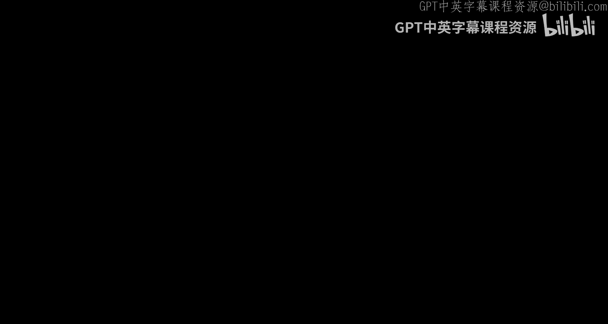
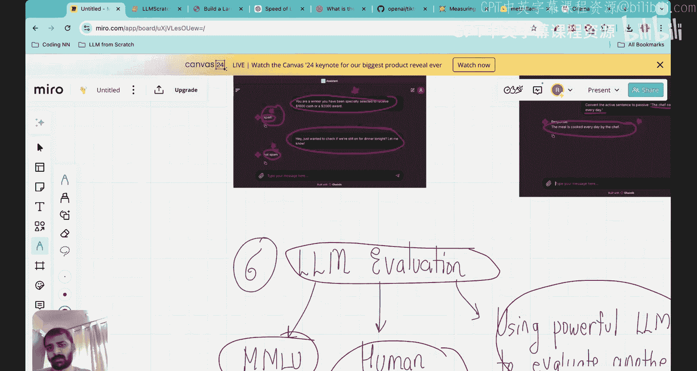

# 41：20分钟总结

大家好，欢迎来到“从零开始搭建大语言模型”系列视频。

这是一个总结视频，我将快速总结我们在本系列课程中完成的所有内容。

你可能属于两类学生之一。第一类是已经跟完了整个系列并正在观看本视频的同学，恭喜你坚持到了这里。你现在可以说是全世界少数几个知道如何完全从零开始构建整个大语言模型的学生之一。如果你偶然看到这个视频，但还不了解系列的其他部分，我强烈建议你观看所有视频，以建立对大语言模型的坚实理解。

我开设这个系列课程的目标是教你如何成为一名基础研究者或基础机器学习工程师。你应该真正关注的重点是理解事物运作的核心原理，而不是运行花哨的大语言模型应用。我们应该将注意力集中在大语言模型是如何真正构建的，理解其内部机制，这也是本系列的全部重点。视频虽然很长，但根据与许多观看学生的互动来看，它们非常有收获。

当我开始这个系列时，我从Sebastian Rashka的《Build a Large Language Model》这本书中获得了许多灵感，感谢Sebastian。这本书确实帮助我构建了整个课程体系。

这是我们贯穿整个系列课程运行的代码文件。正如你所见，代码已经变得相当长，但我们在课程视频中已经非常详细地解释了每一个部分。我向你解释了每一个代码块，并且在本系列中我们不假设任何先验知识，一切都是从零开始深入讲解的。

我已经与所有观看的学生分享了这份代码文件。我希望一旦你获得了这份代码文件，你能够自己运行并构建整个大语言模型。

以下是我们本系列涵盖的所有内容的工作流程。首先我们从第一阶段开始，然后依次进入第二阶段，再到第三阶段。

就像盖房子一样，我们首先需要打好地基。在第一阶段，我们为大语言模型的构建奠定了基础。我们研究了数据准备和采样，然后研究了注意力机制，这是大语言模型获得其能力的引擎。最后，我们研究了第一阶段的大语言模型架构，即不同的模块如何组合在一起以构建大语言模型。

第一阶段完成后，我们进入第二阶段，即预训练。在预训练中，我们研究了如何为大语言模型实现损失函数，如何进行反向传播，以及如何训练通常涉及超过1亿甚至数十亿参数的LLM。我们还看到了如何从像OpenAI GPT-2这样的大语言模型中加载预训练权重，这加速了预训练过程。

然后在第三阶段，我们看到仅靠预训练不足以确保LLM在特定任务上表现良好，例如分类或构建我们自己的个性化聊天机器人。我们学习了微调。我们完全从零开始完成了两个实践项目：我们制作了一个可以区分垃圾邮件与非垃圾邮件的LLM分类器，并且我们还构建了自己的可以遵循指令的个人助手。这些都是非常有价值的经验，我们从最基础的部分展示并理解了一切。

现在，我将带你回顾我们迄今为止在这个旅程中涵盖的各个步骤和关键组成部分。如果你已经观看了系列课程，这将是一个很好的回顾，你也可以在面试前用它进行快速复习。如果你还没有观看之前的课程视频，这将是一个很好的视频，让你了解本系列课程将涵盖哪些内容。

## 第一步：数据预处理流程

构建大语言模型的第一步是实现数据预处理流程。

LLM的数据预处理流程与回归模型或分类模型有很大不同。当大语言模型中有输入文本时，目标是预测下一个标记。因此，你要做的第一件事是将输入文本转换为标记，然后将标记转换为标记ID。

在此之后，下一步是将这些标记ID转换为更高维度的向量空间，以便捕获不同标记的语义含义。

当你将标记投影到更高维度的向量空间后，你必须向这些标记嵌入中添加位置嵌入。将标记ID投影到更高维向量空间的结果，如图所示，称为标记嵌入。你必须将位置嵌入向量添加到标记嵌入向量中。我们添加位置嵌入的原因是，除了将标记转换为向量表示外，单个标记出现的位置在预测下一个标记时也非常重要。

当你将标记嵌入与位置嵌入相加时，就得到了所谓的输入嵌入。现在，这些输入嵌入是我们期望从数据预处理流程中得到的输出。数据预处理流程的整个目标是从大量文档（我们提供给大语言模型的训练数据）中获取输入文本，并将所有这些文档转换为句子，然后转换为标记，再转换为标记ID，接着转换为标记嵌入，最后添加位置嵌入并转换为输入嵌入。

为了让你对标记嵌入维度有个概念，在GPT-2中，嵌入维度是768。

这就是数据预处理流程，这是第一步。

## 第二步：理解注意力机制

在数据预处理之后，我们转向理解注意力机制。注意力机制是赋予LLM能力的驱动引擎。注意力的主要思想是：当你查看向量嵌入时，你只看到一个标记的语义含义，你没有看到一个标记与所有其他标记的关系。然而，在预测下一个标记时，上下文非常重要。你需要知道一个标记如何与所有其他标记相关联。当你查看一个标记时，你应该给予其他标记多少重要性，这种重要性也称为注意力。

因此，注意力机制的整个目标是将输入嵌入向量（看起来像这样）转换为所谓的上下文向量。在注意力机制实现结束时，输入向量被转换为上下文向量。你可以看到“journey”的输入嵌入向量，这里是“journey”的上下文向量。上下文向量比输入嵌入向量丰富得多，因为它们还包含了“journey”与句子中所有其他标记如何相关的信息。

为了从输入嵌入向量过渡到上下文向量，我们需要理解一个巨大的顺序流程。我们首先将输入与可训练的查询、键和值矩阵相乘，得到查询、键和值矩阵。我们将查询与键的转置相乘，得到注意力分数。然后我们用键维度的平方根缩放注意力分数，添加Dropout，实现因果注意力（这意味着我们为所有不参与下一个标记预测任务的标记添加一个掩码），然后我们添加一个Softmax层。在实现缩放、Dropout和Softmax之后，我们将注意力分数转换为注意力权重。注意力权重然后与值相乘，我们就得到了上下文向量矩阵。

现在这只是一个注意力头的情况。当我们考虑大语言模型时，有多个注意力头在起作用。我们拥有多个注意力头的原因是为了捕捉大段落内的多重依赖关系和长距离依赖关系。因此，当你组合来自多个注意力头的上下文向量矩阵时，你会得到这个最终的上下文向量矩阵，这就是输入嵌入矩阵通过注意力头时的输出。

因此，大语言模型发生的整个革命，正是由于我现在屏幕上分享的这个工作流程：将输入嵌入矩阵转换为这个上下文向量矩阵，这是关键。

## 第三步：LLM架构

理解了注意力机制后，我们转向LLM架构。请记住，我讲得有点快，因为这是一个回顾，一个总结。如果你想理解每一个元素，我强烈建议你回到那个特定的课程，再次观看整个视频。

理解注意力之后，下一步是查看LLM架构。这是LLM架构的鸟瞰图。实际上，让我用另一张我认为能更好表示LLM架构的图。我截取这张图的屏幕截图，然后把它移上来。

如果你看这个架构，它为我们提供了一个鸟瞰图，展示了当你查看大语言模型时实际发生的情况。首先，正如我提到的，你有输入。这些输入被转换成一堆标记。然后标记被转换为向量嵌入。我们添加位置嵌入，这就得到了输入嵌入。输入嵌入然后被传递到这个块中，即标记嵌入层、位置嵌入层，然后我们有一个Dropout层，接着我们有了这些输入嵌入，它们被传递到这个蓝色块中，即Transformer块。Transformer块是所有魔法发生的地方。

你可能在想，那么注意力机制在Transformer块中处于什么位置呢？在Transformer块内部，有另一个模块称为注意力模块。我们之前学习的注意力机制以及键、查询、值等所有内容，实际上都发生在这个掩码多头注意力模块内部。在Transformer块内部，有一个归一化层、多头注意力、Dropout层，这些是快捷连接，然后是另一个归一化层、一个前馈神经网络、另一个Dropout层，以及更多的快捷连接，然后我们离开Transformer块。离开Transformer块后，有一个层归一化层和一个最终的神经网络，它将Transformer的输出转换为所谓的逻辑张量。

逻辑张量然后用于在给定输入序列的情况下预测下一个标记。

现在，当你查看GPT-2时，比如说，有12个这样的Transformer块排列在一起。对于更大的LLM，甚至有更多Transformer块排列在一起。在这些Transformer块内部，有多头注意力。在每个Transformer块内部，可以有2个或24个注意力头。所以有多个Transformer块，在每个Transformer块内部有多个注意力头。术语有点复杂，但一旦你获得了这个架构的视觉感受，实际上按顺序编码它是相当容易的。

一旦你理解了这种架构，我们在系列课程中所做的就是完全从零开始编码与这种架构相关的每一个部分。你可以在这里搜索“前馈”。这是架构的第三部分。事实上，我们按照所有部分的顺序进行。我们首先介绍了层归一化，然后介绍了前馈神经网络，接着介绍了快捷连接，然后介绍了编码注意力层。所以，除了这种白板方法外，所有内容也都涵盖了编码。

一旦你弄清楚了这种LLM架构，你就会对输入序列到底发生了什么有一个鸟瞰图：它如何通过Transformer，如何从Transformer中出来，我们得到逻辑张量，然后用于预测下一个标记。这就是我的LLM预测。现在，我的LLM预测的这个下一个标记用于计算损失函数。

## 第四步：预训练与损失函数

在LLM输出和真实结果之间计算损失函数。

得到损失函数后，下一步是运行LLM预训练循环。这意味着一旦我们理解了如何进行前向传播（即如何获取输入句子或输入序列，从LLM获取输出，并根据下一个标记获取损失），我们就需要计算损失。顺便说一下，这个损失是我们预测的下一个标记与实际下一个标记之间的交叉熵损失。

一旦我们知道如何获取损失，我们就需要进行反向传播。这意味着我们需要计算损失相对于LLM架构中所有参数的偏导数。这里我只提到了训练循环：首先计算整个批次的损失，然后进行反向传播，即计算损失相对于所有权重参数的偏导数。

你可能会想，有哪些不同的可训练权重？在标记嵌入和位置嵌入中有可训练权重，因为当我们说转换为向量空间时，我们不知道理想的转换，所以我们需要找出这些参数。我们需要找出位置嵌入参数。我们需要找出层归一化中的缩放和移位参数。在掩码多头注意力模块中，我们需要训练查询、键和值的可训练权重矩阵。第二个层归一化层也有可训练参数。前馈神经网络也有可训练参数。最终的输出层和最终层也有可训练参数。请记住，我们有12个这样的Transformer块，所以当你把这些参数加起来时，会导致超过一百万甚至超过十亿个我们需要训练的参数。因此，我们需要为所有这些参数找到梯度，然后我们需要进行梯度更新，例如使用公式 `W_{i+1} = W_i - α * (∂L/∂W)`。这只是我向你展示的普通梯度下降，通常我们实现一些更复杂的方案，如Adam或AdamW。

一旦你执行了这个预训练循环，你实际上会得到损失函数作为epoch的函数，这是我们在自己的笔记本电脑、自己的系统上完成的，但使用的是非常小的数据集。请记住，像GPT-2、GPT-3、GPT-4等实际LLM所需的预训练是在海量数据上完成的，涉及数百万篇新闻文章、数百万个博客、书籍等，这种预训练的成本也超过100万美元。因此，我们不可能在自己的笔记本电脑上预训练一个真正的、完整的大语言模型。但是，一旦你观看了我展示的课程视频，你就可以为一个小数据集运行预训练循环，这会让你全面了解GPT是如何构建的。

## 第五步：加载预训练权重与微调

在这之后，我们所做的是：我们采用我们的架构，我们采用我们的LLM架构，然后我们从GPT-2加载了预训练权重。然后我们实际上根据输入句子预测了下一个标记。这是我们在本系列课程中取得的第一个基础性成果。

预训练完成后，我们转向LLM微调。我们学习了两种类型的微调：分类微调，我们构建了一个电子邮件分类LLM，当给定一封电子邮件时，LLM可以分类它是垃圾邮件还是非垃圾邮件；然后我们还完全从零开始构建了一个指令微调的LLM。你必须提供一堆指令、输入和输出，并训练LLM在指令上表现出色。比如说，指令是“将主动句转换为被动句”，主动句是“The chef cooks the meal every day”，被动句是“The meal is cooked every day by the chef”。我们完全从零开始训练了这个模型。我现在向你展示的一切都是基于我们在代码中开发的架构实现的，我们没有从其他地方使用它。

## 第六步：LLM评估

最后，我们学习了LLM评估。我们学习了三种类型的评估。第一种是MMLU，基于这篇论文《Measuring Massive Multitask Language Understanding》。他们在这篇论文中展示的是，我们基本上可以使用57个测试来评估LLM性能，这是一种评估类型。第二种是使用人类来比较和评分LLM。第三种是使用一个强大的大语言模型来评估另一个LLM。这是我们遵循的方法。我们使用了一个名为o Llama的工具来访问Llama 3 LLM，特别是我们使用了这个Llama 8B参数指令模型，它已经过微调，拥有80亿参数，因此非常强大。我们用这个更大的LLM所做的是：如果真实输出是这个，而模型响应是这个，我们要求LLM将输出与模型响应进行比较，并给出一个评估分数。这就是LLM给出的评估分数。因此，根据模型响应和实际响应，它给出一个0到100的分数。这就是我们学习的第三种评估策略。

## 总结与后续步骤

这就是我们在本课程中实现的所有内容的全部细节。我们从零开始实现了一个下一个词或下一个标记预测LLM，实现了一个电子邮件分类微调LLM，并实现了一个指令微调LLM。一旦你完成了这个系列课程，我相信你将理解构建大语言模型的核心原理，并且你将成为一个更强大的机器学习和LLM工程师。

如果你已经完成了这个系列并且现在正在观看这个课程，我强烈建议你下一步深入基础研究。你拥有这个代码文件，开始进行修改，开始探索小语言模型。为什么需要大语言模型？我们是否可以只有三个Transformer块？你现在可以开始对代码进行所有这些编辑，因为代码是以构建块格式编写的。你可以更改超参数，探索不同优化器的效果，探索不同学习率的效果，不同Transformer块数量的效果，探索不同评估策略的效果。这是一个活跃的研究领域。尝试深入研究，这是保持在最前沿并为创新和有影响力的LLM研究做出贡献的最佳方式。

我希望你们所有人都喜欢这个系列课程。我对于所有通过这些课程学习的人的整个目标是，将你们训练成为能够为创新研究做出贡献的基础LLM和机器学习工程师，而不仅仅是部署LLM应用。

非常感谢大家，我期待在下一节课中见到你。

