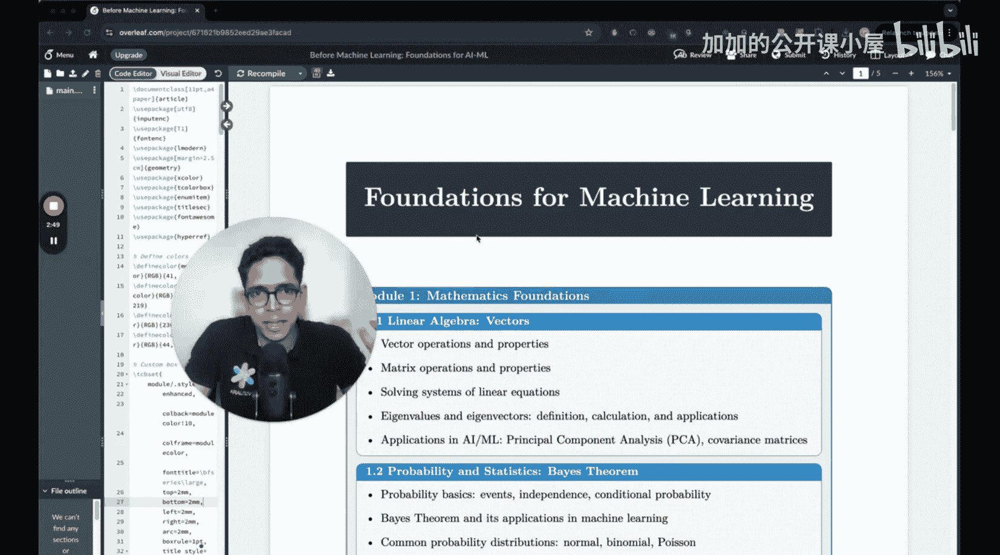

#  001：机器学习基础课程介绍 🎯

在本节课中，我们将介绍“机器学习基础”这门课程的目标、内容结构以及学习它的重要性。我们将探讨扎实的数学和编程基础对于深入理解机器学习的关键作用。

大家好，欢迎来到名为“机器学习基础”的新课程。

我是 Sharia Pant 博士。我于2022年从麻省理工学院获得博士学位。

在此之前，我于2017年从印度马德拉斯理工学院完成了学士学位。

我本科以及博士期间的所有正规教育都是在机械工程系完成的。

我在2019年或2020年左右学习了第一门正式的机器学习课程。

那是麻省理工学院的一门研究生级别的高级机器学习课程。

这门课程让我接触到了许多可以融入我研究中的思想。之后，

我在一些研究问题中使用了机器学习中的某些框架，例如科学机器学习、使用神经网络进行图像分类等，这非常吸引人。当我参加这些课程时，

我确实注意到了世界顶尖大学的机器学习课程与其他地方的教学方式之间的差异。

这些课程非常强调基础知识。

我的意思是，它们非常强调机器学习背后的数学，非常强调微积分、概率论和线性代数。

同时也非常强调从零开始编写代码。

如果你将此与许多在线课程进行比较，

那些课程试图通过让你做一些简单的Kaggle项目或其他项目来给你一些实践经验，让你感觉能够自己构建和运行机器学习模型。

但最终，当你回顾时，你将无法向他人解释清楚其中的原理，而这正是检验你是否深入理解某事物的标准。我注意到，

如果你问一个正在学习机器学习的人一个简单的问题，比如：为什么神经网络需要激活函数？如果没有激活函数会发生什么？

你会发现，大多数人将无法回答这个问题。

理解没有激活函数时神经网络会发生什么，是一个非常简单直观的思考过程。

但从一个真正的概念层面来思考这个问题，你需要深入理解神经网络如何工作、到底发生了什么，以及这一切如何与线性代数联系起来。

---

上一节我们介绍了课程的目标和重要性，本节中我们来看看这门课程将具体涵盖哪些核心内容。

以下是本课程将涵盖的主要数学领域：

*   **线性代数**：处理向量、矩阵和高维数据的基础。
*   **概率论**：理解数据中的不确定性和统计推断。
*   **微积分**：优化算法（如梯度下降）的核心。
*   **优化**：寻找最佳参数或模型的核心理论。

此外，课程将强调**从零开始编码**，以确保你不仅理解理论，还能将其付诸实践。

---

本节课中我们一起学习了“机器学习基础”课程的开篇介绍。我们了解了拥有坚实的数学和编程基础对于深入、真正理解机器学习算法至关重要，而不仅仅是停留在应用层面。本课程旨在填补这一空白，通过强调线性代数、概率论、微积分和优化等核心数学概念，并结合从零开始的编程实践，帮助你建立对机器学习的深刻直觉和扎实功底。