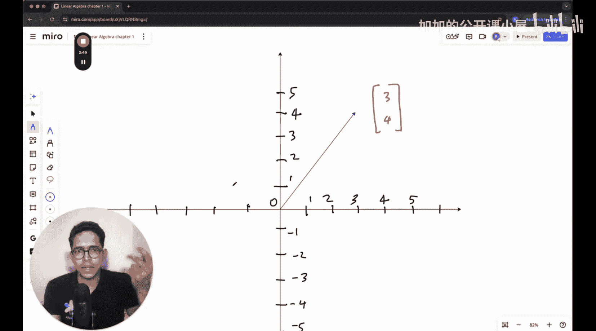

#  002：向量、变换与空间

在本节课中，我们将学习机器学习所需的数学基础，特别是线性代数。我们将从机器学习的角度出发，重点理解线性代数的核心概念及其直观的几何意义，而非深入其所有细节。

## 向量：两种视角

上一节我们介绍了本课程的目标，本节中我们来看看线性代数中最基本的概念：向量。

在物理学中，向量被定义为具有**大小**和**方向**的量。在坐标系中，向量的起点可以是任意位置，不一定在原点。

在计算机科学中，向量通常指一个**数字列表**。例如，一个学生的信息（学号347，年龄20，体重70公斤）可以表示为一个三维向量。

对于机器学习而言，我们主要讨论的向量几乎总是**以原点为起点**的。这意味着我们关注的是向量的方向和大小，而不关心它在空间中的绝对位置。在二维平面（xy平面）中，一个向量具有两个维度：x维度和y维度。

## 向量的表示与运算

理解了向量的基本定义后，我们来看看如何表示和操作向量。

在数学上，一个二维向量可以写作 **v = [x, y]**。向量的基本运算包括加法和标量乘法。

以下是向量运算的规则：
*   **向量加法**：对应分量相加。**v + w = [x1 + x2, y1 + y2]**
*   **标量乘法**：每个分量乘以标量。**c * v = [c*x, c*y]**

从几何上看，向量加法遵循平行四边形法则，标量乘法会改变向量的长度（可能还有方向）。

## 线性变换与矩阵

向量本身是静态的，而线性变换描述了如何对向量进行“操作”或“映射”。这是线性代数的核心。

一个线性变换需要满足两个条件：
1.  可加性：**T(v + w) = T(v) + T(w)**
2.  齐次性：**T(c * v) = c * T(v)**

在二维空间中，任何线性变换都可以用一个2x2矩阵来描述。矩阵的每一列代表了该变换将标准基向量（i-hat 和 j-hat）移动到的位置。

例如，一个变换矩阵 **M = [[a, b], [c, d]]** 作用于向量 **v = [x, y]** 的结果是：
**M * v = x * [a, c] + y * [b, d] = [a*x + b*y, c*x + d*y]**

## 向量空间与子空间

最后，我们来探讨向量存在的“舞台”——向量空间。

向量空间是一个集合，其中的元素（向量）可以进行加法和标量乘法运算，并且运算结果仍然在这个集合中。常见的例子是所有二维实向量的集合 **R²**。

子空间是向量空间的一个子集，它本身也满足向量空间的所有条件。例如，在 **R³**（三维空间）中，任何穿过原点的直线或平面都是一个子空间。

理解向量空间有助于我们思考机器学习算法（如主成分分析PCA）所操作的数据所处的抽象空间。

---

本节课中我们一起学习了线性代数的基石：向量。我们从物理和计算机两种视角认识了向量，学习了其表示与基本运算。我们探讨了线性变换的概念及其与矩阵的等价关系，并初步了解了向量空间与子空间。这些概念为理解机器学习模型如何处理和转换数据奠定了坚实的基础。