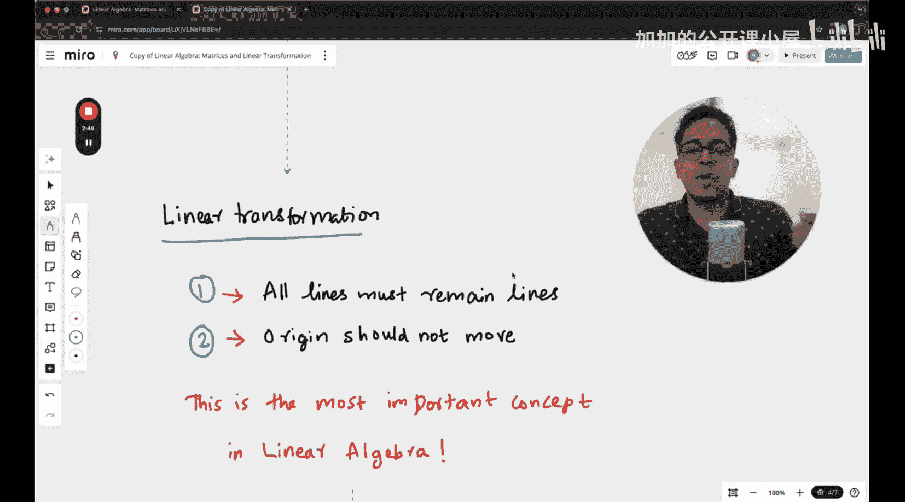

#  003：矩阵乘法即线性变换

在本节课中，我们将学习线性代数的一个核心概念：线性变换。我们将探讨矩阵乘法如何实现线性变换，以及这种变换对向量产生的几何影响。理解这一概念对于构建坚实的机器学习基础至关重要。

## 什么是变换？

变换，可以理解为一个函数，它将一个输入向量映射为一个输出向量。例如，在一个二维XY空间中，存在向量 **v1** 和 **v2**。一个变换函数 **F** 可以将 **v1** 转换为 **v2**。请注意，在本讲座中，输入和输出向量的符号（如 **u** 或 **v**）可能交替使用，但每次都会明确指明其角色。

简而言之，变换就是改变向量的某种操作。变换后，向量可能仍在原空间内，但其方向和长度可能发生了改变。

## 线性变换的特性

在众多变换类型中，线性变换是线性代数的基石。线性变换必须满足两个关键特性：

1.  **所有直线在变换后必须保持为直线**。
2.  **原点位置必须保持不变**。

第一个特性“直线保持为直线”需要特别注意其含义。第二个特性“原点固定”则相对直观。

为了更清晰地理解第一个特性，让我们通过图示来观察。

---

上一节我们介绍了线性变换的基本定义和特性。接下来，我们将深入探讨矩阵如何具体地表示和执行线性变换。