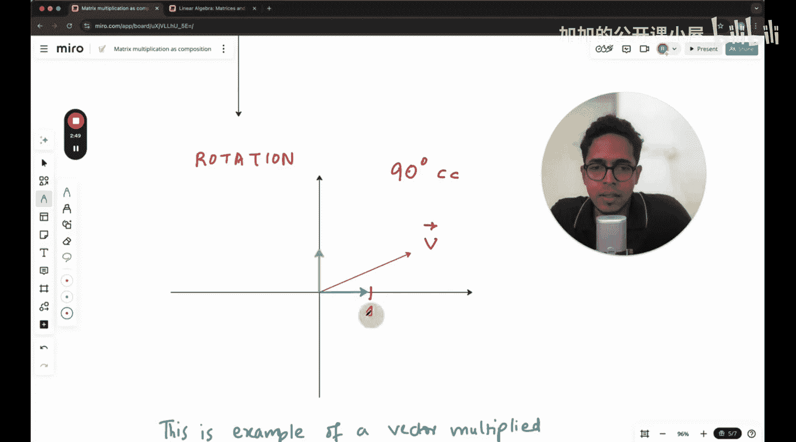

#  004：矩阵乘法与复合变换

在本节课中，我们将学习线性代数中的一个核心概念：矩阵乘法。我们将回顾矩阵如何作为线性变换作用于向量，并深入探讨两个矩阵相乘如何代表一个复合线性变换。理解这一点对于掌握机器学习中的许多算法至关重要。

## 矩阵作为线性变换

上一节我们介绍了矩阵可以看作一个线性变换函数。本节中，我们来看看具体的例子。

线性变换是一个函数，它将一个向量 **v** 变换为另一个向量 **v'**。在二维平面中，变换矩阵是一个 2x2 的矩阵，向量则包含 x 和 y 两个维度。

以下是两个变换示例，帮助我们回顾这个概念。

### 示例1：旋转变换

假设有一个变换，它将 xy 空间中的任何向量逆时针旋转 90 度。

我们想观察向量 **v** 在逆时针旋转 90 度后的位置。为了便于描述，我们设定一个具体坐标：假设向量 **v** 的端点位于 (2, 1)。

### 示例2：剪切变换

现在，让我们考虑另一种常见的线性变换：剪切变换。想象一个力将网格的顶部向右推，而底部保持固定。

我们同样想观察一个向量在这种剪切变换下的结果。

## 追踪基向量的变换

为了理解任意向量在变换后的位置，一个有效的方法是追踪标准基向量的变换结果。

在二维空间中，标准基向量是 **i-hat** (1, 0) 和 **j-hat** (0, 1)。任何向量都可以表示为这两个基向量的线性组合。因此，如果我们知道变换后 **i-hat** 和 **j-hat** 的位置，我们就能通过相同的线性组合，计算出任何向量变换后的位置。

以下是追踪基向量的步骤：

1.  确定变换前基向量 **i-hat** 和 **j-hat** 的位置。
2.  应用线性变换，观察 **i-hat** 和 **j-hat** 移动到了哪里。
3.  变换后基向量的新坐标，就构成了变换矩阵的列。

例如，对于一个逆时针旋转90度的变换：
*   **i-hat** (1, 0) 移动到了 (0, 1)。
*   **j-hat** (0, 1) 移动到了 (-1, 0)。

因此，对应的旋转矩阵是：
`[[0, -1], [1, 0]]`

## 矩阵乘法：复合变换

上一节我们介绍了单个矩阵对向量的变换。本节中，我们来看看当两个矩阵相乘时会发生什么，这代表了一个复合变换。

假设我们有两个连续的线性变换。首先应用变换 A，然后应用变换 B。向量 **v** 的最终位置是 **B(A(v))**。

在矩阵表示中，如果变换 A 对应矩阵 **M_A**，变换 B 对应矩阵 **M_B**，那么先进行 A 再进行 B 的复合变换，就等价于用矩阵 **M_B** * **M_A** 乘以向量 **v**。

**核心公式**：**M_composite = M_B * M_A**
（注意乘法的顺序是从右向左，代表变换的应用顺序）。

### 复合变换的几何意义

从几何角度看，矩阵乘法 **M_B * M_A** 意味着：先进行由 **M_A** 定义的变换，紧接着再进行由 **M_B** 定义的变换。

计算这个复合变换矩阵的列，同样可以通过追踪基向量来完成：
1.  看 **i-hat** 首先被 **M_A** 变换到了哪里。
2.  然后将这个结果再输入 **M_B** 进行变换。
3.  最终得到的位置就是复合矩阵的第一列。
4.  对 **j-hat** 重复此过程，得到复合矩阵的第二列。

## 总结

本节课中我们一起学习了线性代数中矩阵乘法的核心思想。我们回顾了矩阵作为线性变换的作用，并掌握了通过追踪基向量 **i-hat** 和 **j-hat** 来理解变换的方法。最重要的是，我们明白了两个矩阵相乘 **M_B * M_A** 代表了一个复合变换，即先应用 **M_A** 变换，再应用 **M_B** 变换。理解矩阵乘法的这一几何意义，是打通线性代数与机器学习中空间变换概念的关键。