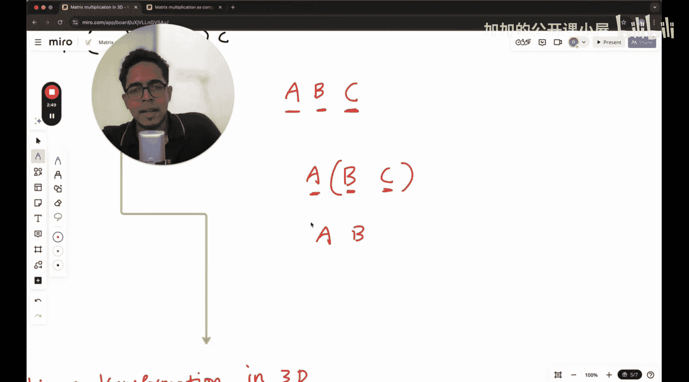

#  005：线性代数 - 3D线性变换 🧮


欢迎来到机器学习基础的新一讲。

我们将继续学习线性代数。在前两讲中，我们了解了矩阵乘法如何直接与线性变换相关联。我们也学习了两个矩阵相乘，就像是两个线性变换依次应用（级联或组合）。所有这些内容我们都是在二维（2D）空间中学习的。

在本讲中，我们将看到一些在三维（3D）空间中非常相似的概念，这些概念也可以推广到任意维度。

本讲内容相对简短，因为我们不会像在2D中那样详细探讨3D中的所有内容，但我想向你展示事物在3D中是如何呈现的，就像在2D中一样。

## 从2D到3D的过渡

在学习矩阵乘法时，你可能听说过结合律。为了证明像 **A × B × C**（其中A、B、C是矩阵）这样的式子，你可以先计算 **B × C**，然后再与 **A** 相乘；或者先计算 **A × B**，然后再与 **C** 相乘，结果相同。

在2D中证明这一点，可以定义通用的矩阵A、B、C。例如，A可以是 `[[a, b], [c, d]]`，B可以是 `[[e, f], [g, h]]`，C可以是 `[[i, j], [k, l]]`。然后，你可以通过先计算这两个矩阵的乘积，再与另一个矩阵相乘，来证明等式两边相等。

但这过程可能有些繁琐。因为如果我们从线性变换的角度来看，矩阵乘法本身就是对向量施加变换的操作。

## 结合律的几何视角

当我们看到三个矩阵相乘 **A × B × C** 时，它的几何意义是依次对向量施加三个变换：首先应用变换 **C**，然后应用变换 **B**，最后应用变换 **A**。

因此，无论你写成 **(A × B) × C** 还是 **A × (B × C)**，它们都表示相同的几何过程：先应用 **C**，再应用 **B**，最后应用 **A**。括号只是改变了计算的顺序，但最终施加到向量上的变换序列是相同的。这就直观地证明了矩阵乘法的结合律。



## 3D中的线性变换

现在，让我们将视角扩展到3D。在3D空间中，向量有三个分量 (x, y, z)，而表示线性变换的矩阵是 **3×3** 矩阵。

一个 **3×3** 矩阵对一个3D向量的变换，可以理解为该矩阵的每一列定义了变换后新坐标系的基向量（i帽、j帽、k帽）在原始坐标系中的位置。

以下是3D中一些基本线性变换类型的示例：

*   **缩放**：沿坐标轴拉伸或压缩空间。
    *   代码表示：`scale_matrix = np.diag([sx, sy, sz])`，其中 `sx`， `sy`， `sz` 是各轴的缩放因子。
*   **旋转**：围绕某个轴旋转空间。例如，绕z轴旋转θ角度的矩阵是：
    *   公式：
        ```
        R_z(θ) = [[cosθ, -sinθ, 0],
                  [sinθ,  cosθ, 0],
                  [0,     0,    1]]
        ```
*   **剪切**：使空间在一个方向上发生倾斜变形。
*   **反射**：关于某个平面翻转空间。

与2D类似，两个 **3×3** 矩阵 **M1** 和 **M2** 的相乘 **M2 × M1**，表示先应用变换 **M1**，再应用变换 **M2**。结果矩阵 **M_result** 的每一列，就是原始基向量 (1,0,0)， (0,1,0)， (0,0,1) 依次经过 **M1** 和 **M2** 变换后的最终位置。

## 高维推广

这些概念并不局限于3D。对于n维空间中的向量，线性变换由一个 **n×n** 矩阵表示。矩阵乘法仍然对应变换的复合，结合律同样成立。机器学习中经常处理高维数据（例如，每个数据点是有多个特征的向量），理解线性变换的几何直观至关重要。

## 总结

在本节课中，我们一起学习了：


1.  从几何变换的角度理解了矩阵乘法结合律，避免了繁琐的代数证明。
2.  将2D中的线性变换概念推广到3D空间，了解了 **3×3** 矩阵的作用。
3.  认识到这些关于矩阵、变换和乘法的原理可以自然地推广到更高维度，为理解机器学习算法中处理高维数据奠定了基础。

核心要点是：**矩阵代表对空间的线性变换，矩阵乘法代表变换的依次应用（复合）。** 无论维度如何，这一几何本质保持不变。