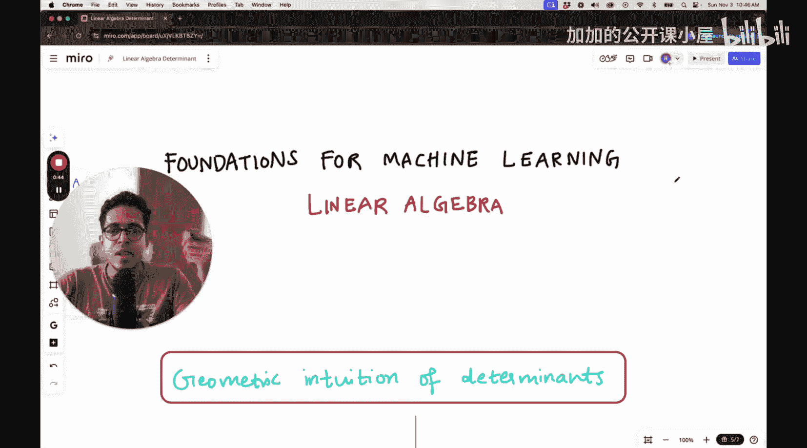
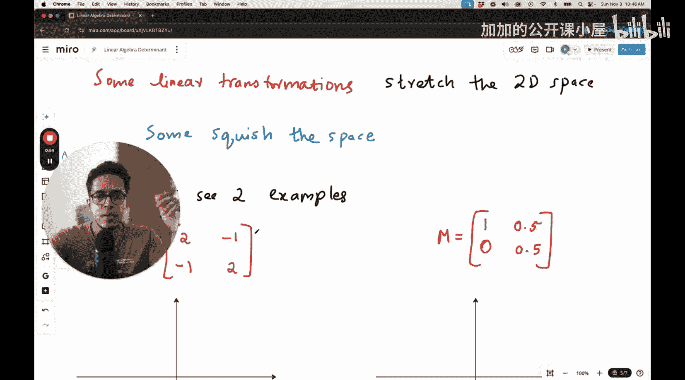
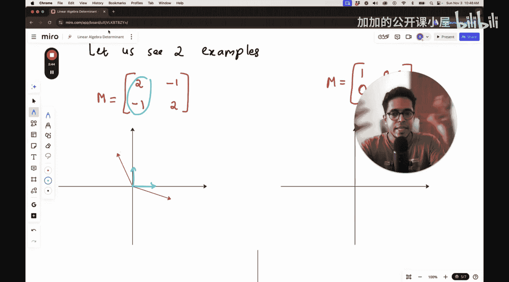
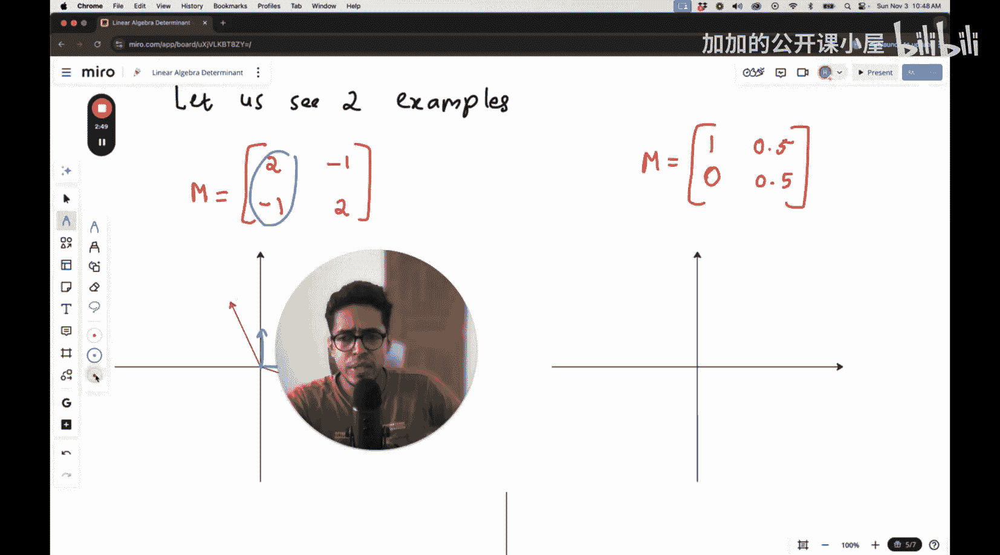

#  006：行列式的物理直觉

在本节课中，我们将学习线性代数中的一个核心概念——行列式。我们将不从传统的数学公式角度，而是从一个几何或物理直觉的角度来理解它。这种视角将帮助你更直观地把握线性变换的本质。

## 线性变换回顾

上一节我们介绍了线性变换，它可以将二维空间进行拉伸或挤压。为了直观展示，我们通常观察单位向量 **i** 和 **j** 在变换后的位置。

## 拉伸空间的例子

让我们看一个拉伸空间的线性变换例子。考虑以下变换矩阵 **M**：



```python
M = [[2, -2],
     [-1, 1]]
```


这个矩阵对应着对二维空间的一种变换。要理解这个变换，我们只需追踪单位向量 **i** 和 **j** 的去向。

*   **i 向量的去向**：变换后，单位向量 **i** 会移动到矩阵 **M** 的第一列所表示的位置，即 `[2, -1]`。
*   **j 向量的去向**：变换后，单位向量 **j** 会移动到矩阵 **M** 的第二列所表示的位置，即 `[-2, 1]`。

原始的单位向量 **i** 和 **j** 构成了一个标准的单位正方形。经过变换后，这两个向量被拉长并改变了方向，这意味着整个空间被拉伸了。空间中的每一个向量，不仅仅是单位向量，都会经历类似的变换。



## 挤压空间的例子

接下来，我们看一个挤压空间的例子。考虑另一个变换矩阵：

```python
M_squish = [[0.5, 0],
            [0, 0.5]]
```

以下是这个变换的效果：

*   **i 向量的去向**：变换后，单位向量 **i** 移动到 `[0.5, 0]`，长度缩短为原来的一半。
*   **j 向量的去向**：变换后，单位向量 **j** 移动到 `[0, 0.5]`，长度同样缩短为原来的一半。

在这个变换中，两个单位向量都向原点方向收缩。结果，由它们张成的单位正方形面积大大缩小，整个空间被均匀地挤压了。

## 行列式的几何意义

现在，我们引入行列式。在上述例子中，变换矩阵的行列式（det）量化了这种面积变化。

*   对于**拉伸**的例子，变换后的面积大于原始面积，其行列式值为一个正数。
*   对于**挤压**的例子，变换后的面积小于原始面积，其行列式值为一个小于1的正数。

更一般地，**行列式的绝对值表示线性变换对面积（在二维中）或体积（在三维中）的缩放比例**。行列式的符号则指示了变换是否改变了空间的“手性”或方向（类似于将平面翻转）。



## 总结



本节课中，我们一起学习了行列式的几何直觉。我们通过观察线性变换如何拉伸或挤压由单位向量张成的空间，理解了行列式本质上衡量了变换对空间面积的缩放因子。记住这个物理图像，将帮助你更直观地理解许多涉及行列式的线性代数概念。