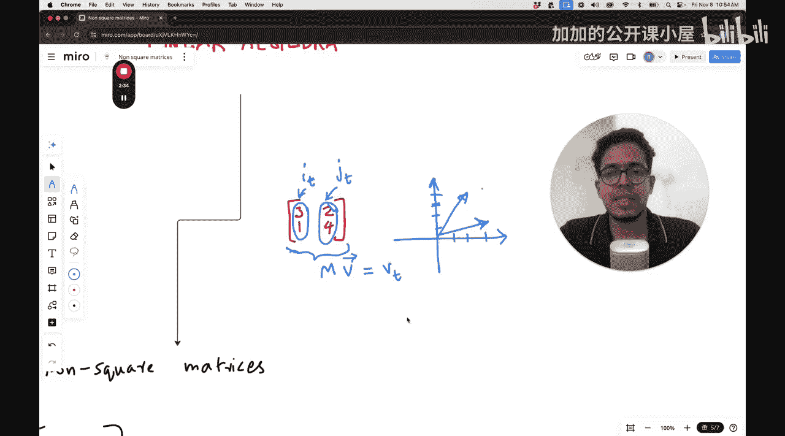
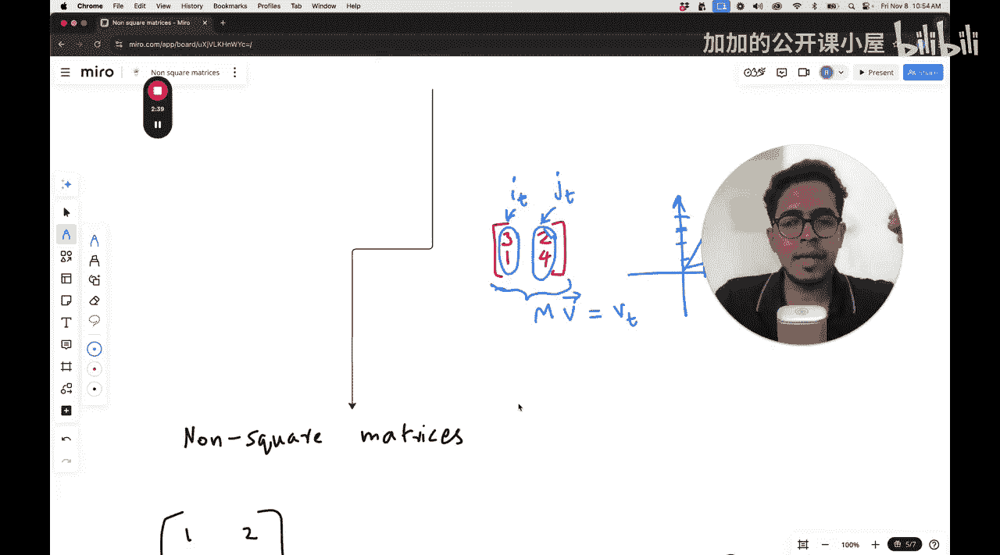
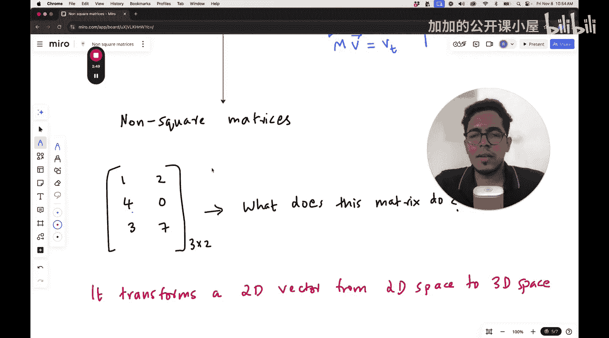
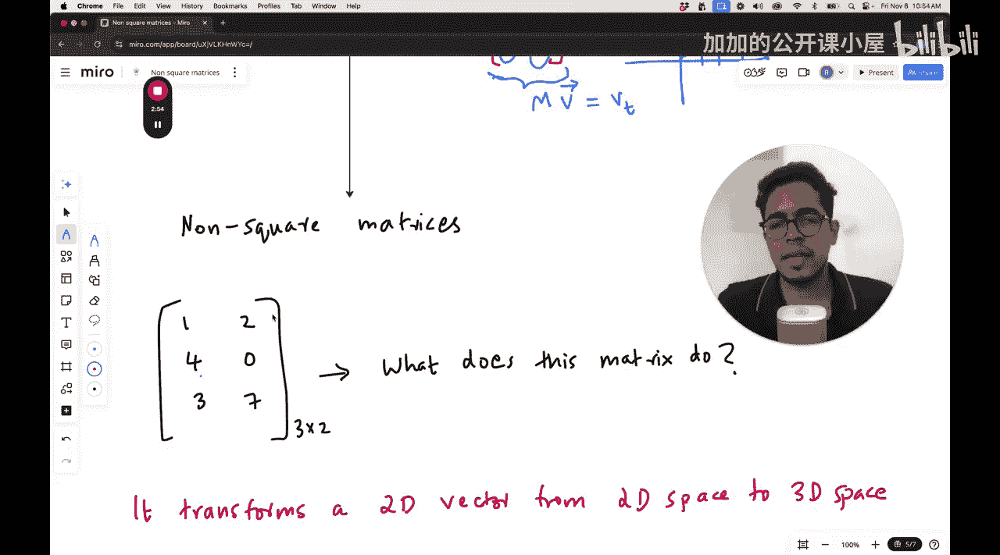

#  007：非方阵的变换

在本节课中，我们将要学习线性代数中的一个重要概念：非方阵所代表的线性变换。我们将探讨非方阵如何作用于向量，以及这种变换在几何上的含义。

## 概述

到目前为止，我们主要研究了方阵，例如在二维空间中使用的2x2矩阵。这些矩阵代表了在相同维度空间内的线性变换，如旋转、剪切和缩放。然而，在实际应用中，尤其是在机器学习中，我们经常需要处理非方阵。本节课程将解答一个关键问题：当一个矩阵不是方阵时，它代表什么样的变换？

## 从方阵到非方阵

上一节我们介绍了方阵如何作为线性变换的表示。例如，一个2x2矩阵 **M** 的列向量定义了新的基向量，任何原始向量 **v** 都可以通过这些新基向量来表示变换后的结果。

**公式表示**：`M * v = v'`


现在，我们来看看非方阵的情况。考虑一个3行2列的矩阵，其形式如下：


**矩阵示例**：
```
[ a11, a12 ]
[ a21, a22 ]
[ a31, a32 ]
```

这个矩阵有两列，但有三行。根据我们对方阵的理解，矩阵的每一列代表一个基向量变换后的位置。对于一个2x2矩阵，这两列对应的是二维空间中 **i** 和 **j** 基向量的新位置。

## 非方阵的几何解释

那么，一个3x2矩阵的几何意义是什么？它有两列，这意味着它仍然是从两个基向量出发进行变换。但是，它有**三行**，这表示变换后的向量将存在于一个**三维空间**中。

**核心概念**：一个 **m x n** 的矩阵将一个 **n** 维空间中的向量，映射（或变换）到一个 **m** 维空间中。

在我们的例子中（3x2矩阵）：
*   **输入空间**：二维空间（因为列数n=2，对应两个基向量）。
*   **输出空间**：三维空间（因为行数m=3，变换后向量的坐标由三个数字描述）。

因此，这个变换将一个二维平面“提升”或“嵌入”到了一个三维空间里。原始二维平面上的每一个点，在经过这个3x2矩阵变换后，都变成了三维空间中的一个点。

## 矩阵与向量的作用

接下来，我们看看这个矩阵如何作用于一个向量。

一个3x2矩阵只能与一个**二维向量**（即拥有两个分量的向量）相乘。相乘的结果是一个**三维向量**。

**运算示例**：
设矩阵 **A** = `[[1, 2], [3, 4], [5, 6]]`，向量 **v** = `[7, 8]^T`。
它们的乘积是：
`A * v = 7*[1, 3, 5]^T + 8*[2, 4, 6]^T = [7+16, 21+32, 35+48]^T = [23, 53, 83]^T`

以下是这个过程的分解：
1.  矩阵的第一列 `[1, 3, 5]^T` 是原始二维空间中第一个基向量（如i-hat）变换后在三维空间中的位置。
2.  矩阵的第二列 `[2, 4, 6]^T` 是原始二维空间中第二个基向量（如j-hat）变换后在三维空间中的位置。
3.  变换结果就是向量 **v** 的每个分量，分别对这两个新的三维基向量进行缩放后相加。



## 重要特性与应用



理解非方阵变换的特性对机器学习至关重要。


*   **降维与升维**：一个 **m x n** 矩阵可以实现从n维空间到m维空间的转换。当 m < n 时，是**降维**；当 m > n 时，是**升维**。
*   **机器学习中的应用**：在机器学习中，这种操作无处不在。
    *   **全连接层**：神经网络中的一层通常就是一个矩阵乘法，其权重矩阵往往是非方阵，用于改变数据的维度。
    *   **特征映射**：将原始特征（如像素）通过线性变换映射到更高维或更低维的特征空间，以便于分类或回归。
    *   **数据压缩**：降维技术（如PCA）的核心步骤就涉及非方阵变换。



## 总结



本节课中我们一起学习了非方阵的线性变换。我们明确了非方阵（m x n）的几何意义：它将一个n维空间中的向量变换到一个m维空间中。我们通过公式和示例理解了其运算过程，并探讨了这种维度变换在机器学习中的关键应用，如神经网络的层间变换和特征降维。掌握这一概念是理解更复杂机器学习模型的基础。