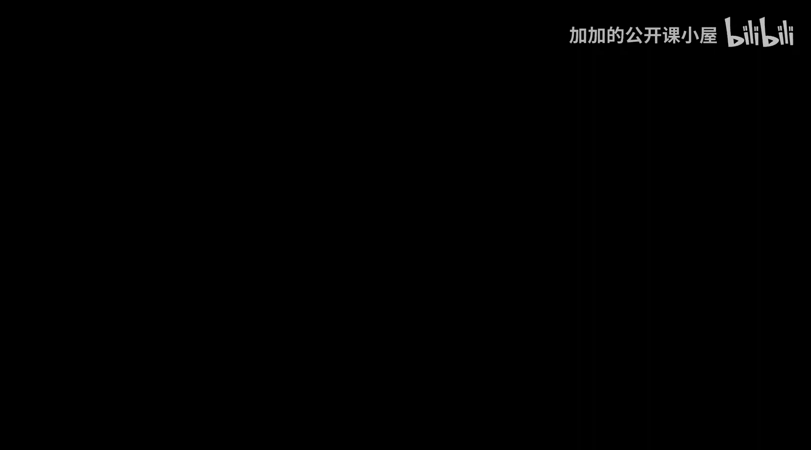
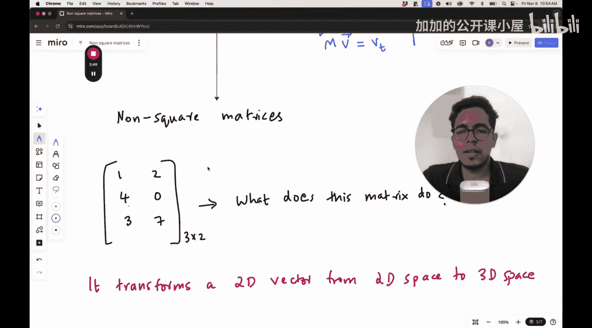

#  008：非方阵的变换




欢迎回到机器学习基础课程。我们将继续学习机器学习的数学基础，特别是线性代数。

## 概述

在本节课中，我们将要学习非方阵所代表的线性变换。到目前为止，我们主要讨论了方阵，但实际应用中会遇到各种形状的矩阵。理解非方阵的变换对于掌握更广泛的机器学习概念至关重要。

## 回顾：方阵作为变换

上一节我们介绍了矩阵本质上是二维或更高维空间中线性变换的表示。我们看到了不同的矩阵可以表示旋转变换、剪切变换，甚至是旋转和剪切同时发生的复合变换。所有这些变换都可以用矩阵表示。

你肯定注意到了一件事，并且可能产生了一个很自然的问题，这在我第一次学习时也发生过。我们之前总是在看**方阵**。例如，在二维空间中，我们主要看的是 **2x2** 矩阵。

假设我们有一个矩阵 **M**：
```python
M = [[3, 2],
     [1, 4]]
```
这是一个二维空间中的变换。其中，单位向量 **i** 被变换到位置 `(3, 1)`，单位向量 **j** 被变换到位置 `(2, 4)`。这意味着新的基向量（相当于变换后的 **i** 和 **j**）分别是 `(3, 1)` 和 `(2, 4)`。现在，xy平面上的任何向量都可以用这两个新的基向量来表示。

如果我们有一个向量 **v**，那么 **Mv** 会生成一个新的变换后的向量，这个向量可以用新的基向量（即变换后的 **i** 和 **j**）来表示。

## 引入非方阵

现在，你可能会有一个非常普遍的问题：如果矩阵不是方阵会怎样？在实际应用中，你处理的不仅仅是方阵，还会遇到**矩形矩阵**，即非方阵。

本节内容就是关于：如果矩阵本身是非方阵，那么它能表示什么样的变换？

让我们来看一个非方阵的例子。这是一个 **3x2** 矩阵：
```python
A = [[a11, a12],
     [a21, a22],
     [a31, a32]]
```
它有两列和三行。这个矩阵是做什么的？它对什么类型的向量进行操作？

## 非方阵的维度含义

理解非方阵变换的关键在于关注其输入和输出空间的维度。

*   **列数**：决定了输入向量的维度。对于一个 **m x n** 矩阵（m行，n列），它作用于一个 **n** 维的输入向量。
*   **行数**：决定了输出向量的维度。变换结果是一个 **m** 维的向量。

因此，一个 **3x2** 矩阵 **A** 表示一个从 **2维空间** 到 **3维空间** 的线性变换。

以下是具体步骤：
1.  你从一个二维向量开始，例如 `v = [x, y]^T`。
2.  矩阵 **A** 与这个向量相乘：`u = A * v`。
3.  结果 **u** 是一个三维向量。

这个过程可以想象为将一个平面（2D）中的点“提升”或“映射”到三维空间（3D）中的一个点。

## 总结



本节课中，我们一起学习了非方阵所代表的线性变换。我们回顾了方阵如何表示同一维度空间内的变换。然后，我们探讨了非方阵的关键特性：它将向量从一个维度空间变换到另一个维度空间。具体来说，一个 **m x n** 矩阵将 **n** 维向量变换为 **m** 维向量。理解这一点是理解后续更复杂线性代数概念（如秩、降维和特征分解）的重要基础。