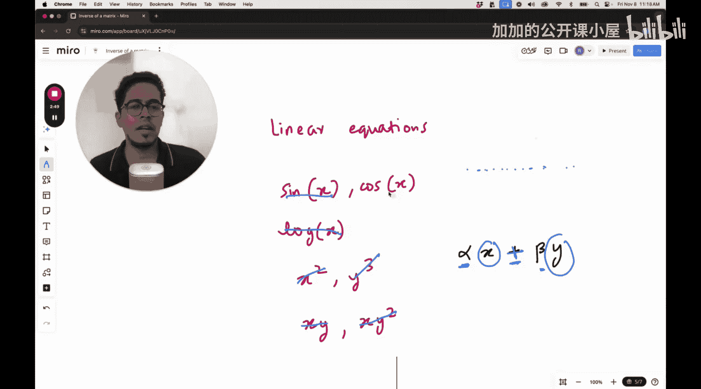

#  009：矩阵逆的物理意义


## 概述
在本节课中，我们将要学习矩阵逆的物理意义。我们将从线性方程组出发，理解矩阵如何表示线性变换，并探讨矩阵的逆运算在几何上如何对应“逆向变换”的过程。

---

## 从线性方程组到矩阵表示

上一节我们介绍了矩阵作为线性变换的几何视角。本节中我们来看看如何用矩阵来表示一组线性方程组。

线性方程组中的每个方程，其变量仅与一个缩放系数相乘，然后进行加法或减法运算。例如，形如 **αx + βy** 的方程是线性的，因为变量x和y分别被系数α和β缩放后相加。变量之间不会相乘（如xy），也不会出现平方（如x²）、立方、对数或三角函数等非线性运算。

一组线性方程组可以简洁地用矩阵乘法来表示。考虑以下方程组：
```
a₁₁x₁ + a₁₂x₂ + ... + a₁ₙxₙ = b₁
a₂₁x₁ + a₂₂x₂ + ... + a₂ₙxₙ = b₂
...
aₘ₁x₁ + aₘ₂x₂ + ... + aₘₙxₙ = bₘ
```

我们可以将其写为矩阵形式：
**A x = b**
其中：
*   **A** 是一个 m×n 的系数矩阵。
*   **x** 是一个包含 n 个变量的列向量。
*   **b** 是一个包含 m 个结果的列向量。


---

## 矩阵逆的直观理解

在了解了矩阵可以表示线性变换后，一个自然的问题是：这个变换可以逆转吗？这就是矩阵逆的概念。

从物理意义上讲，如果矩阵 **A** 代表一个线性变换（例如旋转、缩放），那么它的逆矩阵 **A⁻¹** 就代表一个完全相反的变换，能将变换后的向量恢复原状。

用公式表示这个关系就是：
**A⁻¹ (A x) = x**
或者等价地：
**A A⁻¹ = I**
其中 **I** 是单位矩阵，代表“什么都不做”的变换。

---

## 逆变换存在的条件

并非所有矩阵都存在逆矩阵。逆矩阵存在的关键条件是矩阵必须是**方阵**（行数等于列数），并且是**满秩**的，这意味着其列向量是线性独立的。

以下是一些直观理解：
*   如果一个变换将空间压缩到更低的维度（例如将3D空间投影到2D平面），信息会丢失，你无法从结果唯一地确定原始向量。这种变换没有逆。
*   如果一个变换是“一对一”且“满射”的（即不同输入对应不同输出，且所有输出都可能被达到），那么理论上存在逆变换。

---

## 总结

本节课中我们一起学习了矩阵逆的物理意义。我们了解到：
1.  线性方程组可以用矩阵乘法 **A x = b** 表示。
2.  矩阵 **A** 代表一个线性变换。
3.  矩阵的逆 **A⁻¹** 代表该变换的逆向操作，满足 **A⁻¹A = I**。
4.  只有方阵且满秩（列线性独立）时，逆矩阵才存在。



理解矩阵逆的几何意义，对于后续学习如何求解线性方程组、理解许多机器学习算法中的优化步骤至关重要。