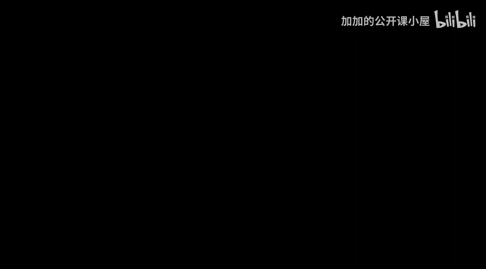
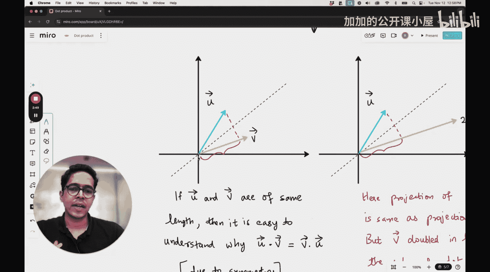

#  010：点积与线性变换的关系

在本节课中，我们将要学习线性代数中的一个核心概念：点积。我们将探讨点积与之前学习的线性变换之间有何联系，并理解其几何意义。

## 概述

在之前的课程中，我们学习了线性变换、矩阵乘法作为线性变换、以及矩阵与向量相乘作为向量的线性变换。本节我们将聚焦于点积运算，并揭示它如何与线性变换的概念相关联。

## 点积的数值计算

首先，我们回顾点积的数值计算方法。点积作用于两个向量，并产生一个标量结果。

例如，有两个向量 **a** = [1, 2, 3] 和 **b** = [3, 2, 1]。它们的点积计算如下：

**a · b** = (1 × 3) + (2 × 2) + (3 × 1) = 3 + 4 + 3 = 10

用公式表示，对于两个 n 维向量 **u** = [u₁, u₂, ..., uₙ] 和 **v** = [v₁, v₂, ..., vₙ]，点积定义为：

**u · v** = u₁v₁ + u₂v₂ + ... + uₙvₙ

## 点积的几何意义

从几何角度看，点积可以理解为**一个向量在另一个向量方向上的投影长度**与**后一个向量长度**的乘积。

假设在二维空间中，有向量 **u** 和 **v**。将向量 **v** 投影到 **u** 所在直线上，会得到一个标量长度（即投影长度）。点积 **u · v** 就等于这个投影长度乘以向量 **u** 自身的长度。

有趣的是，这个运算顺序可以互换。我们也可以将向量 **u** 投影到 **v** 上，然后用得到的投影长度乘以向量 **v** 的长度，结果相同。

## 投影顺序的对称性

你可能会问，为什么投影的顺序不影响最终结果？这背后存在一种几何对称性。

考虑两个长度相等但方向不同的向量 **u** 和 **v**。你可以在它们之间画一条对称轴。由于两个向量长度相等，并且点积运算在几何上是对称的，因此无论将哪个向量投影到另一个上，其“有效贡献”是相同的，所以结果不变。更严格的证明可以通过余弦定理和向量夹角公式来完成，但几何直观有助于我们理解这种对称性。

## 点积与线性变换的联系

现在，我们进入核心部分：点积如何与线性变换联系起来。

我们可以将点积看作一种特殊的线性变换。具体来说，**对向量进行点积运算，等价于将该向量通过一个特定的线性变换矩阵，然后与另一个向量进行标准点积**。

更直接地说，对于固定的向量 **w**，函数 **f(v) = w · v** 是一个从向量空间到标量的线性函数。根据线性代数的知识，任何这样的线性函数都可以表示为某个矩阵（在此例中是一个行向量）与输入向量 **v** 的矩阵乘法。

例如，向量 **w** = [w₁, w₂, w₃] 与向量 **v** 的点积，等价于将 **w** 视为一个 1×3 的行矩阵，然后与列向量 **v** 相乘：

**w · v** = [w₁ w₂ w₃] * [v₁, v₂, v₃]^T

这里，行矩阵 `[w₁ w₂ w₃]` 就定义了一个从三维空间到一维数轴的线性变换。这个变换将任意输入向量 **v** 映射到它在 **w** 方向上的“带符号长度”（即点积值）。

## 总结

本节课我们一起学习了点积与线性变换的关系。

1.  我们回顾了点积的数值计算方法和几何意义（投影）。
2.  我们探讨了点积运算中投影顺序的几何对称性。
3.  最重要的是，我们建立了点积与线性变换的联系：**两个向量的点积，可以理解为其中一个向量（作为行矩阵）对另一个向量实施的线性变换，其结果是一个标量**。

理解点积的这一本质，对于后续学习机器学习中诸如余弦相似度、支持向量机、神经网络中的权重计算等概念至关重要。它不仅是数值运算，更是一种衡量向量方向对齐程度的几何工具和线性映射。