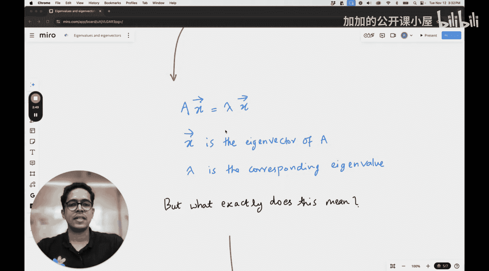

#  011：特征值与特征向量的直观理解

欢迎回到我们的机器学习基础课程。我们将继续学习数学基础，特别是线性代数部分。在未来的课程中，我们当然会学习统计学、概率论等内容。但本节课将是我们在本系列中，为机器学习目的而讲解线性代数基础知识的最后一讲。本节课我将介绍我最喜欢的主题之一：特征值与特征向量。

我之所以喜欢这个主题，是因为对特征值与特征向量的直观理解，通常没有在大学教学中以直观的方式被传授。当我第一次学习这个概念时，它并没有以一种直观的方式介绍给我，而是过分关注了特征值与特征向量的数学方面。因此，我很快就忘记了这个概念本身，甚至在忘记之前，理解起来就非常困难。在本节课中，我们将尝试建立关于特征值与特征向量的一个非常简单的几何直觉。当然，我们将通过线性变换的视角来看待这个问题。

## 课程概述

在本节课中，我们将从线性变换的角度来理解特征值与特征向量，从而建立其几何直觉，而不仅仅是数学框架。

## 回顾线性变换

在整个课程中，我们一直在研究线性变换。简单回顾一下，我们将矩阵视为一个线性变换。如果矩阵是方阵，它将在其所在的空间内执行线性变换。如果它是非方阵，则可能将向量从一个空间（例如2D空间）变换到另一个空间（例如3D空间），或者从3D空间变换到2D空间，因此维度可能会增加或减少。

我们还看到，矩阵与向量的乘法是对向量的线性变换，而矩阵与矩阵的乘法则像是复合的线性变换，其中两个线性变换被依次应用。如果你有一个旋转变换和一个缩放变换，你只需要将向量依次与旋转变换对应的矩阵和缩放变换对应的矩阵相乘即可。

## 从变换视角看特征值与特征向量

在本节课中，我们将从线性变换的角度来看待特征向量和特征值。这将帮助我们理解一个简单的几何直觉，而不仅仅是数学框架。

从数学上讲，我相信你对特征值和特征向量已经很熟悉了。如果你还没有听说过，简单来说：

**公式**：`A * x = λ * x`

其中，`A` 是一个矩阵，`x` 是一个向量，`λ` 是一个标量。如果存在这样的关系，那么 `x` 被称为矩阵 `A` 的**特征向量**，`λ` 被称为对应于该特征向量的**特征值**。

这里，`A` 是一个对向量 `x` 进行变换的线性变换。但这个变换的特殊之处在于，被变换的原始向量 `x` 仅仅是被**缩放**了，而 `λ` 就是这个缩放因子。

## 核心概念解析

上一节我们回顾了线性变换并引入了特征值的数学定义。本节中，我们来深入理解这个定义的几何意义。

以下是理解特征值与特征向量几何意义的关键点：

1.  **不变的方向**：对于一个线性变换 `A`，特征向量 `x` 在经过变换后，其方向保持不变（或恰好反向）。它不会被旋转到其他方向。
2.  **纯粹的缩放**：特征值 `λ` 量化了特征向量 `x` 在该不变方向上被拉伸或压缩的程度。
    *   如果 `|λ| > 1`，向量被拉长。
    *   如果 `0 < |λ| < 1`，向量被缩短。
    *   如果 `λ` 是负数，向量方向反转，同时长度按 `|λ|` 缩放。
3.  **变换的“主轴”**：特征向量可以被视为该线性变换的“主轴”。沿着这些方向，变换的效果最简单，仅仅是缩放。理解这些主轴，就抓住了这个变换最核心的几何行为。

## 总结

本节课中，我们一起学习了特征值与特征向量的直观几何解释。我们了解到，特征向量是线性变换中那些方向保持不变的向量，而特征值则描述了这些向量被缩放的程度。通过从线性变换的视角（而不仅仅是公式计算）来理解这个概念，我们能够更深刻地把握它在机器学习（例如主成分分析、谱聚类等算法）和许多其他领域中的应用本质。记住，特征向量揭示了变换的“内在”结构方向。