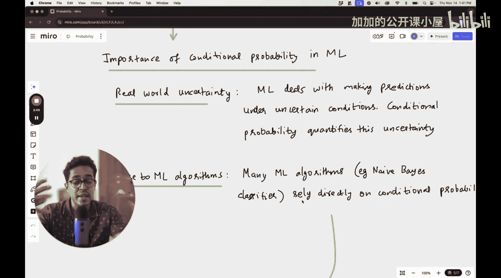

#  013：条件概率

欢迎回到机器学习基础课程。我们继续学习一些数学基础。在本节课中，我们将了解概率论的一些基础知识。如果你想成为一名专业的机器学习工程师，这些知识是必须掌握的。

本课程主要面向初学者。如果你已经非常熟悉概率论，可能会觉得其中一些概念非常简单。但如果你是初学者或第一次学习，你一定会有所收获。我们将尝试理解一些基本概念，而不深入探讨概率论的极端细节，这些细节在我们后续学习机器学习时可能并不需要。

首先，我想强调机器学习中最需要的两个重要概念是条件概率和贝叶斯定理。因此，当我们谈论概率论基础时，我们将主要关注条件概率，并深入探讨贝叶斯定理。我第一次学习贝叶斯定理时，虽然公式很简单，但其背后的物理直觉以及与公式的对应关系总是令人困惑。每当遇到相关问题时，几乎总是会引起混淆。我第一次学习时感觉并不轻松，但随着直觉的加深，我意识到有更简单的方法来思考和理解贝叶斯定理。我将尽力将这些想法传递给你。

## 📊 概率快速回顾

事件E的概率P(E)等于有利结果的数量除以结果的总数。例如，如果我们进行的实验是掷一个骰子，事件定义为出现数字4。那么，整个实验空间是{1, 2, 3, 4, 5, 6}，而事件空间只包含数字4。所以概率基本上是事件空间的大小除以整个结果空间的大小，即1除以6。这是一个相当容易理解的概念：掷一个普通骰子时，任何给定数字的概率是1/6。

这是快速的回顾，我们不想进一步深入，因为这些是简单的数学定义。

## 🤔 概率在机器学习中的应用

那么，概率，特别是条件概率，究竟在机器学习中何处使用呢？这几乎无处不在，因为现实世界中存在不确定性。

如果你有一个关于电子邮件的数据集，比如邮件中包含的词语或文本，你想根据文本进行分类。

## 🔍 理解条件概率

上一节我们回顾了基本概率。本节中，我们来看看条件概率。

条件概率是指在已知另一个事件B已经发生的情况下，事件A发生的概率。记作 **P(A|B)**。

其公式为：
**P(A|B) = P(A ∩ B) / P(B)**

其中，P(A ∩ B) 是事件A和事件B同时发生的概率（联合概率），P(B) 是事件B发生的概率。

为了更直观地理解，我们可以将其视为在事件B的“世界”或“空间”中，事件A发生的比例。它衡量了在给定一些额外信息（B已发生）后，我们对事件A发生可能性的评估如何变化。

## 📝 条件概率示例

以下是理解条件概率的一个简单示例：

假设我们有一个包含100人的数据集。其中，40人是女性，60人是男性。在女性中，10人戴眼镜。在男性中，20人戴眼镜。

现在，我们随机选择一个人。我们想知道：在已知此人是女性的条件下，她戴眼镜的概率是多少？

*   **事件A**：此人戴眼镜。
*   **事件B**：此人是女性。

我们需要计算 **P(戴眼镜 | 女性)**。

根据公式：
P(戴眼镜 | 女性) = P(戴眼镜 ∩ 女性) / P(女性)

*   P(戴眼镜 ∩ 女性) = 戴眼镜的女性人数 / 总人数 = 10 / 100 = 0.1
*   P(女性) = 女性人数 / 总人数 = 40 / 100 = 0.4

因此，P(戴眼镜 | 女性) = 0.1 / 0.4 = 0.25 或 25%。

这意味着，如果我们已经知道选中的人是女性，那么她戴眼镜的概率是25%。这不同于总体中戴眼镜的概率（(10+20)/100 = 30%），因为条件信息（“是女性”）改变了概率。

## 🧮 贝叶斯定理

理解了条件概率后，我们现在可以探讨机器学习的核心工具之一：贝叶斯定理。

贝叶斯定理提供了一种在已知新证据（数据）的情况下，更新假设（模型参数或类别）概率的方法。它建立了两个条件概率之间的关系。

贝叶斯定理的公式是：
**P(A|B) = [P(B|A) * P(A)] / P(B)**

其中：
*   **P(A|B)** 是后验概率：在观察到证据B后，假设A为真的概率。
*   **P(B|A)** 是似然：在假设A为真的条件下，观察到证据B的概率。
*   **P(A)** 是先验概率：在观察到任何证据之前，假设A为真的初始概率。
*   **P(B)** 是证据概率：观察到证据B的总概率（在所有可能假设下）。

## 💡 贝叶斯定理的直观理解

贝叶斯定理的核心思想是“用数据更新信念”。我们从对某件事的初始信念（先验P(A)）开始。然后，我们收集到一些新数据或证据（B）。我们想知道，在看到这个证据后，我们的信念应该如何调整。贝叶斯定理通过结合证据在假设成立下的可能性（P(B|A)）以及证据本身的普遍性（P(B)），来计算更新后的信念（后验P(A|B)）。

一个常见的类比是医学诊断：
*   **A**：患有某种疾病。
*   **B**：检测结果为阳性。
*   **P(A)**：人群中该疾病的患病率（先验）。
*   **P(B|A)**：如果真有病，检测呈阳性的概率（检测的敏感性/似然）。
*   **P(B)**：总体上检测呈阳性的概率。
*   **P(A|B)**：在检测呈阳性的条件下，真正患病的概率（后验）。

贝叶斯定理告诉我们，即使检测非常准确（P(B|A)很高），如果疾病本身非常罕见（P(A)很低），那么一个阳性结果可能并不意味着你很可能真的患病，因为假阳性的可能性也需要考虑（这包含在P(B)中）。

## 🎯 总结

在本节课中，我们一起学习了概率论中两个对机器学习至关重要的基础概念。

首先，我们回顾了基本概率。接着，我们深入探讨了**条件概率 P(A|B)**，它描述了在已知另一事件发生的情况下，某事件发生的概率。我们通过一个关于性别和戴眼镜的简单例子说明了其计算和含义。

最后，我们介绍了**贝叶斯定理**。这是一个强大的公式，用于在获得新证据后更新事件的概率。我们了解了其组成部分：先验概率、似然、证据概率和后验概率，并讨论了它在“用数据更新信念”中的核心作用。

掌握条件概率和贝叶斯定理是理解许多机器学习算法（如朴素贝叶斯分类器、贝叶斯网络以及更广泛的统计推断）的关键第一步。