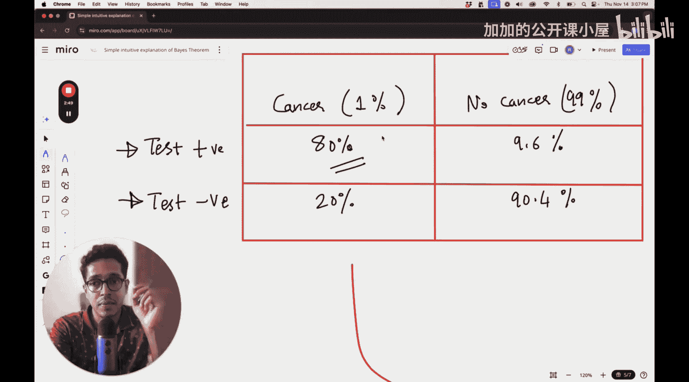

#  014：贝叶斯定理 - 直觉与基础

欢迎来到关于贝叶斯定理的课程。我们将尝试建立一个非常简单的直观理解，来弄明白这个定理究竟在说什么。

在本节课中，我们也将尝试建立这个定理的数学描述，但会更侧重于其背后的逻辑直觉。

## 概述

在本节课中，我们将要学习贝叶斯定理的核心思想。我们将通过一个具体的医学诊断例子，一步步推导出贝叶斯定理的公式，并理解它在现实世界中的意义。

## 一个直观的例子

让我们来看一个例子。我们关注女性乳腺癌的病例。

假设数据是这样的：有1%的女性患有乳腺癌。这个数据可能不准确，但我们暂时不考虑这一点，只关注其传达的思想。

有一种叫做乳腺X光检查（mammogram）的技术，类似于对乳房进行X光检查，可以在X光片上看到乳腺癌的发生。

假设在这种检查中，如果确实存在乳腺癌，有80%的概率能够检测出来。这意味着在20%的情况下，即使乳腺癌存在，也无法被检测出来。这是第二个陈述所表达的意思之一。

第三个陈述说，有9.6%的乳腺X光检查会在没有癌症的情况下检测出乳腺癌。这些也被称为假阳性，因为你给出了“有癌症”的错误信息。所以，这9.6%的情况是乳腺X光检查可能给出假阳性。

那么，剩下的情况是什么呢？在90.4%的情况下，乳腺X光检查检测出乳腺癌，并且癌症确实存在。这也是第三个陈述所表达的意思。

## 构建概率表格

现在，让我们把所有这些信息放入一个表格格式中，以便更容易理解。

我们第一列对应“有癌症”，第二列对应“无癌症”。有1%的概率女性患有乳腺癌，所以这里写1%。有99%的概率她们没有癌症。

第一行说的是：如果某人的乳腺X光检查呈阳性。如果有人患有癌症，有80%的概率乳腺X光检查会呈阳性。但如果有人患有癌症，有20%的概率检查不会呈阳性，意味着检查会呈阴性。这就是乳腺X光检查准确率所表达的意思：在80%的癌症病例中能被检测出来，在20%的癌症病例中检测不出来。

上一节我们通过一个乳腺癌诊断的例子，引入了先验概率和条件概率的概念。本节中，我们来看看如何将这些信息组织起来，并引出贝叶斯定理的核心问题。

以下是构建完整概率表格的步骤：

1.  **确定先验概率**：总体人群中，患癌的概率 `P(癌症) = 1%`，未患癌的概率 `P(无癌) = 99%`。
2.  **确定似然概率**：
    *   在患癌的条件下，检测呈阳性的概率 `P(阳性 | 癌症) = 80%`。
    *   在患癌的条件下，检测呈阴性的概率 `P(阴性 | 癌症) = 20%`。
    *   在未患癌的条件下，检测呈阳性（假阳性）的概率 `P(阳性 | 无癌) = 9.6%`。
    *   在未患癌的条件下，检测呈阴性（真阴性）的概率 `P(阴性 | 无癌) = 90.4%`。
3.  **计算联合概率**：将先验概率与条件概率相乘，得到每个细分情况的概率。例如，一个人既患癌且检测呈阳性的概率是 `P(癌症) * P(阳性 | 癌症) = 1% * 80% = 0.8%`。

通过这个表格，我们可以清晰地看到所有可能情况的概率分布。然而，在实际诊断中，我们更关心一个逆向的问题：**已知检测结果呈阳性，这个人真正患癌的概率是多少？** 这正是贝叶斯定理要解决的核心问题。

## 贝叶斯定理的推导与应用

上一节我们得到了完整的概率分布表。现在，我们利用这个表格来回答那个关键问题：检测呈阳性时，实际患癌的概率是多少？

从表格中我们可以直接计算：
*   检测呈阳性的总概率 `P(阳性)` = 患癌且阳性的概率 + 无癌且阳性的概率 = `0.8% + 9.504% = 10.304%`。
*   在这部分阳性结果中，真正患癌的比例是 `0.8%`。

因此，在已知检测呈阳性的条件下，患癌的后验概率为：
`P(癌症 | 阳性) = P(癌症且阳性) / P(阳性) = 0.8% / 10.304% ≈ 7.76%`

这个计算过程就是贝叶斯定理的直观体现。我们可以将其抽象成通用公式。

贝叶斯定理的公式如下：

`P(A|B) = [P(B|A) * P(A)] / P(B)`

其中：
*   `P(A|B)` 是后验概率，即在事件B发生的条件下，事件A发生的概率（这是我们想求的）。
*   `P(B|A)` 是似然概率，即在事件A发生的条件下，事件B发生的概率。
*   `P(A)` 是先验概率，即事件A发生的初始概率。
*   `P(B)` 是证据或边缘概率，即事件B发生的总概率，通常通过全概率公式计算：`P(B) = P(B|A)*P(A) + P(B|非A)*P(非A)`。

在我们的例子中：
*   `A` 代表“患癌”，`B` 代表“检测阳性”。
*   `P(癌症 | 阳性)` 是后验概率（≈7.76%）。
*   `P(阳性 | 癌症)` 是似然概率（80%）。
*   `P(癌症)` 是先验概率（1%）。
*   `P(阳性)` 是证据概率（10.304%）。

## 总结

本节课中，我们一起学习了贝叶斯定理的基础与直觉。

我们从一个乳腺癌诊断的实例出发，通过构建概率表格，直观地理解了先验概率、似然概率、联合概率和后验概率之间的关系。最关键的是，我们学会了如何利用已知的信息（如检测准确率和疾病基础发病率）来更新我们对某个事件（如一个人是否患病）发生概率的认知。这正是贝叶斯定理的核心：**在获得新证据后，如何更新假设的概率**。

记住这个核心公式 **`P(A|B) = [P(B|A) * P(A)] / P(B)`**，它将在机器学习的许多领域，特别是分类和概率图模型中，发挥至关重要的作用。