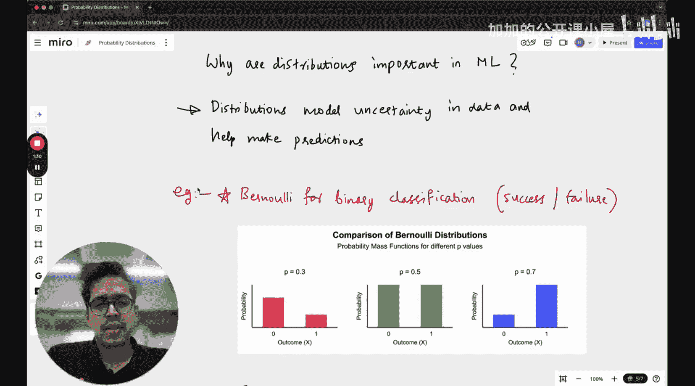

**机器学习基础：P15：概率分布**

在本节课中，我们将学习概率分布的基础知识。概率分布描述了随机变量所有可能结果及其对应概率的分布情况，是理解数据不确定性和进行预测建模的核心工具。

---

上一节我们介绍了概率与统计的基本概念，本节中我们来看看概率分布的具体形式。

概率分布描述了随机变量所有可能结果对应的概率如何分布。这种分布本身可以是离散的或连续的。

*   **离散分布**：当实验结果是可数的、具体的值时，其概率分布是离散的。例如，抛硬币10次，正面朝上的次数只能是0到10之间的整数。
*   **连续分布**：当实验结果可以取某个区间内的任意值时（或在实践中可视为连续），其概率分布是连续的。

概率分布的核心思想是，进行一次实验时，某些结果出现的可能性更高，而另一些则更低。概率分布为我们提供了这种可能性的整体描述。这些分布在机器学习中至关重要，因为它们能对数据中的不确定性进行建模，并帮助我们进行预测。

例如，**伯努利分布**常用于二元分类问题，它描述了一次试验中“成功”或“失败”（例如，真或假）的概率。我们最近一篇关于大语言模型中偏见的研究论文，就涉及到了特定输出概率的计算。

---

以下是几种关键的概率分布及其应用：

**1. 伯努利分布**
伯努利分布描述单次试验中二元结果的概率分布。

*   **公式**：`P(X=1) = p`, `P(X=0) = 1-p`。其中，`X=1`代表“成功”，其概率为`p`。
*   **应用**：模拟单次抛硬币、一次点击预测、或任何只有两种可能结果的事件。

**2. 二项分布**
二项分布描述在固定次数的独立伯努利试验中，“成功”次数的概率分布。

*   **公式**：`P(X=k) = C(n, k) * p^k * (1-p)^(n-k)`。其中，`n`为试验总次数，`k`为成功次数，`p`为单次成功概率。
*   **应用**：计算抛硬币10次得到6次正面的概率，或在100次广告展示中获得一定点击次数的概率。

**3. 均匀分布**
均匀分布描述所有结果出现概率均等的情况。

*   **离散均匀分布**：掷一个公平的六面骰子，每个面朝上的概率都是1/6。
*   **连续均匀分布**：在区间`[a, b]`内，任何子区间取值的概率与该子区间的长度成正比。
*   **应用**：等概率随机抽样、初始化模型参数。

**4. 正态分布**
正态分布（又称高斯分布）是最重要的连续分布之一，其概率密度函数呈钟形曲线。

*   **公式**：`f(x) = (1 / (σ√(2π))) * e^(-(x-μ)²/(2σ²))`。其中，`μ`是均值（决定中心位置），`σ`是标准差（决定分布的宽度）。
*   **应用**：自然界中许多现象的近似分布（如身高、测量误差），也是许多统计方法和机器学习算法的基础假设。

**5. 泊松分布**
泊松分布描述在固定时间或空间间隔内，随机事件发生次数的概率分布。

*   **公式**：`P(X=k) = (λ^k * e^(-λ)) / k!`。其中，`λ`是单位间隔内事件的平均发生次数，`k`是实际发生次数。
*   **应用**：模拟客服中心每小时接到的电话数、网站每分钟的访问次数或放射性物质在给定时间内的衰变次数。

---

本节课中，我们一起学习了概率分布的核心概念及其在机器学习中的重要性。我们介绍了**伯努利分布**、**二项分布**、**均匀分布**、**正态分布**和**泊松分布**这几种关键分布，了解了它们的定义、公式和典型应用场景。理解这些分布是构建机器学习模型、处理数据不确定性和进行统计推断的坚实基础。