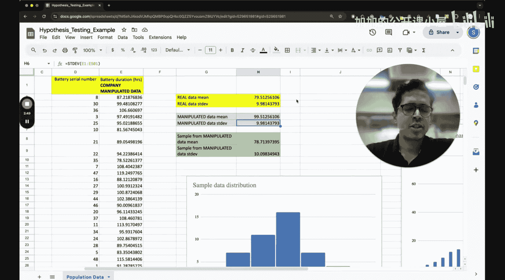

#  016：假设检验与置信区间 🧪


在本节课中，我们将学习统计学中两个核心概念：假设检验与置信区间。它们是数据分析与机器学习的基石，能帮助我们判断数据的真实性、评估模型结果的可信度，并做出基于数据的决策。

## 概述

假设检验是一种统计方法，用于根据样本数据对总体参数提出假设并进行检验。置信区间则用于估计参数的真实值可能落在哪个范围内。理解这两个概念对于评估机器学习模型的性能、进行A/B测试以及理解数据中的不确定性至关重要。

上一节我们介绍了概率分布与抽样，本节中我们来看看如何利用这些知识对总体参数进行推断。

## 一个简单的案例

在深入数学细节之前，我们先看一个简单的案例。假设有一家制造电池的公司，他们生产了500块电池，并测试了每块电池的平均续航时间（以小时计）。

这家公司可能由于某些原因，未能生产出高质量的电池。他们实际收集到的电池续航数据可能如下所示：电池序号从1到500，对应的实际续航时间均值为79.5小时（约80小时），标准差为10小时。因此，电池的典型续航时间大约是80 ± 10小时。

然而，假设这家公司的目标是生产平均续航达到100小时的电池。为了掩盖产品不达标的事实，他们可能对数据进行了篡改。篡改的方式是给每一个原始数据都加上20小时。例如，将67小时改为87小时，将79小时改为99小时，将86小时改为106小时。

经过这样的篡改，电池续航的均值变成了接近99.5小时，标准差保持不变。于是，电池续航就从“80 ± 10小时”变成了“100 ± 10小时”，但这完全是人为操纵的结果。

## 核心概念：零假设与备择假设

面对上述情况，我们如何判断数据是否被篡改？这就需要引入假设检验。假设检验的第一步是建立两个对立的假设。

*   **零假设 (Null Hypothesis, H₀)**：通常代表现状、无效果或没有差异的假设。在电池案例中，零假设可以是“电池的平均续航时间没有达到100小时”，或者更一般地，“样本所来自的总体的均值等于某个特定值”。
    *   公式表示：**H₀: μ = μ₀** （其中μ是总体均值，μ₀是某个假设值，例如100）
*   **备择假设 (Alternative Hypothesis, H₁ 或 Hₐ)**：代表我们想要证明的、与研究预期一致的情况。在电池案例中，如果我们怀疑公司夸大数据，备择假设可以是“电池的平均续航时间低于100小时”。如果我们只是怀疑数据不真实，也可以是“电池的平均续航时间不等于100小时”。
    *   公式表示（单侧检验）：**H₁: μ < μ₀** 或 **H₁: μ > μ₀**
    *   公式表示（双侧检验）：**H₁: μ ≠ μ₀**

检验的目的，就是利用样本数据提供的证据，决定是拒绝零假设（支持备择假设），还是没有足够证据拒绝零假设。

## 置信区间：估计的可靠性

除了直接检验假设，我们还可以通过构建置信区间来估计参数。置信区间提供了一个范围，我们有特定程度的信心（例如95%）认为总体参数的真实值落在这个范围内。

例如，根据公司的**原始数据**（均值79.5，标准差10，样本量500），我们可以计算总体平均续航时间μ的95%置信区间。计算过程涉及样本均值、标准误差和Z分数（或t分数）。

```python
# 示例：计算95%置信区间 (使用Z分数，已知总体标准差或大样本)
import scipy.stats as stats

sample_mean = 79.5
sample_std = 10
n = 500
confidence_level = 0.95

# 计算标准误差
standard_error = sample_std / (n ** 0.5)
# 计算Z分数（对于95%置信度，双尾）
z_score = stats.norm.ppf(1 - (1 - confidence_level) / 2)
# 计算边际误差
margin_of_error = z_score * standard_error
# 计算置信区间
ci_lower = sample_mean - margin_of_error
ci_upper = sample_mean + margin_of_error

print(f"95% 置信区间为: ({ci_lower:.2f}, {ci_upper:.2f}) 小时")
```

运行类似代码，我们可能得到一个如 (78.62, 80.38) 小时的区间。这个区间完全低于100小时，增强了我们对“电池未达宣称标准”的怀疑。

相反，如果使用**篡改后的数据**（均值99.5）计算，置信区间可能会是 (98.62, 100.38) 小时。这个区间包含了100小时，但这并不能证明数据真实，只是说明篡改后的数据在统计上“看起来”符合100小时的标准。关键在于数据来源是否可信。

## 假设检验的步骤

以下是进行假设检验的一般步骤：

1.  **提出假设**：明确零假设H₀和备择假设H₁。
2.  **选择显著性水平 (α)**：设定一个阈值（常用0.05），用于判断结果是否具有统计显著性。它代表了当H₀为真时，我们错误地拒绝它的最大概率（第一类错误）。
3.  **计算检验统计量**：根据样本数据、假设的总体参数以及数据分布，计算一个统计量（如Z值、t值）。
    *   公式示例（Z检验）：**Z = (x̄ - μ₀) / (σ / √n)**
4.  **做出决策**：
    *   **P值法**：计算得到当前样本结果（或更极端结果）的概率（P值）。如果P值 ≤ α，则拒绝H₀。
    *   **临界值法**：将计算出的检验统计量与对应α水平的临界值比较。如果统计量落在拒绝域，则拒绝H₀。

## 总结

本节课中我们一起学习了假设检验与置信区间的核心思想。我们通过一个电池数据篡改的案例，理解了提出**零假设**与**备择假设**的必要性。我们学习了**置信区间**如何为参数估计提供一个可靠的范围。最后，我们梳理了假设检验的标准步骤，包括设定显著性水平、计算检验统计量以及基于P值或临界值做出统计决策。



掌握这些概念，你就能为评估机器学习模型（如比较两个模型准确率是否有显著差异）、分析实验数据打下坚实的统计学基础。记住，统计推断的目标不是证明，而是在不确定性中做出尽可能合理的判断。