#  017：朴素贝叶斯分类与模型评估 📊

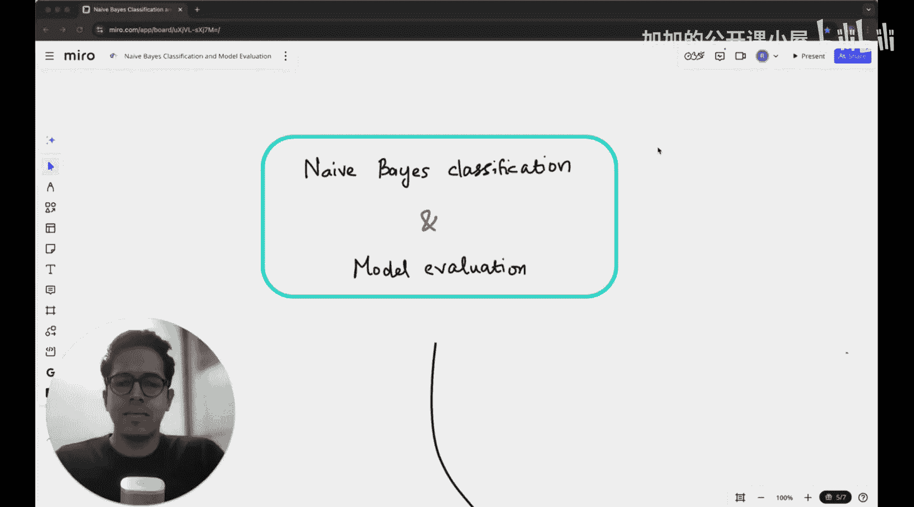

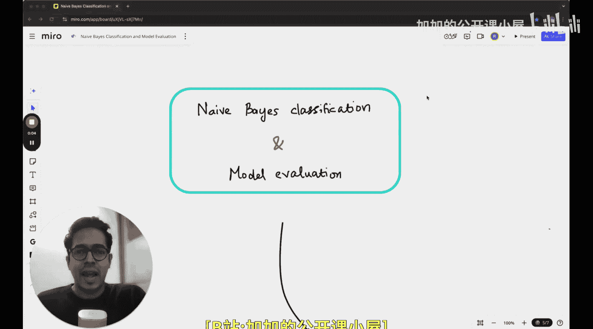

在本节课中，我们将要学习两个在机器学习与数据科学项目中极其常见的主题：**朴素贝叶斯分类器**和**模型评估**。虽然本课程尚未深入探讨机器学习模型的细节，但本讲将为你提供一个概览，让你了解学习分类方法和评估模型效能时将会接触到的核心概念。

上一讲我们探讨了贝叶斯定理和假设检验。本节中，我们将聚焦于一个特定的分类器——朴素贝叶斯分类器。

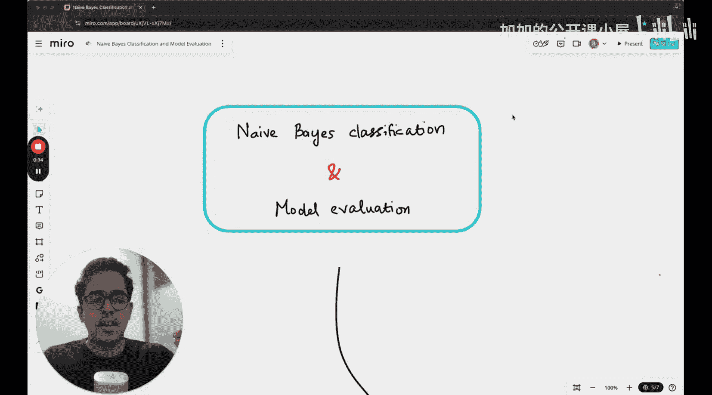

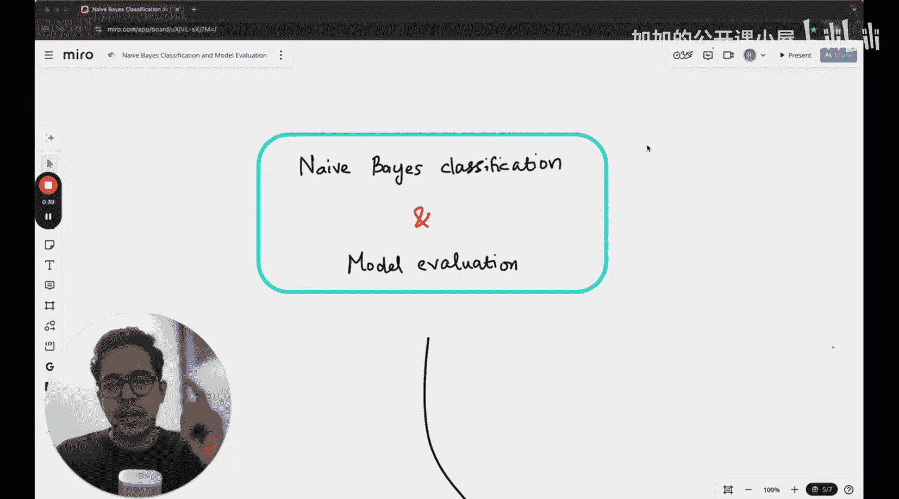

---

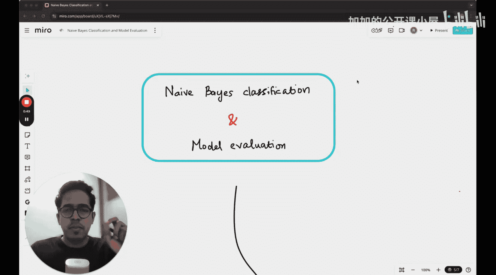

## 第一部分：朴素贝叶斯分类器 📈

本部分我们将学习一些理论基础，并通过手算来实践朴素贝叶斯分类。我们会讨论其基本概念、核心假设，并一步步实现一个用于**垃圾邮件分类**的分类器。在之前的课程中，我们曾根据邮件中是否包含“Nigerian prince”这个词进行分类。今天，我们将看一个稍有不同的例子，同时考虑两个独立的词。

### 分类的概念

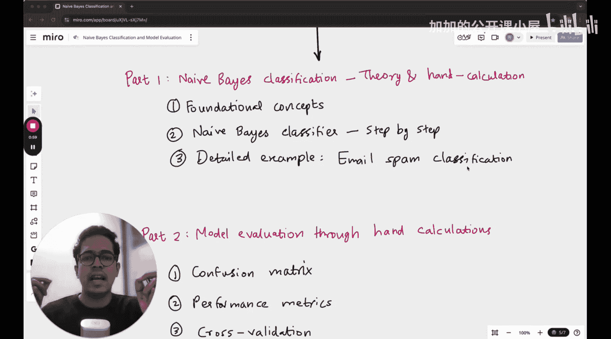

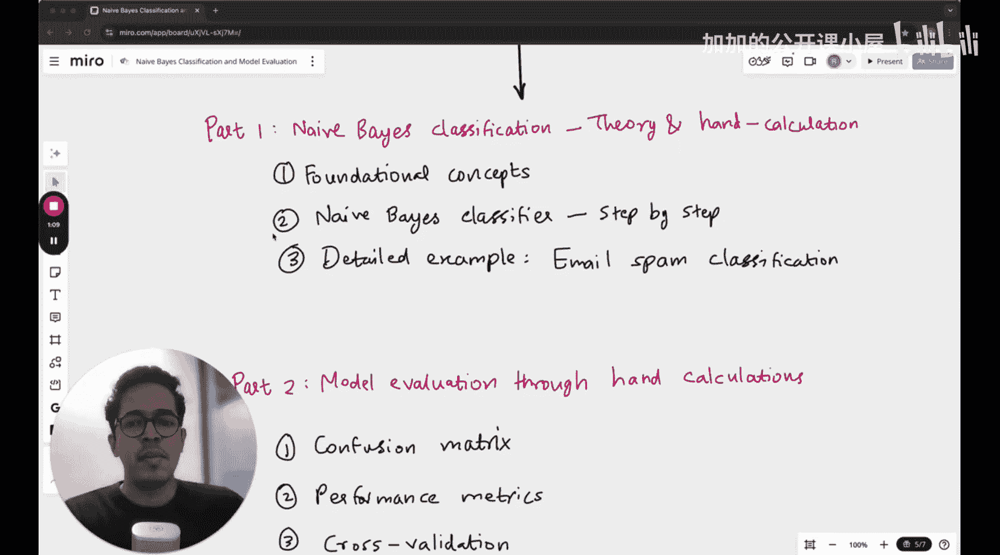

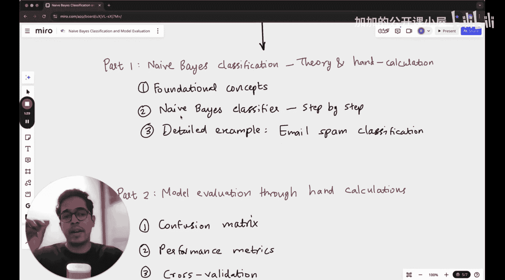

分类，简而言之，就是将给定项目归入两个或多个类别之一。

*   **二元分类器**：将输入划分到两个类别中。例如，将图像分类为“猫”或“狗”，将邮件分类为“垃圾邮件”或“非垃圾邮件”。
*   **多元分类器**：将输入划分到多个类别中。例如，著名的MNIST数据集将手写数字图像分类为0到9这10个类别之一。

在这些分类场景中，贝叶斯定理具有极其重要的意义，因为我们将要讨论的朴素贝叶斯分类器正是基于它来工作，用于判断一封邮件属于垃圾邮件还是非垃圾邮件。

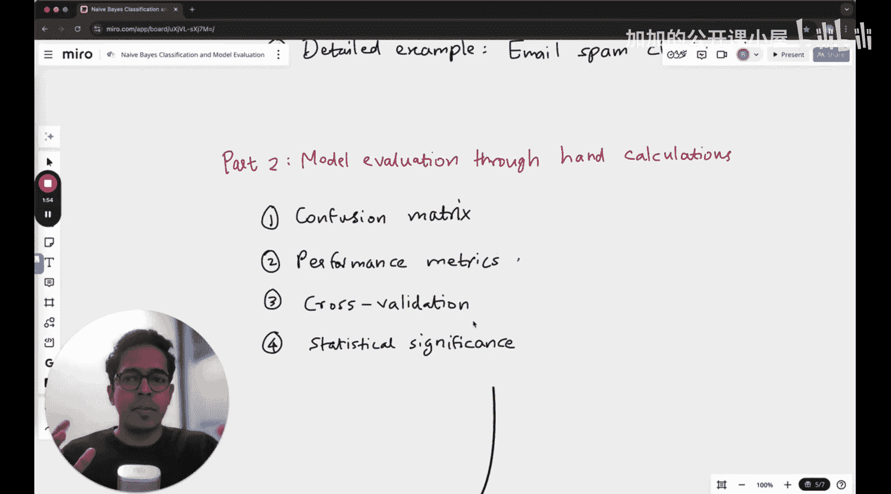

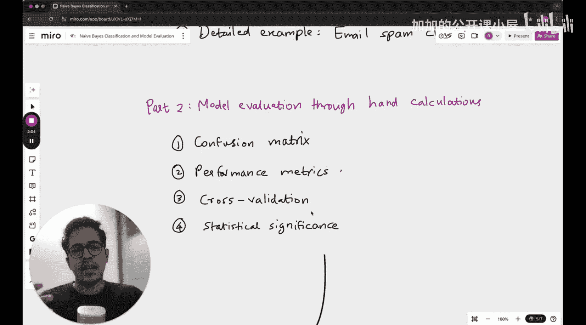

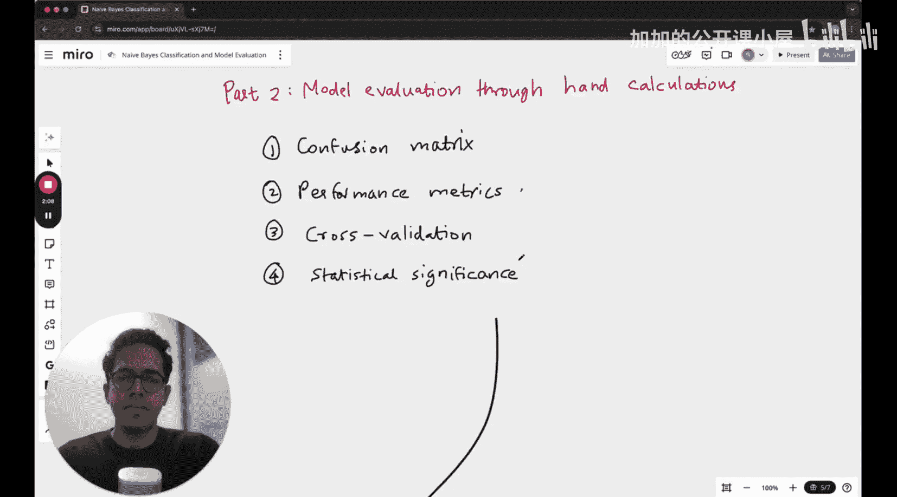

---

## 第二部分：模型评估 📊

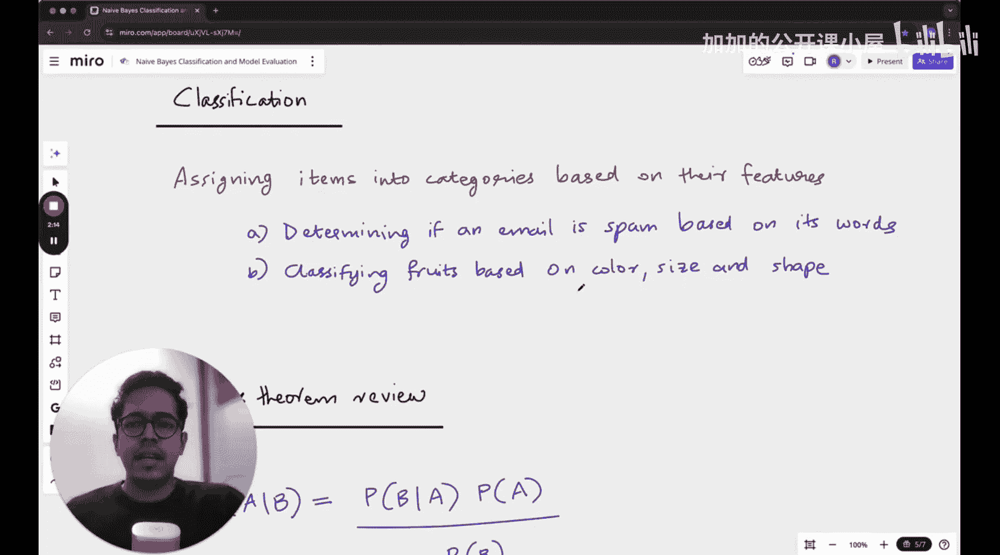

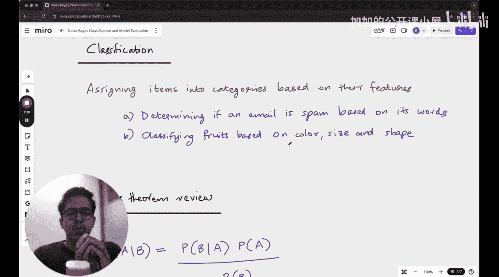

在模型评估部分，我们将讨论**混淆矩阵**，并学习数据科学家和机器学习工程师必备的性能指标，如**准确率**、**精确率**、**召回率**和**F1分数**。我们还会简要介绍**交叉验证**和**统计显著性**。如果你还不清楚这些术语的含义，不用担心，只需跟随本讲内容，并和我一起进行一些手算练习，我相信你能够完全理解。

---

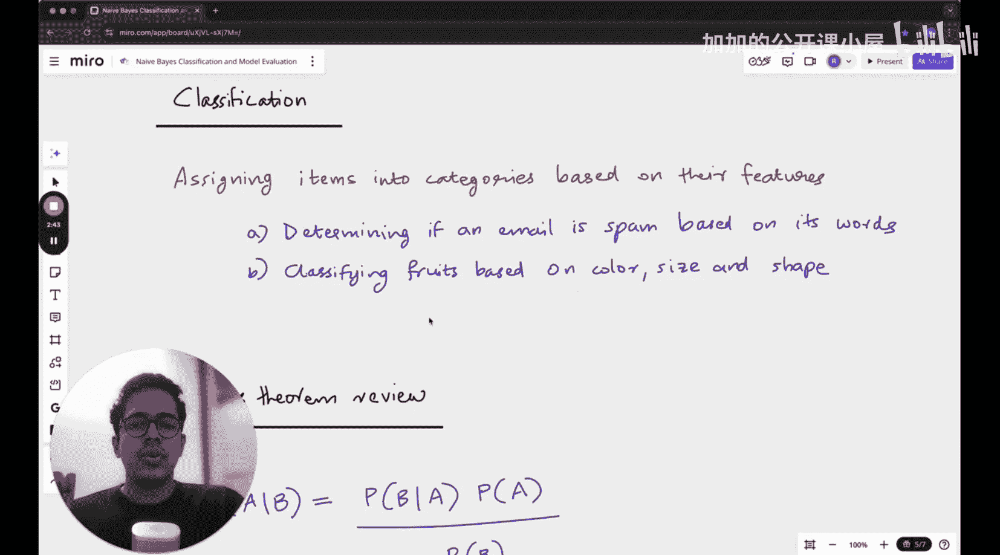

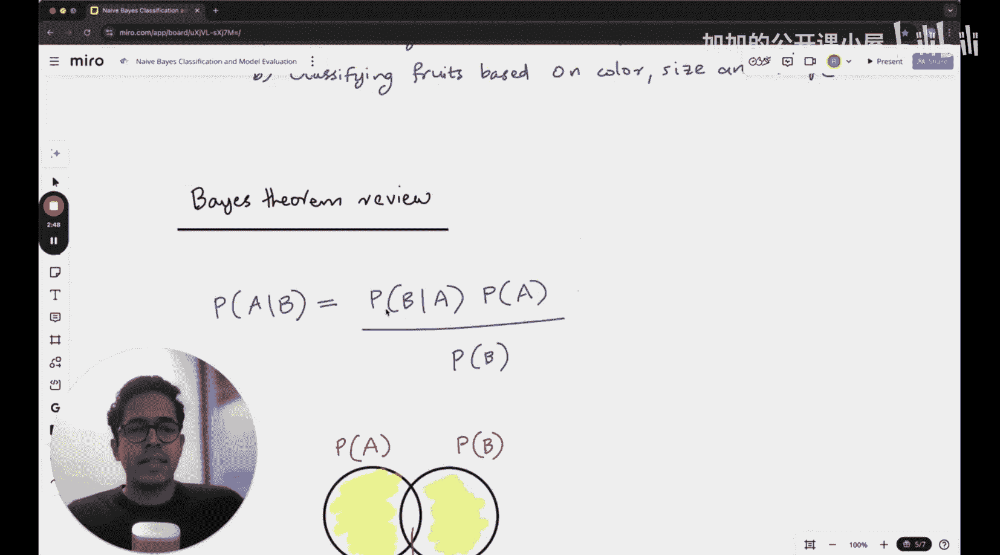

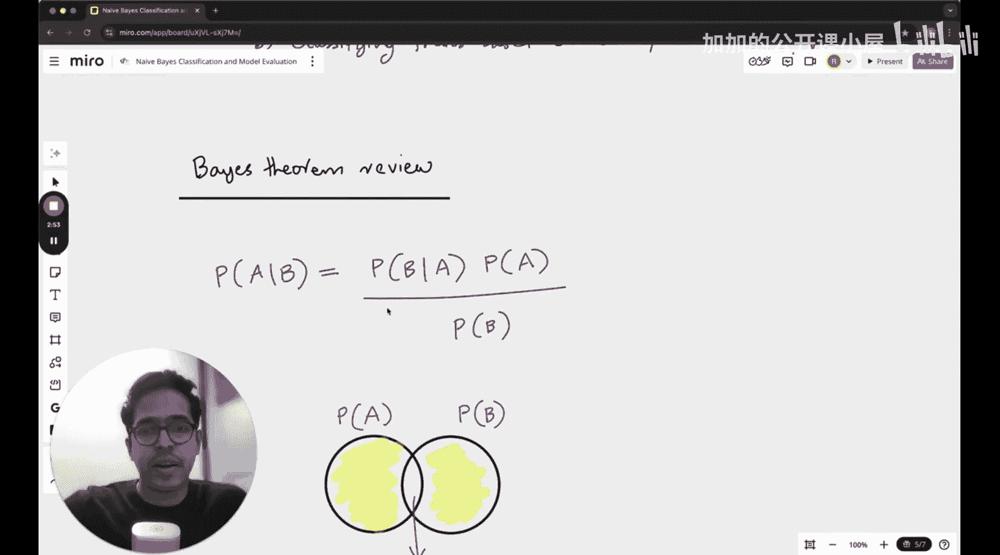

本节课中，我们一起学习了朴素贝叶斯分类的基本原理及其在垃圾邮件分类中的应用步骤，并初步了解了评估机器学习模型效能的关键指标和方法。这些是构建和理解机器学习模型的重要基础。