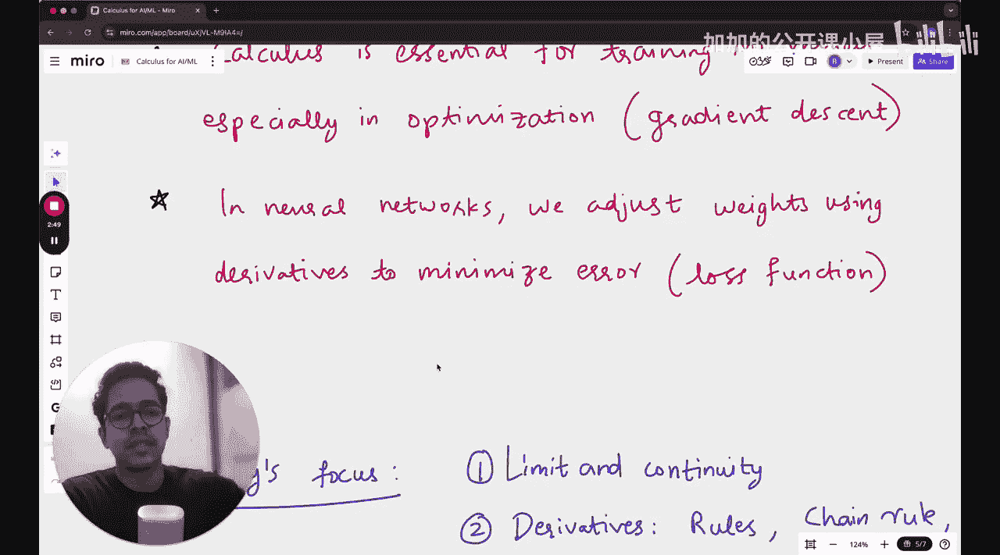

**机器学习基础：P18：机器学习微积分入门 🧮**

在本节课中，我们将开始学习机器学习中至关重要的数学基础——微积分。我们将从最核心的概念入手，理解它如何成为优化算法和神经网络训练的基石。

在之前的模块中，我们学习了线性代数、统计学和概率论。现在，我们进入我个人最喜爱的部分——微积分。如果你已经熟悉微积分，特别是导数和连续性等概念，本节课会相当轻松，你可以将其视为一次复习。如果你是第一次学习微积分，我相信你也会乐在其中。

在机器学习的反向传播中，例如在神经网络模型里，你经常会用到**链式法则**。我曾有过从零开始构建神经网络的经历，当时需要定义一个函数来规定每次反向传播时权重的变化。由于网络末端使用了Softmax激活函数，定义关于权重和网络输入的偏导数变得有些棘手。我分享这个经历是想说明，微积分在神经网络乃至整个机器学习中的重要性。只有当你开始处理复杂任务时，才会真正体会到扎实的微积分基础能让你的工作轻松许多。

---

### **什么是微积分？**

微积分是数学的一个分支，主要研究**累积**和**变化率**。
*   **累积**通常通过**积分**计算。
*   **变化率**通过**微分**计算。

这在优化算法中至关重要。可以说，微积分是人工智能与机器学习（AIML）的数学基础模块之一。如果你听说过**梯度下降**，那么微积分就是你实现它所需学习的最重要的数学知识。

在神经网络中，有一个**权重调整**的过程：你从随机权重开始，然后根据神经网络预测值与实际值之间的差距来调整这些权重的值。这个过程的核心就是微积分。

---

### **核心概念：导数**

导数衡量的是函数在某一点处的**瞬时变化率**。简单来说，它告诉我们当输入发生微小变化时，输出会如何变化。

在数学上，函数 `f(x)` 在点 `x` 处的导数定义为：
`f'(x) = lim (h -> 0) [f(x+h) - f(x)] / h`

这个公式计算的是当 `h`（x的变化量）趋近于0时，函数值平均变化率的极限，即瞬时变化率。

---

### **为什么导数在机器学习中重要？**

在机器学习中，我们经常要找到一个函数（比如模型）的**最小值**或**最大值**（通常是损失函数的最小值）。导数在这里起到了“指南针”的作用。

1.  **梯度下降**：这是一种通过迭代调整参数来最小化损失函数的优化算法。其核心更新公式是：
    `θ_new = θ_old - α * ∇J(θ)`
    其中：
    *   `θ` 代表模型参数（如权重）。
    *   `α` 是学习率，控制步长。
    *   `∇J(θ)` 是损失函数 `J` 关于参数 `θ` 的**梯度**（即多维导数）。梯度指向函数增长最快的方向，因此我们沿着负梯度方向更新参数以寻找最小值。

2.  **反向传播**：在训练神经网络时，我们使用反向传播算法来计算损失函数相对于网络中每一个权重的梯度（偏导数）。链式法则是实现这一计算的关键工具。

---

### **连续性**

在讨论导数之前，理解连续性很有帮助。一个函数在某点连续，直观上意味着其图像在该点没有“断裂”或“跳跃”。更严格地说，函数 `f(x)` 在点 `c` 连续需要满足三个条件：
1.  `f(c)` 有定义。
2.  `lim (x -> c) f(x)` 存在。
3.  `lim (x -> c) f(x) = f(c)`。

可导的函数一定连续，但连续的函数不一定可导（例如，在尖点处）。

---

### **总结**

本节课我们一起学习了机器学习微积分的入门知识。我们了解到微积分是研究变化率和累积的数学分支，并重点探讨了其核心——**导数**的概念。导数衡量函数的瞬时变化率，是理解**梯度下降**等优化算法的基础。在神经网络中，通过**反向传播**和**链式法则**计算导数，从而调整权重以最小化误差。建立这些核心概念的坚实基础，将为你后续深入理解复杂的机器学习模型扫清重要障碍。