#  020：机器学习中的积分学 📚

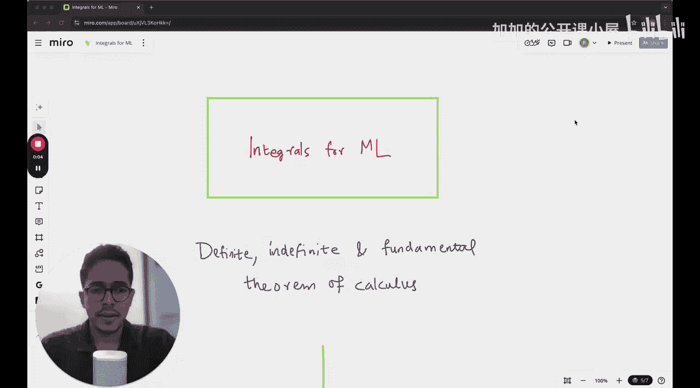

在本节课中，我们将开始学习机器学习中至关重要的积分学。我们将介绍定积分、不定积分以及微积分基本定理，为后续更复杂的机器学习数学概念打下基础。

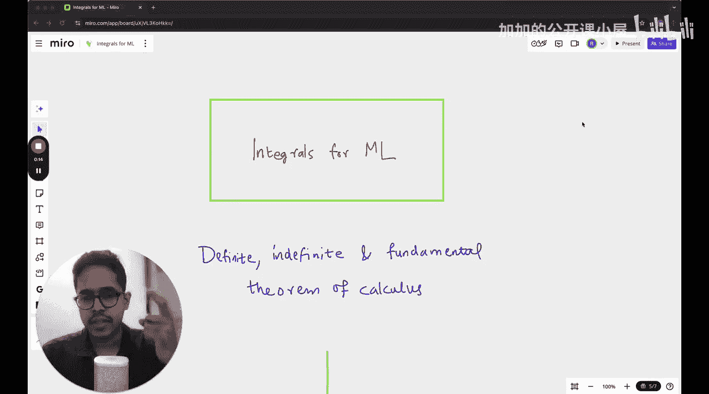

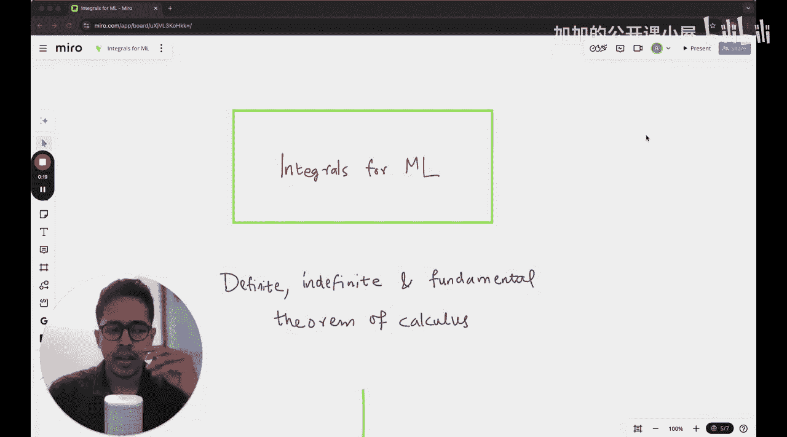

## 从微分到积分 🔄

在之前的课程中，我们学习了导数。导数衡量的是函数在特定瞬间的**变化率**。

积分，正如你可能已经知道的，是微分的一种**反向过程**。如果说微分是“求变化率”，那么积分可以被理解为“累积变化量”。

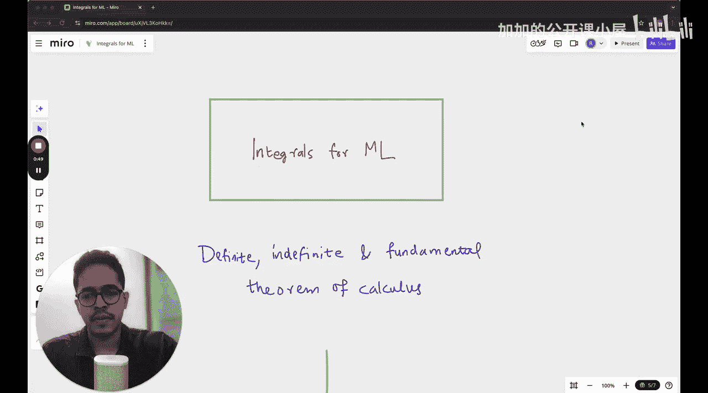

## 积分的几何意义：面积 📐

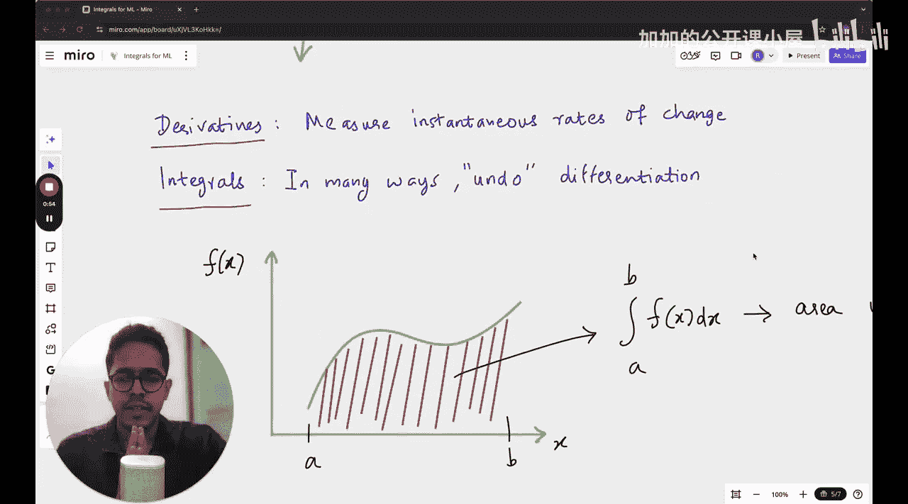

积分的一个核心几何意义是**求曲线下的面积**。如果你对一个函数从点A到点B进行积分，那么该积分的结果就等于该函数曲线在区间 [A, B] 下的面积。

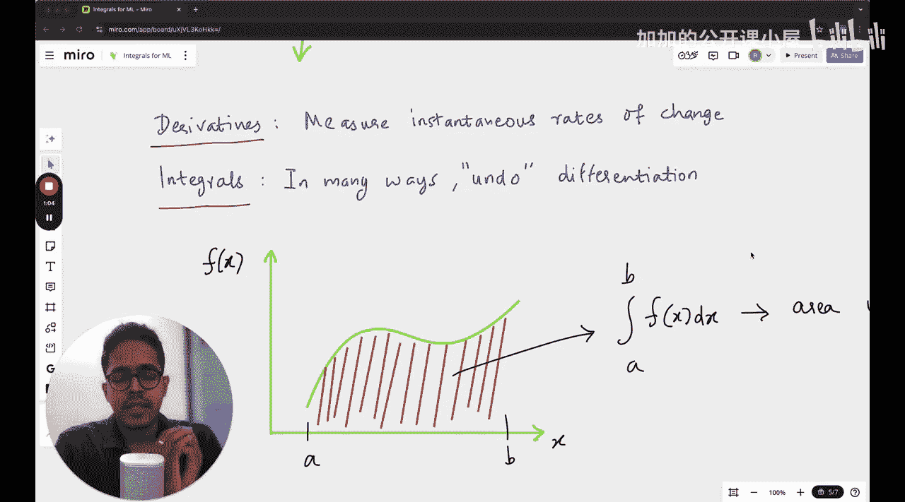

这个运算用以下符号表示：
```
∫_a^b f(x) dx
```
其中 `∫` 是积分符号，`a` 和 `b` 是积分下限和上限，`f(x)` 是被积函数，`dx` 表示对变量 `x` 进行积分。


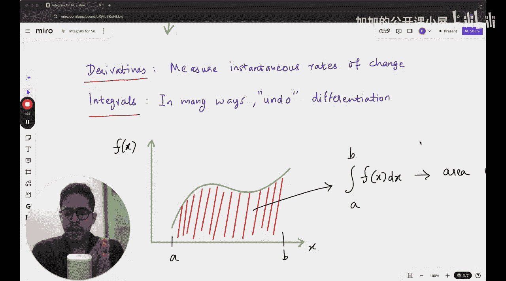

## 黎曼和：面积的近似计算 📊

你可能听说过**黎曼和**。在黎曼和的方法中，曲线下的面积可以通过**对一系列矩形面积求和**来近似表示。

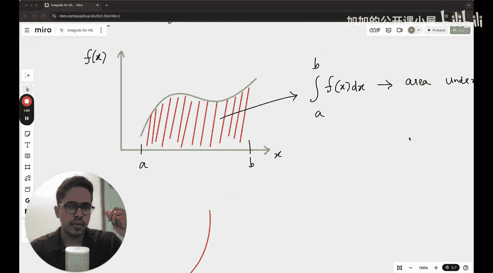

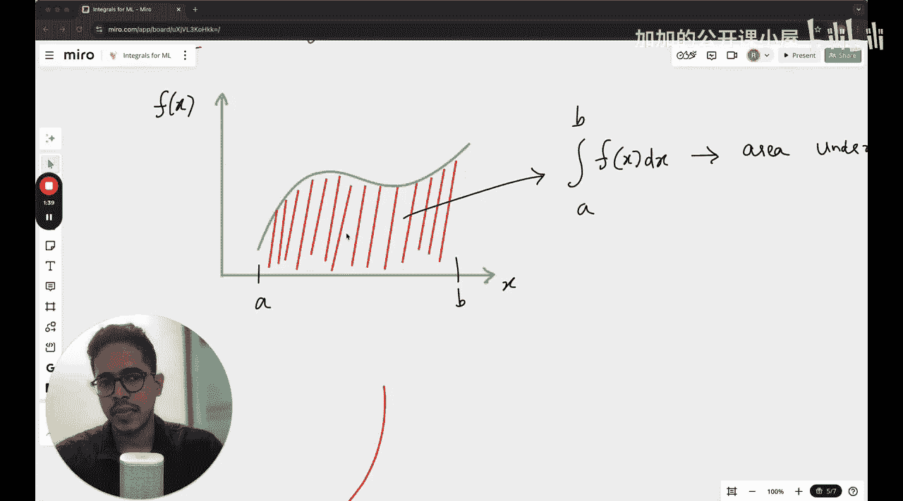

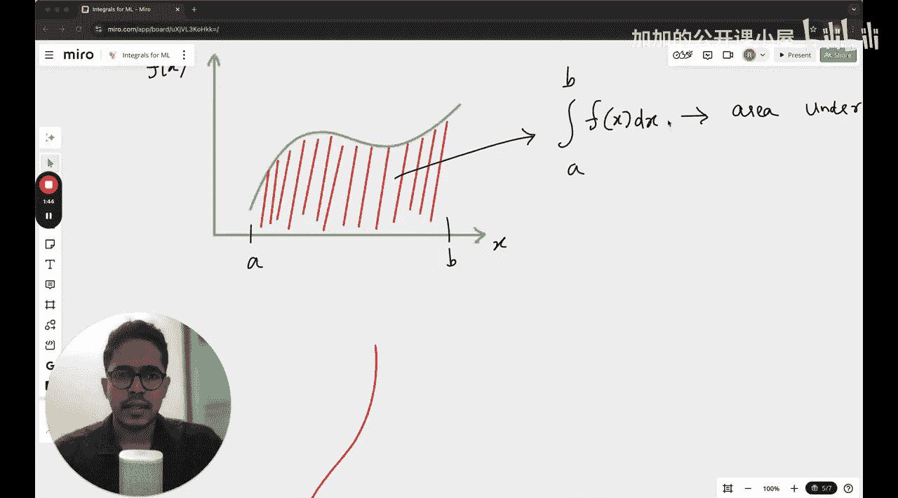

以下是使用不同数量矩形进行近似的示意图：

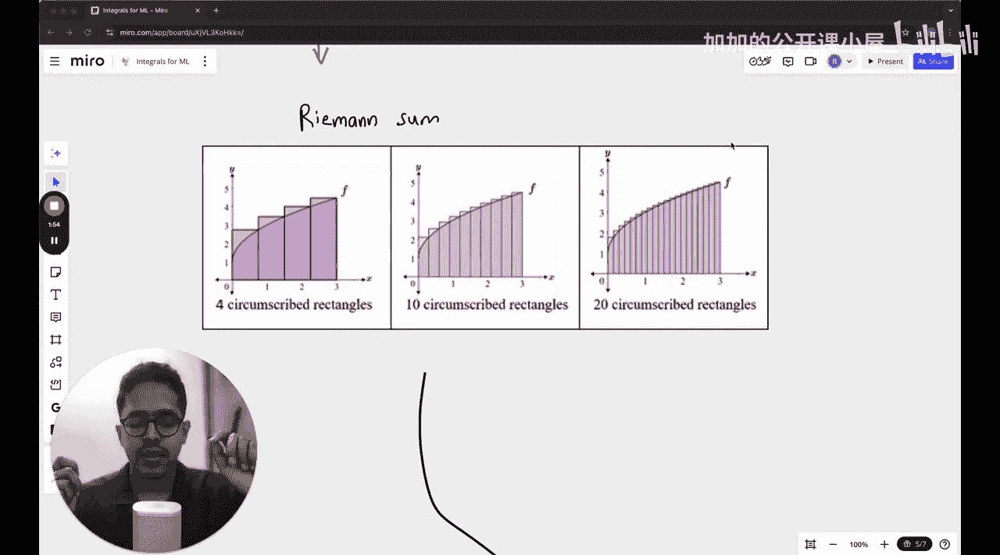

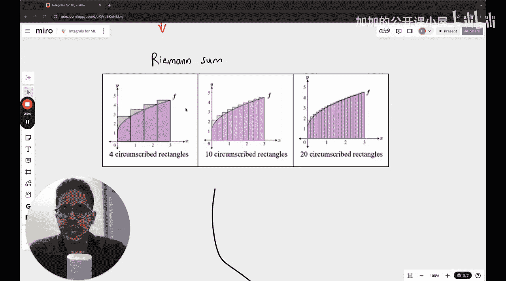

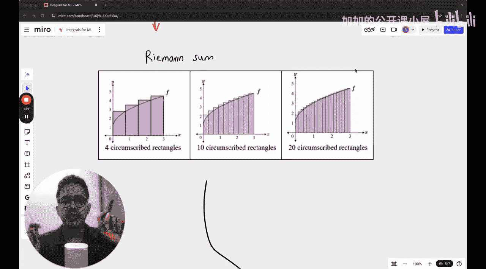

*   **第一张图**：使用4个矩形来近似面积。
*   **第二张图**：使用更多（例如10个）矩形来近似面积。
*   **第三张图**：使用非常多的矩形（例如20个）来近似面积。


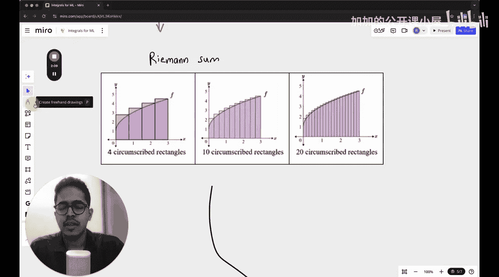

你可以观察到，当使用有限个矩形时，我们总是在**高估**曲线下的实际面积。图中灰色区域的总和就代表了这种高估的程度。

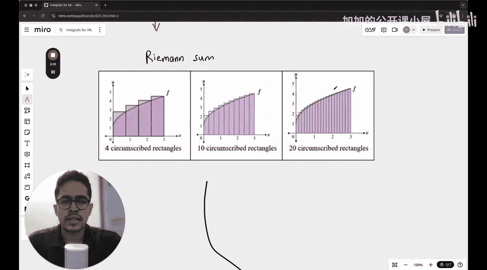

随着矩形数量的增加，每个矩形的宽度变窄，这些灰色区域的总面积会**减少**，我们的近似值也就越来越接近真实的曲线下面积。当矩形的数量趋近于无穷时，黎曼和的极限就精确地等于定积分的值。

## 本节课总结 📝

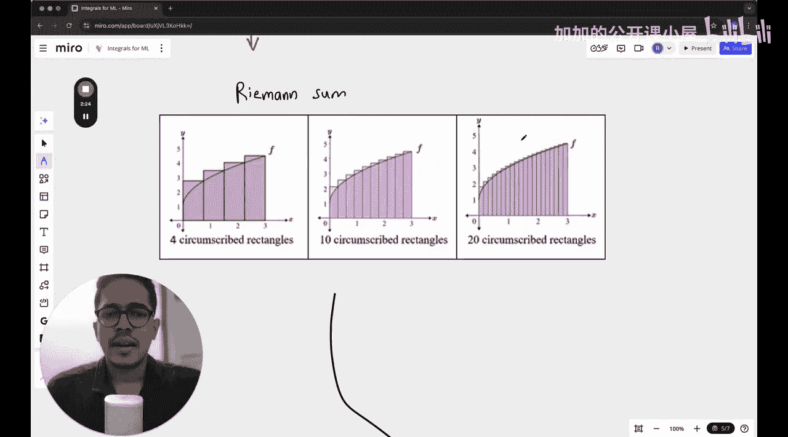

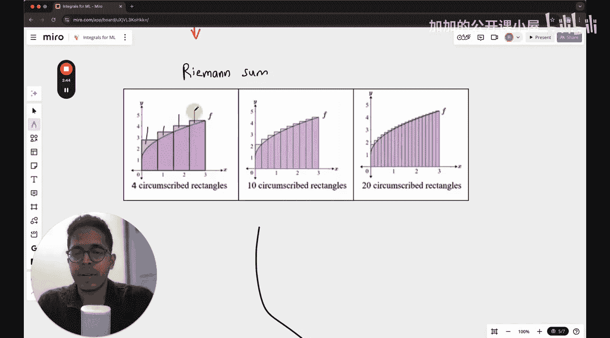

本节课我们一起学习了积分学的基础概念：
1.  **积分是微分的逆运算**，用于累积变化量。
2.  定积分 `∫_a^b f(x) dx` 的几何意义是**计算函数曲线在区间 [a, b] 下的面积**。
3.  **黎曼和**提供了一种通过将面积分割为多个矩形并求和，来近似计算定积分值的方法。矩形数量越多，近似越精确。

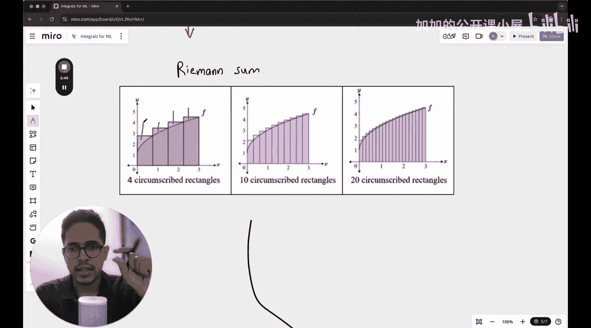

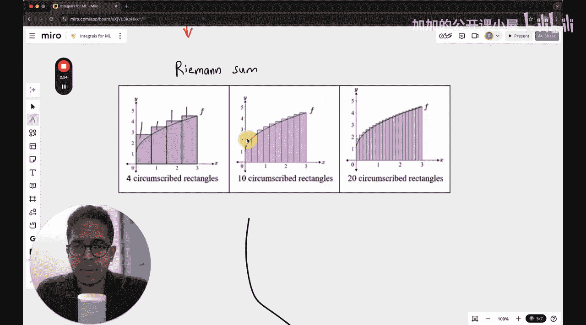

这些概念是理解后续机器学习中概率、优化和连续模型的基础。如果你对这些内容已经非常熟悉，可以将其视为一次复习；如果你是初学者，希望这个简明的介绍能帮助你建立直观的理解。下一讲，我们将深入探讨不定积分和微积分基本定理。