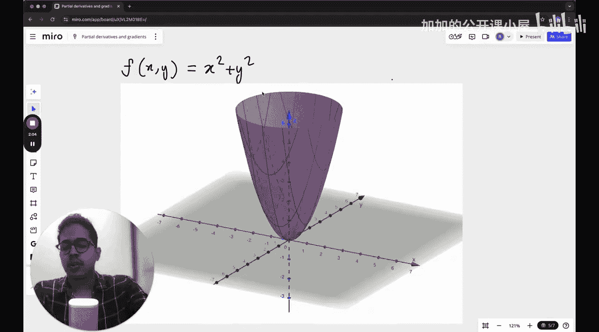
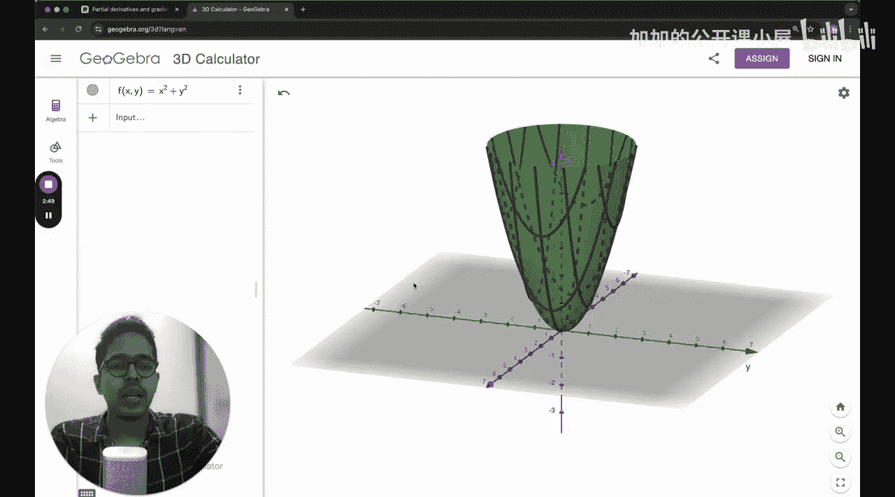

#  021：驱动机器学习的引擎

在本节课中，我们将学习偏导数与梯度，它们是机器学习的重要数学基础之一。我们将从多变量函数入手，逐步介绍偏导数和梯度的概念，并最终解释它们如何与机器学习模型训练的核心——优化过程——联系起来。

## 多变量函数

上一节我们讨论了单变量函数的导数。然而，现实世界中的大多数函数并非如此简单。它们通常依赖于多个独立变量。

例如，房间内的温度会随着具体位置（坐标X, Y, Z）的变化而变化。在机器学习中，以神经网络为例，其成本函数（或称损失函数）的值取决于网络中所有的权重和偏置参数。如果一个网络有500个权重和500个偏置，那么损失就是这1000个参数的函数。这类依赖于多个变量的函数被称为**多变量函数**。

一个最简单的多变量函数例子是：
`f(x, y) = x² + y²`
其图像是一个对称的抛物面。

## 偏导数

理解了多变量函数后，我们自然会问：如何衡量函数值随**某一个**特定变量的变化率？这就是偏导数的概念。

对于一个多变量函数 `f(x, y, z, ...)`，其对变量 `x` 的**偏导数**，记作 `∂f/∂x`，其含义是：在**固定其他所有变量**（如y, z, ...）不变的情况下，函数 `f` 相对于 `x` 的变化率。

计算偏导数非常简单：在求对某个变量的偏导时，**将其他所有变量视为常数**，然后应用我们熟悉的单变量求导法则。

以下是计算 `f(x, y) = x² + y²` 偏导数的步骤：
*   对 `x` 求偏导：将 `y` 视为常数，`y²` 的导数为0，`x²` 的导数为 `2x`。因此，`∂f/∂x = 2x`。
*   对 `y` 求偏导：将 `x` 视为常数，`x²` 的导数为0，`y²` 的导数为 `2y`。因此，`∂f/∂y = 2y`。

## 梯度

我们已经学会了如何分别计算函数对各个变量的偏导数。在优化中，我们需要一个能同时指出**所有方向**上变化率的工具，这就是梯度。

函数 `f` 的**梯度**是一个向量，记作 `∇f`（读作“nabla f”）。它的分量由函数对所有变量的偏导数按顺序排列构成。

对于函数 `f(x, y) = x² + y²`，其梯度为：
`∇f = [∂f/∂x, ∂f/∂y] = [2x, 2y]`

梯度向量具有极其重要的几何意义：**它指向函数值增长最快的方向**。相应地，负梯度方向（`-∇f`）就指向函数值下降最快的方向。

## 梯度下降法

掌握了梯度的方向性后，我们可以利用它来寻找函数的最小值点，这个过程就是**梯度下降法**。它是训练几乎所有机器学习模型的核心优化算法。

梯度下降法的思想直观而朴素：既然负梯度方向是函数下降最快的方向，那么只要我们沿着这个方向一小步一小步地移动，最终就能走到（或接近）函数的谷底（最小值点）。

以下是梯度下降法的基本步骤：
1.  **初始化**：随机选择参数的起始点（例如，`x=2, y=1`）。
2.  **计算梯度**：在当前点计算函数的梯度（例如，在`(2,1)`点，`∇f = [4, 2]`）。
3.  **更新参数**：沿着负梯度方向移动一小步。移动的步长由一个称为**学习率**（Learning Rate）的超参数 `α` 控制。
    参数更新公式为：
    `[x_new, y_new] = [x_old, y_old] - α * [∂f/∂x, ∂f/∂y]`
    例如，若学习率 `α = 0.1`，则新位置为：`[2, 1] - 0.1 * [4, 2] = [1.6, 0.8]`。
4.  **迭代**：重复步骤2和步骤3，直到梯度变得非常小（接近零），或者达到预设的迭代次数。

通过不断迭代，参数 `(x, y)` 将逐渐逼近使函数 `f(x, y)` 取得最小值的点 `(0, 0)`。

## 总结

本节课中，我们一起学习了机器学习优化的核心数学工具。
*   我们首先认识了**多变量函数**，它描述了现实世界和机器学习模型中常见的复杂关系。
*   接着，我们学习了**偏导数**，它衡量了函数在固定其他变量时，沿某一个特定方向的变化率。
*   然后，我们将所有偏导数组合成**梯度**向量，它指明了函数值增长最快的方向。
*   最后，我们介绍了**梯度下降法**。通过反复计算梯度并沿负梯度方向更新参数，该算法能够有效地寻找函数的最小值点，这正是训练机器学习模型（最小化损失函数）的本质过程。

理解偏导数和梯度下降，是深入掌握机器学习工作原理的关键一步。