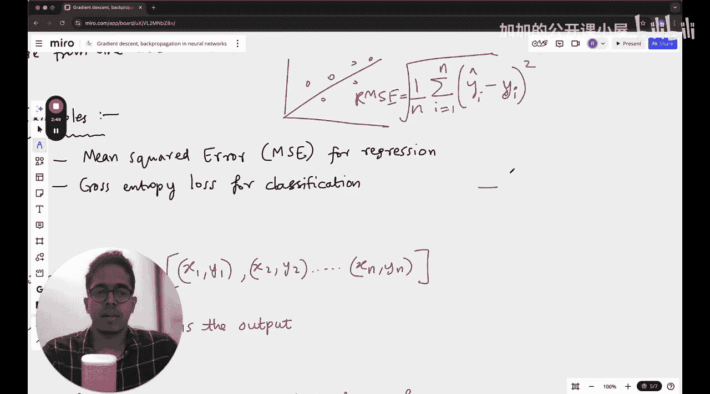

#  022：机器学习中的梯度下降

## 概述
在本节课中，我们将学习机器学习中一个核心且至关重要的概念：梯度下降。我们将探讨什么是损失函数，以及如何利用梯度下降来最小化它。此外，我们还将了解反向传播在神经网络中的作用，并讨论一些实际应用中的注意事项。

---

## 损失函数的概念
损失函数在机器学习中的概念相当直接。你有一个期望的结果。例如，如果你正在构建一个分类模型或线性回归模型，你有一个目标值，并且希望模型的预测值尽可能接近这个目标值。

但问题在于，你通常不只有一个输入和一个输出。你可能拥有100个输入和对应的10个输出。那么，你如何确保你的模型（可能是一条直线，或者在神经网络中是一个超平面）做出的预测，能够最小化预测值与实际值之间的距离呢？这就是通过损失函数来定义的。

损失函数衡量的是模型预测值与实际真实值之间的差距。

---

## 损失函数的量化术语
以下是用于量化损失的几种常见术语。

**均方误差** 是所有损失平方的平均值。在线性回归中，如果这条直线是你的模型，而这些是你的数据点，那么均方误差的计算公式如下：

`MSE = (1/n) * Σ (y_predicted_i - y_actual_i)^2`

其中，`n` 是数据点的数量。如果你对这个结果取平方根，就得到了**均方根误差**。这种方法主要用于回归问题。

对于分类问题，通常使用**交叉熵损失**。其公式可以定义为：

`Cross-Entropy Loss = - Σ (y_actual_i * log(y_predicted_i))`

---

## 梯度下降简介
上一节我们介绍了损失函数，它量化了模型的误差。本节中，我们来看看如何通过梯度下降来最小化这个误差。

梯度下降是一种优化算法，用于寻找使损失函数值最小的模型参数。其核心思想是：通过计算损失函数相对于每个参数的梯度（即导数），然后沿着梯度的反方向（即下降最快的方向）更新参数。

参数更新的基本公式如下：

`θ_new = θ_old - α * ∇J(θ)`

其中：
*   `θ` 代表模型参数。
*   `α` 是学习率，控制每次更新的步长。
*   `∇J(θ)` 是损失函数 `J` 在参数 `θ` 处的梯度。

---

## 反向传播在神经网络中的应用
理解了梯度下降的基本原理后，我们将其应用到更复杂的神经网络中。在神经网络中，参数数量庞大，直接计算所有梯度非常困难。这时就需要反向传播算法。

反向传播是一种高效计算神经网络中损失函数对所有参数梯度的方法。其过程分为两个步骤：
1.  **前向传播**：输入数据通过网络层层计算，得到最终预测值，并计算损失。
2.  **反向传播**：从输出层开始，将损失沿着网络反向传播，利用链式法则计算损失相对于每一层参数的梯度。

通过反向传播计算出梯度后，我们就可以使用梯度下降法来更新网络中的所有权重和偏置。

---

## 实践中的注意事项
在应用梯度下降优化模型时，可能会遇到一些挑战。以下是几个关键的注意事项。

**局部极小值与鞍点**
梯度下降的目标是找到损失函数的全局最小值。但在复杂模型中，损失函数可能存在多个“低谷”，即局部极小值。优化过程可能会陷入某个局部极小值而无法到达全局最优。此外，在高维空间中，还可能遇到梯度为零但并非极值点的“鞍点”，这也会使优化停滞。

**学习率的选择**
学习率 `α` 是一个超参数。如果学习率设置过大，参数更新步伐太大，可能会在最小值附近震荡甚至发散；如果学习率设置过小，收敛速度会非常慢，训练时间过长。通常需要尝试不同的学习率或使用自适应学习率算法。

**梯度消失与爆炸**
在深度神经网络中，反向传播时梯度可能会随着层数的增加而指数级地减小（消失）或增大（爆炸）。这会导致深层网络的参数难以更新或更新不稳定。使用特定的激活函数（如ReLU）和权重初始化技巧有助于缓解这些问题。

---

## 总结
本节课中，我们一起学习了机器学习中的核心优化技术。我们首先定义了损失函数，它用于衡量模型预测的误差。接着，我们深入探讨了梯度下降算法，它是通过沿着损失函数梯度的反方向更新参数来最小化误差。然后，我们了解了反向传播算法，它是在神经网络中高效计算所有参数梯度的关键。最后，我们讨论了实践中可能遇到的问题，如局部极小值、学习率设置以及梯度消失/爆炸现象。掌握这些概念是理解和构建有效机器学习模型的重要基础。