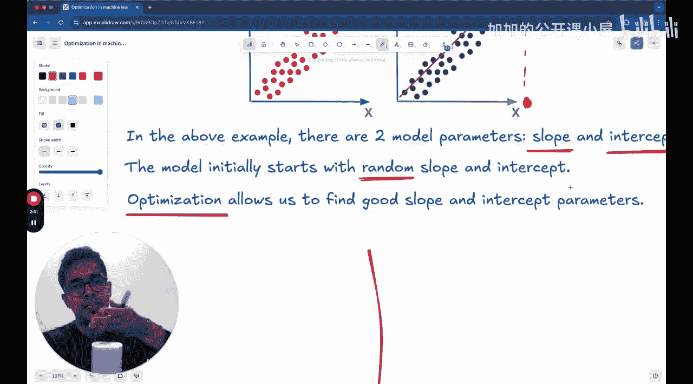

#  023：机器学习优化入门

欢迎来到机器学习优化新模块的开始。本讲座是“机器学习基础”课程的一部分。今天我们将探讨优化，特别是梯度下降。讲座分为两部分。第一部分，我们将探讨理论：优化究竟意味着什么，以及我们优化的是什么。第二部分，我们将从零开始实现梯度下降。欢迎来到本次讲座。

讲座的结构如前所述。我们将介绍优化本身的概念。当我们说为某个参数进行优化时，其数学含义是什么？损失函数或成本函数究竟是什么？什么是梯度下降？如果你想成为一名严肃的机器学习工程师，这可能是你必须熟悉的唯一最重要的概念。传统梯度下降方法存在哪些问题？我们将在本次讲座中讨论所有这些内容。

让我们看一个非常简单的机器学习模型，我们之前讨论过的线性回归。😊

在线性回归中，这些点是数据点。我们试图做的是拟合一个最能代表这些数据的模型。这样，如果要求你对不属于训练数据的输入数据进行预测，例如对于这里的某个x值，要求你给出对应的y值是什么？通过线性回归得到的这条穿过数据点的直线模型就可以进行预测。你会说，如果你想预测当输入x等于某个值时，输出变量y的值是多少，那么你需要做的就是沿着这条直线，如果直线像这样延伸，让我减小线条粗细，那么你需要做的就是找到对应的y值在哪里。因此，你可以说对于这个特定的x值，对应的y值是这个。为什么？因为模型是这样说的。模型是什么？就是这条直线。

这里有两个参数，假设你只有一维数据，那么只有两个参数：斜率和截距。因此，在这个特定情境下，优化的运作方式是：即使你从一个随机的斜率值和随机的截距值开始，因为你不知道数据是否通过原点，也不知道穿过数据的直线的平均值是否通过原点，或者你不知道...

