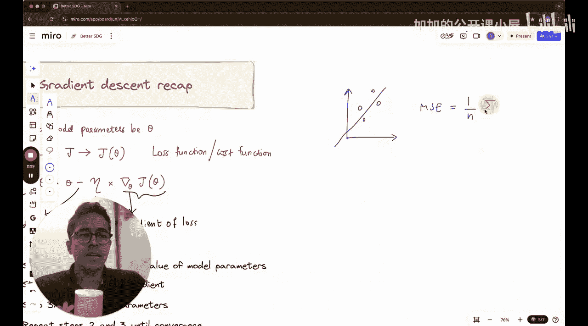

#  024：从零实现随机梯度下降 | 优化入门


欢迎回到《机器学习基础》课程。本讲是一个新模块的开始，该模块包含四节讲座，主题是如何在机器学习中大幅改进梯度下降算法。

具体来说，我们将学习**随机梯度下降**、**动量法**、**均方根传播**以及**Adam优化器**。Adam可能是整个机器学习领域最著名的优化算法。

我最初考虑将这四部分内容录制成一节讲座，但后来认为那样会使讲座过长。因此，我决定将其拆分，并深入探讨每一个主题，这能让大家很好地理解人们为何会想到这些改进梯度下降算法的方法。在本讲中，我们将重点学习随机梯度下降。

我将本讲分为两部分。第一部分讨论随机梯度下降的理论。第二部分将实现该算法，并探讨为何随机梯度下降优于普通的“香草”梯度下降。普通的梯度下降也称为**批量梯度下降**，因为它是使用整个数据批次来决定参数应改变多少。

你可能会想，我还不了解梯度下降，是否应该学习本讲？别担心，在进入随机梯度下降之前，我们会在讲座第一部分对梯度下降本身进行适当的回顾。现在，让我们开始吧。

## 梯度下降回顾 🧠

梯度下降是一种用于最小化损失函数或成本函数的算法。

损失函数或成本函数是衡量机器学习模型预测值与真实数据之间差距的指标。在上一讲中我们讨论过，对于线性回归，损失函数可以用**均方误差**来描述。

假设我们有一些数据点，以及一条描述这些点线性拟合的直线，那么损失函数可以表示为：

**均方误差公式：**
`MSE = (1/n) * Σ (y_i_pred - y_i)^2`

其中，`n` 是数据点的数量，`y_i_pred` 是模型对第 `i` 个点的预测值，`y_i` 是第 `i` 个点的实际值。之所以称为“均方误差”，是因为它计算了误差的平方，并求其平均值（求和后除以 `n`）。

梯度下降的目标是找到使这个损失函数值最小的模型参数（例如，线性回归中的斜率和截距）。它通过迭代地沿损失函数梯度的反方向更新参数来实现。

**梯度下降参数更新公式：**
`θ_new = θ_old - α * ∇J(θ)`

其中：
*   `θ` 代表模型参数。
*   `α` 是学习率，控制每次更新的步长。
*   `∇J(θ)` 是损失函数 `J` 关于参数 `θ` 的梯度（导数）。

在标准的批量梯度下降中，计算梯度 `∇J(θ)` 需要使用**全部**训练数据。对于大型数据集，这会导致每次迭代的计算成本非常高，速度很慢。

## 随机梯度下降理论 ⚡

上一节我们回顾了标准的批量梯度下降。本节中，我们来看看如何改进它，这就是**随机梯度下降**的核心思想。

SGD 的关键区别在于：它**不使用全部数据来计算梯度**。相反，在每次参数更新时，它只随机选择一个训练样本（或一小批样本）来计算梯度。

以下是 SGD 的基本步骤：

1.  **随机打乱数据**：首先，将训练数据集随机打乱顺序。
2.  **迭代更新**：对于打乱后的数据集中的每一个样本（或每一小批样本）：
    *   使用当前模型参数和**当前这个（或这一小批）样本**计算损失函数的梯度。
    *   使用这个“估计”的梯度来更新模型参数。

**随机梯度下降参数更新公式（单个样本）：**
`θ_new = θ_old - α * ∇J_i(θ)`

其中，`∇J_i(θ)` 是仅基于第 `i` 个训练样本计算出的损失梯度。

与批量梯度下降相比，SGD 有以下几个主要特点：

*   **计算高效**：每次更新只处理一个或少量样本，计算速度快，内存需求低。
*   **引入噪声**：由于梯度基于单个样本估计，它不再是整个数据集上的真实平均梯度，而是包含噪声的估计。这可能导致更新路径不稳定（ zig-zag 路径）。
*   **可能逃离局部极小值**：这种噪声有时有助于算法跳出局部最小值，从而可能找到更好的解。
*   **需要更多迭代**：虽然每次迭代更快，但由于更新方向有噪声，通常需要更多次的迭代（或“周期”，即完整遍历数据集的次数）才能收敛。

为了在纯随机（噪声大）和批量计算（成本高）之间取得平衡，实践中常用**小批量随机梯度下降**。它每次使用一小批随机样本（例如 32、64、128 个）来计算梯度，这是目前深度学习中最常用的优化变体。

**小批量 SGD 参数更新公式：**
`θ_new = θ_old - α * (1/m) * Σ ∇J_k(θ)`

其中，`m` 是小批量的大小，求和是对该小批量中的所有样本 `k` 进行。

## 为何 SGD 更优？ 🤔

我们已经了解了 SGD 的理论。你可能会问，使用带噪声的梯度估计真的更好吗？本节我们通过一个类比来理解其优势。

想象你要从山顶（高损失）走到山谷最低点（最小损失）。批量梯度下降就像在每次迈步前，先仔细勘察整个地形，找到最陡的下山方向，然后迈出一步。这很准确，但勘察整个地形（计算全数据梯度）非常耗时。

而 SGD 更像是在每一步，你只快速看一眼脚下附近的一小块地方（一个样本），就决定朝那个方向走一步。虽然每一步的方向可能不是全局最优的，甚至偶尔会走错，但你迈步的速度极快。总体来看，你可能会以更短的总时间到达谷底附近。

对于非常大的数据集（现代机器学习的常态），SGD 的这种“快速但嘈杂”的特性使其在实践中的总收敛时间往往远少于批量梯度下降。此外，噪声带来的随机性有助于模型逃离尖锐的局部极小值，从而可能泛化得更好。

## 从零实现 SGD 🛠️

理论部分已经清晰，现在让我们动手实现一个简单的随机梯度下降，并将其与批量梯度下降进行比较，以直观感受其差异。

我们将为一个简单的线性回归问题实现优化。假设我们的模型是 `y_pred = w * x + b`，损失函数为均方误差。

以下是关键代码步骤的概述：



1.  **生成模拟数据**：创建一组带有噪声的线性数据。
2.  **定义模型和损失**：编写预测函数和损失函数（MSE）。
3.  **实现批量梯度下降**：
    ```python
    # 伪代码示意
    for epoch in range(num_epochs):
        # 计算整个数据集的梯度
        grad_w = (2/n) * sum((y_pred - y) * x)
        grad_b = (2/n) * sum(y_pred - y)
        # 更新参数
        w = w - learning_rate * grad_w
        b = b - learning_rate * grad_b
    ```
4.  **实现随机梯度下降**：
    ```python
    # 伪代码示意
    for epoch in range(num_epochs):
        # 打乱数据顺序
        shuffle(data)
        for x_i, y_i in data:
            # 计算单个样本的预测和损失
            y_pred_i = w * x_i + b
            # 计算单个样本的梯度
            grad_w_i = 2 * (y_pred_i - y_i) * x_i
            grad_b_i = 2 * (y_pred_i - y_i)
            # 用该样本的梯度立即更新参数
            w = w - learning_rate * grad_w_i
            b = b - learning_rate * grad_b_i
    ```
5.  **比较结果**：运行两种算法，观察：
    *   **收敛速度**：SGD 的损失下降曲线是否在更少的“计算量”或“时间”内快速下降？
    *   **更新路径**：在参数空间中，SGD 的更新路径是否更加曲折（zig-zag），而批量梯度下降的路径则更直接地指向最小值？
    *   **最终效果**：两者最终找到的参数解是否接近？

通过这个简单的实现和对比，你将亲眼看到 SGD 如何通过频繁但基于部分信息的更新，在优化过程中带来效率优势。

## 总结 📝

本节课中，我们一起学习了梯度下降的一个重要变体——**随机梯度下降**。

我们首先回顾了标准的批量梯度下降，它使用全部数据计算梯度，准确但计算成本高。然后，我们深入探讨了 SGD 的原理：它通过每次迭代仅随机使用一个或一小批样本来估计梯度，从而极大地提高了每次更新的速度。我们分析了其优缺点，包括计算效率高、引入噪声、可能帮助逃离局部极小值等。最后，我们讨论了如何从零开始实现 SGD 并与批量梯度下降进行比较，以直观理解其工作方式。

SGD 及其变体（如小批量 SGD）是训练大规模机器学习模型，尤其是深度神经网络的基石。理解它是迈入实用机器学习优化领域的关键一步。在接下来的讲座中，我们将以此为基础，学习更先进的优化技术，如动量法和 Adam，它们能进一步改善 SGD 的收敛稳定性与速度。