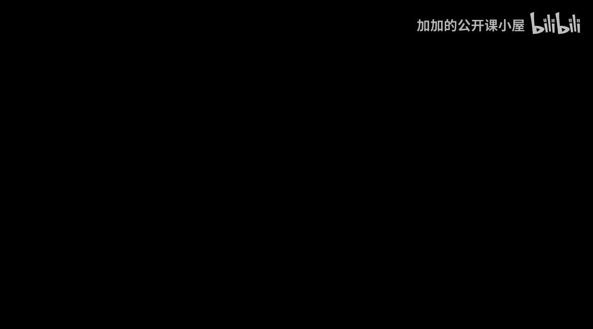

#  025：P25 从零实现基于动量的梯度下降




欢迎来到机器学习优化模块的新一讲。本模块是“机器学习基础”课程的一部分。今天我们将学习如何利用动量来改进梯度下降。

在本模块中，我们一直在探讨实现梯度下降的各种方法。上一讲我们学习了随机梯度下降，今天我们将介绍动量方法。本模块还有另外两种方法需要介绍：第三种是RMSProp（均方根传播），最后一种是Adam优化器，这是机器学习中最常用的优化器。如果你还不了解梯度下降，请不要担心，我会在讲座的第一部分进行回顾。

本次讲座分为两部分。第一部分，我将介绍动量梯度下降背后的理论。第二部分，我们将通过代码实现它，以便你能看到相比普通梯度下降，动量方法为何更优。

现在，让我们开始学习。

## 梯度下降回顾

梯度下降是机器学习中用于最小化损失函数的方法。损失函数是一个指标，用于衡量你的预测值与实际数据点之间的差距。

如果损失函数用 **J** 表示，机器学习模型参数用 **θ** 表示。以线性回归为例，即用一条直线拟合一系列数据点，参数就是斜率和截距。损失函数是均方误差，即计算点与直线偏差的平方，然后取平均值。

梯度下降的步骤如下：
1.  首先，从参数的某个随机初始值开始。在线性回归的上下文中，就是随机的斜率和截距值。
2.  然后，我们不断迭代修改这个 **θ**，最终找到一个能使损失函数最小化的 **θ** 值。这就是梯度下降的全部目标。

具体迭代过程如下：
第一步是计算梯度。这个项就是梯度：**∇J(θ)**，即损失函数 **J** 关于参数 **θ** 的梯度。
第二步是更新参数。将梯度乘以一个学习率 **α**，然后用旧的参数值减去这个乘积，得到新的参数值。

参数更新公式为：
**θ_new = θ_old - α * ∇J(θ)**

然后，重复计算梯度和更新参数这两个步骤，直到满足停止条件。

## 动量梯度下降理论

上一节我们回顾了标准梯度下降。本节中，我们来看看如何通过引入“动量”来改进它。

标准梯度下降的一个问题是，它在优化过程中可能会在狭窄的沟谷或局部最小值附近振荡，导致收敛缓慢。动量方法通过引入一个“速度”项来解决这个问题，该速度项累积了过去梯度的指数加权平均。

其核心思想是：参数更新不仅依赖于当前的梯度，还依赖于之前更新步骤的“动量”。这类似于一个球滚下山坡时，会积累动量，从而更平稳地穿过平坦区域并加速通过陡峭区域。

以下是动量梯度下降的关键步骤：

1.  **初始化**：除了模型参数 **θ**，我们还需要初始化一个速度向量 **v**，其维度与 **θ** 相同，通常初始化为零。
2.  **计算当前梯度**：在每次迭代中，计算当前参数 **θ** 下的损失函数梯度 **∇J(θ)**。
3.  **更新速度**：使用以下公式更新速度 **v**。其中 **β** 是一个超参数，称为动量系数，通常取值在0.9左右。它决定了保留多少历史速度信息。
    **v = β * v + (1 - β) * ∇J(θ)**
4.  **更新参数**：使用更新后的速度来调整参数，而不是直接使用原始梯度。
    **θ = θ - α * v**

这里的 **α** 是学习率。

通过这种方式，如果连续几次梯度的方向一致，速度项会增大，从而加速参数更新。如果梯度方向改变，速度项会因指数衰减而减小，有助于减少振荡。

## 从零实现动量梯度下降

理解了动量方法的理论后，本节我们将通过Python代码从零开始实现它，并与标准梯度下降进行对比。

我们将使用一个简单的二次函数作为损失函数：**J(θ) = θ²**。它的最小值在 **θ=0** 处。我们将观察两种方法寻找最小值的过程。

以下是实现步骤和代码：

首先，我们定义损失函数及其梯度。

```python
def loss_function(theta):
    return theta ** 2

def gradient(theta):
    return 2 * theta
```

接下来，我们实现标准梯度下降。

```python
def gradient_descent(theta_init, learning_rate, iterations):
    theta = theta_init
    history = [theta]  # 记录参数变化
    for i in range(iterations):
        grad = gradient(theta)
        theta = theta - learning_rate * grad
        history.append(theta)
    return history
```

现在，我们实现动量梯度下降。关键部分是按照前面介绍的公式更新速度和参数。

```python
def momentum_gradient_descent(theta_init, learning_rate, beta, iterations):
    theta = theta_init
    v = 0  # 初始化速度
    history = [theta]
    for i in range(iterations):
        grad = gradient(theta)
        v = beta * v + (1 - beta) * grad  # 更新速度
        theta = theta - learning_rate * v  # 用速度更新参数
        history.append(theta)
    return history
```

最后，我们设置初始参数并运行两种方法，比较它们的收敛路径。

```python
# 参数设置
theta_init = 10.0
learning_rate = 0.1
beta = 0.9  # 动量系数
iterations = 50

# 运行优化
gd_history = gradient_descent(theta_init, learning_rate, iterations)
momentum_history = momentum_gradient_descent(theta_init, learning_rate, beta, iterations)

# 打印最终结果
print("标准梯度下降最终 theta:", gd_history[-1])
print("动量梯度下降最终 theta:", momentum_history[-1])
```

运行这段代码，你可以观察到动量梯度下降的路径更加直接、振荡更少，通常能更快地接近最小值点 **0**。通过绘制 `gd_history` 和 `momentum_history` 的曲线，可以更直观地看到这种差异。

## 总结

本节课中，我们一起学习了动量梯度下降。

我们首先回顾了标准梯度下降的原理及其可能存在的振荡问题。接着，引入了动量概念，它通过累积过去梯度的指数加权平均（即速度 **v**）来平滑更新方向，公式为 **v = β * v + (1 - β) * ∇J(θ)** 和 **θ = θ - α * v**。最后，我们通过代码实现了两种方法，并直观展示了动量方法如何带来更稳定、更快速的收敛。

动量是优化神经网络和复杂模型时的一个基础且重要的技术，它为后续学习更高级的优化器（如RMSProp和Adam）奠定了基础。