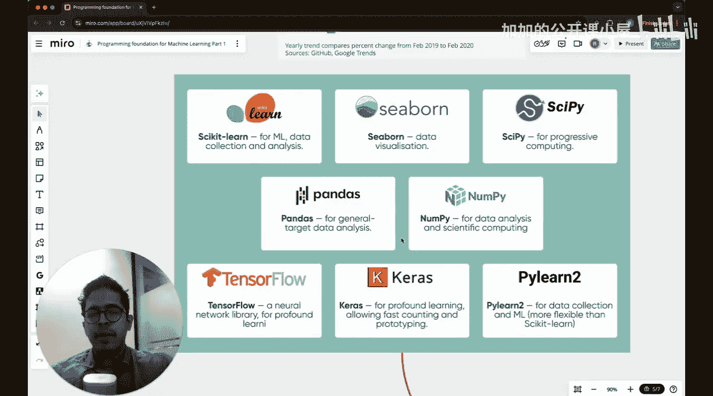

#  029：Python入门基础

欢迎回到机器学习基础课程。这是新模块的开始，我们将介绍机器学习工程师所需的编程基础。

本课程是Python的全新起点。如果你已经熟悉Python基础知识，可以完全跳过本课。如果你不是初学者，本课并非必需。如果你是零基础，没有太多使用或运行程序、编写Python代码的背景，那么本课适合你。让我们开始学习，我们将从非常基础的数据类型开始，然后在本课结束时编写一些更复杂的函数。

## Python简介 🐍

首先，Python是一种编程语言。它的书写方式非常易于解释，语法非常容易学习。它是目前机器学习领域最流行的编程语言，也广泛应用于Web开发。相对于许多其他编程语言，学习Python非常容易。对我个人而言，Python比C或C++更容易学习。如果你想成为一名专业的机器学习工程师，当然应该掌握Python。另一个优点是，Python拥有大量非常流行的库，社区支持非常好。此外，由于许多互联网数据库基于Python，像ChatGPT或Anthropic的Claude这样的大型语言模型，在你遇到Python问题时，都非常擅长提供解决方案。

下图显示了从2019年2月到2020年2月，教程搜索中哪些语言最突出。Python位居榜首，其次是Java等。因为在Web开发中Java也被广泛使用，所以你会看到这种趋势。但很明显，Python是世界上最受欢迎的编程语言。

## Python库简介 📚

以下是Python中一些在机器学习、数据科学、深度学习等领域非常流行的库。其中一些用于数据可视化，如Seaborn；一些用于数据分析和实现机器学习模型；还有一些用于存储表格数据等。如果你不知道这些库是什么，不用担心，只需将它们视为预定义的代码，这样你就不必重复编写执行某些功能的代码。这些是Python中非常流行的库，当你进入机器学习领域时，将广泛使用它们。

以下是这些库的简要列表：
*   **NumPy**：用于数值计算。
*   **Pandas**：用于数据分析和操作。
*   **Matplotlib**：用于数据可视化。
*   **Seaborn**：基于Matplotlib的统计图形库。
*   **Scikit-learn**：用于机器学习的库。
*   **TensorFlow / PyTorch**：用于深度学习的框架。

## 总结

在本节课中，我们一起学习了Python编程语言的基本介绍及其在机器学习中的重要性。我们了解到Python因其易学性和强大的社区支持而成为最受欢迎的编程语言之一。我们还简要介绍了一些在机器学习中常用的Python库，这些库将在后续的学习中发挥重要作用。下一节，我们将开始学习Python的基础数据类型。