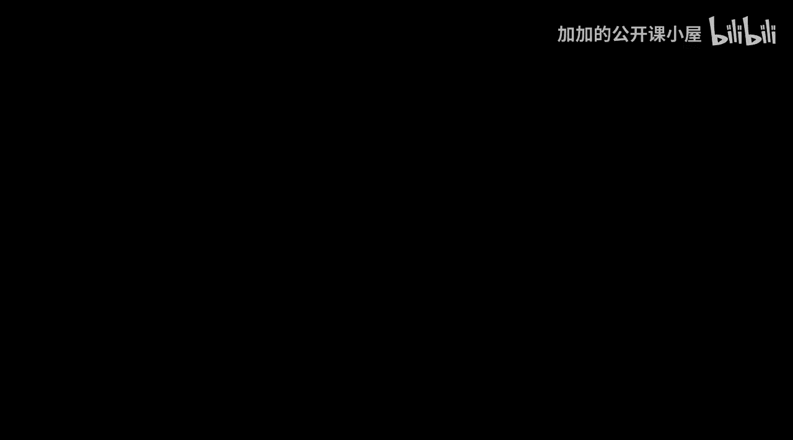
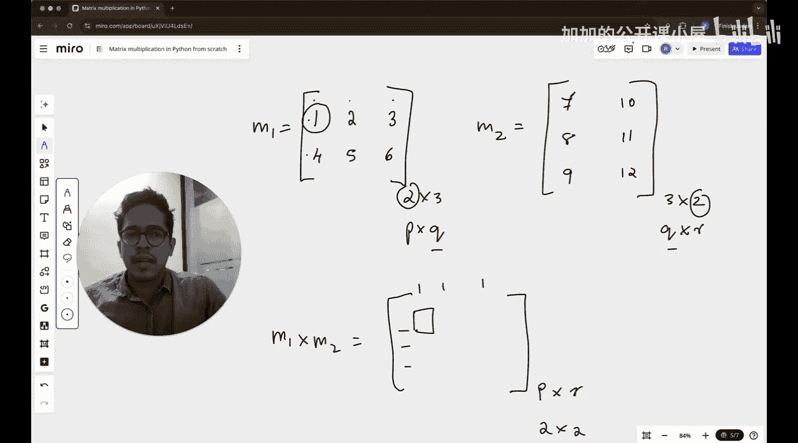

#  030：从零实现Python矩阵乘法




在本节课中，我们将学习如何在Python中不借助任何库，从零开始实现矩阵乘法。

对于初学者而言，这是一个极佳的练习。它将让你接触到Python中的多个重要概念：处理列表（这是Python中的基础数据结构）、理解矩阵（本质上是列表的列表）、运用循环、条件语句、掌握Python基本语法，以及将人类逻辑转化为代码。通过这一个练习，你将获得全面的实践。

我们将不使用NumPy或其他任何库，完全从零开始实现矩阵乘法。

## 矩阵乘法规则概述

矩阵乘法遵循特定规则。假设有两个矩阵M1和M2。只有当第一个矩阵M1的**列数**等于第二个矩阵M2的**行数**时，这两个矩阵才能相乘。否则，会出现维度不匹配的错误。

我们可以用维度P、Q、R来一般化地表示。设第一个矩阵的维度为 **P × Q**，第二个矩阵的维度为 **Q × R**。其中，**Q** 必须相同，而 **P** 和 **R** 可以不同。

相乘的结果矩阵维度将是 **P × R**。这意味着结果矩阵有P行和R列。

## 计算过程详解

那么，如何计算M1乘以M2呢？结果矩阵中的每个元素，都是由M1的一行与M2的一列对应元素相乘再求和得到的。

具体来说，结果矩阵中位于第 `i` 行、第 `j` 列的元素（在Python中索引从0开始，即 `[i][j]`），其计算方式如下：

取M1的第 `i` 行向量，与M2的第 `j` 列向量，将它们的对应元素相乘，然后将所有乘积相加。

用公式表示，结果矩阵 `C` 的元素 `C[i][j]` 为：
**C[i][j] = Σ (M1[i][k] * M2[k][j])**，其中求和 `Σ` 对 `k` 从0到 `Q-1` 进行。

## 代码实现步骤

以下是实现矩阵乘法的具体步骤。我们将逐步构建代码。

首先，需要检查两个矩阵是否可以相乘。这通过比较M1的列数（即 `len(M1[0])`）和M2的行数（即 `len(M2)`）来完成。

```python
def matrix_multiply(M1, M2):
    # 1. 检查维度是否匹配
    if len(M1[0]) != len(M2):
        return "错误：矩阵维度不匹配，无法相乘。"
```

如果维度匹配，我们就可以继续。接下来，初始化结果矩阵。结果矩阵的行数等于M1的行数（`len(M1)`），列数等于M2的列数（`len(M2[0])`）。我们创建一个全零的二维列表作为初始结果。

```python
    # 2. 初始化结果矩阵（P行，R列，全部填充0）
    result_rows = len(M1)
    result_cols = len(M2[0])
    result = [[0 for _ in range(result_cols)] for _ in range(result_rows)]
```

现在进入核心计算部分。我们需要三层嵌套循环：
*   外层循环 `i` 遍历结果矩阵的每一行（即M1的每一行）。
*   中层循环 `j` 遍历结果矩阵的每一列（即M2的每一列）。
*   内层循环 `k` 遍历共同的维度 `Q`，用于计算点积。

```python
    # 3. 三层循环计算每个元素
    for i in range(result_rows):          # 遍历M1的每一行
        for j in range(result_cols):      # 遍历M2的每一列
            for k in range(len(M2)):      # 遍历共同维度Q (即 len(M1[0]) 或 len(M2))
                result[i][j] += M1[i][k] * M2[k][j]
```

最后，函数返回计算得到的结果矩阵。

```python
    return result
```

## 完整代码与测试

让我们将以上步骤整合，并提供一个测试用例。

```python
def matrix_multiply(M1, M2):
    """
    从零实现矩阵乘法。
    参数:
        M1 (list of lists): 第一个矩阵，维度 P x Q。
        M2 (list of lists): 第二个矩阵，维度 Q x R。
    返回:
        list of lists: 结果矩阵，维度 P x R。如果维度不匹配则返回错误信息。
    """
    # 1. 检查维度是否匹配
    if len(M1[0]) != len(M2):
        return "错误：矩阵维度不匹配，无法相乘。"

    # 2. 初始化结果矩阵（P行，R列，全部填充0）
    result_rows = len(M1)
    result_cols = len(M2[0])
    result = [[0 for _ in range(result_cols)] for _ in range(result_rows)]

    # 3. 三层循环计算每个元素
    for i in range(result_rows):          # 遍历M1的每一行 (P)
        for j in range(result_cols):      # 遍历M2的每一列 (R)
            for k in range(len(M2)):      # 遍历共同维度Q (即 len(M1[0]) 或 len(M2))
                result[i][j] += M1[i][k] * M2[k][j]

    return result

# 测试用例
if __name__ == "__main__":
    # 定义两个矩阵
    A = [[1, 2, 3],
         [4, 5, 6]]  # 2x3 矩阵

    B = [[7, 8],
         [9, 10],
         [11, 12]]   # 3x2 矩阵

    # 调用函数进行计算
    C = matrix_multiply(A, B)

    # 打印结果
    print("矩阵 A:")
    for row in A:
        print(row)
    print("\n矩阵 B:")
    for row in B:
        print(row)
    print("\n乘积矩阵 C = A x B:")
    if isinstance(C, str):
        print(C)  # 打印错误信息
    else:
        for row in C:
            print(row)
```

运行上述代码，你将得到结果矩阵 `C`，其维度为2x2，计算过程正如我们之前描述的规则所示。

## 总结



本节课中，我们一起学习了如何在不使用任何外部库的情况下，从零开始在Python中实现矩阵乘法。我们首先理解了矩阵乘法的核心规则——第一个矩阵的列数必须等于第二个矩阵的行数。接着，我们剖析了计算过程：结果矩阵的每个元素都是M1一行与M2一列的点积。最后，我们通过编写包含维度检查、结果初始化和三层嵌套循环的代码，完整实现了这一算法。这个练习巩固了对Python列表、循环和基础算法逻辑的理解，是迈向更复杂机器学习概念的重要一步。