#  031：Python类入门教程 🐍

在本节课中，我们将要学习Python编程中一个核心但初学者常感困惑的概念：**类（Class）**。理解类是构建复杂程序，特别是机器学习模型的重要基础。我们将从最基础的概念讲起，解释什么是类、为什么使用类，并通过简单的比喻帮助你建立直观理解。

---

## 什么是类？📋

上一节我们介绍了编程基础的重要性，本节中我们来看看Python中的“类”。

类可以被理解为一个**蓝图（Blueprint）**。这个蓝图用于创建具有相似特征和行为的对象。

为了理解这一点，请看下面的例子。这里有两个对象：`student1`和`student2`。`student1`对象拥有三个属性：姓名、学号和院系。`student2`对象同样拥有这三个属性：姓名、学号和院系。

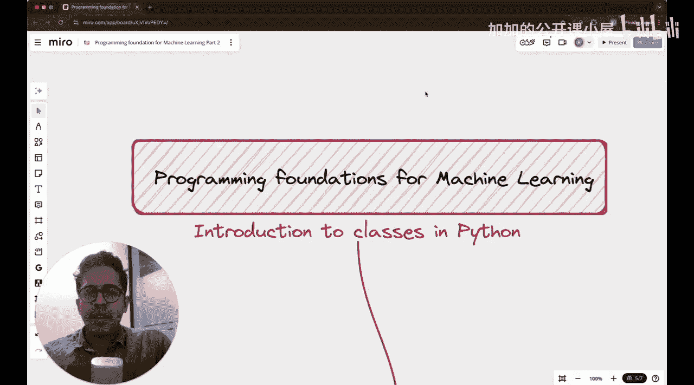

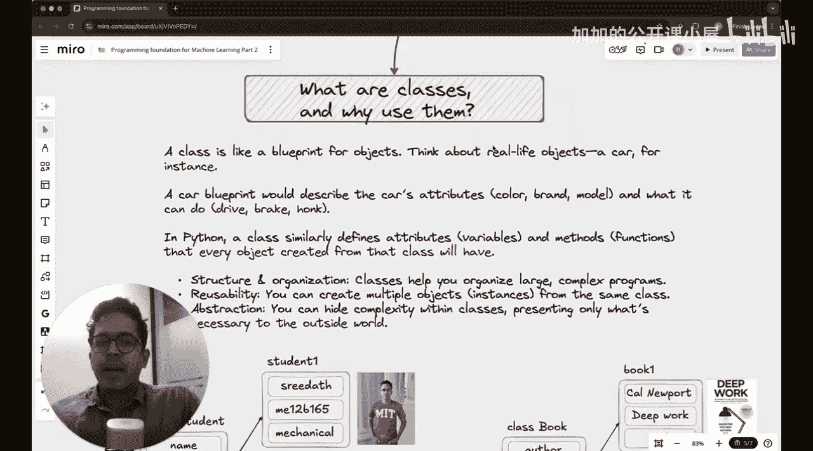

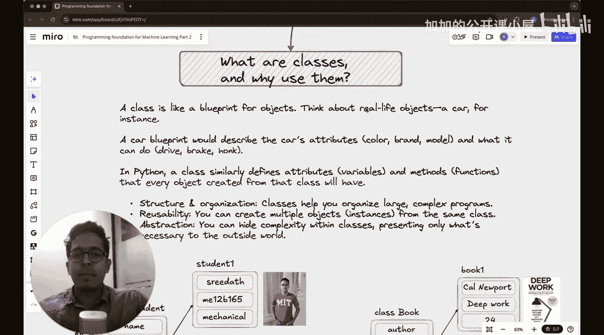


那么，类就是定义这个蓝图的**数据结构**。它规定了`student1`、`student2`或任何其他学生对象都应该具备哪些属性。在这个例子中，类定义了三个属性：
1.  第一个属性是`name`（姓名）。
2.  第二个属性是`role_number`（学号）。
3.  第三个属性是`department`（院系）。

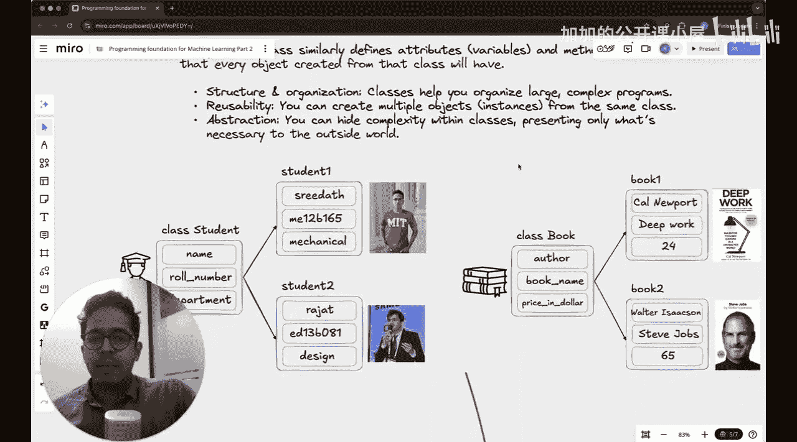
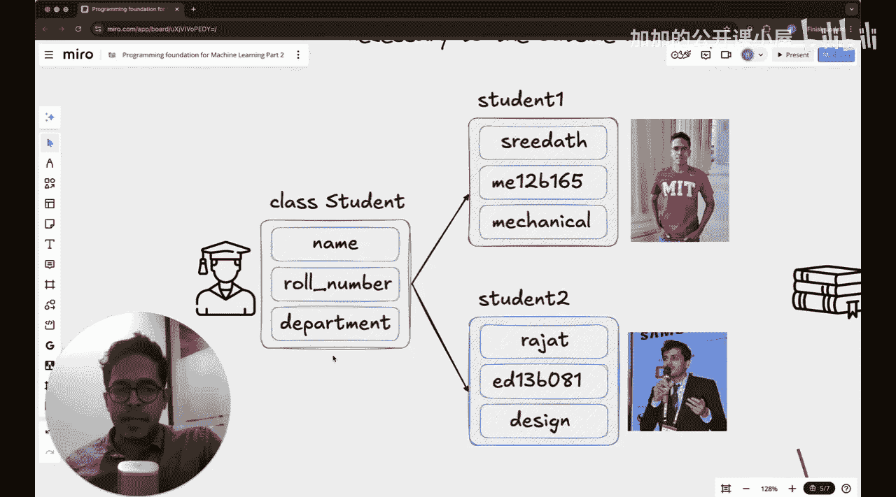

---


## 另一个例子：图书类 📚

现在让我们思考另一个例子。假设你需要存储关于书籍的信息。一本书的“蓝图”，或者说元数据，可能包含以下信息：
*   作者
*   书名
*   价格（美元）
*   页数

这里，如果你定义一个名为`Book`的类，并以作者、书名和价格为属性，那么你就可以创建这个类的对象。


以下是这个类的可能结构：
```python
class Book:
    def __init__(self, author, book_name, price):
        self.author = author
        self.book_name = book_name
        self.price = price
```

然后，你可以创建该类的对象：
*   `book1` 是这个类的第一个对象，其属性值为：作者“Newport”，书名“Deep Work”，价格24。
*   `book2` 是这个类的第二个对象，其属性值为：作者“Author2”，书名“Book Name 2”，价格30。

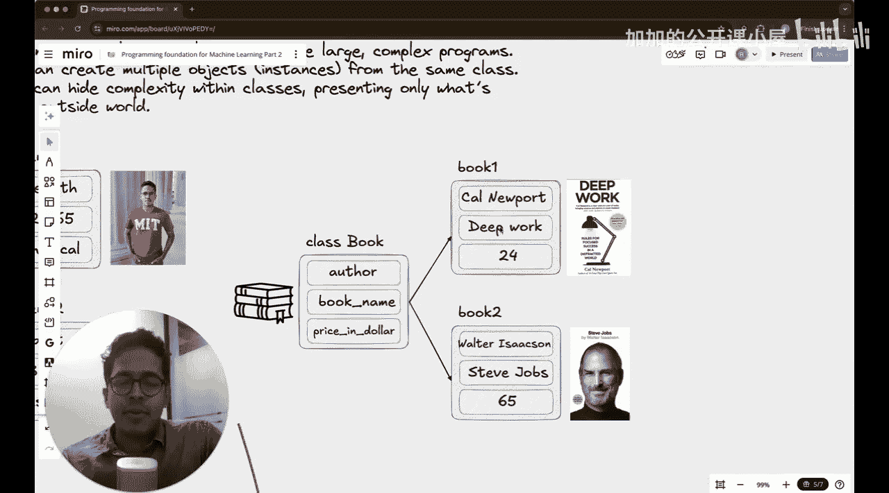
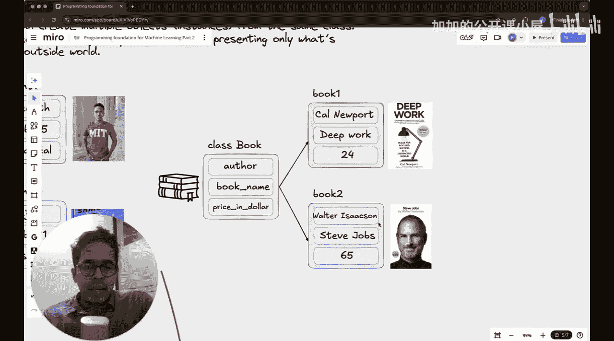

---

## 类的核心优势：重用与组织 🔄

通过上面的例子，我们了解了类的基本形态。在类的定义中，你可以包含各种相似属性的变量。这些变量可以是整数、字符串，甚至是函数。


**类的核心优势在于其可重用性**。你不需要为每个学生或每本书单独、重复地定义结构。即使你需要定义300个学生，你也不需要创建300个独立且结构各异的对象。所有这些对象都可以是同一个称为“类”的结构的**实例（Instances）**。


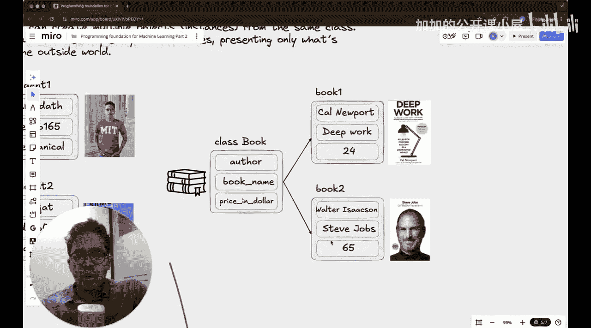
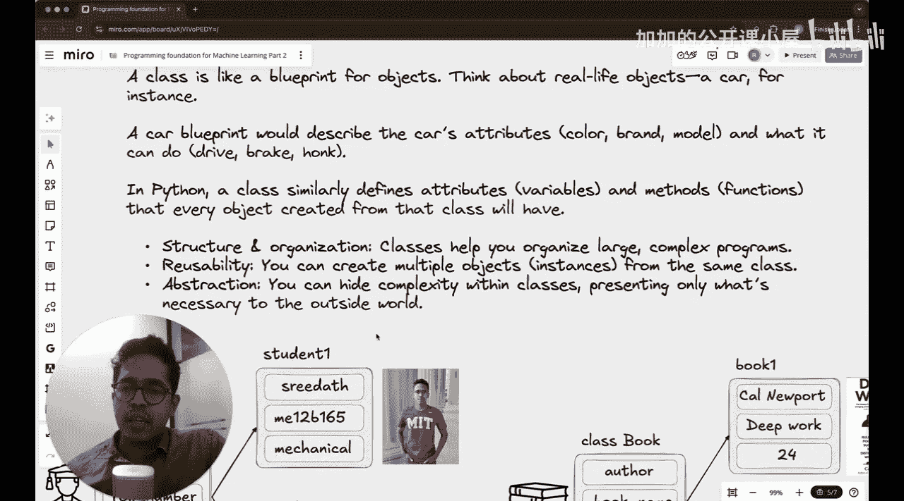
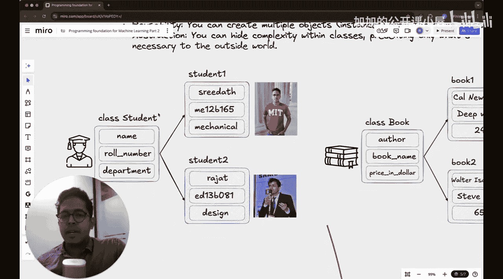

---

## 给初学者的提示 💡


我知道，如果你是第一次学习类的概念，可能仍然会感到有些困惑。这是完全正常的。这种困惑通常会在我们实际动手编写代码时消失，所以不必过于担心。

目前，请先尝试理解这个核心思想：**类是一个可以容纳数据（属性）和行为（方法）的模板或容器，它允许我们高效地创建和管理多个具有共同特征的对象。**


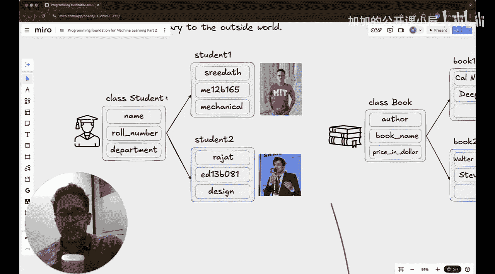


---

## 总结 ✨

本节课中我们一起学习了Python中“类”的基本概念。我们了解到：
1.  **类是一个蓝图**，用于创建对象。
2.  类定义了对象的**属性**（如学生的姓名、学号）和未来可以定义的**行为**。
3.  使用类的主要目的是**代码重用和组织**，避免重复定义相似的数据结构。
4.  从同一个类创建出来的具体对象，称为该类的**实例**。


理解类是迈向面向对象编程和构建复杂机器学习模型的关键一步。在接下来的课程中，我们将通过实际编码来巩固这一概念。