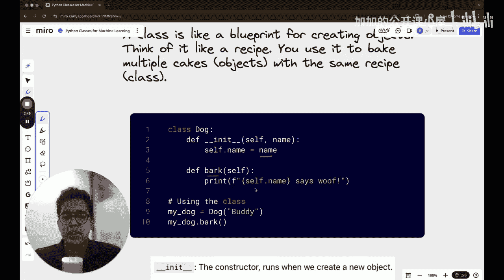

#  032：Python类与对象在机器学习中的介绍


欢迎回到机器学习编程基础课程。在本节课中，我们将学习关于类的知识，特别是在机器学习的背景下。这是一堂完全面向初学者的课程，我们将尝试理解类以及如何在机器学习中使用它们。同时，我们还将讨论为什么在有函数的情况下还要使用类。让我们开始这节课。

首先，在课程结束时，你将掌握以下四个关键要点：

*   你将理解Python类的基础知识。
*   你将理解如何构建涉及类的代码结构，例如神经网络、线性回归模型或类似的机器学习代码。
*   你将在今天的课程中实现两个模型：第一个是完全从零开始的线性回归模型，第二个是用于执行二分类的简单神经网络。
*   所有这些都将通过使用Python类来定义模型完成。

## 什么是类？🐕

上一节我们介绍了课程目标，本节中我们来看看什么是类。

用简单的话来说，一个类就像一个用于创建对象的蓝图。你可能听说过面向对象编程，对象就是这个类的一个实例。一种理解方式是想象一个教室，里面有20名学生。每个学生都有一些属性：姓名、身高、学号、所修科目、成绩等等。蓝图基本上就是这个事实：要描述一个学生，你需要这些属性。而实例就是一个学生的具体例子，比如有一个具体的名字叫“Srid”，具体的身高，具体的学号，学生正在修的具体科目等。

以下是一个类的例子，我们定义了一个名为 `Dog` 的类。我们将解释为什么类内部有某些东西，比如 `self` 和 `__init__` 等。这可能是学生最困惑的部分。

```python
class Dog:
    def __init__(self, name):
        self.name = name

    def bark(self):
        print(f"{self.name} says woof!")
```

一个类也可以是空的。在上面的 `Dog` 类中，你不需要有任何内容，你可以只在类里面写 `pass`，那么你也会有一个什么都不做的类。但这里的情况并非如此。类内部有两样东西：一个叫做 `name` 的属性，以及一个叫做 `bark` 的方法或函数。`bark` 函数的作用是打印这只狗的名字，假设狗的名字是“Buddy”。

## 为什么在机器学习中使用类？🧠

我们已经了解了类的基本概念，现在让我们探讨为什么在机器学习中类如此重要。

在机器学习中，模型（如线性回归、神经网络）通常具有以下共同点：

1.  **参数**：模型需要学习和存储的权重和偏置。
2.  **前向传播**：一个根据输入和当前参数计算输出的函数。
3.  **训练循环**：一个更新参数以最小化损失的过程。

使用类可以将所有这些组件（数据和方法）封装在一个整洁、有组织的单元中。这使得代码更易于管理、调试和复用。例如，你可以创建一个 `LinearRegression` 类，它内部包含权重、偏置、计算预测值的方法和更新参数的方法。

## 动手实践：实现线性回归模型📈

理论介绍完毕，现在让我们通过一个具体的例子来巩固理解。以下是使用类实现一个简单线性回归模型的步骤。

我们将创建一个 `LinearRegression` 类，它能够根据输入数据拟合一条直线。

```python
import numpy as np

class LinearRegression:
    def __init__(self):
        self.weight = None
        self.bias = None

    def fit(self, X, y, learning_rate=0.01, epochs=1000):
        # 初始化参数
        n_samples, n_features = X.shape
        self.weight = np.zeros(n_features)
        self.bias = 0

        # 梯度下降
        for _ in range(epochs):
            # 计算预测值: y_pred = X * w + b
            y_pred = np.dot(X, self.weight) + self.bias

            # 计算梯度
            dw = (1 / n_samples) * np.dot(X.T, (y_pred - y))
            db = (1 / n_samples) * np.sum(y_pred - y)

            # 更新参数
            self.weight -= learning_rate * dw
            self.bias -= learning_rate * db

    def predict(self, X):
        return np.dot(X, self.weight) + self.bias
```

**代码解释**：
*   `__init__`：初始化权重和偏置为 `None`。
*   `fit`：使用梯度下降法训练模型。它接收特征 `X`、目标值 `y`、学习率和迭代次数作为输入。
*   `predict`：使用训练好的权重和偏置对新数据 `X` 进行预测。

## 扩展应用：实现一个简单神经网络🧩

掌握了线性回归的实现后，我们可以进一步探索更复杂的模型。本节我们将实现一个用于二分类的简单神经网络。

这个网络将有一个隐藏层，使用Sigmoid激活函数。

```python
class SimpleNeuralNetwork:
    def __init__(self, input_size, hidden_size, output_size):
        # 初始化权重和偏置
        self.W1 = np.random.randn(input_size, hidden_size)
        self.b1 = np.zeros((1, hidden_size))
        self.W2 = np.random.randn(hidden_size, output_size)
        self.b2 = np.zeros((1, output_size))

    def sigmoid(self, x):
        return 1 / (1 + np.exp(-x))

    def forward(self, X):
        # 前向传播
        self.z1 = np.dot(X, self.W1) + self.b1
        self.a1 = self.sigmoid(self.z1)
        self.z2 = np.dot(self.a1, self.W2) + self.b2
        self.a2 = self.sigmoid(self.z2)
        return self.a2

    def train(self, X, y, learning_rate=0.1, epochs=10000):
        for i in range(epochs):
            # 前向传播
            output = self.forward(X)

            # 反向传播（简化版，使用均方误差）
            error = output - y
            d_output = error * (output * (1 - output)) # Sigmoid导数

            error_hidden = d_output.dot(self.W2.T)
            d_hidden = error_hidden * (self.a1 * (1 - self.a1))

            # 更新权重和偏置
            self.W2 -= self.a1.T.dot(d_output) * learning_rate
            self.b2 -= np.sum(d_output, axis=0, keepdims=True) * learning_rate
            self.W1 -= X.T.dot(d_hidden) * learning_rate
            self.b1 -= np.sum(d_hidden, axis=0, keepdims=True) * learning_rate
```

**代码解释**：
*   `__init__`：随机初始化两层网络的权重和偏置。
*   `sigmoid`：Sigmoid激活函数。
*   `forward`：执行前向传播，计算网络输出。
*   `train`：使用反向传播和梯度下降训练网络。这里使用了一个简化的梯度计算。

## 总结✨



在本节课中，我们一起学习了Python类与对象在机器学习中的应用。我们首先了解了类作为创建对象蓝图的基本概念。接着，我们探讨了在机器学习中使用类来封装模型参数和方法的优势，这能使代码结构更清晰、更易维护。然后，我们通过动手实践，使用类从头实现了一个线性回归模型和一个简单的二分类神经网络。通过这些例子，你应该对如何使用类来组织机器学习代码有了更具体的认识。掌握类的使用是构建复杂、模块化机器学习项目的重要一步。