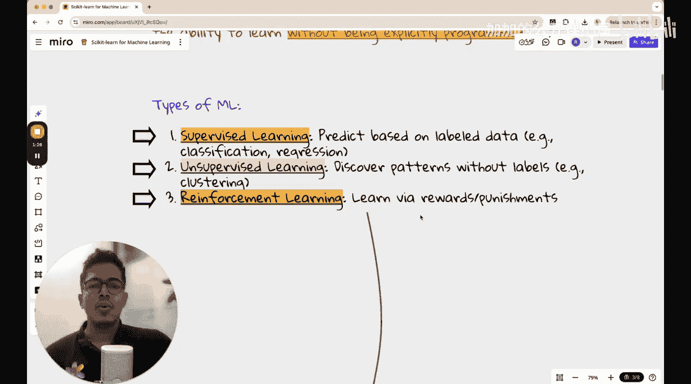

#  036：Python Scikit-learn入门

在本节课中，我们将要学习Python中最流行的机器学习库之一——Scikit-learn。我们将以一个简单的数据集为例，完整地走一遍机器学习项目流程，包括数据探索、数据预处理、模型实现与评估。具体来说，我们将实现K近邻和决策树两种模型，并了解其背后的基本原理。


## 什么是机器学习？

在开始学习Scikit-learn之前，我们先简要讨论一下什么是机器学习。

在传统编程中，我们通过编写明确的规则（如`if-else`条件语句）来告诉计算机如何根据输入产生输出。然而，在机器学习中，我们不显式地编程定义这些规则。相反，我们让算法从数据中自行“学习”出输入与输出之间的映射关系。这个过程被称为**训练**。

## 机器学习的类型

机器学习过程大致可分为三种主要类型：监督学习、无监督学习和强化学习。此外，还有自监督学习、半监督学习等其他术语。

以下是三种主要学习类型的简要介绍：

*   **监督学习**：在这种学习中，我们为模型提供带有明确标签的训练数据。例如，在训练一个区分猫狗图片的分类器时，输入是图片，对应的标签是“猫”或“狗”。模型的任务是学习从图片到标签的映射关系。
*   **无监督学习**：在这种学习中，训练数据没有明确的标签。算法的目标是从数据中发现内在的结构或模式，例如将数据点分组到不同的**聚类**中。
*   **强化学习**：在这种学习中，一个智能体通过与环境互动来学习。它根据采取的行动获得奖励或惩罚，目标是学习一个策略，以最大化长期累积奖励。

## 引入Scikit-learn

上一节我们介绍了机器学习的基本概念，本节中我们来看看今天的主角——Scikit-learn。

Scikit-learn（简称sklearn）是Python中一个功能强大且易于使用的机器学习库。它内置了大量经典的机器学习算法，并提供了统一的接口，使得数据预处理、模型训练、预测和评估变得非常简单。

为了使用Scikit-learn，我们首先需要导入它。通常，我们也会导入一些辅助库，如NumPy和Pandas，用于数据处理。

```python
import numpy as np
import pandas as pd
from sklearn import datasets
```

## 加载与探索数据

一个机器学习项目始于数据。Scikit-learn内置了一些经典的小型数据集，非常适合用于学习和测试。

本节课我们将使用著名的**鸢尾花数据集**。这个数据集包含了三种不同品种鸢尾花（山鸢尾、变色鸢尾、维吉尼亚鸢尾）的测量数据，每种有50个样本。每个样本有4个特征：花萼长度、花萼宽度、花瓣长度和花瓣宽度。

以下是加载和初步查看数据的步骤：

```python
# 加载鸢尾花数据集
iris = datasets.load_iris()

# 数据集通常被组织为特征矩阵 X 和目标向量 y
X = iris.data  # 特征
y = iris.target # 标签（0, 1, 2 分别代表三种花）

# 查看数据形状
print(f"特征数据形状: {X.shape}") # 输出: (150, 4)
print(f"标签数据形状: {y.shape}") # 输出: (150,)

# 查看特征名称和标签名称
print(f"特征名称: {iris.feature_names}")
print(f"标签名称: {iris.target_names}")
```

通过查看数据形状，我们知道有150个样本，每个样本有4个特征。标签`y`是一个包含150个数字（0, 1, 2）的向量，对应三种花的品种。

## 数据预处理与划分

在将数据喂给模型之前，通常需要进行一些预处理，并将数据划分为训练集和测试集。

**数据预处理**可能包括处理缺失值、标准化或归一化特征等。鸢尾花数据集非常干净，我们暂时跳过复杂的预处理。

**划分数据集**至关重要，它让我们可以用一部分数据（训练集）来训练模型，然后用另一部分未见过的数据（测试集）来评估模型的泛化能力。Scikit-learn提供了方便的`train_test_split`函数。

```python
from sklearn.model_selection import train_test_split

# 将数据随机划分为训练集和测试集，测试集占比20%
X_train, X_test, y_train, y_test = train_test_split(X, y, test_size=0.2, random_state=42)

print(f"训练集大小: {X_train.shape}")
print(f"测试集大小: {X_test.shape}")
```
`random_state`参数用于确保每次运行代码时，数据划分的方式都是一致的，这有助于结果的可复现性。

## 模型一：K近邻算法

现在我们已经准备好了数据，接下来开始实现第一个机器学习模型——K近邻。

K近邻是一种简单直观的监督学习算法，既可用于分类也可用于回归。其核心思想是：对于一个新样本，在特征空间中找出与其最接近的K个训练样本，然后根据这K个“邻居”的标签（通过投票或平均）来预测新样本的标签。

距离通常使用**欧几里得距离**计算，公式如下：
`distance = sqrt((x1-x2)^2 + (y1-y2)^2 + ...)`

在Scikit-learn中，实现KNN只需要几行代码：

```python
from sklearn.neighbors import KNeighborsClassifier

# 创建KNN分类器实例，设置邻居数K=3
knn_model = KNeighborsClassifier(n_neighbors=3)

# 使用训练数据拟合（训练）模型
knn_model.fit(X_train, y_train)

# 使用训练好的模型对测试集进行预测
y_pred_knn = knn_model.predict(X_test)
```
模型训练完成后，我们可以用它对测试集进行预测，得到预测结果`y_pred_knn`。

## 模型评估

我们如何知道模型预测得好不好呢？这就需要评估指标。

对于分类问题，一个基础的指标是**准确率**，即预测正确的样本数占总样本数的比例。

```python
from sklearn.metrics import accuracy_score

# 计算KNN模型的准确率
knn_accuracy = accuracy_score(y_test, y_pred_knn)
print(f"K近邻模型准确率: {knn_accuracy:.2f}")
```
除了准确率，混淆矩阵、精确率、召回率等也是常用的分类评估指标。

## 模型二：决策树算法

上一节我们使用K近邻算法对鸢尾花数据进行了分类，本节中我们来看看另一种经典的算法——决策树。

决策树通过一系列`if-else`决策规则对数据进行划分，最终形成一棵树状结构。它非常易于理解和解释。

以下是使用Scikit-learn实现决策树的步骤：

```python
from sklearn.tree import DecisionTreeClassifier

# 创建决策树分类器实例
tree_model = DecisionTreeClassifier(random_state=42)

# 训练决策树模型
tree_model.fit(X_train, y_train)

# 使用决策树模型进行预测
y_pred_tree = tree_model.predict(X_test)

# 评估决策树模型
tree_accuracy = accuracy_score(y_test, y_pred_tree)
print(f"决策树模型准确率: {tree_accuracy:.2f}")
```
我们可以比较两个模型的准确率，看看哪种算法在这个数据集上表现更好。

## 总结

本节课中我们一起学习了使用Scikit-learn库完成一个端到端的机器学习分类项目。

我们首先了解了机器学习的基本概念和类型。然后，我们加载了鸢尾花数据集并进行了初步探索。接着，我们将数据划分为训练集和测试集。之后，我们先后实现了**K近邻**和**决策树**两种分类模型，并使用准确率对它们进行了评估。



通过这个简单的示例，你应当对使用Scikit-learn进行数据预处理、模型训练、预测和评估的完整流程有了初步的感性认识。记住，对于更复杂的数据和问题，可能还需要更多的特征工程、模型调参和交叉验证等步骤。