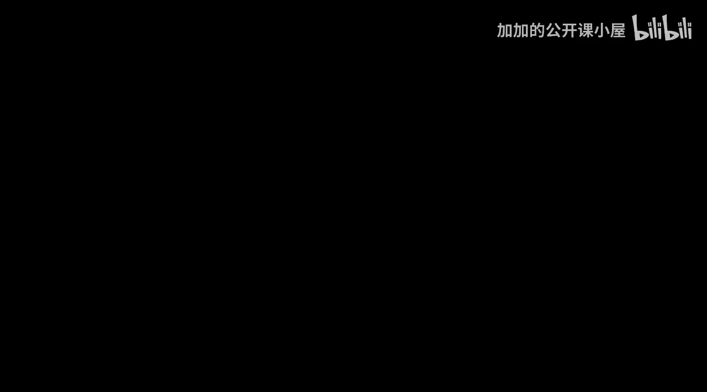
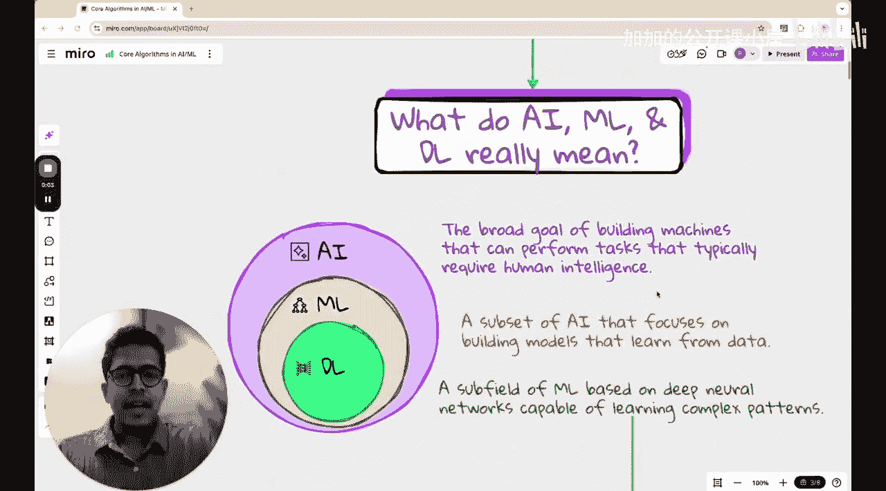

#  038：机器学习算法概览

在本节课中，我们将学习机器学习领域中最常见的一些核心算法。本讲座的目的是为你提供一个清晰的图谱，帮助你理解各种算法在机器学习版图中的位置。你可能听说过许多术语，如支持向量机、深度神经网络、隐马尔可夫模型、强化学习、长短期记忆网络等。这些术语在不同语境下变得非常流行，但很多人并不清楚它们之间的界限、需要学习多少内容，以及如何规划学习路径。因此，本节课不会深入讲解任何具体算法，而是为你绘制一张地图，展示所有存在的不同技术。如果你想在未来六到八个月内学习机器学习，了解这些内容将帮助你明确学习方向，为成为机器学习专家打下坚实基础。

## 人工智能、机器学习与深度学习

首先，我们来看看人工智能、机器学习和深度学习之间的区别。这些术语有时会被混用，但这并不准确，它们各自有特定的含义。

人工智能是一个广泛的领域，涵盖了一系列使机器或计算机能够获得某种类人智能的技术。人工智能涉及许多其他方面，例如能够执行自主任务的机器人。任何能够做出决策并执行任务的系统都可以归入人工智能的范畴。人工智能有许多早期形式，例如遗传算法和模糊逻辑，其涵盖的范围非常广泛。

而机器学习和深度学习则是实现人工智能最成功的技术。机器学习是指这样一类模型：它们能够在已有数据上进行训练，并对未见过的数据进行预测。在机器学习模型中，数据的特征是现成可用的。这里的“特征”可以理解为数据表中的列。例如，一个包含个人血糖、身体质量指数和胆固醇水平的数据集，每个人的这三个数据点就可以直接作为特征，供机器学习模型学习。

## 机器学习算法分类

上一节我们了解了人工智能的广阔范畴，以及机器学习在其中的位置。本节中，我们将具体看看机器学习算法的主要分类。机器学习算法通常可以根据学习方式分为三大类：监督学习、无监督学习和强化学习。

以下是这三种主要学习方式的简要介绍：

*   **监督学习**：模型从带有标签的训练数据中学习。目标是学习一个从输入到输出的映射函数，以便对新的、未见过的输入做出准确预测。这就像有老师提供正确答案来指导学习。
*   **无监督学习**：模型在没有标签的数据中发现内在结构或模式。目标可能是对数据进行分组、降维或发现异常。这就像在没有指导的情况下自行探索数据。
*   **强化学习**：智能体通过与环境互动来学习。它通过尝试不同的行动并获得奖励或惩罚来学习达成目标的最佳策略。这就像通过试错来学习游戏。

## 核心算法简介

了解了三大学习范式后，我们来看看每一类中一些最核心和流行的具体算法。掌握这些算法是构建坚实机器学习基础的关键。

以下是监督学习中的一些代表性算法：

*   **线性回归**：用于预测连续的数值。其核心思想是找到一条最佳拟合直线（或超平面）。公式可以表示为：`y = w1*x1 + w2*x2 + ... + b`，其中 `w` 是权重，`b` 是偏置。
*   **逻辑回归**：尽管名字中有“回归”，但它主要用于**分类**任务，特别是二分类。它通过Sigmoid函数将线性组合映射到0到1之间的概率。
*   **支持向量机**：一种强大的分类算法，目标是找到一个能最大化不同类别数据间隔的**超平面**。
*   **决策树与随机森林**：决策树通过一系列规则对数据进行分类或回归。随机森林则是通过构建多棵决策树并综合其结果，以提高模型的准确性和鲁棒性。
*   **朴素贝叶斯**：基于贝叶斯定理，并假设特征之间相互独立。它简单高效，常用于文本分类。

以下是无监督学习中的一些代表性算法：

*   **K-均值聚类**：一种将数据划分为K个簇的聚类算法。目标是使同一个簇内的数据点尽可能相似，不同簇间的数据点尽可能不同。
*   **主成分分析**：一种**降维**技术，通过线性变换将原始数据转换为一组各维度线性无关的表示，用于提取主要特征分量。

最后，强化学习有其独特的学习框架，智能体、环境、状态、动作和奖励是其核心概念。深度Q网络和策略梯度方法是当前强化学习领域的重要算法。

## 深度学习简介

在讨论了传统机器学习算法之后，我们自然要过渡到机器学习的一个强大子领域——深度学习。深度学习本质上是使用深层神经网络（即包含多个隐藏层的神经网络）的机器学习。

深度学习在处理如图像、声音、文本等非结构化数据方面表现出色。以下是一些关键的深度学习架构：

*   **卷积神经网络**：专门为处理网格状数据（如图像）而设计，通过卷积层自动提取空间层次特征。
*   **循环神经网络**：用于处理序列数据（如时间序列、文本），具有记忆先前信息的能力。**长短期记忆网络** 是RNN的一种改进，能更好地学习长期依赖关系。
*   **生成对抗网络**：由生成器和判别器组成，两者在对抗中共同进步，常用于生成新的、与训练数据相似的数据样本。

## 总结

本节课中，我们一起学习了机器学习算法的整体图谱。我们从区分人工智能、机器学习和深度学习开始，明确了它们之间的关系。接着，我们探讨了机器学习的三大范式：监督学习、无监督学习和强化学习，并列举了每一类中的核心算法，如线性回归、支持向量机、K-均值聚类等。最后，我们简要介绍了深度学习及其代表性架构，如卷积神经网络和循环神经网络。理解这个概览图有助于你规划学习路径，知道在广阔的机器学习领域中需要关注哪些核心内容。