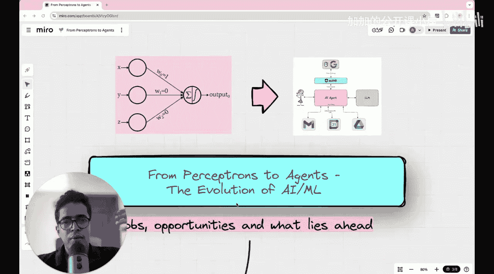
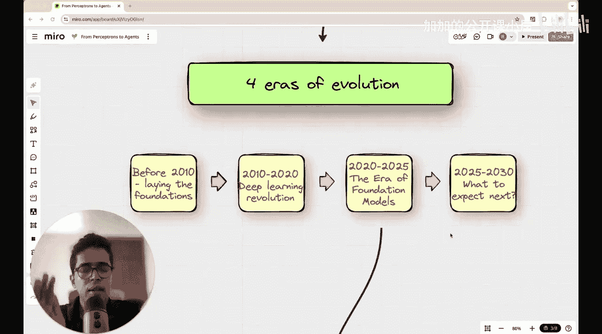

#  039：AI的发展方向？演变、当前趋势与职业机会

在本节课中，我们将一起回顾人工智能在过去几十年的发展历程，梳理其演变阶段、分析当前的核心趋势，并探讨未来几年的职业机会。我们将跳出日常的技术新闻，从一个更宏观的视角来理解AI的发展脉络。

## 概述：为何需要回顾AI发展史？

如果你经常使用领英或其他社交媒体，你一定会不断听到AI/ML领域的新进展。这些消息的涌现速度极快，几乎令人应接不暇。因此，本节课旨在后退一步，纵览全局，观察AI在过去几十年是如何发展的。我们将把这些发展或演变划分为几个不同的阶段，以便看清在特定时期最突出的进展是什么，以及在当前纷繁的噪音中正在发生什么，并展望未来五年左右的情况。这样做的目的是帮助你明确应该关注哪些领域，从而在AI/ML领域获得最佳的职业机会。

## AI发展的四个阶段

我们将AI的发展历程划分为四个主要阶段或时代。

### 第一阶段：2010年之前 - 机器学习与特征工程时代

在2010年之前的阶段，机器学习模型或基于特征工程的模型最为突出。那确实是许多数学基础得以奠定的时期，为基本的概率模型和基础的机器学习模型打下了坚实的理论基础。

### 第二阶段：2010-2020年 - 深度学习爆发时代

然而，真正的变革和巨大的职业机会转变发生在2010年至2020年。深度学习随着深度神经网络架构的出现而真正爆发，使得利用海量数据训练模型成为可能，并能在生产环境中实际执行有用的任务。

### 第三阶段：2020-2025年 - 基础模型时代

从2020年到2025年，可以称之为基础模型时代。我们见证了GPT-3.0的发布，以及后续的GPT模型和其他大型语言模型。在这些模型之上，你可以进行微调，或利用单独的数据库执行检索增强生成（RAG）并进行查询。

### 第四阶段：2025年及以后 - AI智能体时代

现在，在2025年，许多人开始讨论AI智能体。许多人也在谈论模型上下文协议（MCP）等许多其他术语。因此，让我们分阶段审视AI的整个发展过程，并尝试预测接下来会发生什么，以及将出现何种职业机会。

## 演变历程：从人工神经元到自主AI智能体

这项技术始于像人工神经元或多层感知机这样基础的概念。多层感知机是一种前馈神经网络，起点就是如此简单。如今，它已经发展到能够自主决策并执行行动的自主AI智能体阶段。因此，本节课将概述AI领域已经发生的所有事情、我们周围正在发生的事情，以及我们在不久的将来可以预期发生的事情。

## 总结与展望

本节课中，我们一起回顾了人工智能从早期机器学习到当前AI智能体时代的演变历程。我们梳理了四个关键发展阶段：特征工程时代、深度学习爆发时代、基础模型时代以及正在兴起的AI智能体时代。理解这一发展脉络，有助于我们在快速变化的技术浪潮中把握核心趋势，并为未来的学习和职业规划找准方向。