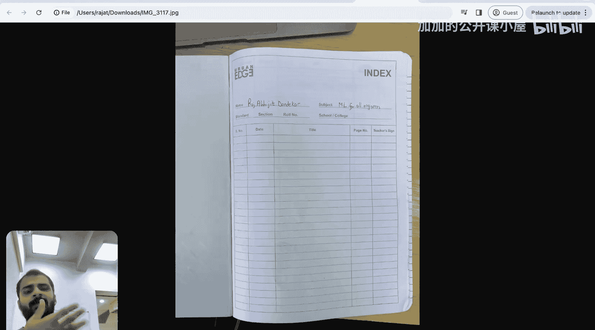
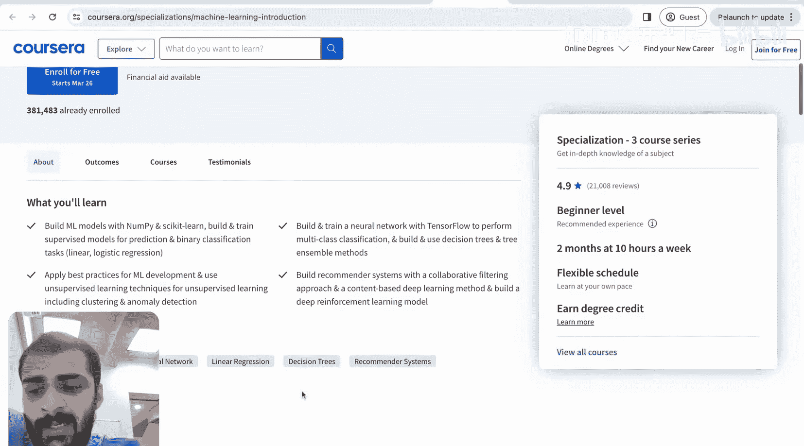

#  001：项目介绍与学习规划 🚀

在本节课中，我们将要学习如何开始你的机器学习之旅。我们将介绍“实践教学”项目的核心理念，并规划从零开始学习机器学习的路径。课程将帮助你明确学习目标，并指导你如何筛选初始学习资源。

---

大家好，欢迎来到“面向所有工程师的机器学习：实践教学”项目。

我是 Raj Danandeer 博士。在这一系列视频中，我将从零开始重新学习机器学习。我会将我的学习过程记录下来，并与你们分享所有资源，以便你们可以跟随我一起踏上这段旅程。

首先，让我介绍一下自己以及启动这个项目的原因。然后，我们将直接进入第一讲。

我的名字是 Raj Danandeer 博士。我于2017年从印度理工学院马德拉斯分校获得机械工程学士学位。随后，我在麻省理工学院完成了博士学位，并于2022年获得了机器学习领域的博士学位。实际上，我在2018年参加了麻省理工学院的第一次机器学习讲座，这完全改变了我的生活。在接下来的四年里，我掌握了机器学习概念，发表了ML研究，完成了机器学习实习和企业工作，并最终在麻省理工学院获得了机器学习领域的博士学位。

2022年，我回到印度，带着一个使命：教育数百万计划转型到机器学习领域的工程师，并指导他们的旅程。我希望能帮助所有想要转型到机器学习的学生。我一直在思考多种方式来帮助学生。什么才是最好的方式？如何确保学生能够开始他们的旅程，并且不会感到困惑、失去动力或停滞不前？

因此，我启动了这个名为“实践教学”的新项目。在这些视频中，我将扮演一个对机器学习一无所知的完全初学者。我会从零开始，就像你们如果从零开始学习一样。这样，你们就能与我在视频中展示的内容产生共鸣。我会以完全初学者的视角展示一切，就像你们想要转型到机器学习领域一样。

每天早晨，我都会发布前一天学习的内容，制作像这样的视频。我会制作讲义，分享参考资料，并完成作业，分享我的解答。你们可以看到，我已经带来了这本书，用来记录我学习的所有内容，它将作为学习资源。我还带来了不同颜色的笔，以便在学习材料时突出不同的信息。

在我重新学习这些材料时，我会分享哪些内容在工业界真正有用，哪些已经过时。我还会分享大量关于哪些领域包含开放研究课题的信息，以便感兴趣的学生也能开始他们的研究之旅。我会仔细选择学习材料，并向你们展示我是如何选择这些材料的。

对于那些感到困惑或停滞不前，无法成功转型到机器学习的学生来说，也许现有的课程和线下视频不够有启发性。如果看到别人从零开始学习机器学习，然后你可以跟随同样的旅程，这可能会激励你。这些视频完全免费，没有隐藏费用，纯粹是教与学。所以，你们可以加入我的旅程，一起转型到机器学习领域。

可能会有大量的视频，因为今天是我开始的第一天。每天我都会发布我的学习内容。在我们开始之前，你应该首先明确自己学习机器学习的目标。根据我的经验，最大的动力有三点：第一，如果你想在这个领域找到一份工作，但目前简历上没有相关经验，这可以成为开始学习机器学习的强大动力。第二，如果你想申请研究生院，但目前没有机器学习项目经验，因此你想学习机器学习。第三，你可以看到整个世界都在向机器学习和人工智能转型，你不想被落下。你对这个主题感兴趣，只是想了解机器学习，以便在这个快速转型的世界中感到自己属于其中。

我和所有希望转型的你们处境相似，因为我曾是机械工程专业，对机器学习一无所知。我在四、五年前了解了它，这完全改变了我的职业和个人生活。我希望我制作的这一系列视频能够激励、鼓舞并指导你们转型到机器学习的旅程。

我会每天在这个YouTube频道上发布内容，并在评论中附上资源和我在这本书中做的笔记，以便你们可以跟随学习。

非常感谢，我们第一讲见。

好的，让我们开始“实践教学”机器学习项目的第一讲视频。

正如你们在屏幕上看到的，我已经开始填写这本日记或笔记本，我将用它来维护我从零开始学习的所有讲义。今天将是一段漫长而富有成果的旅程的开始，所以让我们开始理解和学习机器学习的旅程吧。

首先，我要做的是进入访客模式，因为我不想让我过去的浏览历史影响我搜索不同内容时看到的结果。

让我首先说明，你们转型到机器学习的目标是以下三者之一：要么你想找一份工作，要么你想申请研究生院并转型到机器学习，第三是你只是想了解这个领域，因为整个世界都在朝这个方向发展，你对此感到好奇。

很好，那么作为一个初学者，我首先要搜索的是“ML for beginners”。好的。

我立刻可以看到已经出现了大量的结果。目前我无法比较这些内容，而且我也看到开始出现了一些赞助结果。

让我开始浏览所有的搜索结果，并尝试缩小我们开始学习的初始资源范围。

让我们排除一些我们肯定不需要的东西。例如，看看这个“Layers or data science online course”。但这看起来更像是针对就业安置的，而且这可能是一个为早期职业专业人士设计的付费项目。我们现在可能不需要这个，因为我们想要的是能在机器学习理论和实践知识方面为我们打下基础的东西。我们想要一种深入的课程，同时也能给我们实践经验。所以这看起来像是一个研究生项目，我们现在不需要这种程度的专业化，所以先排除这个。

这里还有另一个数据科学课程，显示“先就业后付款”等等。这也是付费的，所以我们现在先不考虑这些项目。而且这些项目可能有点“速成”，它们可能会教你快速完成项目，快速编码，但可能不会真正培养机器学习的坚实基础，而这是极其关键的。我的主要目标之一是指导你们作为初学者的旅程，但同时要打好基础，建立非常扎实的基本功，而不仅仅是做快速项目。

所以我现在也排除这个选项。好的，然后我听说过Coursera，也听说过Udemy。让我看看Coursera上的项目。让我搜索“machine learning for beginner Coursera”。

在这里你可以看到“面向初学者的顶级机器学习课程”。我可以看到这里又有大量的课程。这再次让人不知所措，很难选择到底该学什么，因为它们都有不错的评分。但我知道这门由吴恩达教授的课程相当不错，它有4.9的评分和2.1万条评论。让我点击看看这门课程的具体内容。

我可以看到可以免费注册，这很好。其次，我可以看到在这个项目中，我们将学习构建ML模型。

---

本节课中我们一起学习了“实践教学”项目的介绍和启动方法。我们明确了学习机器学习的三个主要动机：求职、升学或保持与时俱进的好奇心。我们开始了筛选初始学习资源的第一步，并认识到建立扎实的理论与实践基础的重要性，而不仅仅是追求速成项目。在下一节中，我们将深入探讨如何具体选择第一门课程并制定学习计划。