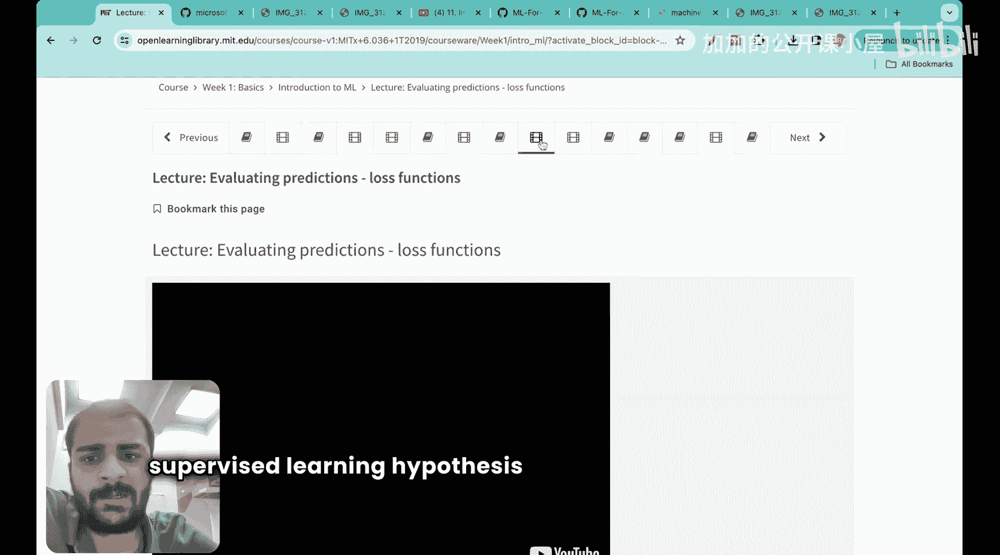
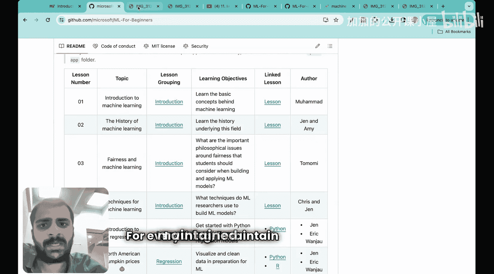
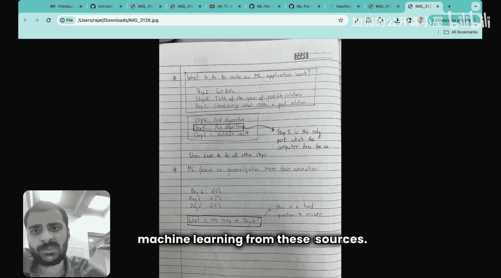
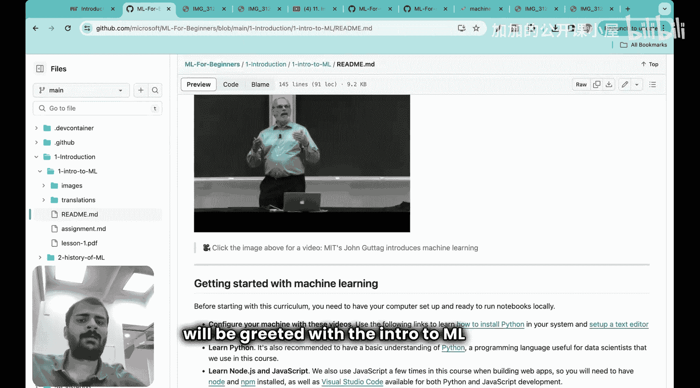
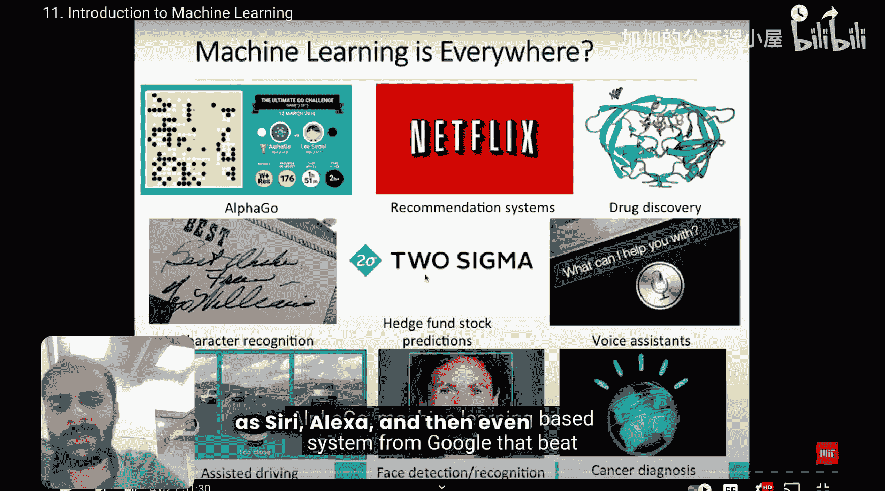
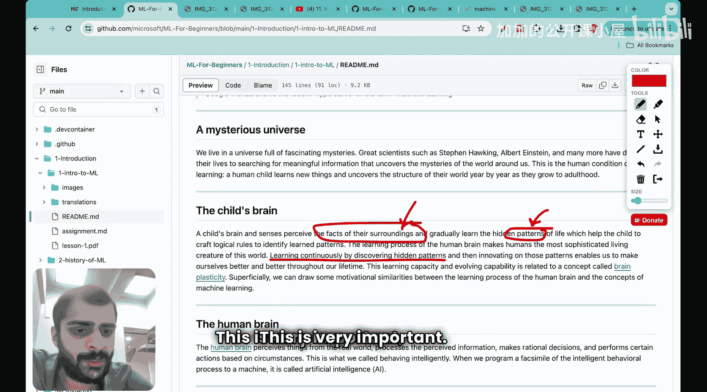

#  002：机器学习入门 🚀

在本节课中，我们将要学习机器学习的基本概念、历史背景以及它与人工智能和深度学习的区别。我们将结合MIT的理论课程与微软的实践课程内容，为你提供一个清晰、全面的入门指南。

---

## 概述

机器学习正深刻地影响着我们生活的方方面面。本节课将带你了解机器学习的定义、其无处不在的应用、当前的热潮背后的原因，并厘清机器学习、人工智能与深度学习之间的关系。

---

## 什么是机器学习？

我们首先从微软的课程开始。机器学习已经渗透到我们日常生活的每个角落。

以下是机器学习的一些关键应用领域：
*   **游戏与竞技**：例如AlphaGo和IBM的“深蓝”，它们学会了击败人类顶尖棋手。
*   **内容推荐**：Netflix、YouTube、亚马逊的“为您推荐”功能，会根据你的互动行为个性化推荐内容。
*   **医疗健康**：加速药物发现、辅助癌症诊断。
*   **消费应用**：手机助手（如Siri、Alexa）、面部识别解锁、指纹识别。
*   **金融与识别**：股市预测、医生或邮递员的字符识别。

由此可见，从你醒来接触手机的那一刻起，到教育、医疗等各个行业，机器学习都在发挥作用。

---

## 机器学习的热潮

上一节我们介绍了机器学习的广泛应用，本节中我们来看看公众对它的兴趣变化。当前围绕机器学习的炒作并非历来如此。

通过查看Google趋势数据可以发现，自2004年以来，全球对“机器学习”的搜索兴趣增长了上百倍，目前正处于历史峰值。印度在全球的兴趣排名中位列第三。这解释了为何当下学习机器学习如此重要——整个社会都高度关注这一领域。

这种热潮的根源与机器学习的发展历史密切相关。

---

## 人工智能、机器学习与深度学习

在了解历史之前，我们需要明确几个核心概念的区别。人们常常混淆人工智能、机器学习和深度学习。

我们可以从一个孩子的学习过程来理解智能的本质：我们不断从周围环境接收**输入**，并从中发现**隐藏的模式**，这些模式使我们能够做出**决策**。

基于这个类比，我们可以这样定义：
*   **人工智能**：一个广义概念，目标是让机器能够模拟人类的智能行为（如推理、学习、解决问题）。
*   **机器学习**：实现人工智能的一种主要方法。其核心是让计算机**从数据中学习规律和模式**，而无需为每个任务进行明确的编程。
    *   关键思想：`学习 = 通过数据发现模式`
*   **深度学习**：是机器学习的一个子领域，它使用被称为**神经网络**的复杂结构来学习数据中的模式，特别擅长处理图像、声音和文本等非结构化数据。

简单来说，**深度学习是机器学习的一种方法，而机器学习是实现人工智能的一条重要途径**。

---

## 机器学习简史

理解了核心概念后，我们来看看机器学习是如何发展到今天的。机器学习的发展并非一帆风顺，经历了多次“热潮”与“寒冬”。

以下是其发展的几个关键阶段：
*   **1940-50年代：思想萌芽**。沃伦·麦卡洛克和沃尔特·皮茨提出了第一个人工神经元数学模型。
*   **1950-60年代：早期乐观**。艾伦·图灵提出了“图灵测试”。1956年，“人工智能”一词在达特茅斯会议上被正式提出，人们非常乐观。
*   **1970年代：第一次AI寒冬**。由于计算能力有限、数据匮乏，早期承诺无法实现，资助大幅减少。
*   **1980年代：专家系统兴起**。基于规则的“专家系统”在商业上取得成功，但规模有限，最终再次遇冷。
*   **1990年代-2000年代：机器学习崛起**。统计学习方法（如支持向量机）成为主流。互联网兴起带来了更多数据。
*   **2010年代至今：深度学习革命**。得益于**海量数据**、强大的**GPU计算**和**算法改进**，深度学习取得突破性进展，引发了当前这一轮人工智能热潮。

所以，当前的火热并非偶然，是数据、算力和算法多年积累后共同作用的结果。

---

## 机器学习的基本流程

了解了历史背景，现在我们聚焦于机器学习本身是如何工作的。MIT的课程为我们提供了一个清晰的框架。

一个典型的机器学习项目遵循以下流程：
1.  **定义问题与收集数据**：明确你要解决什么问题，并收集相关的数据。
2.  **数据预处理**：清理数据，处理缺失值，将其转换为适合模型的格式。
3.  **选择与训练模型**：选择一个算法（模型），用大部分数据（训练集）来训练它，让模型学习数据中的模式。
    *   核心目标：找到一个函数 `f`，使得 `预测值 y ≈ f(输入数据 x)`。
4.  **评估模型**：使用未参与训练的数据（测试集）来评估模型的性能，看它是否能够很好地泛化到新数据。
5.  **调优与部署**：根据评估结果调整模型参数，优化性能，最终将模型部署到实际应用中。

---

## 核心概念：监督学习

在众多机器学习类型中，**监督学习**是最常见和基础的一种。它就像一个有老师指导的学习过程。

监督学习的关键要素包括：
*   **训练数据**：每个样本都包含一个“输入”和一个对应的“正确答案”（标签）。例如：（电子邮件内容， 垃圾邮件/非垃圾邮件）。
*   **假设函数**：模型试图学习的从输入到输出的映射关系，可以表示为一个函数 `h(x)`。
*   **损失函数**：用于衡量模型的预测值 `h(x)` 与真实标签 `y` 之间的差距。常见的损失函数包括均方误差：`Loss = (1/n) * Σ (h(x_i) - y_i)^2`。
*   **学习算法**：通过优化算法（如梯度下降）不断调整模型参数，以最小化损失函数，从而使 `h(x)` 越来越接近真实的映射关系。

---

## 总结

本节课中我们一起学习了机器学习的入门知识。我们了解到机器学习已广泛应用于游戏、推荐、医疗等领域，并正处于发展热潮之中。我们厘清了**人工智能**、**机器学习**和**深度学习**三者之间的关系。回顾历史，我们看到当前的热潮得益于数据、算力和算法的共同突破。最后，我们介绍了机器学习的基本流程，并深入探讨了最常见的**监督学习**及其核心组件：训练数据、假设函数、损失函数和学习算法。这些基础概念为我们后续的深入学习奠定了坚实的基石。