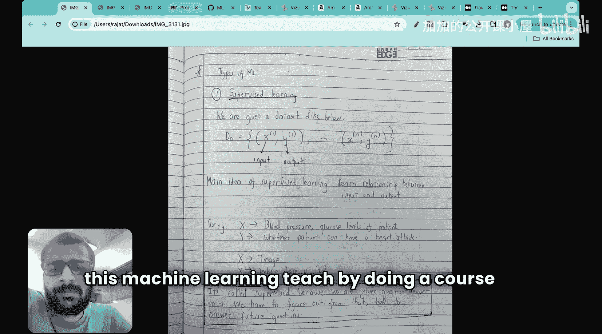
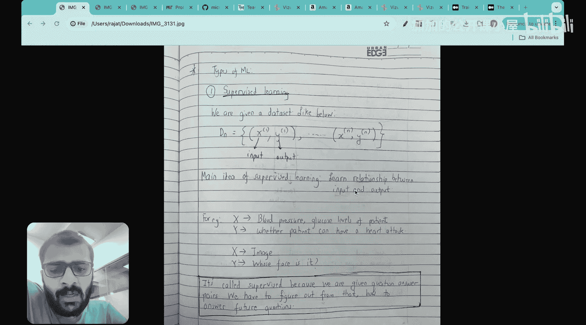
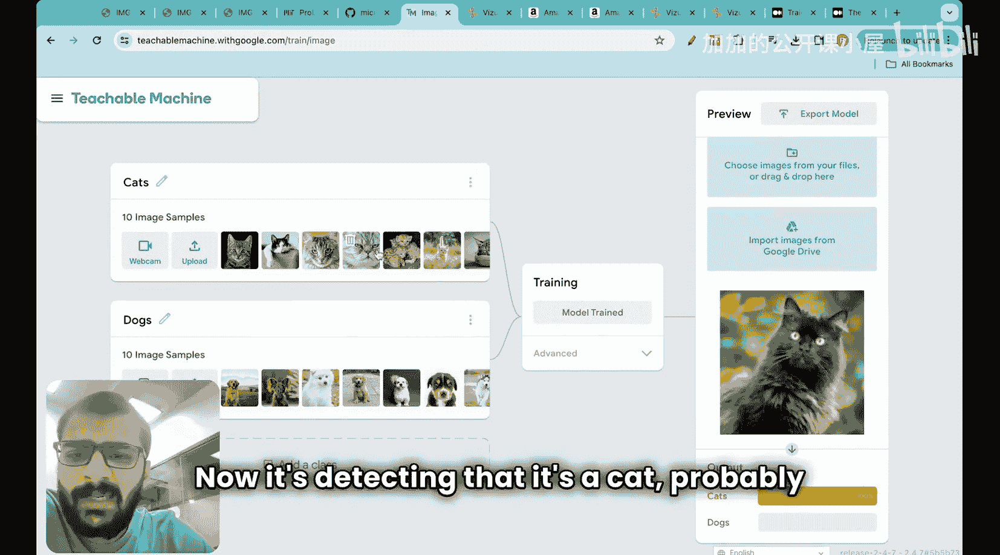

#  003：机器学习模型类型 🧠

在本节课中，我们将要学习机器学习中不同类型的模型。我们将从最核心的监督学习开始，了解其基本概念，并通过一个直观的例子来加深理解。接着，我们会简要介绍其他类型的模型，如无监督学习和强化学习，为后续学习打下基础。

上一节我们回顾了人工智能、机器学习和深度学习之间的关系。本节中，我们来看看机器学习模型有哪些主要类型。

## 监督学习

监督学习是机器学习中非常重要且应用广泛的一种模型类型。在监督学习中，我们本质上被给予一个数据集，其中 **x** 代表输入，**y** 代表输出。假设我们有 **M** 个输入-输出对。

监督学习的主要思想是学习输入 **x** 与输出 **y** 之间的关系。我们被给予这些输入-输出对。

以下是监督学习的可能示例：
*   **输入 x** 可以是患者的血压水平、血糖水平等。
*   **输出 y** 可以是患者是否有心脏病发作的概率，或在不久的将来是否会心脏病发作。

另一个例子是：
*   **输入 x** 可以是一张图像。
*   **输出 y** 可以是“这是谁的脸”。

它之所以被称为“监督”学习，是因为我们被给予了“问题”和“答案”对。我们拥有一组数据，我们知道问题（即 **x**）和答案（即 **y**）。例如，如果问题是血压、血糖水平（输入），答案就是哪些患者可能心脏病发作。

真正的挑战在于，基于这些数据，我们必须找出如何回答未来的问题。假设数据集包含50名患者及其是否心脏病发作的信息（例如，25名患者答案为“是”，25名为“否”）。我们计划回答的真正问题是：假设一名新患者前来就诊，我测量了他们的血压、血糖水平等，我能否预测这名患者是否会心脏病发作？这就是监督学习设置下机器学习的主要任务。

为了更直观地理解监督学习，我们可以通过一个实践演示来观察。以下是一个使用“可教机器”网站进行的图像分类项目示例，它完美诠释了监督学习：

1.  **项目目标**：让计算机学会区分猫和狗的图片。
2.  **准备数据**：上传10张猫的图片作为一类输入，并告诉计算机这些图片的“答案”是“猫”。上传10张狗的图片作为另一类输入，并告诉计算机这些图片的“答案”是“狗”。
3.  **训练模型**：基于这些输入-输出对（图片及其对应标签），让机器学习模型进行训练，学习区分猫和狗的特征模式。
4.  **测试模型**：上传一张全新的、训练时未见过的猫或狗图片。
5.  **观察结果**：训练好的模型能够以很高的准确率（例如100%）预测新图片是“猫”还是“狗”。

这个例子展示了监督学习的核心：模型通过学习已知的“问题-答案”对，掌握了内在规律，从而能够对新的、未知的“问题”给出预测“答案”。模型可能自动识别了诸如猫有尖耳朵、较长胡须等特征。

## 其他类型的机器学习模型

在深入探讨了监督学习之后，我们简要了解一下其他主要的机器学习模型类型。以下是机器学习的主要分类：

*   **监督学习**：如上所述，模型从带有标签的训练数据中学习。
*   **无监督学习**：模型在没有标签的数据中寻找隐藏的结构或模式。例如，对客户进行分组（聚类）。
*   **强化学习**：模型通过与环境互动并接收奖励或惩罚来学习如何采取行动以实现目标。例如，训练一个玩游戏的AI。

本节课中我们一起学习了机器学习模型的几种主要类型，并重点通过一个图像分类的例子深入理解了监督学习的工作原理。我们了解到，监督学习通过已知的输入-输出对来训练模型，使其能够对未来新的输入做出预测。理解这些基础模型类型是构建更复杂机器学习应用的第一步。