#  004：任何机器学习项目的六个步骤 🧠

在本节课中，我们将学习任何机器学习项目都通用的六个核心步骤。我们将通过一个简单的学生成绩预测例子，来具体理解每一步的含义和操作。

在上一讲中，我们介绍了三种主要的机器学习模型：监督学习、无监督学习和强化学习。本节中，我们来看看如何将一个实际的机器学习项目分解为可执行的步骤。

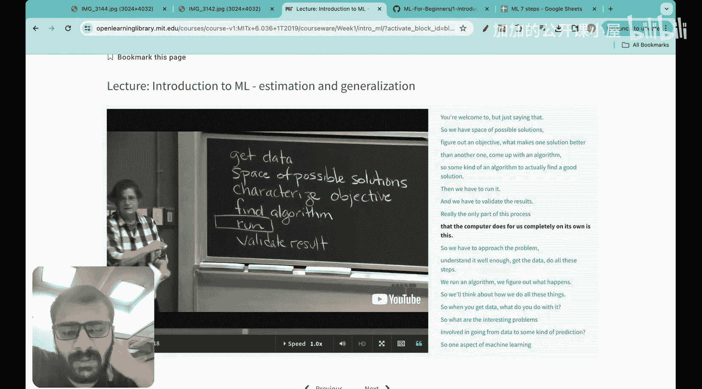

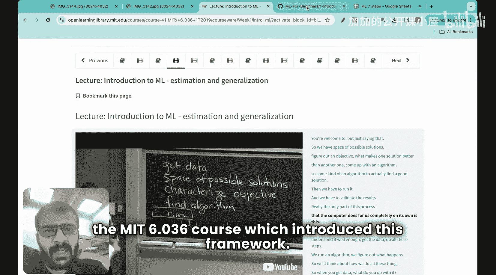

根据对数十个真实世界项目的观察，我发现任何机器学习项目本质上都遵循以下六个步骤。这个框架主要参考了MIT 6.036课程的内容。

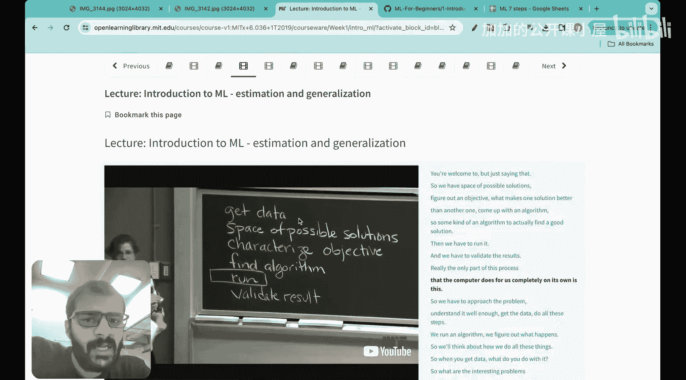

以下是构成任何机器学习项目的六个主要步骤：

1.  **获取数据**
2.  **构思可能的解决方案空间**
3.  **定义“好”解决方案的标准**
4.  **寻找算法**
5.  **运行算法**
6.  **验证结果**

在这六个步骤中，除了第五步“运行算法”是由机器完成的，其余所有步骤都需要由人来完成。学习本系列课程的目标，就是让你最终能够独立完成所有这些步骤。

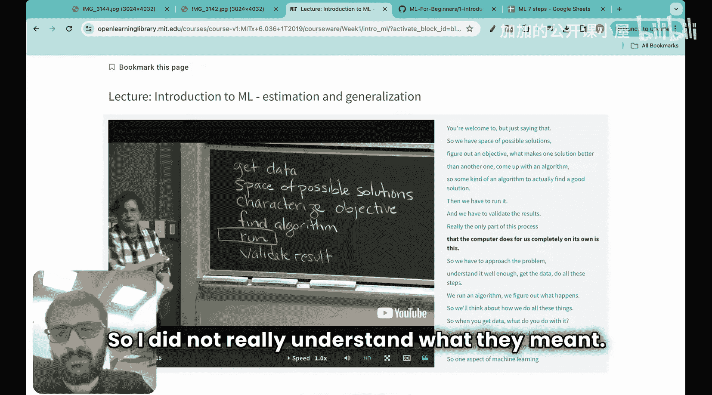

起初，这些步骤的概念可能有些抽象。为了更清晰地理解，我通常会边学习边做笔记。这也是我贯穿本系列的建议：观看视频时，请同步记笔记，这有助于理清概念。

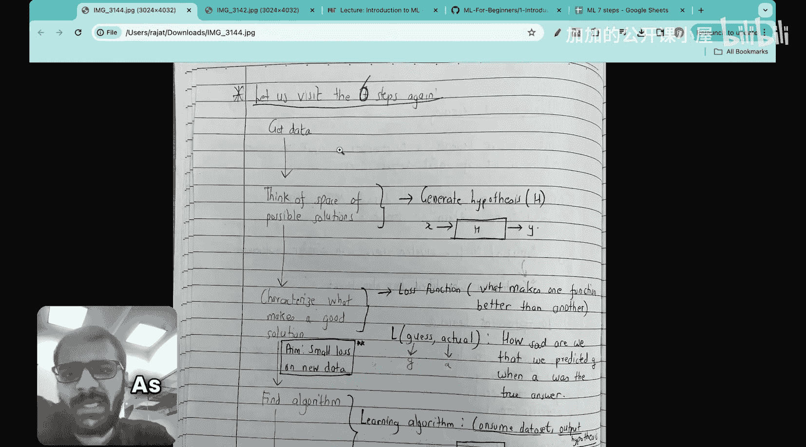

让我们再次审视这六个步骤，并用更具体的术语来理解：
*   **第一步：获取数据**。
*   **第二步：构思可能的解决方案空间**。这也可以理解为**生成假设**。假设输入是 `x`，输出是 `y`，我们需要找到 `x` 和 `y` 之间的关系。
*   **第三步：定义“好”解决方案的标准**。这里我们需要确定，是什么让一个假设比另一个假设更好。
*   **第四步：寻找算法**。我们需要选定学习算法，或者说最终确定我们的假设。
*   **第五步：运行算法**。
*   **第六步：验证结果**。

为了让大家更好地理解，我构建了一个简单的实践案例，并使用Excel表格来演示，以便于大家跟随这六个步骤。

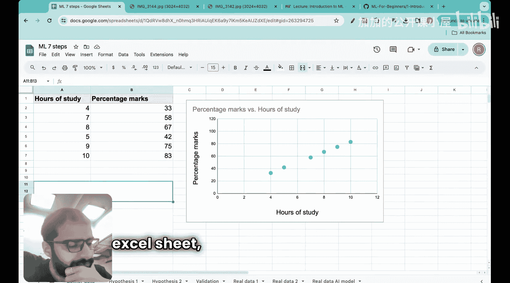

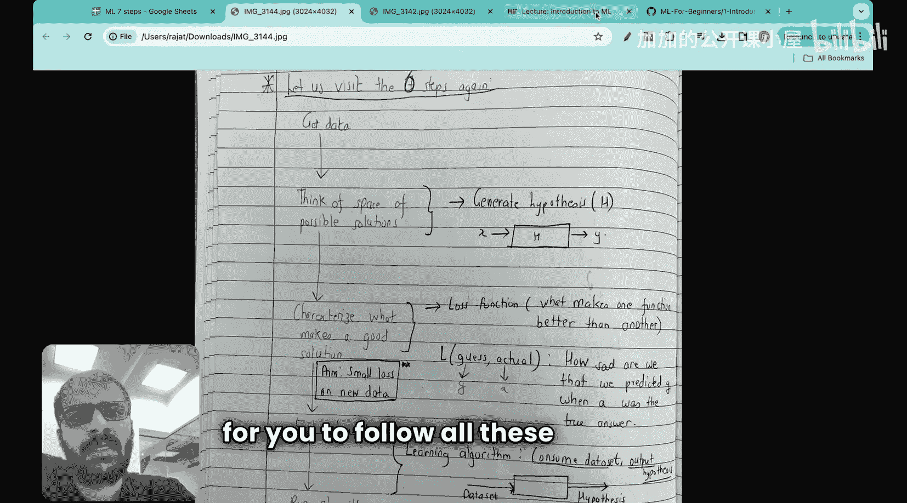

让我们来看一个简单的问题。假设你被委派了这样一个任务：你访问了一所学校，学校希望你能够根据学生的学习小时数，来预测学生的考试分数百分比。

记住，上一讲我们提到机器学习处理的是预测和泛化。这正是此类问题：你获得了一些历史学生数据（学习时长和对应分数），你的任务是为一个新学生（给定其学习时长）预测其分数。你被要求使用机器学习来解决这个问题。

作为一个初学者，让我们遵循这六个步骤。第一步是收集数据。你向学校索要数据，因为对于机器学习来说，没有数据就无从谈起，正如我们需要食物才能生存一样。

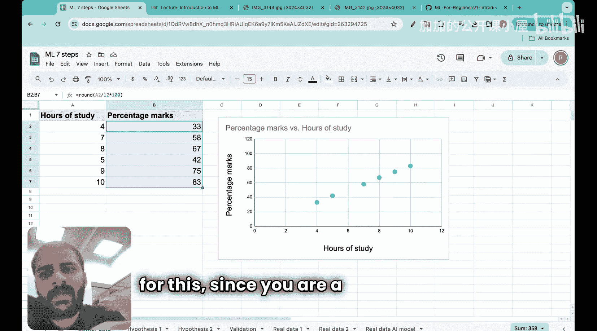

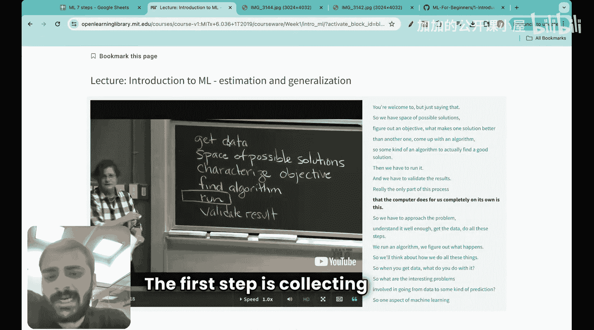

学校答复说，他们有6名学生的数据，包括学习小时数和获得的分数百分比。当你将这些数据绘制在图表上时，X轴代表学习小时数，Y轴代表分数百分比。

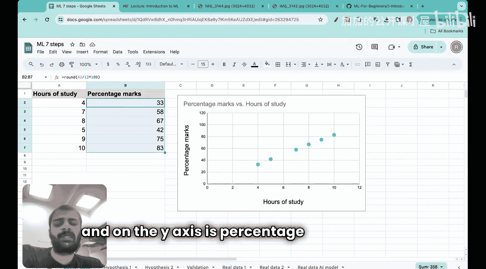

很好，现在进入下一步。第二步是构思可能的解决方案空间。作为一名机器学习工程师，你现在需要找到输入（学习小时数）和输出（分数百分比）之间的关系。这时你就会思考可能的解决方案空间，也就是生成假设。

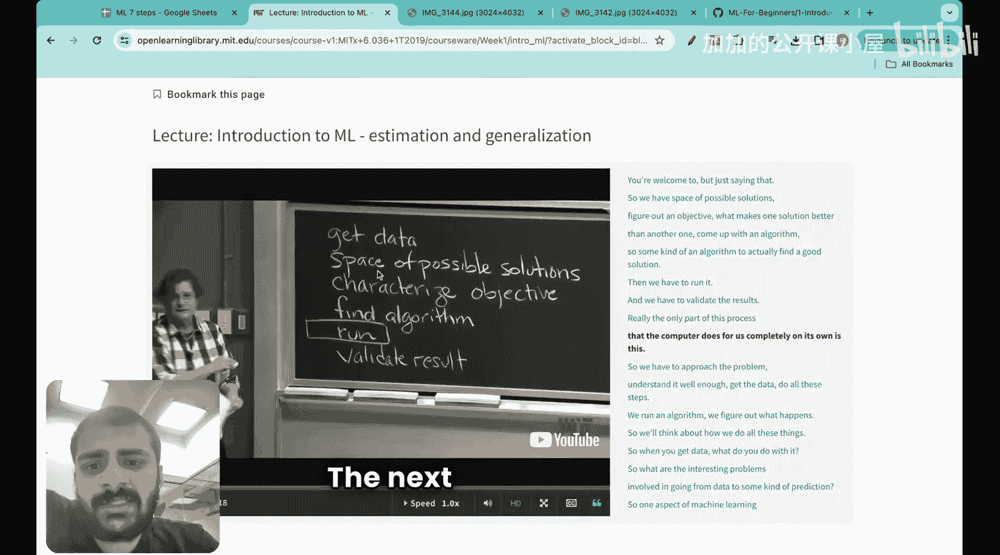

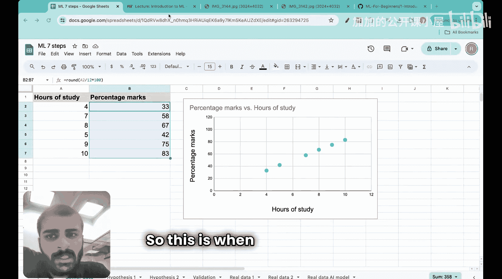

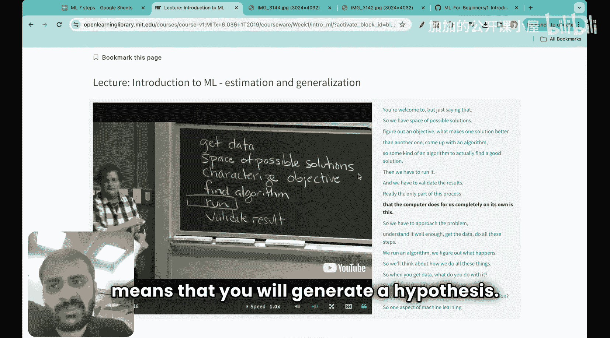

让我们生成两个假设：
*   **第一个假设**：输入和输出之间存在**直线**关系。
*   **第二个假设**：输入和输出之间存在**曲线**关系。

作为一名ML工程师，你想出了这两个假设。这就是第二步的含义：构思可能的解决方案空间，即思考输入 `x` 和输出 `y` 之间可能的关系（假设）。目前我们已经想到了两个假设。

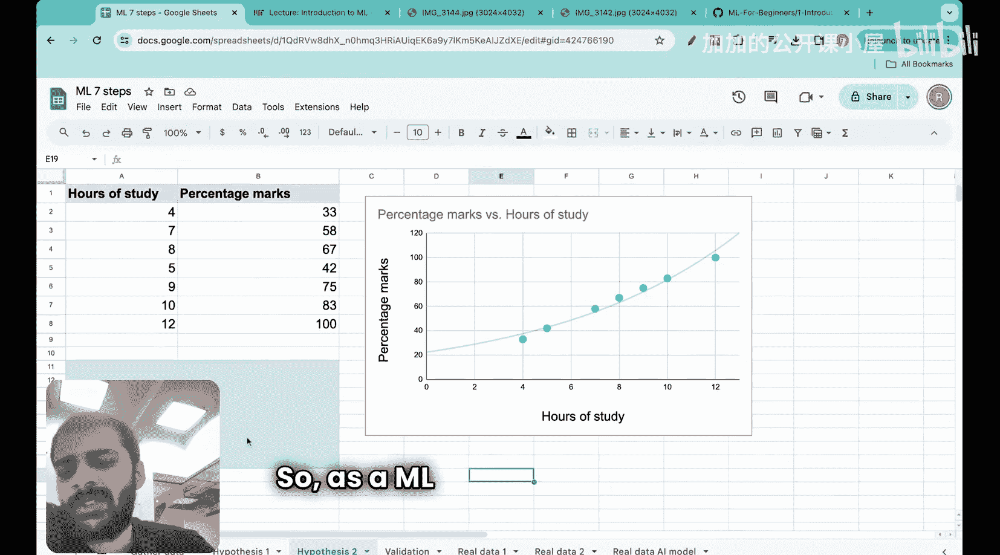

现在，让我们进入至关重要的第三步：定义什么是“好”的解决方案。我们如何决定哪个假设更好？是第一个直线假设好，还是第二个曲线假设好？我们需要一个量化的指标来进行比较。

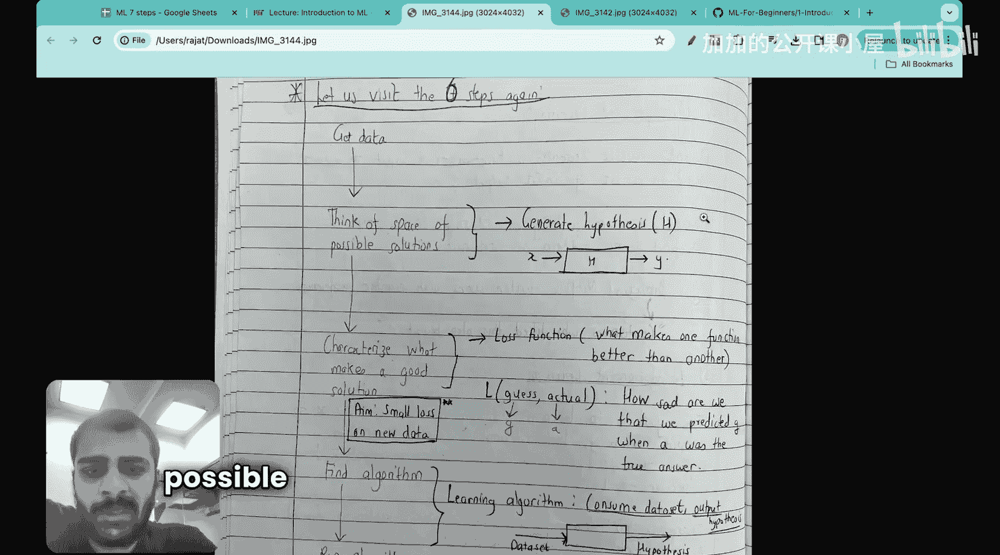

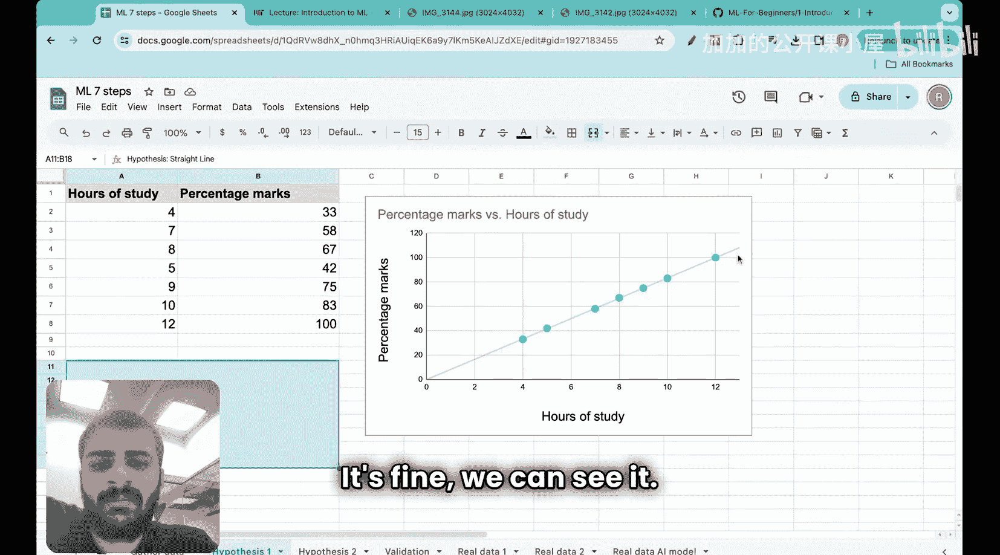

这时，**损失函数**就登场了。损失函数本质上是我们的**预测值**与**实际数据值**之间的差异。通俗地说，它衡量的是：当实际值是 `A` 时，我们预测了某个猜测值 `G`，我们对此有多“不满意”。就是这样。所以，损失函数就是你的猜测与实际值之间的差值。

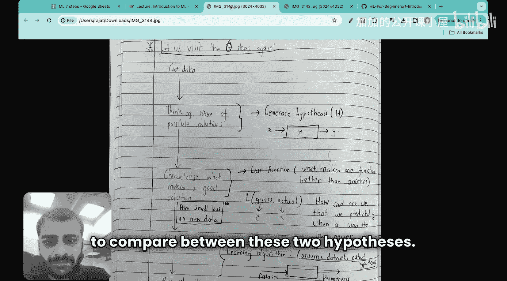

本节课中，我们一起学习了构成任何机器学习项目的六个核心步骤：获取数据、构思假设、定义评估标准、选择算法、运行算法和验证结果。我们通过一个学生成绩预测的简单例子，初步理解了前三个步骤，特别是损失函数的概念。在接下来的课程中，我们将继续用这个例子，深入探讨如何应用这些步骤来构建一个完整的机器学习模型。