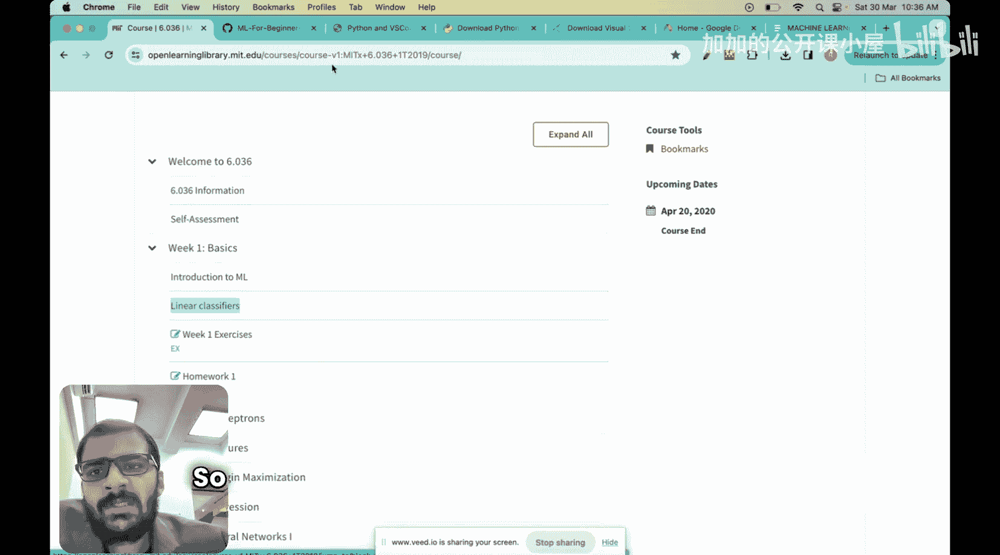
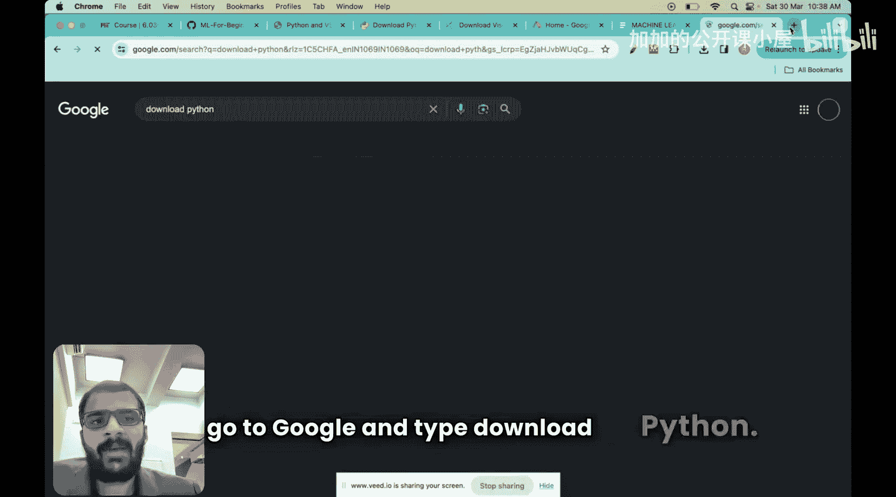
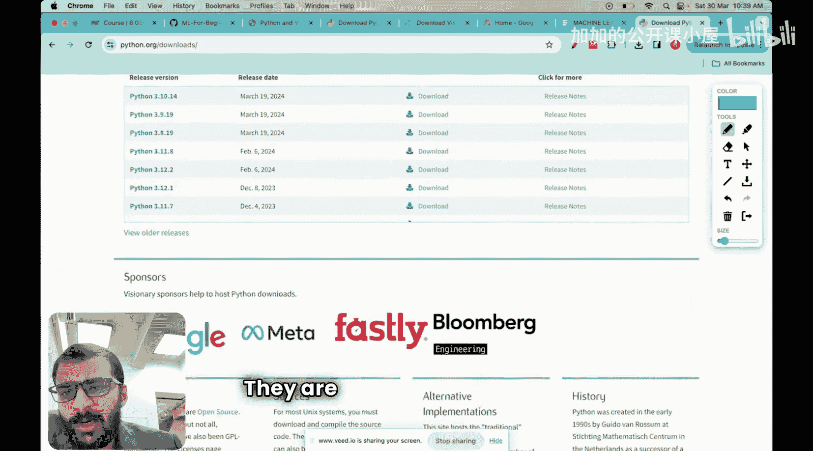

#  005：安装Python并运行你的第一个代码！🚀

在本节课中，我们将学习Python编程语言，并完成Python和VS Code编辑器的安装。你将亲手执行你的第一段Python代码。

上一节我们介绍了机器学习项目的六个步骤。本节中，我们来看看如何为这些步骤准备核心工具——Python。

## 什么是Python？🐍

Python是一种流行的编程语言，以其简单性和可读性而闻名。它被广泛应用于机器学习、人工智能等多个领域。

可以将Python视为所有机器学习工程师都应掌握的工具。如果没有Python，机器学习的研究进展将会显著放缓。Python使得工程师和学生能够轻松地在自己的电脑上运行机器学习算法。

我们之前看到的机器学习六个步骤，正是在Python环境中运行和执行的。因此，许多课程都非常重视Python。

## 为什么Python在机器学习中如此流行？✨

Python之所以在机器学习领域广受欢迎，主要有以下四个原因：

以下是四个关键原因：

1.  **简单易学**：Python代码易于理解和编写。对于没有编程背景的工程师来说，用Python写代码比用C或C++简单得多。
2.  **丰富的库**：大量研究人员和学生为机器学习和人工智能构建了现成的库。例如，训练一个语言模型时，无需从头编写所有代码，可以直接使用Python中预写的库。核心代码示例如下：
    ```python
    # 例如，使用scikit-learn库训练一个简单模型
    from sklearn.linear_model import LinearRegression
    model = LinearRegression()
    model.fit(X_train, y_train)
    ```
3.  **开源免费**：Python可以完全免费下载、安装和使用，没有入门门槛。
4.  **强大的社区支持**：有数百万用户每天都在使用Python。如果你在互联网上提出疑问，几乎总能得到解答。

## 如何安装Python？💻

现在，让我们开始动手安装Python。这个过程非常简单快捷，大约只需15到20分钟。

1.  **访问下载页面**：打开浏览器，在搜索引擎中输入“download Python”，或直接访问Python官方网站。页面会根据你的操作系统（如Windows、Mac）显示相应的下载选项。
2.  **选择版本**：请务必下载**最新版本**的Python。不要下载Python 2，因为它是非常旧的版本。点击对应的下载按钮。
3.  **运行安装程序**：下载完成后，在你的“下载”文件夹中找到安装文件（如`.exe`文件或`.pkg`文件）。双击运行它。
4.  **遵循安装向导**：在安装过程中，请勾选“Add Python to PATH”选项（这对于在命令行中直接使用Python很重要），然后按照屏幕提示点击“Next”或“Install”完成安装。

## 安装代码编辑器：VS Code📝

仅仅安装Python还不够，我们还需要一个文本编辑器来编写代码。VS Code是一个功能强大且流行的选择。

上一部分我们安装了Python解释器，它负责执行代码。本节中，我们来看看代码编辑器的作用及其与解释器的区别。

编辑器是你编写和修改代码的工具，而解释器（Python）是读取并运行这些代码的程序。VS Code等编辑器提供了语法高亮、代码提示等功能，让编程更高效。



1.  **访问VS Code官网**：在浏览器中搜索“Visual Studio Code”并进入官网。
2.  **下载安装包**：选择对应你操作系统的版本进行下载。
3.  **安装VS Code**：运行下载的安装程序，并遵循提示完成安装。

## 运行你的第一个Python代码🎉

我的编程哲学很简单：不要一开始就试图理解所有细节。先运行一个能工作的代码，看到输出结果，这会给你带来继续学习的巨大动力。之后，你再回头理解代码是如何编写的。

最好的学习方式就是先动手实践，直接运行你的第一段代码，然后再研究代码的构成。

现在，让我们来运行第一段Python代码。

1.  **打开VS Code**：启动刚刚安装的VS Code。
2.  **新建Python文件**：点击“File” -> “New File”，然后保存文件，命名为 `hello.py`（确保文件扩展名为 `.py`）。
3.  **编写代码**：在文件中输入以下代码：
    ```python
    print("Hello, Machine Learning!")
    ```
    这行代码使用了 **`print()`** 函数，它的作用是将括号内的内容输出到屏幕上。
4.  **运行代码**：
    *   在VS Code中，你可以点击右上角的“运行”三角按钮。
    *   或者，打开终端（命令行），导航到你的文件所在目录，然后输入命令：`python hello.py`



如果一切顺利，你将在终端或输出窗口中看到：`Hello, Machine Learning!`

## 总结📚



本节课中，我们一起学习了Python的基础知识及其在机器学习中的重要性。我们完成了Python解释器和VS Code编辑器的安装，并成功运行了第一个Python程序。

记住，学习编程的关键是勇于实践。如果在安装或运行代码过程中遇到任何问题，请随时在评论区留言，我们会尽快为你解答。

现在，你已经拥有了开始机器学习实践之旅的核心工具。在接下来的课程中，当我们学习回归、分类等算法时，你将能直接上手操作。准备好了吗？让我们继续前进！