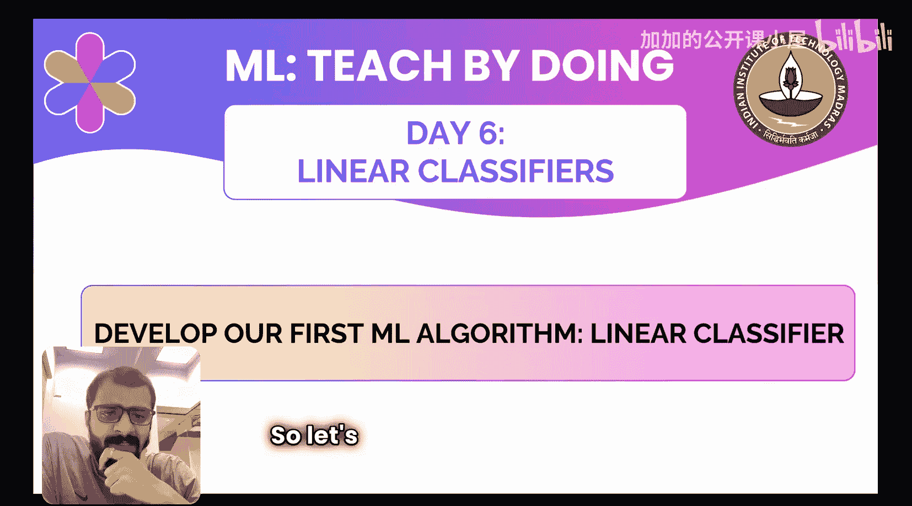
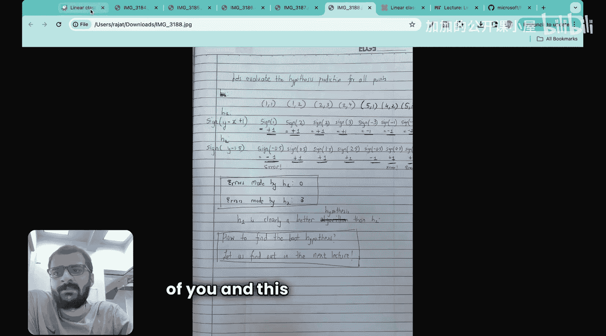
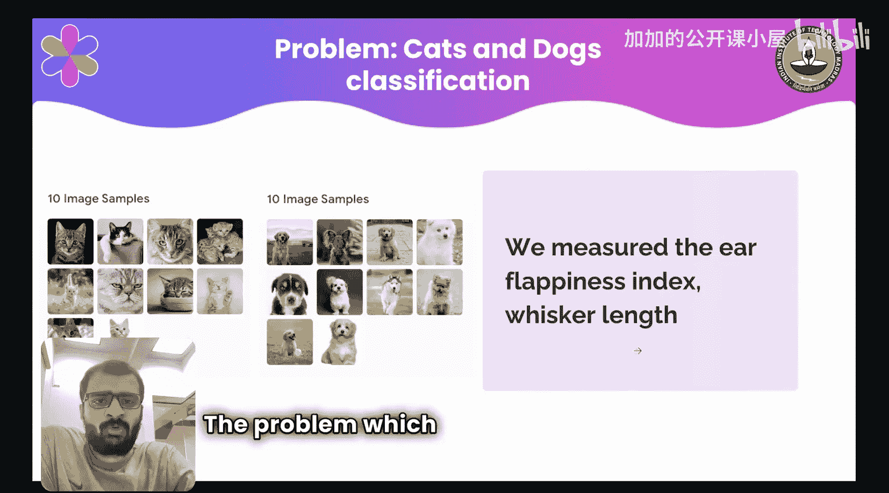
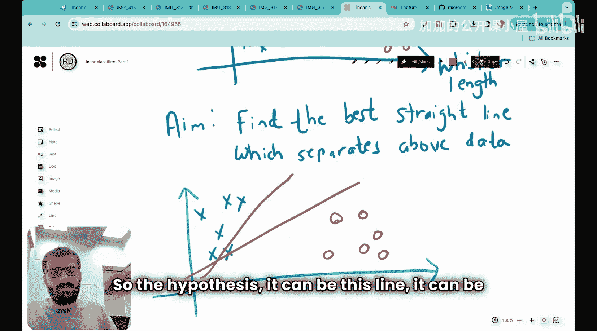

#  006：线性分类器（第一部分） 🧠

在本节课中，我们将要学习并动手开发我们的第一个机器学习算法——线性分类器。我们将从一个具体的“猫狗分类”问题出发，逐步理解其背后的理论、数学公式以及构建思路。本节课将重点介绍机器学习项目六步法中的前两步：数据收集与假设空间生成。

在之前的五节课中，我们涵盖了多种内容，包括机器学习模型的类型、Python环境安装、运行第一个机器学习代码以及任何机器学习项目的六个步骤。如果你还没有观看之前的课程，请先学习它们，然后再回到本节课。

今天是一个非常有趣的主题。我们将开发我们的第一个机器学习算法。这是一节关于线性分类器的课程。我计划用两节课来讲解，今天是第一部分。我也会在大家面前写下许多内容，请准备好纸笔，这将极大地帮助你理解。让我们开始吧。

在开始之前，我想说明，我为今天的课程准备了四页手写笔记和演示文稿PDF，这些资料都会在视频的信息区提供给大家。

所以，让我们开始今天有趣的课程，我们将开发第一个机器学习算法——线性分类器。

## 问题定义：猫狗分类 🐱🐶

我们将要解决的问题是猫和狗的分类。记得在之前的一节课中，我们看过Teachable Machine界面，在那里我们进行了两类图像的分类：一类是猫，另一类是狗。我们上传了10张猫的图片和10张狗的图片，然后运行了AI模型。今天，我们将开发自己的AI模型，使其能够区分猫和狗。

我们将深入探讨一些理论和实践。另外我想分享的是，如果你去看微软的课程，他们讲解分类的方式是直接使用Python和项目，但没有提及分类的理论或背后的数学原理。而在今天的课程中，我们将遵循MIT课程的方法，深入探讨线性分类背后的理论和数学理解。

本系列课程的目标之一不仅是做实践项目，还要向你介绍机器学习的基础。我们当然也会做实际的分类项目，但最初大家确实需要理解理论。因此，这第一节课以及明天的课程将侧重于分类理论，之后我们会通过Python项目进行实践演示。

我们面临的问题是必须区分猫和狗。还有一点，我们基于所有这些图像测量了两个属性：我们测量了胡须长度，也测量了耳朵下垂指数。我们知道狗的耳朵是下垂的，所以我们构建了一个名为“耳朵下垂指数”的指标；我们也知道猫的胡须更长，所以我们测量了另一个指标“胡须长度”。

现在，你的任务是基于这两个测量值构建一个线性分类器。这样，如果我给你任何其他新动物，你再次测量这两个指标——耳朵下垂指数和胡须长度——你的模型应该能够预测它是一只猫还是一只狗。

我希望每个人都理解了这个问题。想象一下，你有10只猫和10只狗，并且你已经测量了所有这些动物的耳朵下垂指数和胡须长度，这就是你的训练数据。问题是构建一个线性分类器模型，该模型可以对任何新动物进行分类。假设现在我给了你另一只新动物，你测量了它的下垂指数和胡须长度，基于训练数据，你的工作是对新动物进行分类。

输入是这两个测量值，输出是分类结果：是猫还是狗。很好，我希望每个人都理解了这个问题。

## 回顾：机器学习六步法 📋

现在，每当有人给你任何像这样的机器学习项目时，你的第一反应应该是回到任何机器学习项目的六个步骤。

我想在本系列的第三天，我们学习了任何机器学习项目的六个步骤。我们看到这六个步骤是：1. 收集数据，2. 生成假设空间，3. 定义损失函数，4. 寻找算法，5. 运行算法，6. 验证结果。

在今天的课程中，我们将重点看第一步和第二步，并稍微涉及第三步。在明天的课程中，我们将看第四、第五和第六步。

好的，你被分配了这个项目，并且你有任何机器学习项目的六个步骤。让我们从第一步开始，收集数据。

## 第一步：收集数据 📊

现在，我将在这个白板上为大家书写。

我们的当前任务是生成线性分类器，或者说找到最佳的可能算法。

正如我提到的，我们看了第一步。第一步是收集数据。

现在让我们看看数据。我将在这里绘制数据。数据看起来像这样。这是y轴，这是x轴。X轴标签是胡须长度。Y轴标签是耳朵下垂指数。

好的，第一个数据点是狗的。狗通常有下垂的耳朵和较短的胡须长度，所以所有的数据点都分布在这里。这是我们收集的数据，这是狗的数据。

对于猫，所有的数据点都分布在这里。猫通常有较低的耳朵下垂指数，并且它们的胡须长度通常更长。所以这是猫的数据，分布在这里。

现在，我们的目标。让我切换回蓝色。我们的目标是找到最佳的线性分类器。当我们说找到最佳的线性分类器时，我们的目标是找到最佳的分隔线。

这条线将上述数据分隔开。这就是我们的目标。进一步的目标是，每当有人给我们一个新的数据点时，假设有人给了我们一个新的数据点，它位于这里的某个位置。基于那条直线，我们应该能够分类它是猫还是狗。这就是目标。

## 第二步：生成假设空间 🧩

如果我们进入第二步，我们必须生成一个假设空间。

由于我们正在构建一个线性分类器，假设空间将是所有可能的直线的集合。

让我再次画出上面的图。这是狗的数据。这是猫的数据。

好的，现在假设空间是所有可能存在的直线。让我们看看，假设空间在视觉上可能看起来像这样。

让我用橙色表示。所以假设可以是这条线，可以是那条线，可以是这条线，可以是那条线，可以是这个，可以是那个。

---

本节课中我们一起学习了线性分类器问题的定义，回顾了机器学习项目的六步法，并详细探讨了前两步：数据收集与假设空间生成。我们通过一个具体的猫狗分类例子，理解了如何将实际问题转化为数据点，并认识到线性分类器的核心任务是找到一条最佳直线来分隔不同类别的数据。在下一节课中，我们将继续探讨如何定义损失函数并寻找最优的算法。