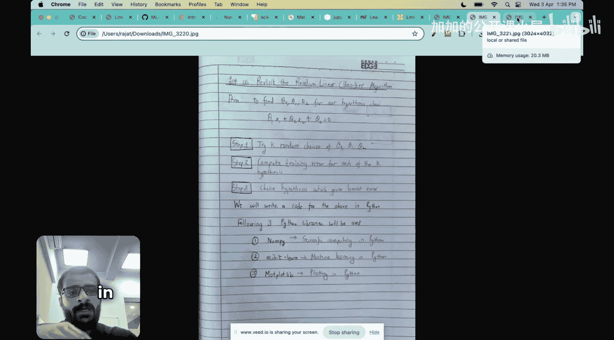
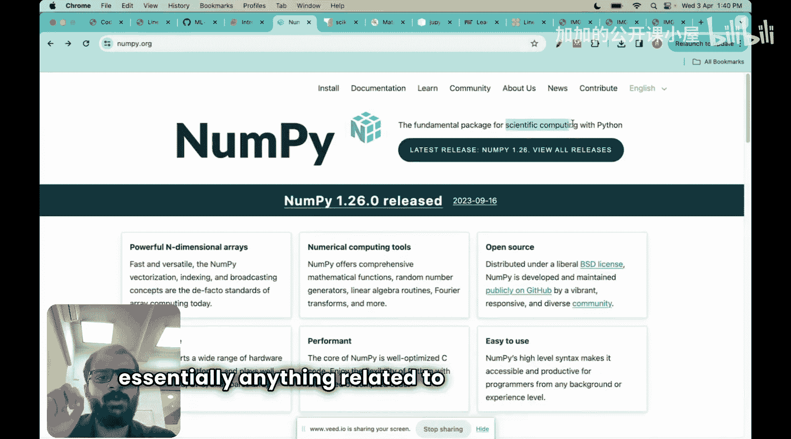
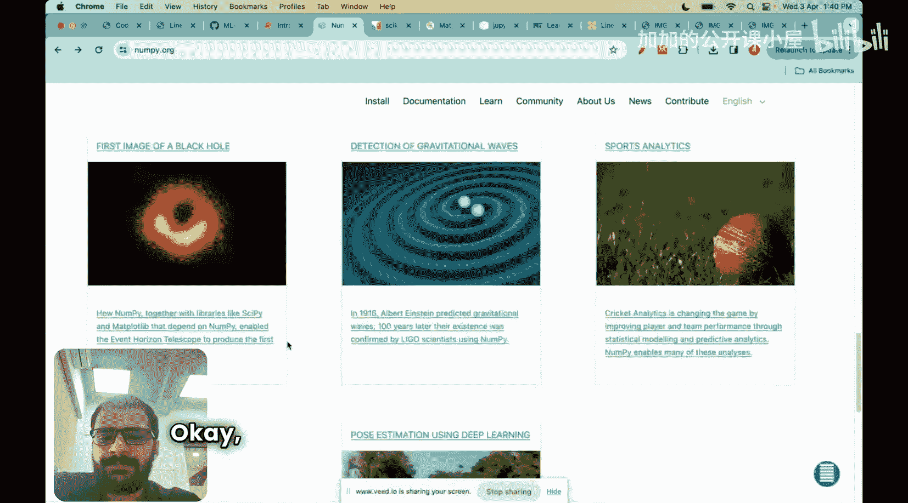
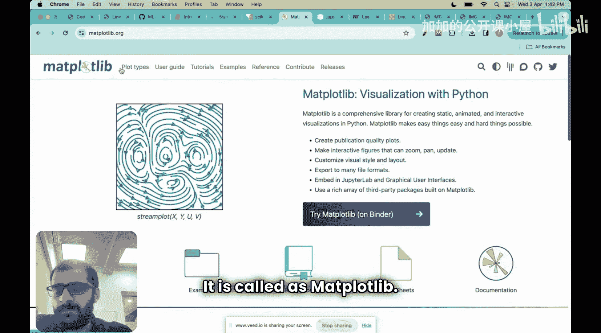

#  008：Jupyter Notebooks、NumPy、Scikit-Learn与Matplotlib入门

在本节课中，我们将开始动手实践，学习如何在Python中实现线性分类器。我们将从理论转向代码，通过一个完整的项目来巩固前两节课学到的知识。本节课是实践部分的第一部分，我们将重点介绍开发环境和核心工具。

在上一节课中，我们探讨了线性分类器，并开发了第一个机器学习算法——随机线性分类算法。我们按照六个步骤执行了该算法：收集数据、生成线性假设类、定义损失函数、寻找算法、运行算法以及验证结果。

本节课中，我们将用Python代码完整地实现这六个步骤。通过从头开始编写代码，你将获得对之前所学理论的实际动手经验。本课程旨在理论与实践相结合，前两节课侧重于理论，而本节课将深入实践层面。

为了顺利进行编码，我们需要配置合适的开发环境并了解一些强大的Python库。因此，本节课的第一部分将专注于介绍Jupyter Notebook和三个关键的Python库：NumPy、Scikit-Learn和Matplotlib。我们将学习如何将它们集成到VS Code环境中。

## Jupyter Notebook简介 📓

首先，我们来了解Jupyter Notebook。根据官方文档，Jupyter Notebook是进行交互式计算和沟通的社区标准工具。

我认为Jupyter Notebook在沟通方面表现卓越。如果仅在VS Code中编写代码，很难与他人有效沟通，因为将代码与标题、描述等内容整合起来相当困难。

Jupyter Notebook文档允许你混合文本、数学公式、图像、视频和代码。这使得解释和演示代码变得非常容易。总体而言，它是一个出色的沟通工具。

因此，我将通过Jupyter Notebook展示代码，这样能更清晰地展示每一行代码是如何工作的。这也是全球许多工程师、学生和教师（包括我自己）喜欢使用Jupyter Notebook进行机器学习教学和初始脚本编写的原因。

## 三大核心Python库 🧰

在介绍如何集成Jupyter Notebook之前，让我们先认识三个强大的Python库，它们构成了科学计算和机器学习的基础。

### 1. NumPy

第一个库是NumPy。访问 `numpy.org` 可以找到其官方网站。NumPy是Python科学计算的基础包。

NumPy允许我们定义和操作数组及矩阵。它提供了许多用于线性代数和其他机器学习框架的计算工具。这个库是完全开源的。

使用NumPy时，你首先需要告诉Python编辑器加载这个包。之后，你可以轻松地执行各种数组操作，例如创建二维数组、设置特定元素或按行查找最大值。NumPy使得定义数组和执行数学运算变得非常简单。

它在数据科学、机器学习和可视化领域有广泛的应用。实际上，它已成为科学计算中默认的数组操作包。

### 2. Scikit-Learn

第二个极其强大的包是Scikit-Learn，这是一个专门用于Python机器学习的库。

Scikit-Learn提供了大量开箱即用的函数，可以直接用于分类、回归、聚类等任务。这些库的目的是让他人预先编写好代码，这样当你想执行一个著名的机器学习算法时，无需从头编写所有代码，只需调用该库提供的函数即可。

Scikit-Learn本身构建在NumPy之上。无论是简单项目还是复杂项目，Scikit-Learn都是执行机器学习任务时最常使用的库。

### 3. Matplotlib

第三个要介绍的包是绘图库，名为Matplotlib。

例如，当你运行一个Python脚本并希望生成图表进行可视化时，Matplotlib就是你的工具。它是一个用于创建静态、动态和交互式可视化的综合库。

## 环境配置与安装 ⚙️

介绍完这些库和Jupyter Notebook后，我们将在VS Code环境中安装它们，以便我们的Python安装能够配置好这些库和Jupyter Notebook环境。

以下是配置步骤的简要概述：
1.  确保已安装Python和VS Code。
2.  在VS Code中安装Jupyter扩展。
3.  使用Python的包管理工具`pip`安装NumPy、Scikit-Learn和Matplotlib。

具体的安装和集成步骤将在下一部分详细演示。通过正确配置，你将拥有一个强大的开发环境，可以高效地编写、运行和可视化机器学习代码。

## 总结 📝

本节课中，我们一起学习了实践机器学习编码的准备工作。我们首先了解了Jupyter Notebook，这是一个强大的工具，能够混合代码、文本和可视化内容，极大地便利了代码的编写、演示和沟通。

接着，我们介绍了三个核心的Python库：用于高效数组运算和科学计算的**NumPy**，提供了丰富机器学习算法的**Scikit-Learn**，以及用于数据可视化的**Matplotlib**。这些库构成了Python机器学习生态系统的基石。

在下一部分，我们将动手配置这些工具，并开始编写我们的第一个线性分类器代码。你将看到如何将这些理论概念转化为实际运行的Python程序。