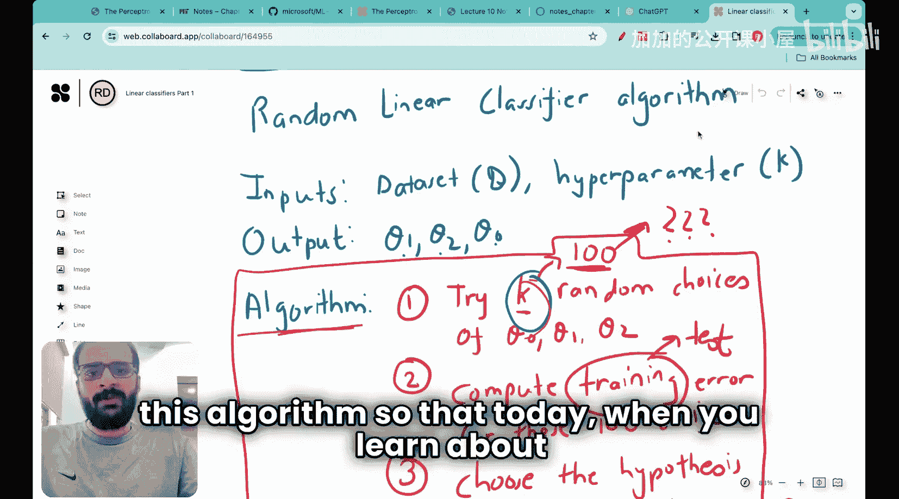
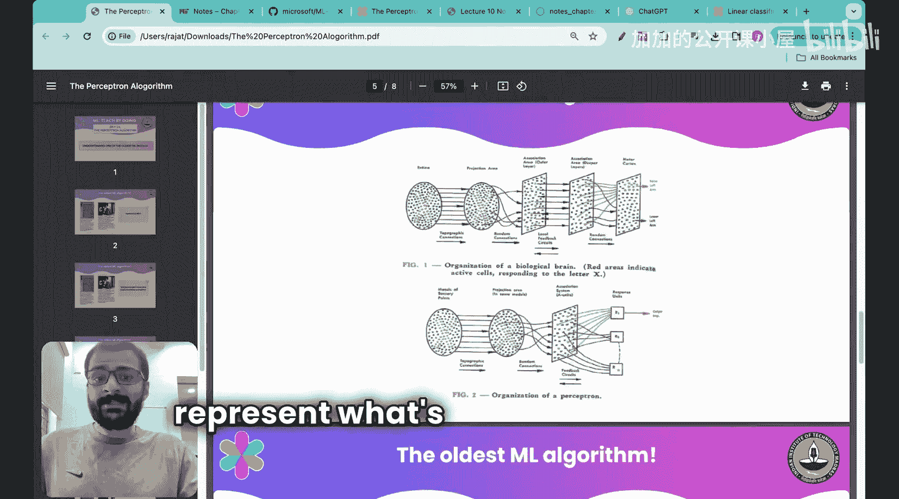
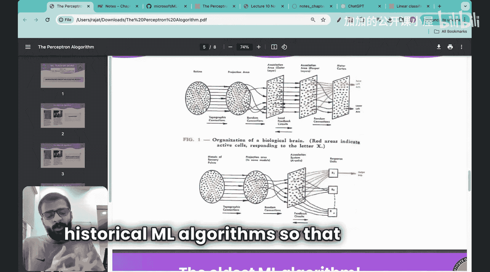
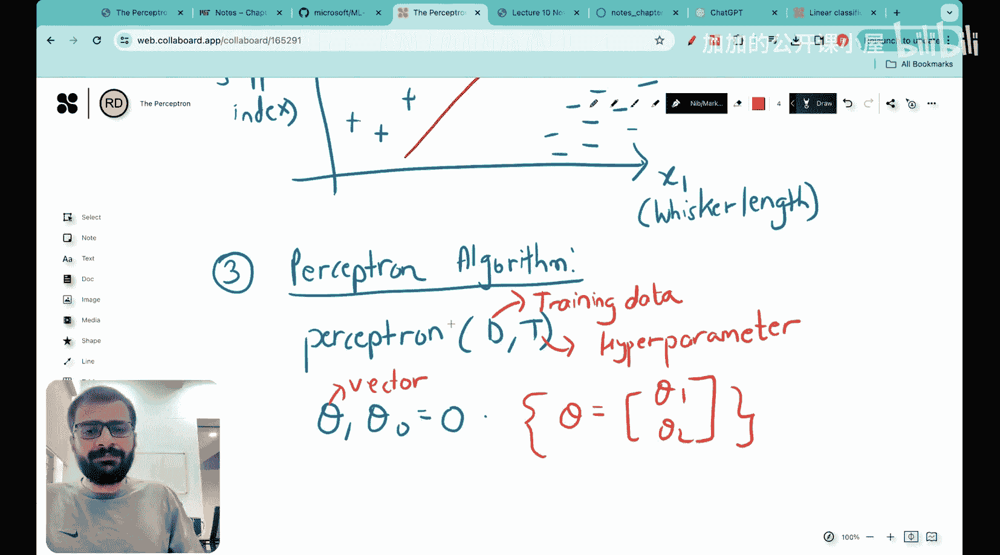

#  010：感知机算法详解 🧠

在本节课中，我们将要学习最古老的机器学习模型之一——感知机算法。该算法于1957年提出，是理解现代机器学习发展的重要基石。我们将从零开始，通过白板演示的方式，完整地理解其原理和实现步骤。

上一节我们介绍了随机线性分类器，本节中我们来看看一个更“聪明”的算法——感知机算法。

## 感知机的历史背景

感知机算法不仅是模型，也曾被实现为物理机器。下图展示了名为Mark1的感知机机器，它是该算法的首次硬件实现。

这台机器的核心目标是模仿人脑处理视觉信息并从中学习的方式。在当时，神经网络和人工智能的概念尚未成型，感知机的提出为“机器学习算法可以模拟人脑”这一想法奠定了基础。

感知机是最早能够从错误中学习的模型之一，这本身就是机器学习的关键思想。它的主要应用是识别形状、图案、字母和数字。

## 问题定义

我们使用与之前构建随机线性分类器时相同的问题。假设我们收集了一批猫和狗的数据，测量两个特征：
*   **X1**：胡须长度（x轴）
*   **X2**：耳朵下垂指数（y轴）

狗的数据点通常具有较高的耳朵下垂指数和较低的胡须长度。猫的数据点则相反，具有较高的胡须长度和较低的耳朵下垂指数。

感知机算法的目标，就是找到一条能最佳区分这两类数据的直线。在二维空间中，这条直线的方程可以表示为：

**公式：** `θ₁x₁ + θ₂x₂ + θ₀ = 0`

我们的任务就是找到参数 **θ₁**、**θ₂** 和 **θ₀**。

## 感知机算法

首先，让我们查看完整的感知机算法伪代码。算法的输入是训练数据 **D** 和一个超参数 **T**（迭代次数）。

以下是算法步骤：

1.  **初始化参数**：将向量 **θ** 和标量 **θ₀** 初始化为0。
    *   **代码表示**：`θ = [0, 0]`, `θ₀ = 0`
2.  **循环迭代**：对于 `t = 1` 到 `T`，执行以下步骤。
3.  **遍历数据**：对于训练集 **D** 中的每一个数据点 **(x, y)**，执行以下检查。
4.  **预测与判断**：计算 `y * (θ·x + θ₀)`。
    *   如果结果 `<= 0`，说明当前分类错误或位于边界上。
5.  **参数更新**：如果分类错误，则按照以下规则更新参数：
    *   **公式**：`θ = θ + y * x`
    *   **公式**：`θ₀ = θ₀ + y`
6.  **返回结果**：循环结束后，返回找到的参数 **θ** 和 **θ₀**。

## 算法详解与演示

现在，我们一步步拆解这个算法。首先，我们使用向量表示法来简化。将 **θ** 视为包含 **θ₁** 和 **θ₂** 的向量，**θ₀** 保持为标量。

核心思想是：算法遍历数据，每当遇到一个被当前决策边界（由 **θ** 和 **θ₀** 定义）错误分类的点时，就更新参数。更新规则是将参数向正确分类该点的方向调整。

具体来说：
*   如果一个正类样本（`y = +1`）被误分为负类，则 `θ` 增加 `x`，`θ₀` 增加 `1`。
*   如果一个负类样本（`y = -1`）被误分为正类，则 `θ` 减去 `x`，`θ₀` 减去 `1`。

通过多次迭代（`T` 次），算法逐步修正错误，最终（在数据线性可分的情况下）收敛到一个能完美分类所有训练样本的决策边界。

本节课中我们一起学习了感知机算法，这是机器学习历史上的一座里程碑。我们了解了它的历史背景、核心目标，并逐步剖析了其算法步骤和更新原理。理解这个简单而强大的算法，有助于我们更好地领会现代复杂模型的思想根源。