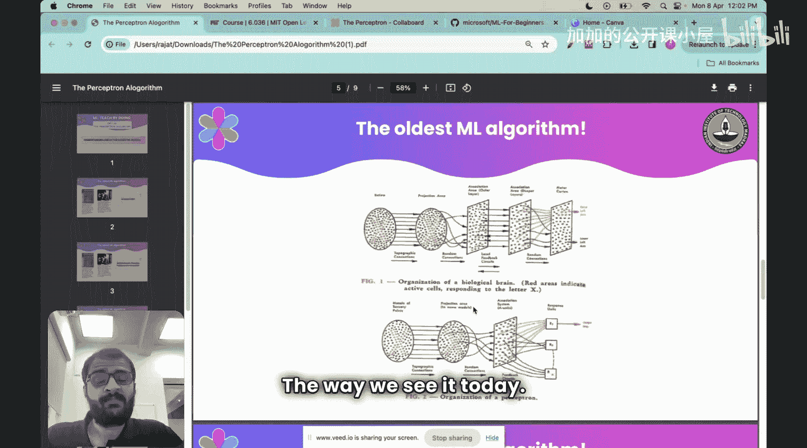
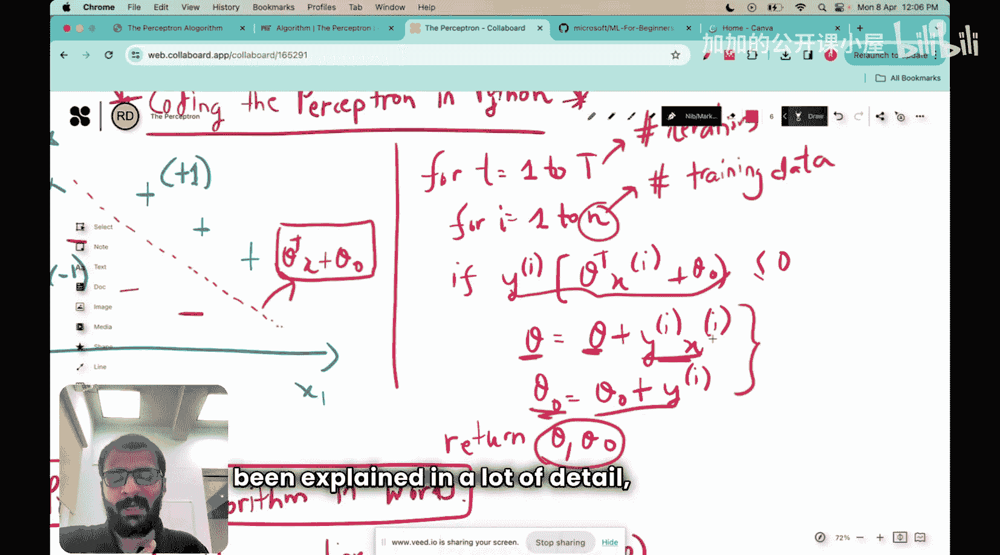
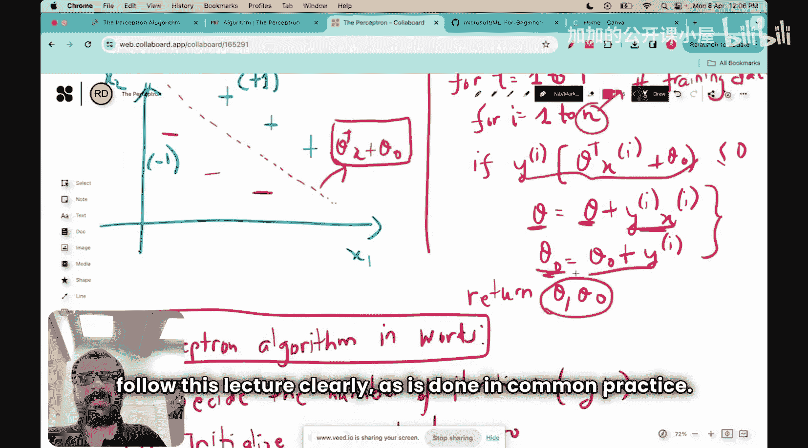
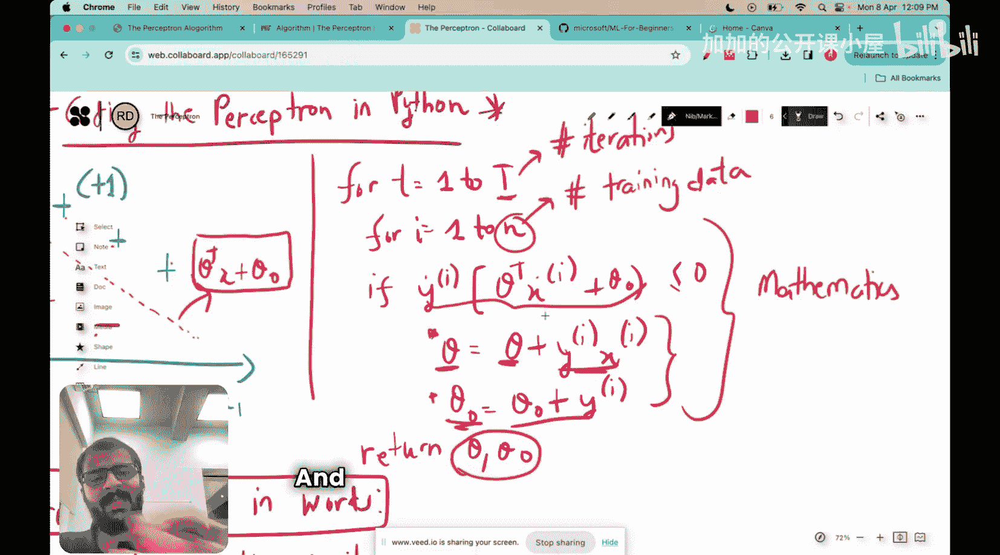
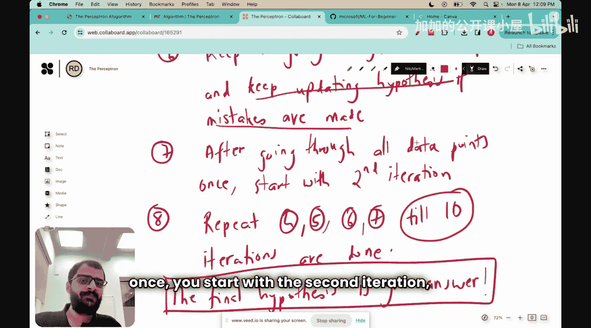
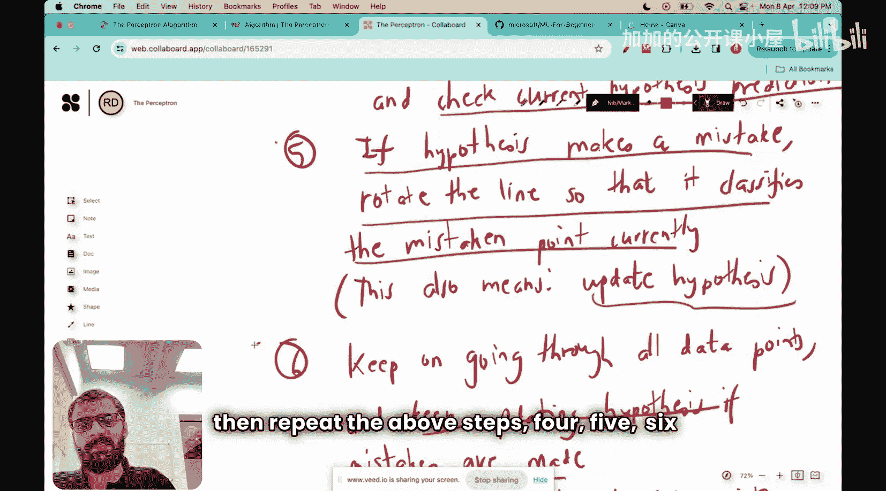
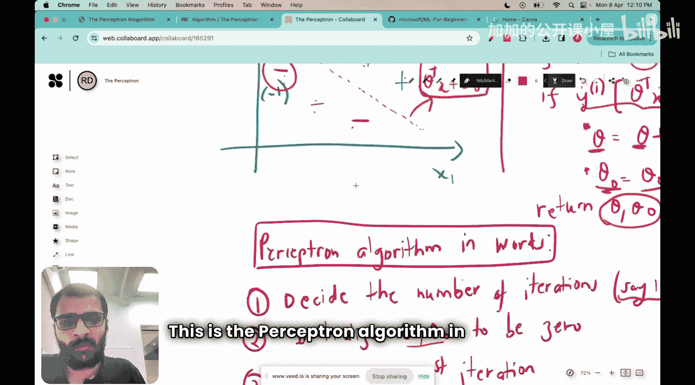
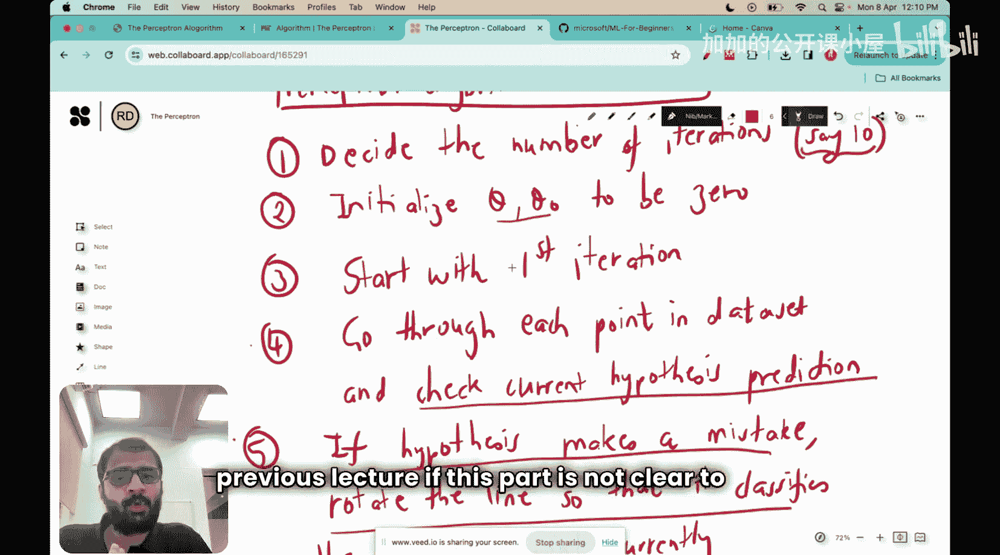
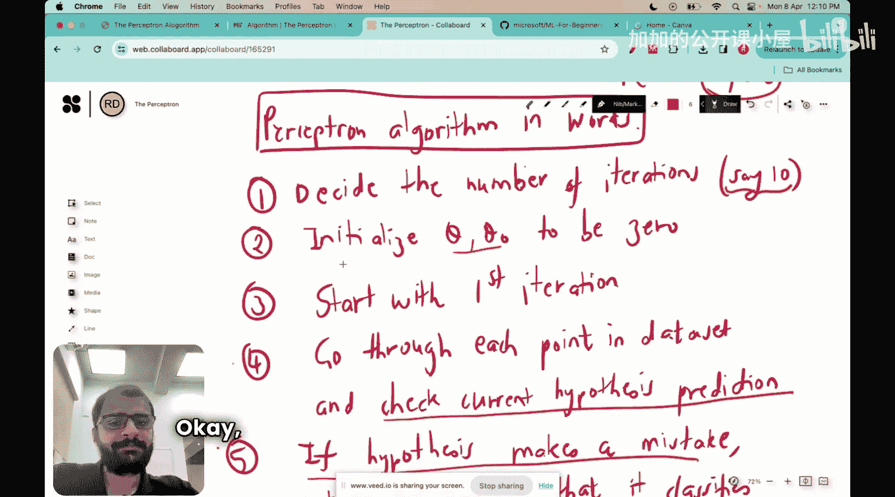
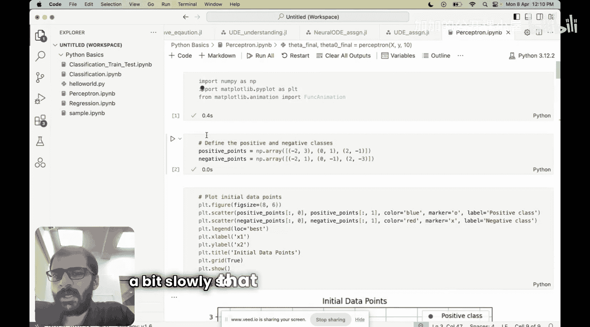

#  011：编写感知机算法 🧠

在本节课中，我们将学习如何在Python中编写感知机算法的代码。感知机是最古老的机器学习模型之一，理解其实现方式对于掌握机器学习的基础至关重要。

上一节我们详细介绍了感知机算法的原理和历史背景。本节中，我们将动手实践，一步步用Python代码实现这个算法。

## 算法回顾



感知机算法的核心目标是找到一个线性分类器，即一条直线（或超平面），能够正确区分数据集中的正类（标记为+1）和负类（标记为-1）。其数学公式描述如下：

对于迭代次数 `t = 1` 到 `T`：
对于每个训练数据点 `i = 1` 到 `n`：
如果 `y_i * (θ^T * x_i + θ_0) <= 0`：
更新 `θ = θ + y_i * x_i`
更新 `θ_0 = θ_0 + y_i`

最终返回 `θ` 和 `θ_0`。

## 算法步骤详解

以下是感知机算法用自然语言描述的步骤，我们将据此编写代码：

1.  首先，决定迭代次数 `T`。
2.  初始化参数 `θ` 和 `θ_0` 为0。这是我们的初始假设。
3.  开始第一次迭代。
4.  在每次迭代中，遍历数据集中的每一个点。
5.  对于每个点，检查当前假设是否对其做出了错误分类。错误的条件是 `y_i * (θ^T * x_i + θ_0) <= 0`。
6.  如果发生了错误，就“旋转”当前的假设直线，使其能正确分类该点。数学上，这个旋转操作对应着更新 `θ` 和 `θ_0`。
7.  遍历完所有数据点后，完成一次迭代。
8.  重复步骤3到7，直到完成预设的 `T` 次迭代。
9.  最终得到的 `θ` 和 `θ_0` 就是学习到的分类器参数。

如果对上述步骤感到困惑，强烈建议回顾上一节关于感知机原理的详细讲解。

现在，让我们开始用Python实现这些步骤。

## Python代码实现

我们将按照上述步骤，逐步构建感知机算法。

首先，导入必要的库并准备一个简单的二维数据集用于演示。

```python
import numpy as np
import matplotlib.pyplot as plt

# 设置随机种子以确保结果可复现
np.random.seed(42)

# 生成模拟数据
# 生成20个负类样本（标签为-1），中心在(2, 2)
neg_centroid = [2, 2]
neg_data = np.random.randn(20, 2) + neg_centroid
neg_labels = -1 * np.ones(20)

# 生成20个正类样本（标签为+1），中心在(6, 6)
pos_centroid = [6, 6]
pos_data = np.random.randn(20, 2) + pos_centroid
pos_labels = np.ones(20)



# 合并数据和标签
X = np.vstack((neg_data, pos_data))
y = np.hstack((neg_labels, pos_labels))



# 可视化数据
plt.figure(figsize=(8, 6))
plt.scatter(neg_data[:, 0], neg_data[:, 1], color='red', label='Negative Class (y=-1)', alpha=0.7)
plt.scatter(pos_data[:, 0], pos_data[:, 1], color='green', marker='+', s=100, label='Positive Class (y=+1)', alpha=0.7)
plt.xlabel('Feature 1 (x1)')
plt.ylabel('Feature 2 (x2)')
plt.title('Perceptron Training Data')
plt.legend()
plt.grid(True, alpha=0.3)
plt.show()
```

接下来，我们实现感知机训练函数。以下是核心代码：

```python
def perceptron_train(X, y, max_iters=100):
    """
    感知机训练函数。

    参数:
    X : numpy数组，形状为 (n_samples, n_features)，输入特征。
    y : numpy数组，形状为 (n_samples,)，类别标签，应为+1或-1。
    max_iters : 整数，最大迭代次数。

    返回:
    theta : numpy数组，学习到的权重向量。
    theta_0 : 标量，学习到的偏置项。
    mistakes_history : 列表，记录每次迭代中错误分类的数量。
    """
    # 获取样本数量和特征数量
    n_samples, n_features = X.shape

    # 步骤1 & 2: 初始化参数 theta 和 theta_0 为0
    theta = np.zeros(n_features)
    theta_0 = 0.0

    # 用于记录每次迭代的错误数，便于观察收敛情况
    mistakes_history = []

    # 步骤3: 开始迭代，t 从 1 到 T (max_iters)
    for t in range(max_iters):
        mistakes_in_this_epoch = 0

        # 步骤4: 遍历数据集中的每一个样本点
        for i in range(n_samples):
            xi = X[i]
            yi = y[i]

            # 步骤5: 计算当前假设的预测值，并检查是否分类错误
            # 公式: y_i * (θ^T * x_i + θ_0)
            prediction = yi * (np.dot(theta, xi) + theta_0)

            # 步骤6: 如果 prediction <= 0，说明分类错误
            if prediction <= 0:
                mistakes_in_this_epoch += 1
                # 更新参数（旋转假设）
                # 公式: θ = θ + y_i * x_i
                theta = theta + yi * xi
                # 公式: θ_0 = θ_0 + y_i
                theta_0 = theta_0 + yi

        # 记录本次迭代的错误数
        mistakes_history.append(mistakes_in_this_epoch)

        # 提前终止：如果本次迭代没有发生任何错误，说明已完美分类
        if mistakes_in_this_epoch == 0:
            print(f"Converged after {t+1} iterations.")
            break

    # 步骤9: 返回最终学习到的参数
    return theta, theta_0, mistakes_history
```

现在，让我们使用这个函数来训练感知机模型。

```python
# 训练感知机
theta, theta_0, mistakes_history = perceptron_train(X, y, max_iters=50)

print(f"Learned weights (theta): {theta}")
print(f"Learned bias (theta_0): {theta_0}")
```

为了理解训练过程，我们可以绘制错误数随迭代次数的变化图。

```python
# 绘制训练过程中错误数的变化
plt.figure(figsize=(8, 5))
plt.plot(range(1, len(mistakes_history)+1), mistakes_history, marker='o', linestyle='-')
plt.xlabel('Iteration Number')
plt.ylabel('Number of Mistakes')
plt.title('Perceptron Training: Mistakes per Iteration')
plt.grid(True, alpha=0.3)
plt.show()
```

最后，我们将学习到的决策边界可视化，看看感知机是如何划分数据的。

```python
# 定义一个函数来根据theta和theta_0计算决策边界
def plot_decision_boundary(theta, theta_0, X, y):
    """
    绘制感知机决策边界和数据点。
    """
    plt.figure(figsize=(8, 6))

    # 绘制数据点
    neg_idx = y == -1
    pos_idx = y == 1
    plt.scatter(X[neg_idx, 0], X[neg_idx, 1], color='red', label='Negative Class (y=-1)', alpha=0.7)
    plt.scatter(X[pos_idx, 0], X[pos_idx, 1], color='green', marker='+', s=100, label='Positive Class (y=+1)', alpha=0.7)

    # 计算决策边界线
    # 决策边界是 θ^T * x + θ_0 = 0
    # 对于二维情况，可以表示为: theta[0]*x1 + theta[1]*x2 + theta_0 = 0
    # 重写为: x2 = -(theta[0]/theta[1]) * x1 - (theta_0/theta[1])
    x1_min, x1_max = X[:, 0].min() - 1, X[:, 0].max() + 1
    x1_vals = np.linspace(x1_min, x1_max, 100)

    # 避免除零错误
    if abs(theta[1]) > 1e-10:
        x2_vals = -(theta[0]/theta[1]) * x1_vals - (theta_0/theta[1])
        plt.plot(x1_vals, x2_vals, 'b-', linewidth=2, label='Decision Boundary')
    else:
        # 如果theta[1]接近0，边界几乎是垂直的
        vert_line_x = -theta_0 / theta[0] if abs(theta[0]) > 1e-10 else 0
        plt.axvline(x=vert_line_x, color='b', linewidth=2, label='Decision Boundary')

    plt.xlabel('Feature 1 (x1)')
    plt.ylabel('Feature 2 (x2)')
    plt.title('Perceptron Decision Boundary')
    plt.legend()
    plt.grid(True, alpha=0.3)
    plt.axis('equal')
    plt.show()



# 绘制最终决策边界
plot_decision_boundary(theta, theta_0, X, y)
```





此外，我们可以编写一个预测函数，用于对新数据进行分类。

```python
def perceptron_predict(X, theta, theta_0):
    """
    使用训练好的感知机模型进行预测。

    参数:
    X : numpy数组，形状为 (n_samples, n_features)，输入特征。
    theta : numpy数组，学习到的权重向量。
    theta_0 : 标量，学习到的偏置项。

    返回:
    predictions : numpy数组，形状为 (n_samples,)，预测的类别标签 (+1 或 -1)。
    """
    # 计算线性输出: θ^T * x + θ_0
    linear_output = np.dot(X, theta) + theta_0
    # 应用符号函数作为激活函数
    predictions = np.sign(linear_output)
    # 确保输出为+1或-1（np.sign(0)会返回0，我们将其映射为+1，但通常不会发生）
    predictions[predictions == 0] = 1
    return predictions

# 在训练数据上计算准确率
train_predictions = perceptron_predict(X, theta, theta_0)
accuracy = np.mean(train_predictions == y) * 100
print(f"Training Accuracy: {accuracy:.2f}%")
```



## 总结

本节课中我们一起学习了如何用Python从头开始实现感知机算法。我们回顾了算法的数学原理和步骤，并将其转化为具体的代码，包括数据准备、模型训练、决策边界可视化和预测。





通过本教程，你应当能够：
1.  理解感知机算法的核心更新规则。
2.  独立编写感知机的训练和预测代码。
3.  可视化训练过程和最终的分类结果。
4.  认识到感知机作为线性分类器的基本特性和局限性（例如，它无法处理线性不可分的数据）。



感知机是神经网络和许多现代机器学习模型的基石，掌握其实现为学习更复杂的模型奠定了坚实的基础。