#  012：感知机收敛定理

在本节课中，我们将学习感知机算法相关的几个核心术语。我们将探讨感知机过原点、数据集的线性可分性、数据集的间隔，并最终介绍感知机收敛定理。这些概念对于理解更高级的机器学习模型（如支持向量机）至关重要。

上一讲我们实现了感知机算法。本节中，我们将深入其理论基础。

## 感知机过原点

首先，我们介绍“感知机过原点”的概念。在之前的感知机算法中，分类线由公式 **θᵀx + θ₀ = 0** 表示，其中 θ₀ 是一个偏移量。

感知机过原点是指，我们强制分类线必须穿过坐标原点。这相当于在算法中设置 **θ₀ = 0**。此时，分类线简化为 **θᵀx = 0**。

以下是感知机过原点的算法步骤：

1.  初始化参数向量 θ 为零向量。
2.  循环遍历数据集多次（例如10次）。
3.  对于每个数据点 (xᵢ, yᵢ)，检查是否分类错误。判断条件是计算 **yᵢ * (θᵀxᵢ)**。
4.  如果该值小于或等于0，表示分类错误，则更新参数：**θ = θ + yᵢ * xᵢ**。
5.  由于 θ₀ 恒为0，因此无需更新。

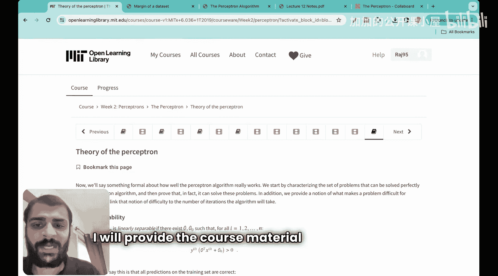

感知机过原点是标准感知机的一个简化版本，常用于理论分析，因为它减少了需要处理的参数。

## 数据集的线性可分性

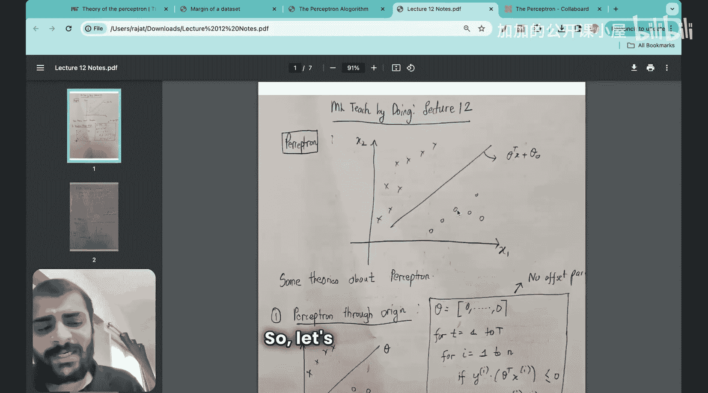

接下来，我们定义“线性可分性”。一个数据集 D 被称为是线性可分的，当且仅当存在一个线性分类器（一条直线或超平面），能够完美地将所有数据点正确分类。

用数学语言描述：数据集 D = {(xᵢ, yᵢ)} 是线性可分的，如果存在一个参数向量 θ，使得对于数据集中的所有点，都满足 **yᵢ * (θᵀxᵢ) > 0**。

回顾之前的内容，**yᵢ * (θᵀxᵢ)** 大于0意味着该点被正确分类。因此，线性可分的定义就是：存在一个分类器，它在整个数据集上不犯任何错误。

例如，下图展示了一个线性可分的数据集，因为我们可以画出一条直线，将所有的“加号”点和“圆圈”点分开。

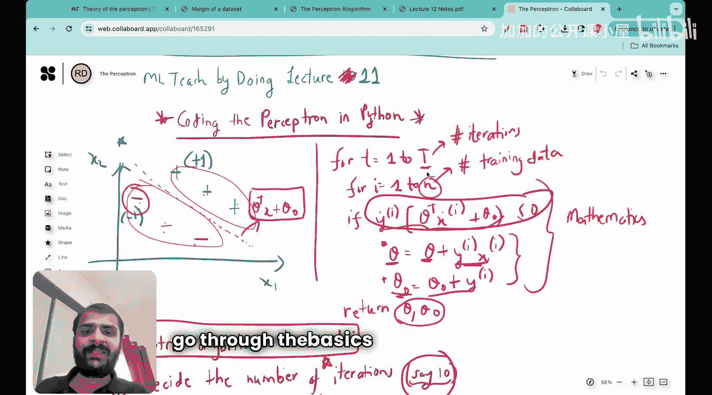

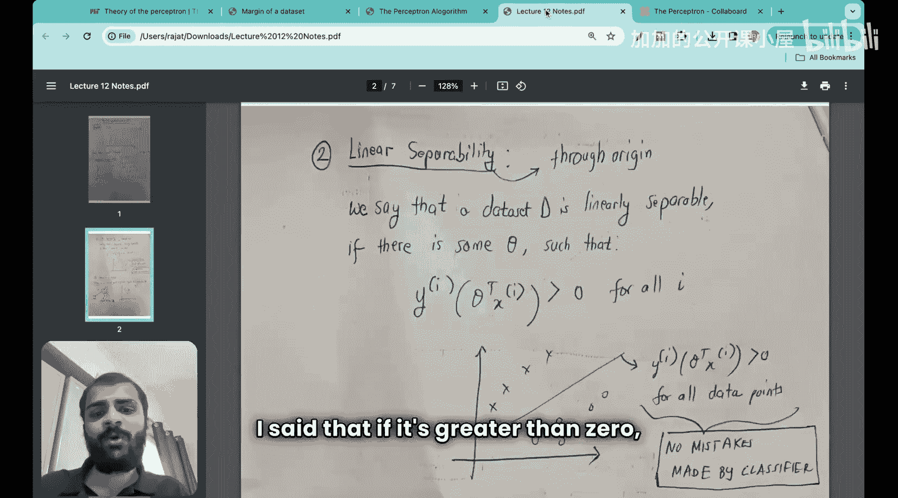

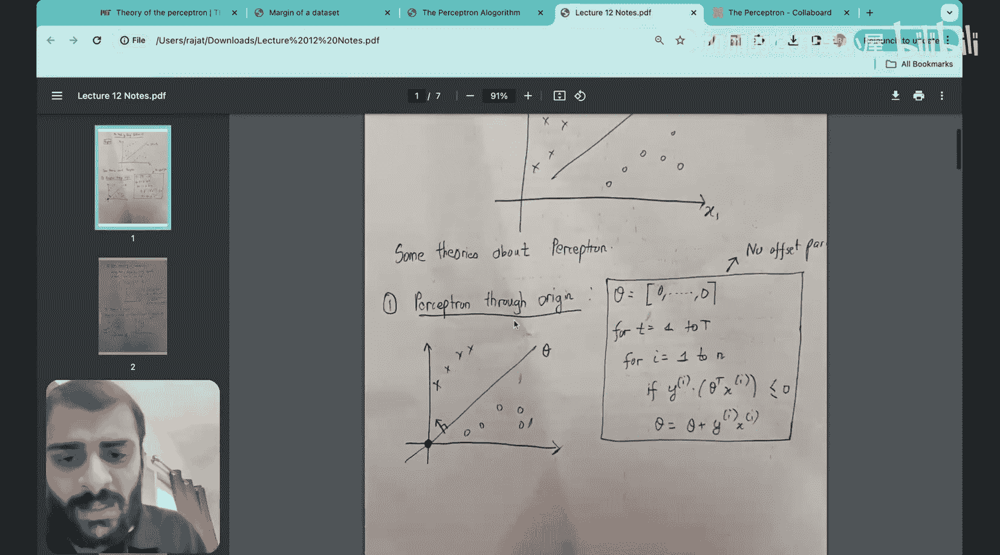

## 数据集的间隔

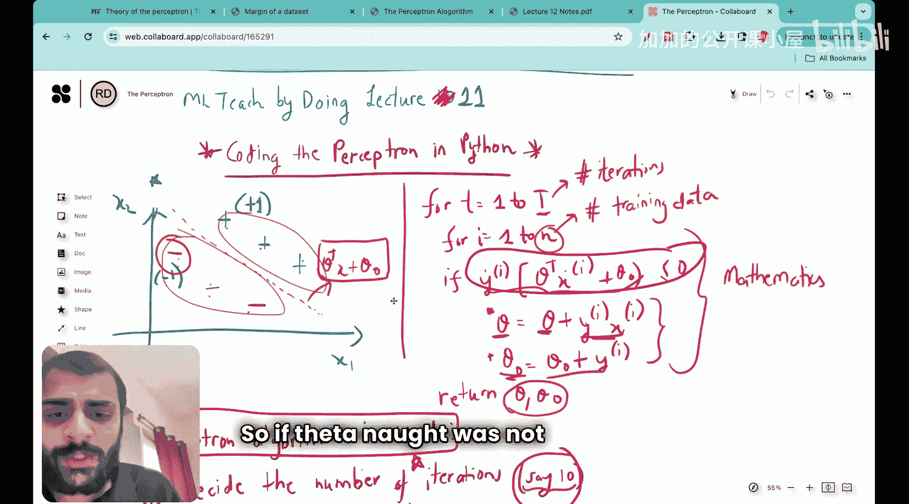

现在，我们进入本节课最重要的概念：间隔。首先，我们定义单个数据点相对于一条分类线的“间隔”。

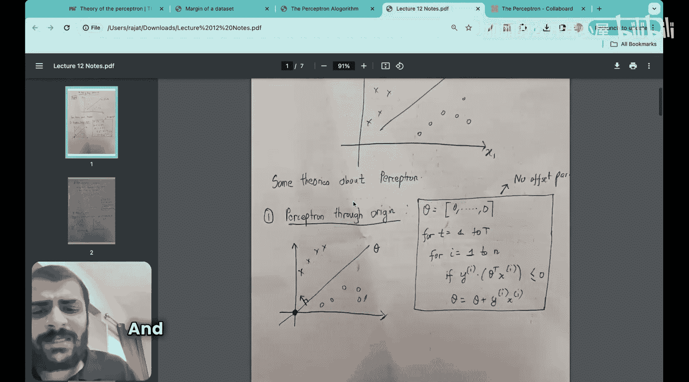

假设我们有一条过原点的分类线 **θᵀx = 0**，其法向量方向由 θ 指定。同时，我们有一个带标签的数据点 (x, y)，其中 y 为 +1 或 -1。

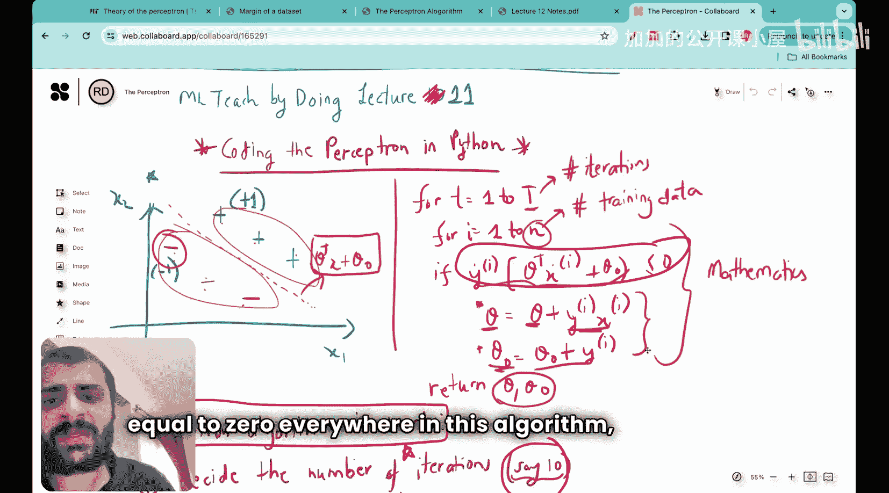

该点相对于这条分类线的“间隔” γ 定义为：
**γ = y * (θᵀx) / ||θ||**

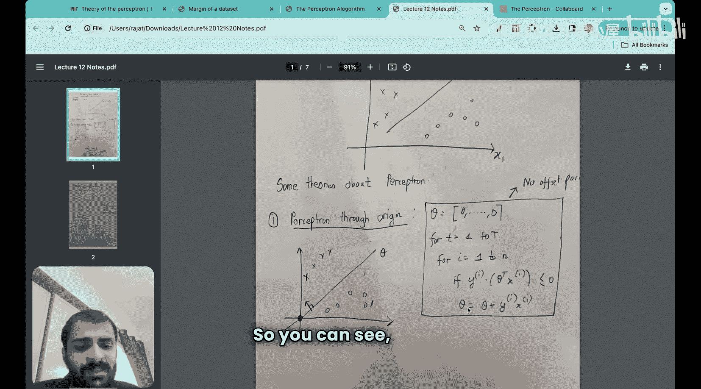

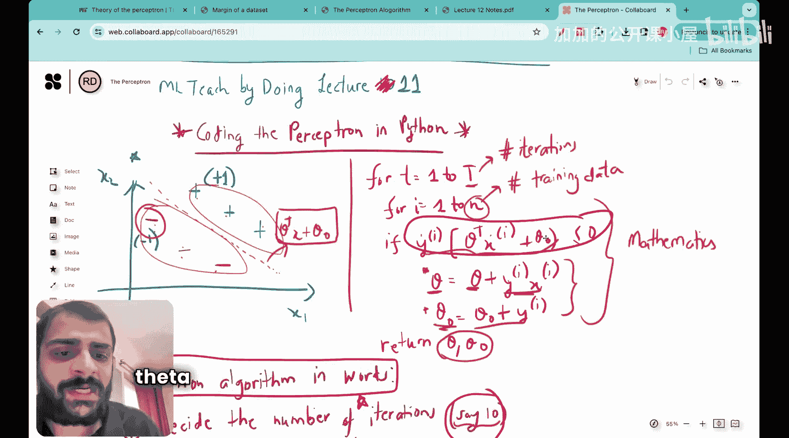

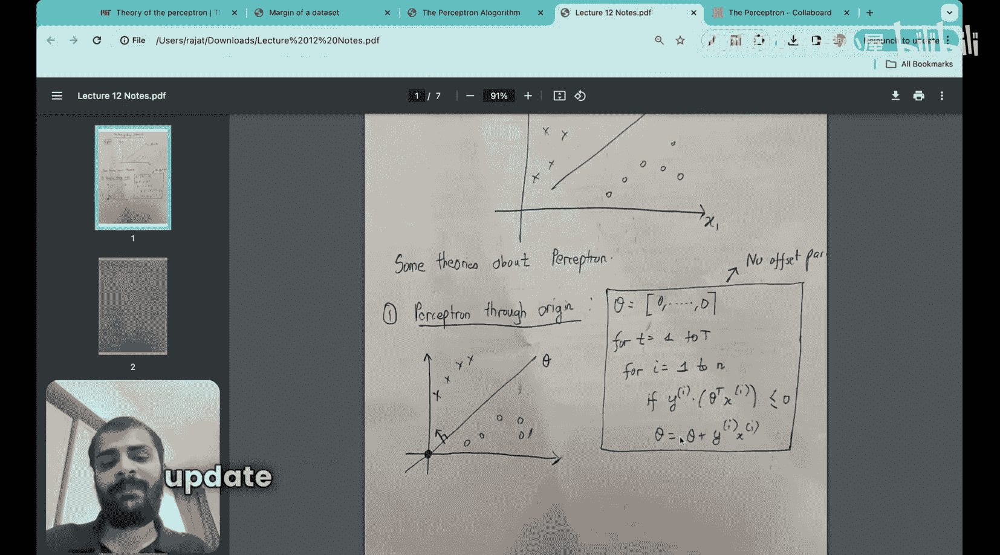

这个公式的几何意义是：计算该点到分类线的带符号距离。距离的绝对值表示点到线的远近，符号由分类是否正确决定（正确为正，错误为负）。

理解了点间隔后，我们可以定义整个“数据集的间隔”。数据集的间隔 Γ 是指，在所有能完美分类该数据集的线性分类器中，其所能达到的**最小点间隔**的最大值。

换句话说：
1.  首先，考虑所有能将数据集线性分开的分类器 θ。
2.  对于每一个这样的分类器 θ，计算数据集中所有点相对于它的间隔，并取其中最小的那个值（即最接近分类线的那个点的间隔）。
3.  最后，在所有候选分类器中，找到那个能让这个“最小间隔”最大的分类器。这个最大的“最小间隔”就是数据集的间隔 Γ。

数据集的间隔是一个衡量数据集分离难易程度的重要指标。间隔越大，说明两类数据点分离得越开，理论上也越容易找到一个鲁棒的分类器。

## 感知机收敛定理

最后，我们介绍“感知机收敛定理”。这是一个非常重要的理论结果。

感知机收敛定理指出：如果一个数据集是线性可分的，并且其间隔 Γ > 0，那么感知机算法（包括过原点版本）将在有限次迭代内收敛到一个正确的分类器。

更具体地说，定理给出了算法在收敛前所需更新次数（即犯错次数）的一个上界。该上界与 **R² / Γ²** 成正比，其中 R 是数据集中所有点的最大范数（即离原点最远点的距离）。

**定理公式化表述**：对于线性可分数据集，感知机算法的权重更新次数不会超过 **(R / Γ)²** 次。

这个定理的意义在于，它从理论上保证了感知机算法在线性可分条件下的有效性和有限步收敛性。间隔 Γ 越大（数据越容易分），算法收敛得越快。

## 总结

本节课中，我们一起学习了感知机算法的四个核心理论概念：
1.  **感知机过原点**：将分类线约束为穿过原点，简化了模型和理论分析。
2.  **线性可分性**：描述了存在一个线性分类器能完美分离数据集的性质，条件是存在 θ 使得对所有点满足 **yᵢ(θᵀxᵢ) > 0**。
3.  **间隔**：包括点间隔 **γ = y(θᵀx)/||θ||** 和数据集间隔 Γ。数据集间隔是衡量分类难易程度的关键度量，值越大表示分类越容易。
4.  **感知机收敛定理**：该定理保证了在线性可分条件下，感知机算法会在有限步内收敛，且收敛速度与数据集间隔 Γ 密切相关。

理解这些概念为后续学习更复杂的分类模型（如支持向量机）奠定了坚实的基础。