#  015：逻辑回归第一部分 🧠

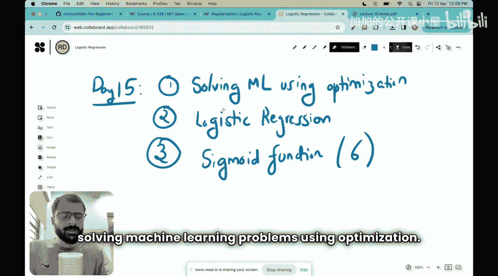

在本节课中，我们将学习如何将机器学习问题转化为优化问题，并初步认识逻辑回归及其核心组件——Sigmoid函数。我们将从优化框架开始，逐步理解逻辑回归的基本概念。

## 将机器学习视为优化问题 🔄

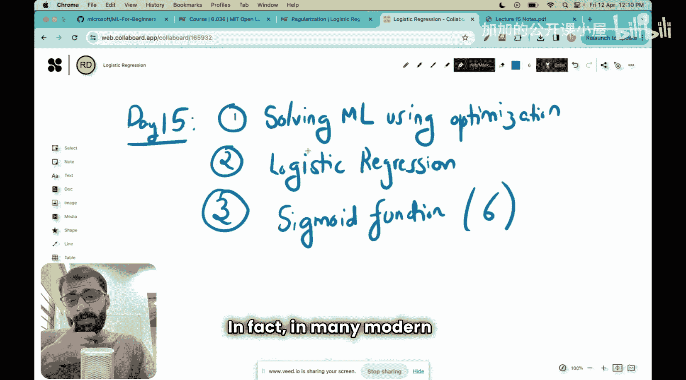

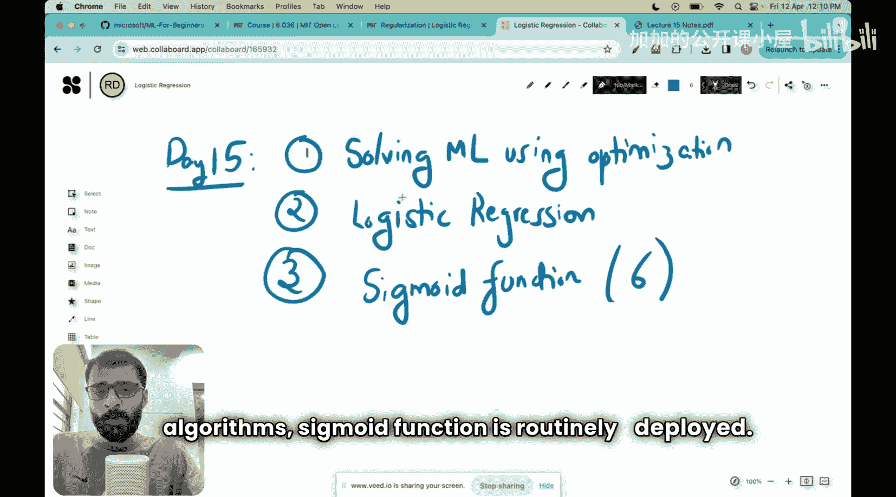

上一节我们介绍了感知机等算法，它们源于人类的直觉。但面对复杂的机器学习问题时，我们无法每次都依赖直觉来设计新算法。我们需要一套系统化的方法。

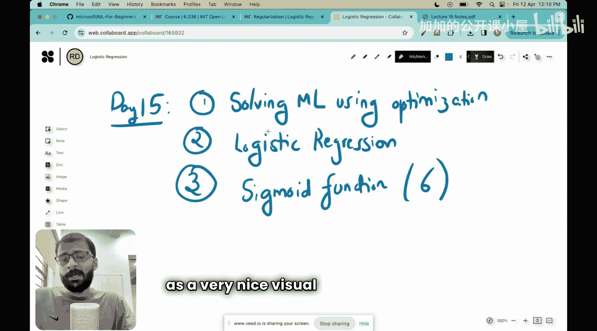

我们需要一种能够为任何问题推导出机器学习算法的机制或方法论。这就是为什么机器学习实践者会将机器学习问题转化为优化问题。

优化是一个发展迅速的数学领域，其中包含许多成熟的技术。如果我们将机器学习问题视为优化问题，就可以利用这些技术来解决它。

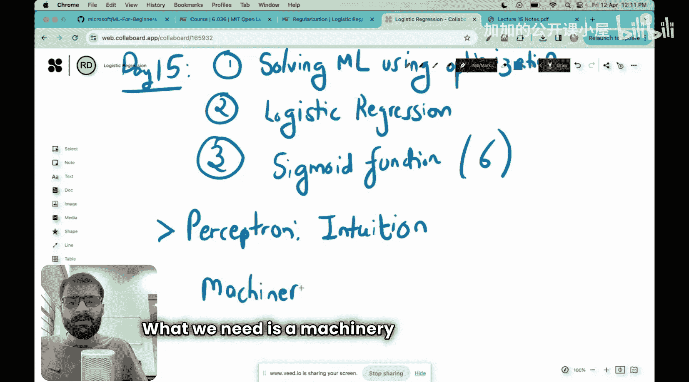

## 什么是优化问题？🎯

本质上，优化意味着我们希望优化某个函数。例如，预订网约车时，算法会根据我的位置、附近司机的距离、司机评分以及我的支付意愿，为我分配最佳司机。这就是一个优化问题，Uber试图优化的函数是“为我分配最佳司机”。

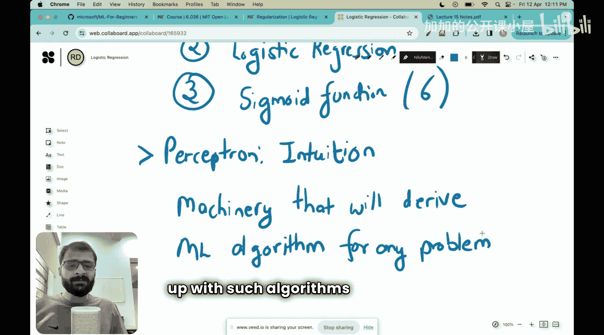

在日常生活中，当我们想从A地到B地时，我们可能会选择耗时最短的路线，这也是一个优化问题，我们在此优化的是时间。

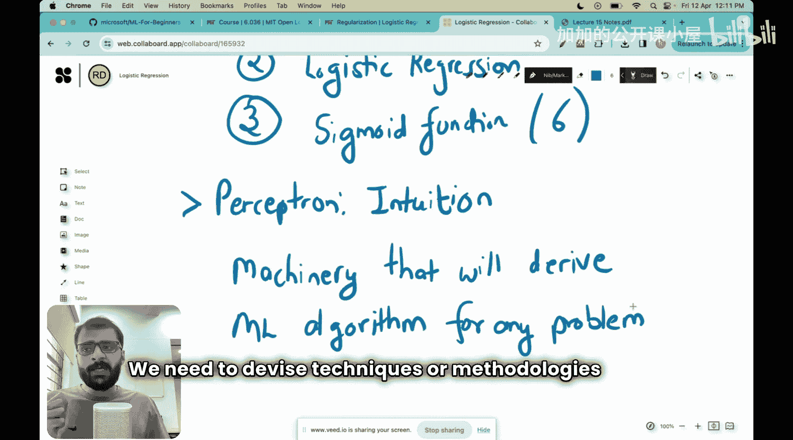

在任何优化问题中，都有一个我们想要优化的函数，称为 **J**，它依赖于参数 **θ**。

在机器学习的语境下：
*   **J** 是我们想要最小化的**目标函数**（通常是损失函数）。
*   **θ** 是模型的**参数**。

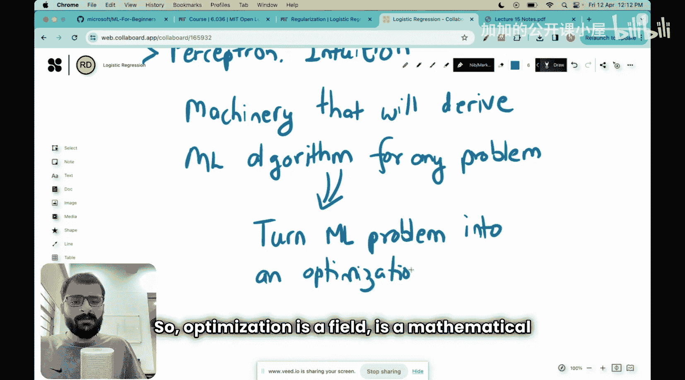

例如，对于一个线性分类器 `θ₁x₁ + θ₂x₂ + θ₀ = 0`，其参数就是 `θ₁`、`θ₂` 和 `θ₀`。

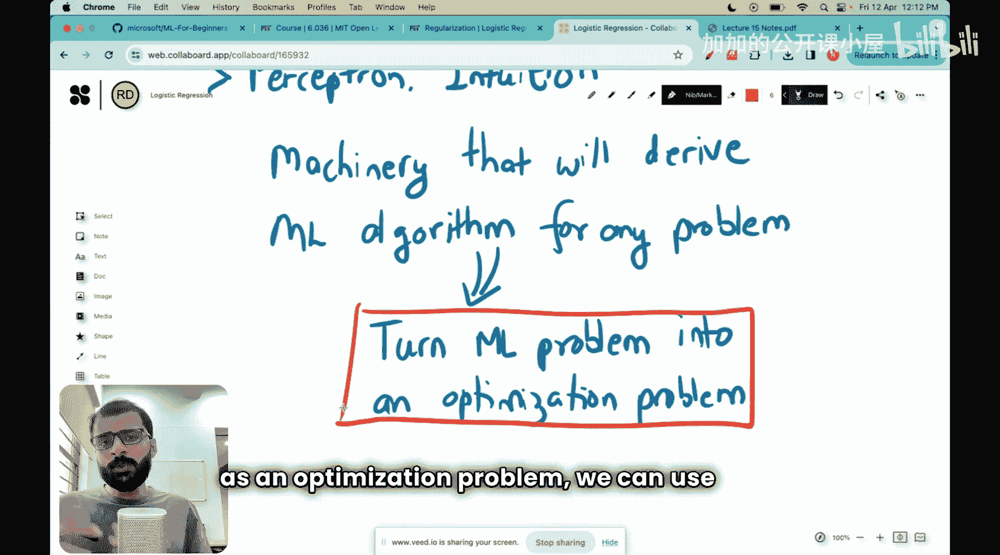

因此，优化问题的本质是：**找到能够最小化 J 的参数 θ***。

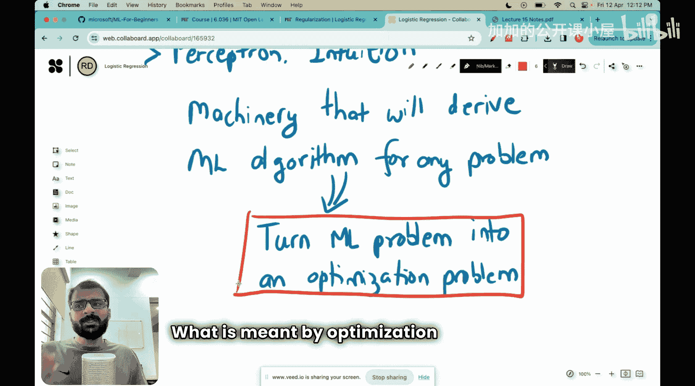

## 机器学习中的目标函数 📉

你可能会想，这个目标函数具体是什么样子？对于机器学习问题，目标函数通常具有以下形式：

首先，目标函数 J(θ) 总是**训练数据上的损失之和**。我们希望最小化训练数据上的损失。

其次，还有一个额外的项，称为**正则化器**。我们稍后会详细了解它，但正则化器实际上有助于我们**最小化或减少测试数据上的损失**。

正如我们之前所见，仅仅确保训练数据上的损失最小化是不够的。我们需要确保当给出任何新数据点时，我们的机器学习算法在新数据点上的错误也很少。为此，我们使用了一种称为正则化的技术。

用数学公式表示，目标函数如下：

**J(θ) = (1/n) * Σᵢ₌₁ⁿ L(h(x⁽ⁱ⁾), y⁽ⁱ⁾) + λ * R(θ)**

以下是公式各部分的解释：

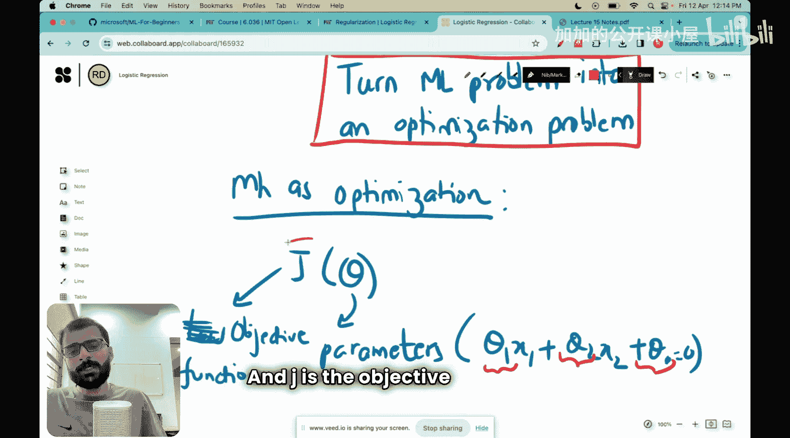

*   `(1/n) * Σᵢ₌₁ⁿ L(h(x⁽ⁱ⁾), y⁽ⁱ⁾)`：这部分是**经验风险**或**损失项**。
    *   `n` 是数据点的数量。
    *   `L` 是损失函数，用于衡量预测值与真实值之间的差异。
    *   `h(x⁽ⁱ⁾)` 是我们的假设（模型）对第 `i` 个样本的预测。
    *   `y⁽ⁱ⁾` 是第 `i` 个样本的真实值。
    *   本质上，我们取假设的预测值，计算预测值与真实值之间的误差（即损失函数），然后对所有训练数据的损失函数取平均。

*   `λ * R(θ)`：这部分是**正则化项**。
    *   `λ` 是一个**超参数**，用于控制正则化的强度。
    *   `R(θ)` 是正则化函数。

你可以将正则化器视为对我们的参数 **θ** 施加一种**惩罚**。这样做的目的是告诉算法：不要试图完美或过度精确地拟合数据，因为这可能导致过拟合问题。或者说，尝试保持最优解的简洁性，不要试图过拟合。

麻省理工学院的一个可视化示例很好地总结了这一点。观察一组数据，其中黑点是正类数据，空心点是负类数据。比较两个假设 `h1` 和 `h2`。`h1` 完美地穿过了所有点并分隔了数据，但它可能非常复杂，对噪声敏感，容易过拟合。而 `h2` 虽然可能没有完美分类所有训练点，但它更平滑、更简单，可能对未见数据具有更好的泛化能力。正则化的目标就是鼓励模型选择像 `h2` 这样更简单的解。

## 逻辑回归简介 ➕➖

现在，让我们将注意力转向本节课的核心主题之一：逻辑回归。

逻辑回归是一种广泛使用的机器学习算法，主要用于**分类**任务，尤其是**二分类**问题（例如，将邮件分类为垃圾邮件或非垃圾邮件，判断交易是否为欺诈等）。

尽管名字中有“回归”，但逻辑回归解决的是分类问题。它的核心思想是：不像线性回归那样直接输出一个连续值，逻辑回归希望输出一个介于0和1之间的概率值，表示某个样本属于正类的可能性。

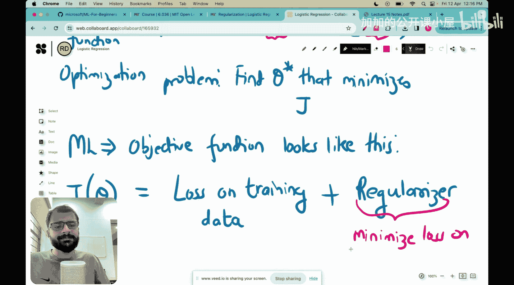

## Sigmoid函数：逻辑回归的核心 🧮

那么，逻辑回归如何将线性模型的输出（一个任意实数）转换为一个概率值呢？答案就是通过 **Sigmoid函数**（或称逻辑函数）。

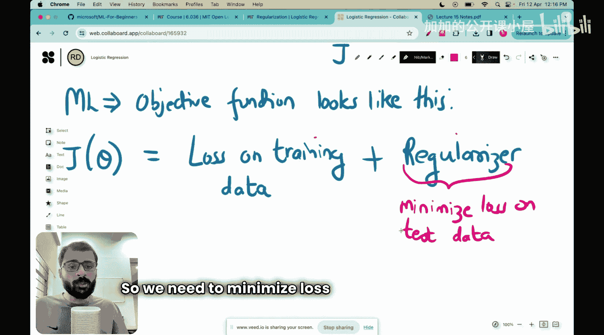

Sigmoid函数是逻辑回归中至关重要的组成部分，事实上，它在许多现代机器学习算法中也经常被使用。本节课也将作为对Sigmoid函数含义的一个非常好的直观介绍。

Sigmoid函数的数学定义如下：

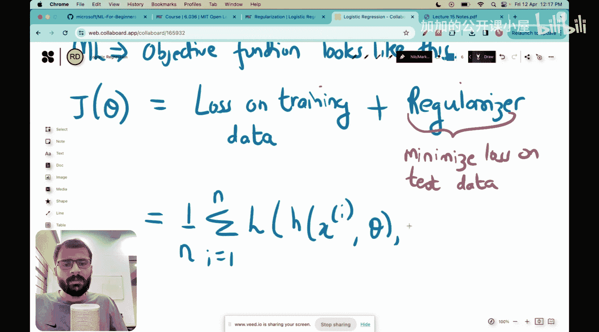

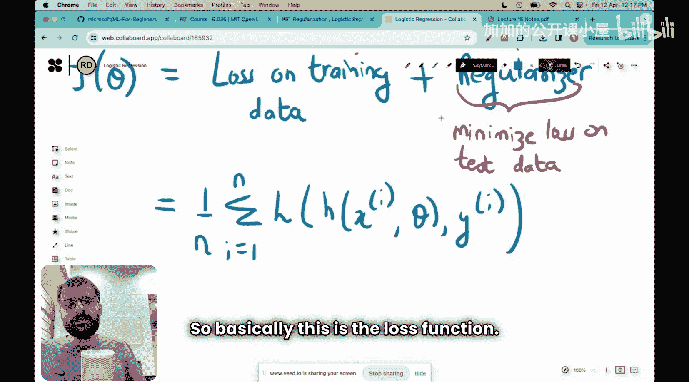

**σ(z) = 1 / (1 + e⁻ᶻ)**

其中，`z` 通常是线性组合，例如 `z = θᵀx = θ₀ + θ₁x₁ + θ₂x₂ + ...`。

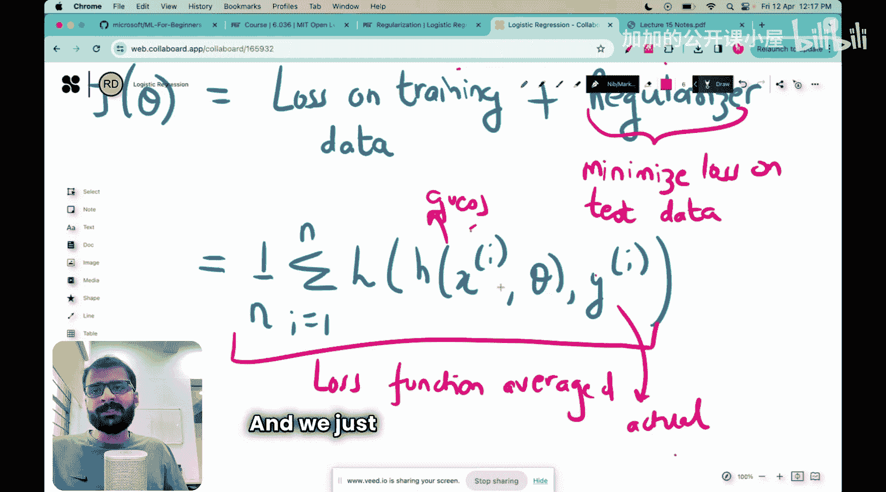

这个函数有什么特别之处？
1.  **输出范围**：无论输入 `z` 是任何实数，Sigmoid函数的输出始终被压缩在 **(0, 1)** 区间内。这使得它非常适合解释为概率。
2.  **形状**：它的图形是一条平滑的“S”形曲线。
    *   当 `z` 趋向于正无穷大时，`σ(z)` 趋近于 1。
    *   当 `z` 趋向于负无穷大时，`σ(z)` 趋近于 0。
    *   当 `z = 0` 时，`σ(z) = 0.5`。

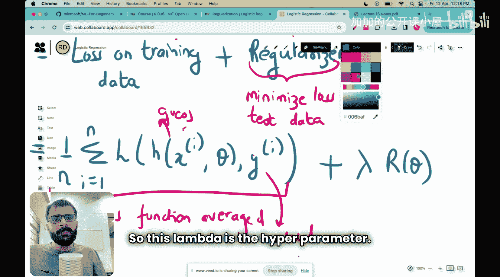

在逻辑回归中，我们将线性组合 `z = θᵀx` 代入Sigmoid函数，得到：

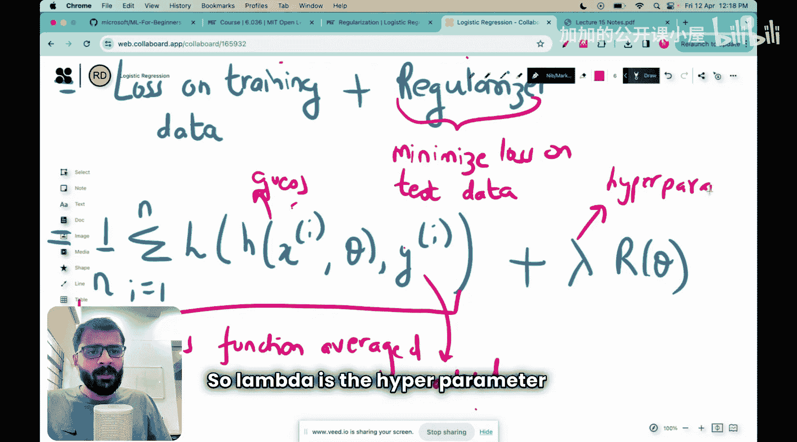

**h(x) = σ(θᵀx) = 1 / (1 + e⁻θᵀˣ)**

这个 `h(x)` 就被解释为“给定输入特征 `x`，其标签 `y=1`（属于正类）的概率”，即 `P(y=1|x; θ)`。

## 总结 📚

本节课我们一起学习了三个关键内容：

1.  **机器学习作为优化**：我们探讨了将机器学习问题转化为优化问题的必要性。优化提供了一个系统化的框架，通过最小化一个包含损失项和正则化项的目标函数 `J(θ)` 来求解模型参数 `θ`。
2.  **逻辑回归简介**：我们认识了逻辑回归，它是一种用于二分类问题的强大算法，其目标是预测一个样本属于某个类别的概率。
3.  **Sigmoid函数**：我们深入了解了Sigmoid函数，它是逻辑回归的核心。该函数将线性模型的输出映射到(0,1)区间，从而可以解释为概率。其公式为 `σ(z) = 1 / (1 + e⁻ᶻ)`。

理解优化框架是掌握许多现代机器学习算法的基础，而逻辑回归及其Sigmoid函数是分类任务中的一个经典且重要的起点。在接下来的课程中，我们将继续探讨逻辑回归的损失函数以及如何对其进行优化。