#  016：交叉熵损失函数

在本节课中，我们将学习逻辑回归的第二个核心部分：损失函数。我们将重点介绍交叉熵损失函数，理解其数学形式、直观含义以及为何它适用于逻辑回归模型。

上一节我们介绍了逻辑回归的假设函数——Sigmoid函数。本节中，我们来看看如何衡量这个假设函数的预测效果，即定义其损失函数。

## 问题回顾与目标设定

首先，我们简要回顾一下逻辑回归要解决的问题。假设我们有一个一维数据集，包含四个数据点。

*   点1和点2属于**正类**，其真实标签 `y = 1`。
*   点3和点4属于**负类**，其真实标签 `y = 0`。

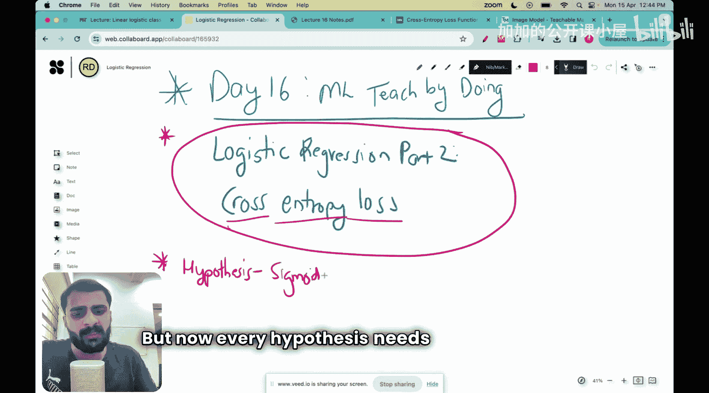

我们的目标是找到一个线性分类器，能够完美地将正类点与负类点分开。这个分类器在一维空间中就是一个点（决策边界）。

我们将使用上一节学习的Sigmoid函数作为我们的假设函数。

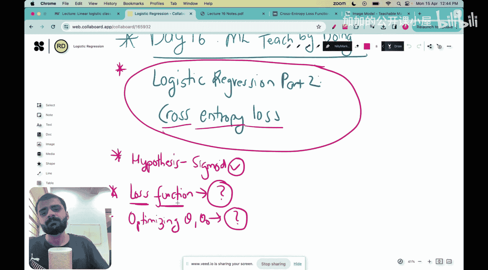

## Sigmoid假设函数回顾

Sigmoid函数的数学公式如下：

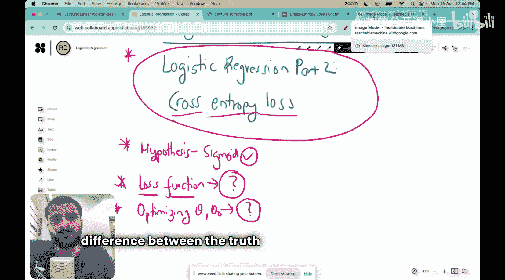

**公式：`σ(z) = 1 / (1 + e^(-z))`**

其中，`z = θ^T * x + θ₀`。`θ` 和 `θ₀` 是描述我们分类器的参数。

Sigmoid函数将任何实数输入 `z` 映射到 `(0, 1)` 区间。其函数图像呈S形。

我们的分类规则基于 `z` 的值：
*   如果 `z = θ^T * x + θ₀ > 0`，则预测值 `ŷ` 接近1（分类为正类）。
*   如果 `z = θ^T * x + θ₀ < 0`，则预测值 `ŷ` 接近0（分类为负类）。

Sigmoid函数的一个重要直觉是它与概率密切相关：
*   当 `σ(z)` 接近1时，表示模型**确信**该样本属于正类的概率很高。
*   当 `σ(z)` 接近0时，表示模型**确信**该样本属于负类的概率很高。

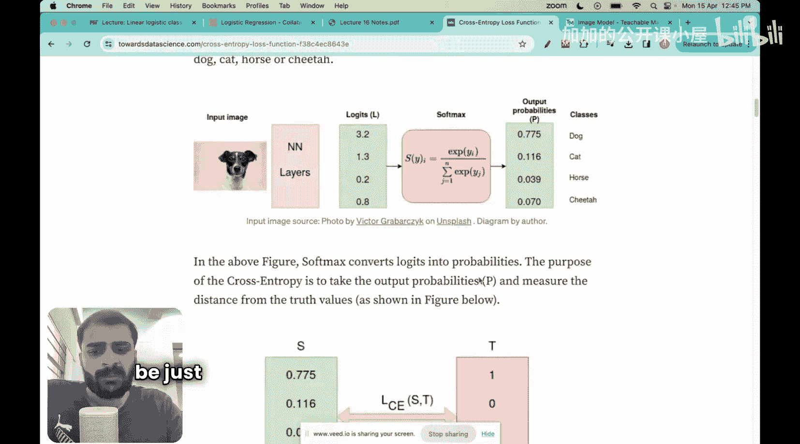

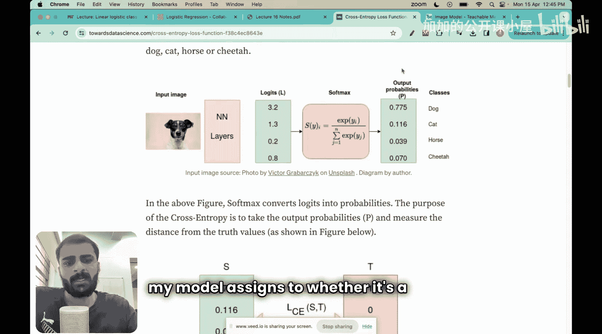

## 为何需要新的损失函数？

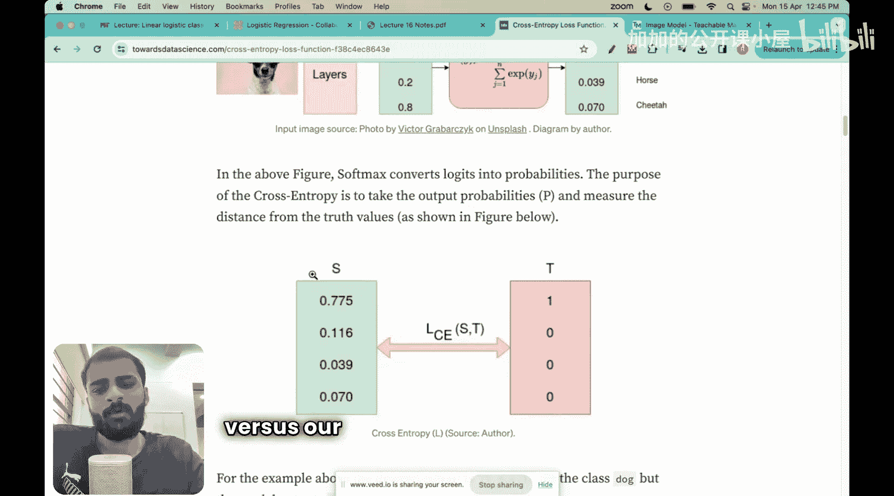

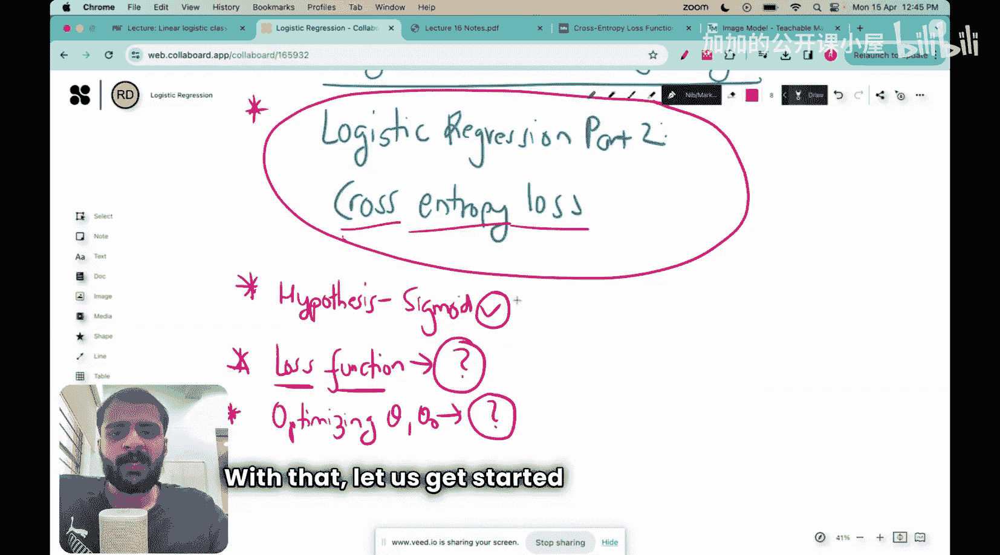

既然我们已经有了假设函数，为什么不能沿用线性回归中的均方误差（MSE）损失函数呢？

以下是原因：

1.  **非凸优化问题**：在逻辑回归中，如果使用MSE损失函数，其代价函数会变成非凸函数。这意味着优化过程中可能会陷入局部最优解，而无法找到全局最优的参数。
2.  **与概率解释不匹配**：Sigmoid输出的是概率。我们需要一个损失函数，能够有效地衡量**预测概率分布**与**真实标签分布**之间的差异。

因此，我们需要一个专为分类问题设计的损失函数。

## 交叉熵损失函数

交叉熵损失函数完美地解决了上述问题。它源于信息论，用于衡量两个概率分布之间的差异。

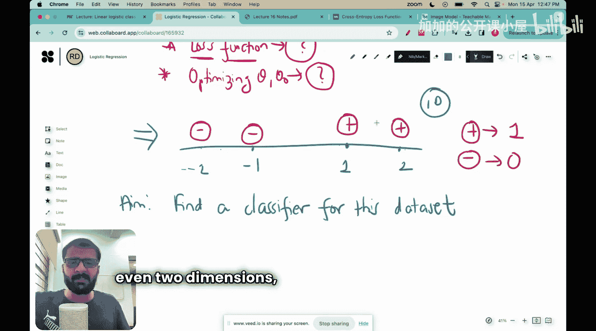

### 直观理解

想象一个猫狗分类模型。对于一个狗的图像：
*   **真实分布**：狗的概率为1，猫的概率为0。
*   **模型预测分布**：可能输出狗的概率为0.9，猫的概率为0.1。

交叉熵损失就是衡量这两个分布（真实 vs. 预测）之间的“距离”。预测越准确，这个“距离”就越小，损失值也越低。

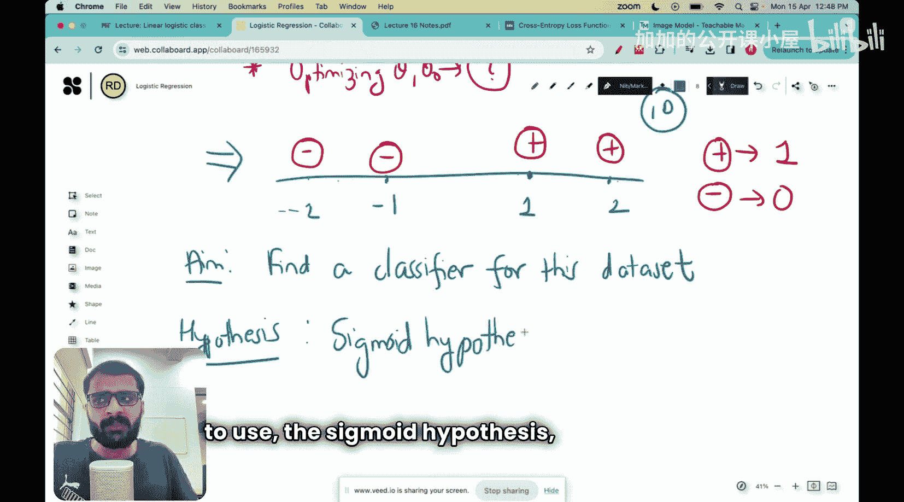

### 数学定义

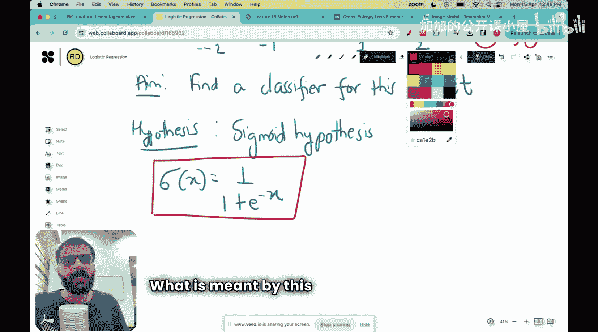

对于一个单独的训练样本 `(x, y)`，交叉熵损失函数定义如下：

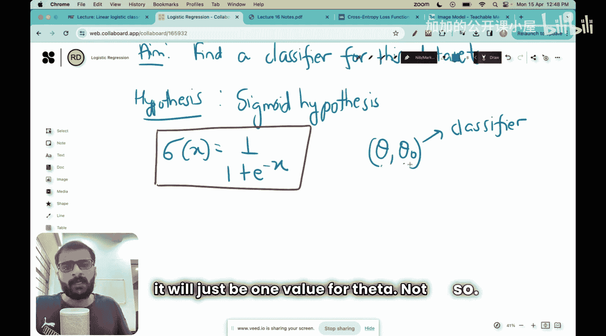

**公式：`Loss = - [ y * log(ŷ) + (1 - y) * log(1 - ŷ) ]`**

其中：
*   `y` 是样本的真实标签（0或1）。
*   `ŷ` 是模型预测该样本为正类的概率，即 `ŷ = σ(θ^T * x + θ₀)`。

让我们分析这个公式为何有效：

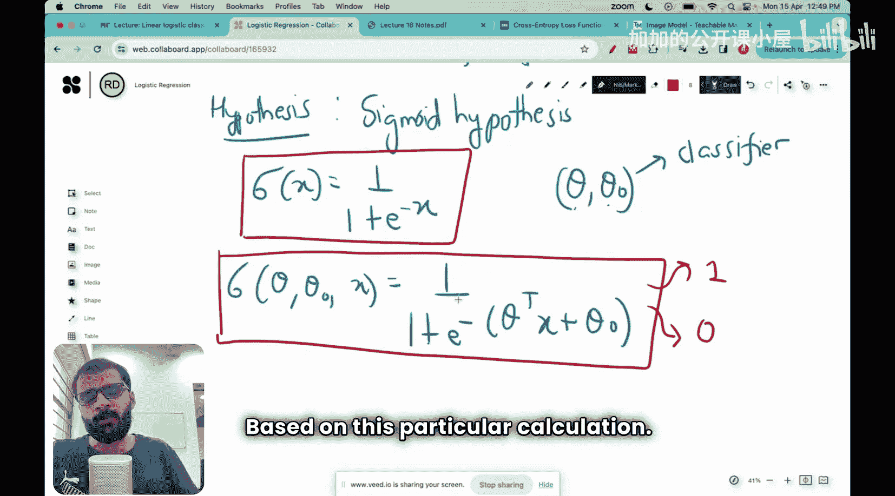

**情况一：真实标签 `y = 1`**
*   损失函数简化为：`Loss = - log(ŷ)`
*   如果模型预测正确（`ŷ` 接近1），则 `log(ŷ)` 接近0，损失很小。
*   如果模型预测错误（`ŷ` 接近0），则 `log(ŷ)` 会是一个很大的负数，加上负号后，损失会变得非常大。这严厉地惩罚了错误预测。

**情况二：真实标签 `y = 0`**
*   损失函数简化为：`Loss = - log(1 - ŷ)`
*   如果模型预测正确（`ŷ` 接近0），则 `1-ŷ` 接近1，`log(1-ŷ)` 接近0，损失很小。
*   如果模型预测错误（`ŷ` 接近1），则 `1-ŷ` 接近0，`log(1-ŷ)` 会是一个很大的负数，导致损失非常大。

### 应用于我们的例子

对于我们的四个数据点，总损失 `J(θ)` 是所有单个样本损失的平均值：

**公式：`J(θ) = -(1/m) * Σ [ y⁽ⁱ⁾ * log(ŷ⁽ⁱ⁾) + (1 - y⁽ⁱ⁾) * log(1 - ŷ⁽ⁱ⁾) ]`**

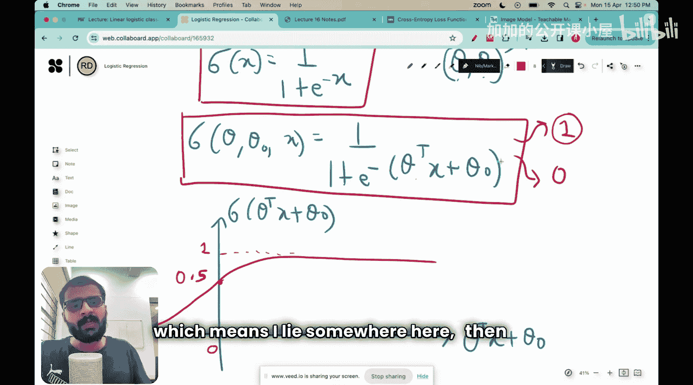

其中 `m=4` 是样本数量。

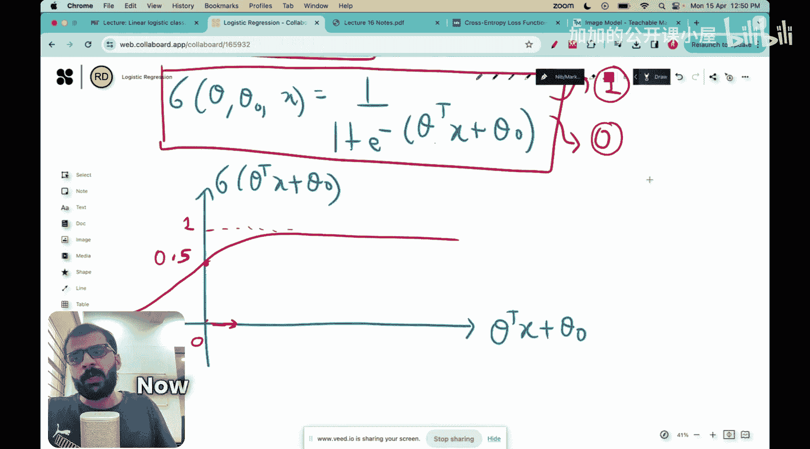

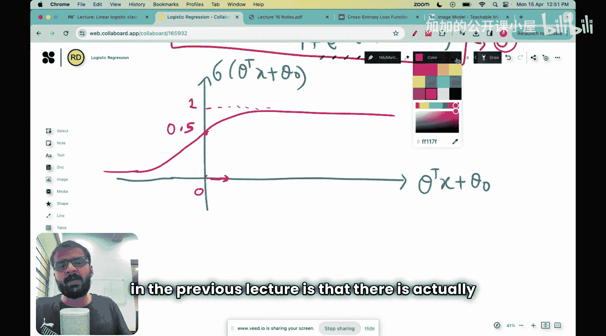

我们的目标就是找到一组参数 `θ` 和 `θ₀`，使得这个总损失 `J(θ)` 最小化。

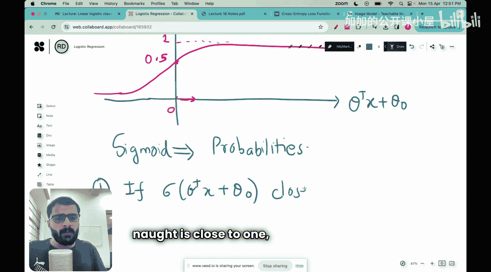

## 总结

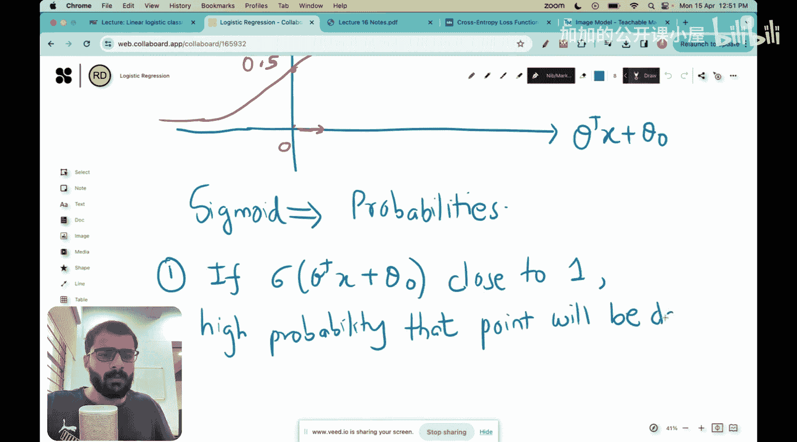

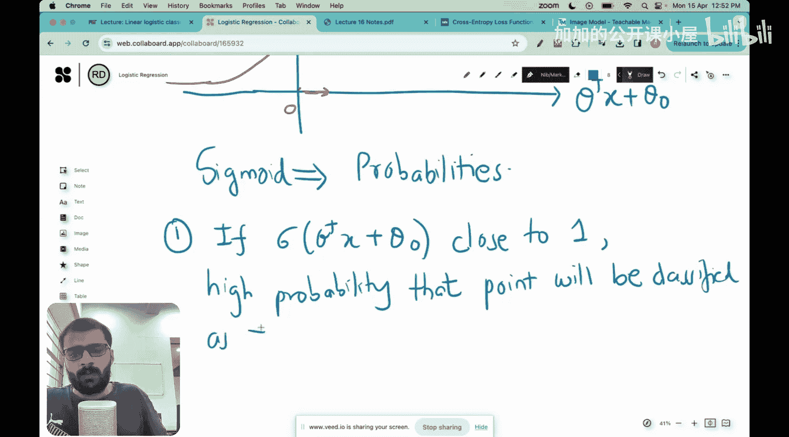

本节课中我们一起学习了逻辑回归的核心组成部分——交叉熵损失函数。

*   我们首先回顾了Sigmoid假设函数及其概率解释。
*   接着，我们理解了为何均方误差（MSE）不适用于逻辑回归，因为它会导致非凸的优化问题。
*   然后，我们深入介绍了交叉熵损失函数。我们从直观上理解了它如何衡量预测概率与真实分布之间的差异。
*   最后，我们给出了交叉熵损失函数的数学定义，并分析了它如何对正确预测给予小奖励，对错误预测给予大惩罚。

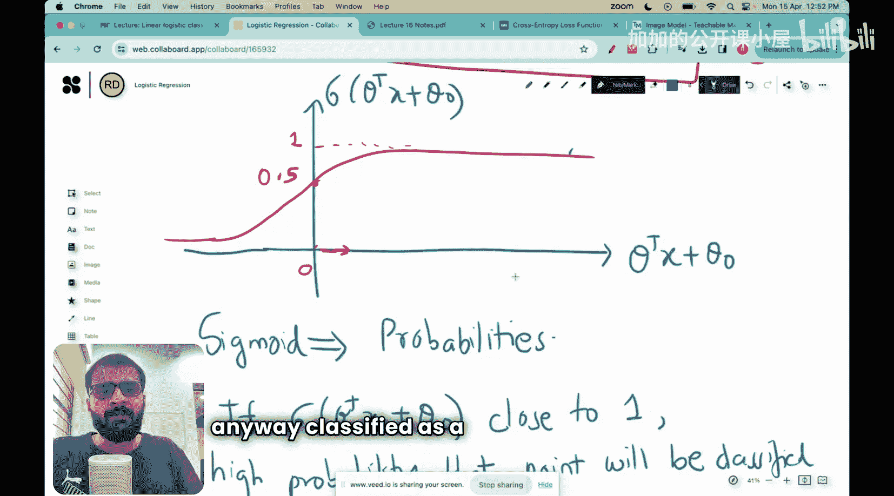

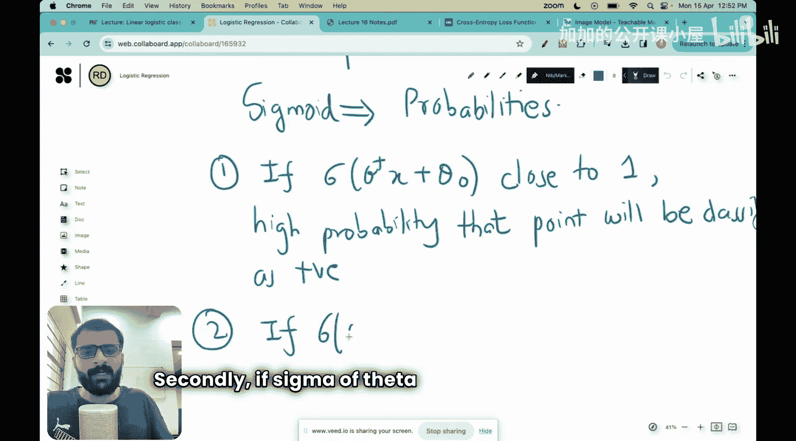

下一节，我们将探讨如何通过优化算法（如梯度下降）来最小化这个交叉熵损失函数，从而找到最佳的模型参数 `θ` 和 `θ₀`。