#  019：正则化入门 🧠

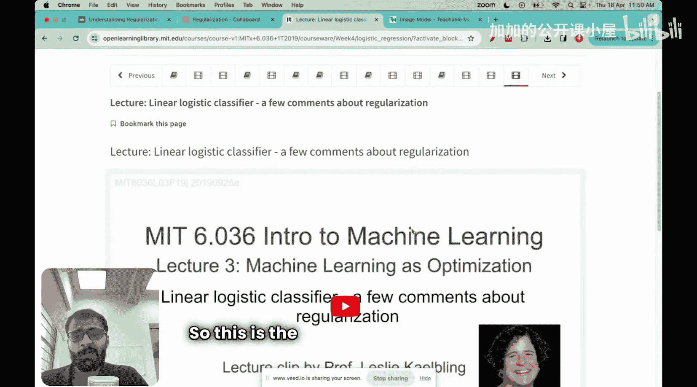

在本节课中，我们将学习机器学习中一个最重要的概念——正则化。正则化是任何优秀机器学习课程都会涵盖的内容，其核心目标是提升模型在未见数据上的表现能力，即泛化能力。

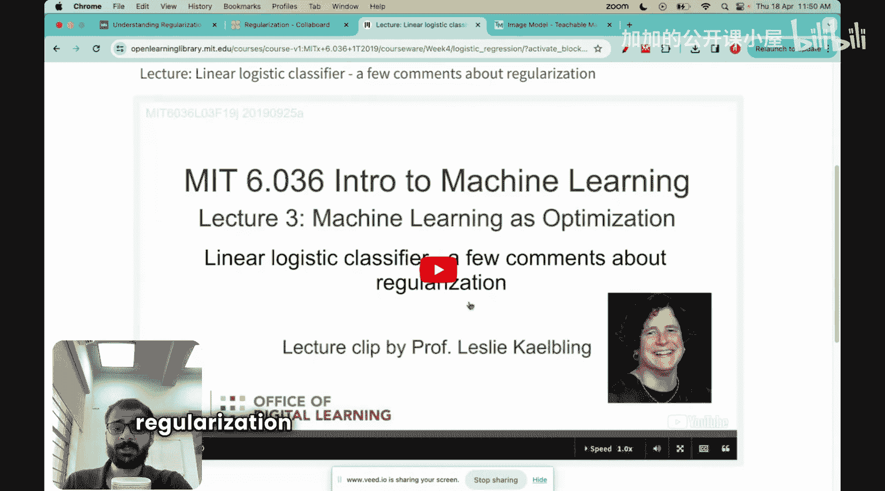

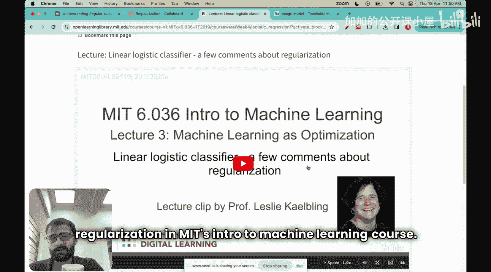

上一节我们完整地从零实现了逻辑分类器，但并未涉及正则化。本节我们将重点探讨这个概念。

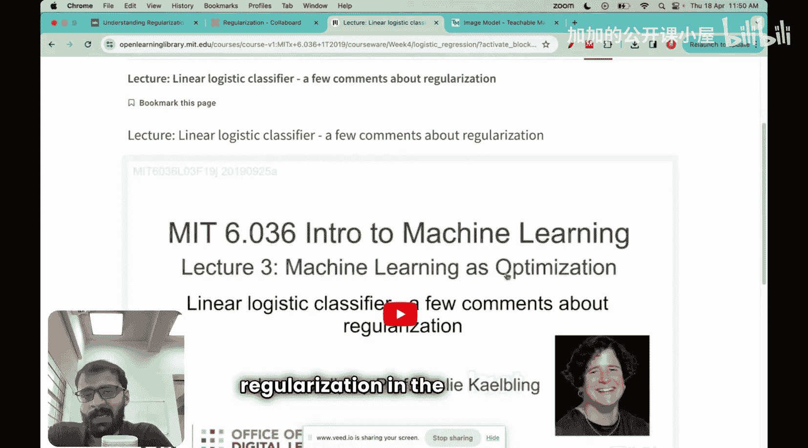

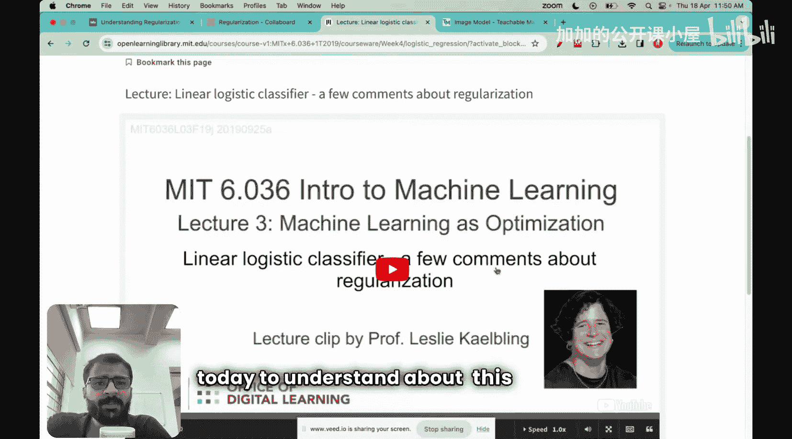

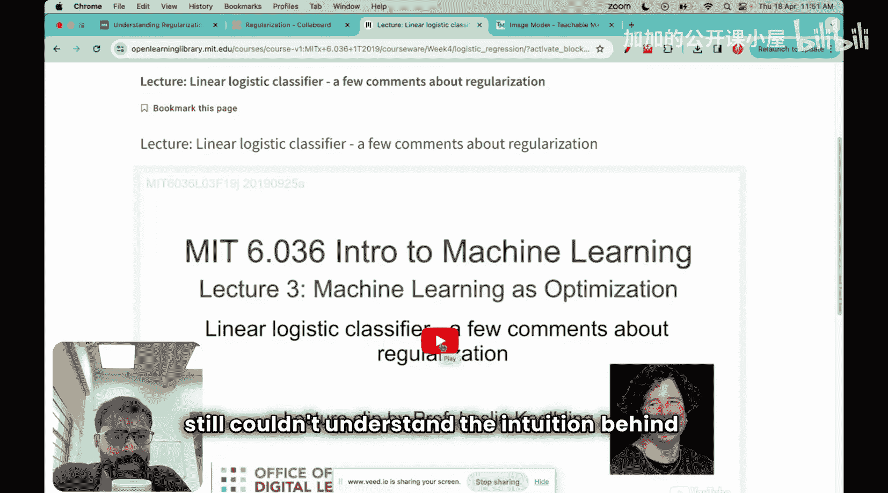

## 理解训练与测试数据

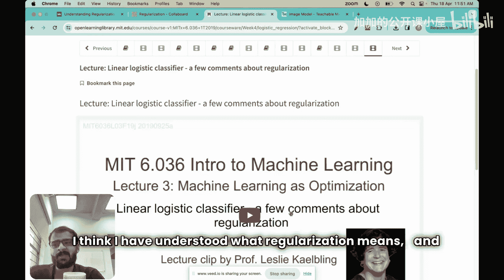

在深入正则化之前，首先需要理解任何机器学习算法都依赖数据。数据通常被分为两种类型：
*   **训练数据**：占数据的大部分，用于训练模型。
*   **测试数据**：占数据的少部分，用于评估模型在未知数据上的表现。

以下是一个简单的例子来说明这两个概念：
1.  假设我们要构建一个区分猫和狗的分类器。
2.  我们上传10张猫的图片和10张狗的图片作为**训练数据**。
3.  基于这些训练数据，我们训练一个机器学习模型。
4.  模型训练完成后，我们上传它从未见过的图片（例如一张狗的侧视图）作为**测试数据**。
5.  如果模型能准确预测这些新图片，说明它具有良好的**泛化能力**。这正是所有机器学习模型的主要目标：不仅在训练数据上表现良好，更要在未见过的数据上表现良好。

正则化的主要目的就是为了实现这个目标。

## 正则化的数学形式

在逻辑回归中，我们将机器学习视为优化问题，目标是最小化一个目标函数。之前我们只关注了损失函数部分，但实际上完整的目标函数包含两项：

**目标函数公式：**
`J(θ) = L(θ) + λ * R(θ)`

其中：
*   `L(θ)` 是**损失函数**，衡量模型预测与真实值之间的差异。对于逻辑回归，这通常是交叉熵损失。
*   `R(θ)` 是**正则化项**。
*   `λ` 是一个**超参数**，用于控制正则化的强度。

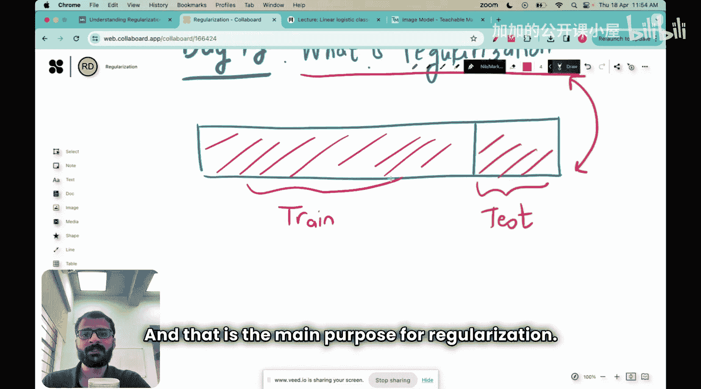

我们的目标是最小化整个目标函数 `J(θ)`。

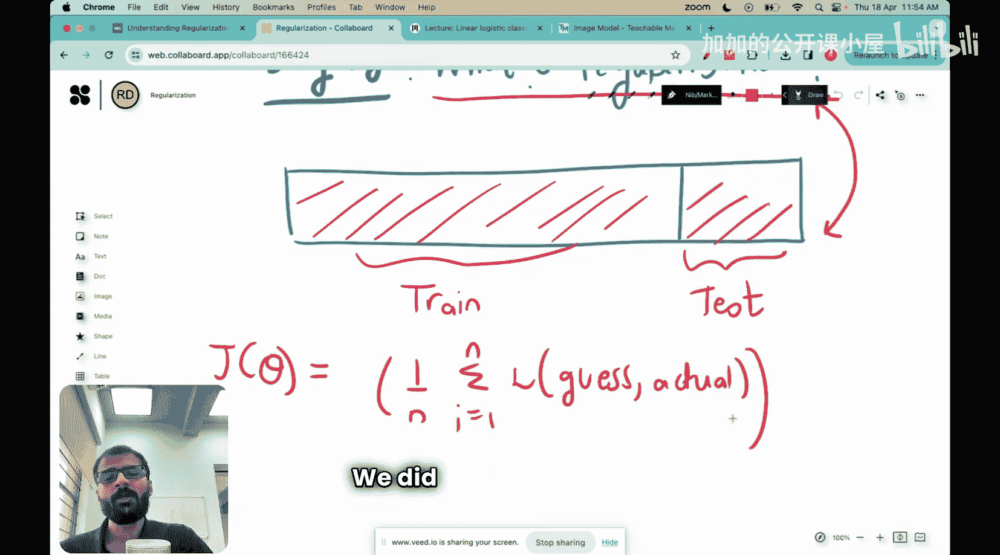

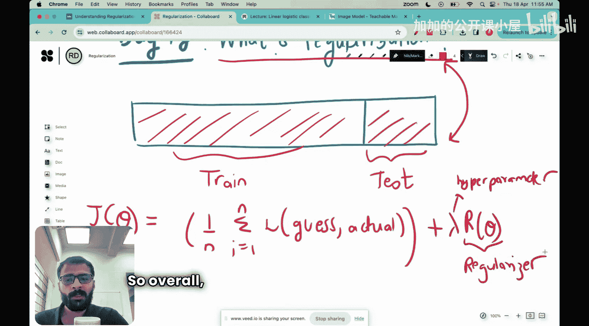

## 正则化项的含义

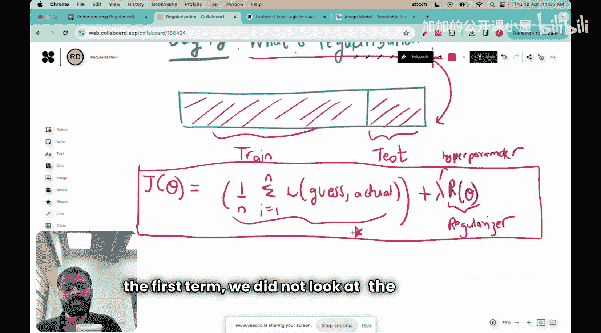

以二维情况为例，假设我们的决策边界是直线：`θ₁x₁ + θ₂x₂ + θ₀ = 0`。一种常见的正则化项（L2正则化）形式为：

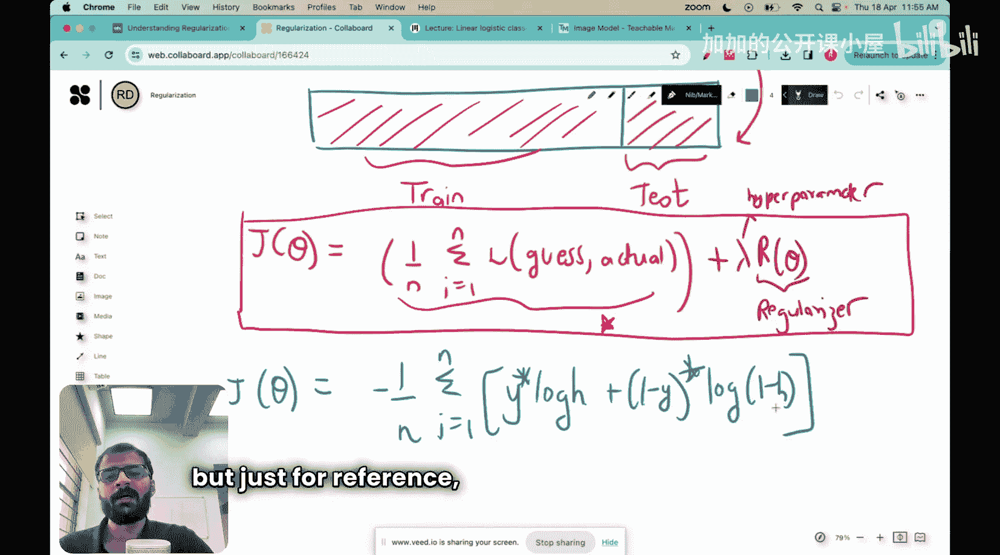

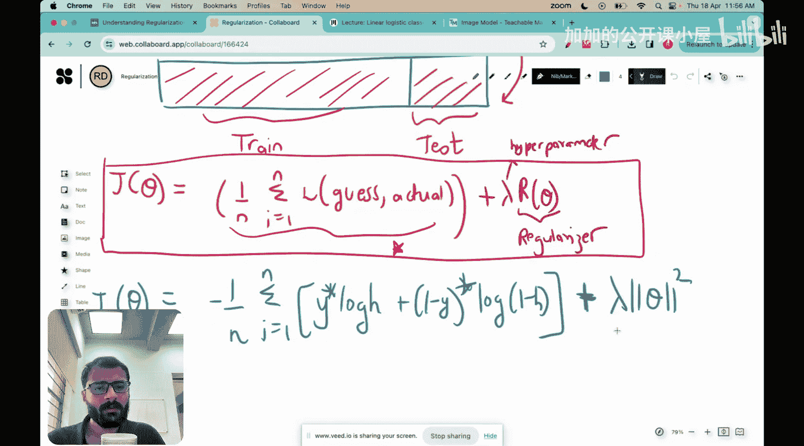

**正则化项公式（二维）：**
`R(θ) = (θ₁² + θ₂²) / n`

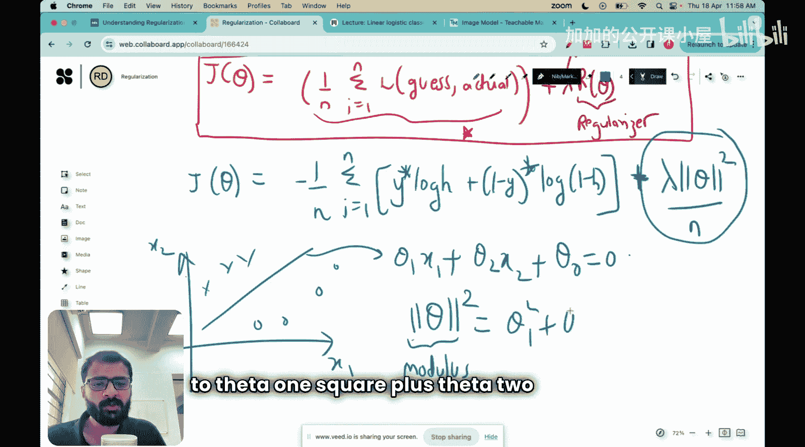

其中 `n` 是数据点的数量。

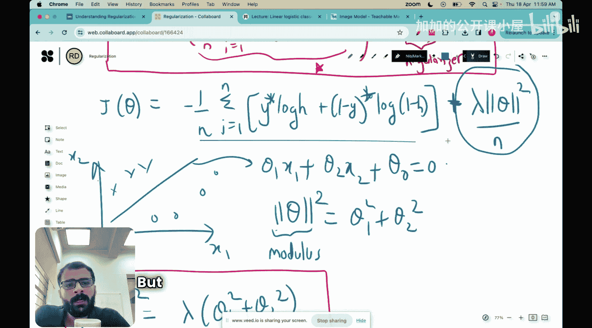

由于我们需要最小化 `J(θ)`，而 `J(θ)` 是损失 `L(θ)` 和正则项 `λ * R(θ)` 的和，这意味着我们同时也希望最小化正则化项 `R(θ)`。在二维例子中，即我们希望 `θ₁` 和 `θ₂` 的值尽可能小。

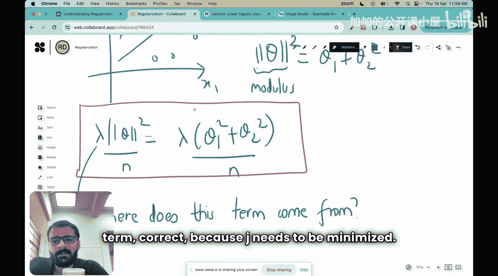

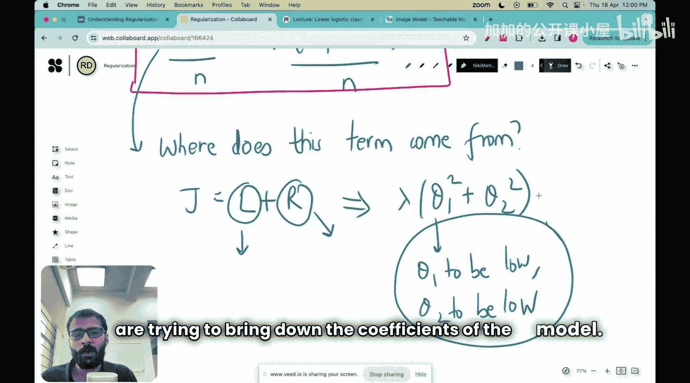

**核心问题随之而来：为什么我们希望模型的参数（系数）变小？鼓励模型参数保持较小值背后的直觉是什么？**

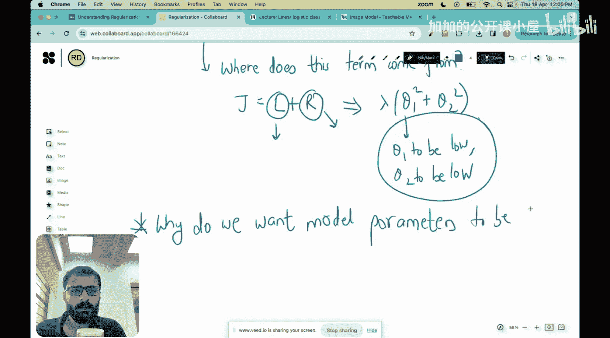

本节课我们一起学习了正则化的基本概念，理解了其目标是提升模型泛化能力，并初步认识了其在目标函数中的数学形式。下一节，我们将深入探讨“为什么需要小参数”这个核心问题，从而真正理解正则化的直觉。