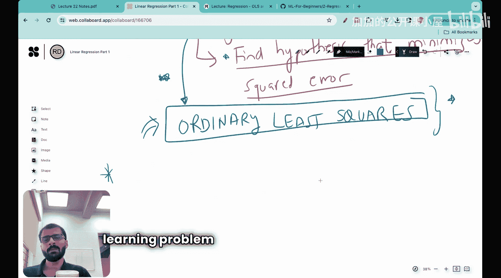
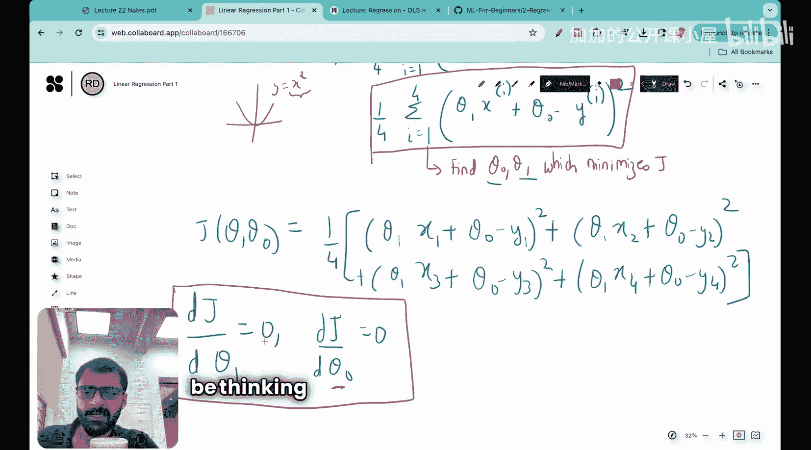

#  022：普通最小二乘法逐步实现 🧮

在本节课中，我们将学习回归分析中一项非常重要的技术——普通最小二乘法。这项技术将帮助我们找到能够最小化平方误差的假设函数。

上一节我们介绍了线性回归，并学习了其假设函数（在二维或三维空间中是一条直线）和我们将要使用的损失函数——平方损失函数。本节中，我们将进入机器学习框架的第四步：将机器学习问题表述为一个优化问题，并通过优化过程找到最佳假设函数。这正是我们接下来要做的。

## 从实践演示开始 🚀

许多课程在讲解普通最小二乘法时，会直接从其矩阵形式开始，但并未展示如何通过动手实践一步步推导出解。与我们在本课程中的一贯做法类似，我们将从一个非常实用的动手演示开始，让你自己推导出解。这样，普通最小二乘法对你来说将变得非常直观。在你亲自为演示找到解之后，我们再来看矩阵形式，并观察矩阵形式与我们所得结果之间的相似之处。

如果你有一些线性代数的基础知识，对本节课会很有帮助。如果没有，也没关系。对于不理解的部分，你可以在课后去学习相关的线性代数知识。

以下是我们的实践问题：
我们有一个包含四个点的数据集，坐标如下：
*   点1: (1, 2)
*   点2: (2, 3)
*   点3: (3, 5)
*   点4: (4, 4)

我们的目标是找到最佳直线 `y = θ₁x + θ₀`，使得这条直线对所有数据点的平方损失最小。

## 构建优化问题 ⚙️

首先，我们需要构建需要最小化的目标函数。目标函数 `J` 依赖于两个参数 `θ₁` 和 `θ₀`。一旦这两个参数确定，假设函数也就确定了。

目标函数是平均平方误差，对于我们的四个数据点，其公式如下：

`J(θ₁, θ₀) = (1/4) * Σ (从 i=1 到 4) (预测值ᵢ - 实际值ᵢ)²`

其中，预测值就是我们的假设函数：`预测值ᵢ = θ₁ * xᵢ + θ₀`。

因此，目标函数可以详细展开为：

`J(θ₁, θ₀) = (1/4) * [ (θ₁*x₁ + θ₀ - y₁)² + (θ₁*x₂ + θ₀ - y₂)² + (θ₁*x₃ + θ₀ - y₃)² + (θ₁*x₄ + θ₀ - y₄)² ]`

我们的任务是找到能够最小化 `J` 的 `θ₀` 和 `θ₁`。

## 通过求导求解最优参数 📉

当我们有一个函数（例如 `y = x²`）并想找到使其最小的 `x` 时，我们会求导并令导数等于零。这正是我们现在要做的。

我们需要优化两个参数 `θ₁` 和 `θ₀`。因此，我们需要确保目标函数 `J` 对这两个参数的偏导数都等于零，此时对应的 `θ₀` 和 `θ₁` 就是最优解（在凸优化问题中，这对应最小值点）。

所以，我们需要建立并求解以下两个方程：
1.  `∂J/∂θ₁ = 0`
2.  `∂J/∂θ₀ = 0`

接下来，我们将具体计算这些偏导数。首先，将我们的数据点坐标代入详细的目标函数：

`J(θ₁, θ₀) = (1/4) * [ (θ₁*1 + θ₀ - 2)² + (θ₁*2 + θ₀ - 3)² + (θ₁*3 + θ₀ - 5)² + (θ₁*4 + θ₀ - 4)² ]`

现在，我们分别对 `θ₁` 和 `θ₀` 求偏导数。

**对 `θ₁` 求偏导 (`∂J/∂θ₁`):**
应用链式法则，每一项的导数为：`2*(θ₁*xᵢ + θ₀ - yᵢ) * xᵢ`。
因此：
`∂J/∂θ₁ = (1/4) * [ 2*(θ₁*1+θ₀-2)*1 + 2*(θ₁*2+θ₀-3)*2 + 2*(θ₁*3+θ₀-5)*3 + 2*(θ₁*4+θ₀-4)*4 ]`
令其等于0，并简化（两边同时乘以4并除以2）：
`(θ₁*1+θ₀-2)*1 + (θ₁*2+θ₀-3)*2 + (θ₁*3+θ₀-5)*3 + (θ₁*4+θ₀-4)*4 = 0`

**对 `θ₀` 求偏导 (`∂J/∂θ₀`):**
每一项的导数为：`2*(θ₁*xᵢ + θ₀ - yᵢ) * 1`。
因此：
`∂J/∂θ₀ = (1/4) * [ 2*(θ₁*1+θ₀-2) + 2*(θ₁*2+θ₀-3) + 2*(θ₁*3+θ₀-5) + 2*(θ₁*4+θ₀-4) ]`
令其等于0，并简化（两边同时乘以4并除以2）：
`(θ₁*1+θ₀-2) + (θ₁*2+θ₀-3) + (θ₁*3+θ₀-5) + (θ₁*4+θ₀-4) = 0`

## 整理并求解方程组 🔢

现在，我们得到了两个关于 `θ₁` 和 `θ₀` 的方程。让我们整理它们。

从 `∂J/∂θ₀ = 0` 的方程开始（我们称其为方程 A）：
`(θ₁ + θ₀ - 2) + (2θ₁ + θ₀ - 3) + (3θ₁ + θ₀ - 5) + (4θ₁ + θ₀ - 4) = 0`
合并同类项：
`(θ₁+2θ₁+3θ₁+4θ₁) + (θ₀+θ₀+θ₀+θ₀) + (-2-3-5-4) = 0`
`10θ₁ + 4θ₀ - 14 = 0`  **(方程 A)**

从 `∂J/∂θ₁ = 0` 的方程开始（我们称其为方程 B）：
`1*(θ₁+θ₀-2) + 2*(2θ₁+θ₀-3) + 3*(3θ₁+θ₀-5) + 4*(4θ₁+θ₀-4) = 0`
展开：
`(θ₁+θ₀-2) + (4θ₁+2θ₀-6) + (9θ₁+3θ₀-15) + (16θ₁+4θ₀-16) = 0`
合并同类项：
`(θ₁+4θ₁+9θ₁+16θ₁) + (θ₀+2θ₀+3θ₀+4θ₀) + (-2-6-15-16) = 0`
`30θ₁ + 10θ₀ - 39 = 0`  **(方程 B)**

现在我们有了一个二元一次方程组：
1.  `10θ₁ + 4θ₀ = 14`  (方程 A)
2.  `30θ₁ + 10θ₀ = 39` (方程 B)

我们可以用消元法求解。将方程 A 乘以 2.5：`25θ₁ + 10θ₀ = 35`。用方程 B 减去这个新方程：
`(30θ₁ + 10θ₀) - (25θ₁ + 10θ₀) = 39 - 35`
`5θ₁ = 4`
`θ₁ = 0.8`

将 `θ₁ = 0.8` 代入方程 A：
`10*0.8 + 4θ₀ = 14`
`8 + 4θ₀ = 14`
`4θ₀ = 6`
`θ₀ = 1.5`

## 得到最佳拟合直线 🎯

因此，通过普通最小二乘法，我们得到的最佳拟合直线参数为：
`θ₁ = 0.8`
`θ₀ = 1.5`

所以，最优假设函数（直线）是：
`y = 0.8x + 1.5`

这条直线最小化了给定四个数据点的总平方误差。

## 与矩阵形式关联 🔗

在我们亲手推导出解之后，现在可以简要关联到普通最小二乘法的常见矩阵形式。对于线性回归 `y = Xθ`，其中 `X` 是包含特征（和常数项）的设计矩阵，`θ` 是参数向量，`y` 是目标值向量，最小二乘解由以下正规方程给出：
`θ = (XᵀX)⁻¹Xᵀy`

我们刚才逐步求解的过程，本质上就是对这个特定小数据集手动推导并求解了这个正规方程。矩阵形式是将这个过程推广到任意数量特征和数据点的紧凑数学表示。

## 总结 📝

本节课中，我们一起学习了普通最小二乘法的核心思想与逐步实现。我们从具体的四个数据点出发，定义了平方损失目标函数，然后通过对其两个参数分别求偏导并令其为零，将问题转化为一个二元一次方程组。通过求解这个方程组，我们得到了最佳拟合直线的斜率和截距。最后，我们了解到这一逐步推导过程与OLS的经典矩阵形式在本质上是相通的。这种方法确保了我们对最小二乘原理有了坚实而直观的理解。