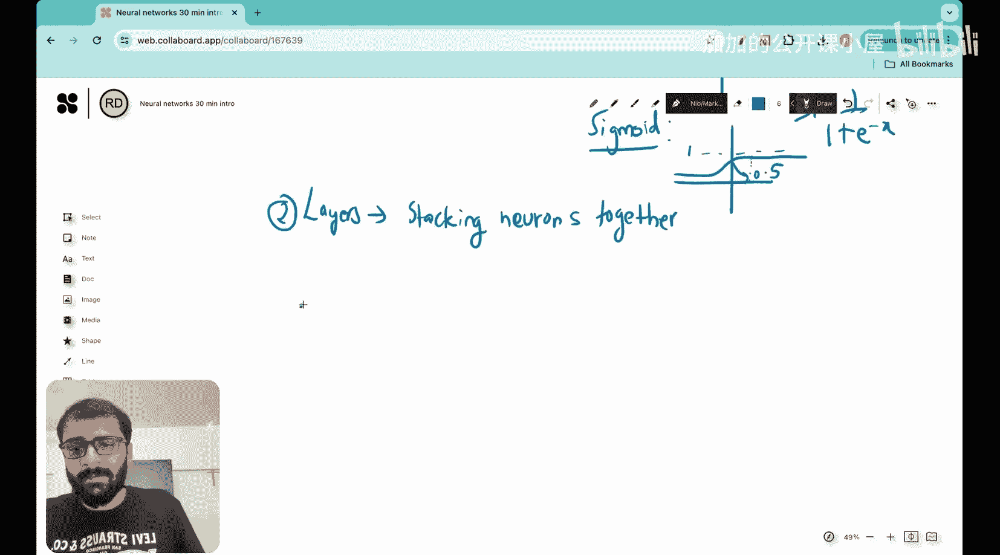

#  025：30分钟理解神经网络架构 🧠

在本节课中，我们将学习神经网络架构的核心组成部分。我们将从最基本的构建单元开始，逐步将它们组合起来，最终理解一个完整的神经网络是如何工作的。内容设计简单直白，适合初学者。

---

## 概述

本节课我们将学习神经网络的两个核心构建模块：神经元和层。我们将解释神经元如何接收输入、进行计算并产生输出，以及如何通过堆叠神经元形成层来构建强大的神经网络模型。

---

## 神经元：神经网络的基本单元 🧱

上一节我们介绍了本课程的目标。本节中，我们来看看神经网络的第一个，也是最小的构建模块——神经元。

神经元是神经网络架构中最小的构建单元，其最简单的功能是接收输入并产生输出。它通常用一个圆圈表示。

神经元之所以被称为“神经元”，是因为这个概念最初是为了模拟生物大脑中的神经元而提出的。我们大脑中的神经元也以类似的方式工作：接收输入，然后产生输出。

因此，神经元的功能就是接收输入并产生输出。

你可能会想，这些输入和输出具体是什么？神经元内部到底发生了什么？

输入是用于进行预测的特征。例如，假设我们有三个主要属性：瞳孔直径、耳朵下垂指数和胡须长度。我们的目标是让神经网络接收这三个特征作为输入，然后输出判断目标是猫还是狗。

为了演示，让我们具体观察一个神经元及其输入、输出和内部过程。假设有三个输入：`x1`（瞳孔直径）、`x2`（耳朵下垂指数）和`x3`（胡须长度）。这个神经元有三个输入。

每个输入都有一个与之关联的权重，分别是 `w1`、`w2` 和 `w3`。权重的存在是为了表示该特征的重要性。例如，如果 `w1` 远大于 `w2` 和 `w3`，则表明这个神经元非常重视瞳孔直径这个特征。

现在，我们有一个输出，暂时称之为 `y`。

那么，在这个“魔法”发生的神经元内部，到底进行了哪些操作呢？每个神经元本质上执行三个重要功能：

以下是神经元内部执行的三个主要操作：

1.  **求和运算**：对加权后的输入进行求和。
2.  **添加偏置**：在求和结果上加上一个偏置项。
3.  **激活函数**：对加上偏置后的结果应用一个非线性函数。

用数学公式表示，神经元的输出 `y` 为：
`y = f(w1*x1 + w2*x2 + w3*x3 + b)`
其中，`f` 是激活函数，`b` 是偏置项。

你可以看到求和、偏置和激活函数这三个元素是如何结合在一起的。

神经网络中的每个神经元都执行这三个功能：接收输入特征 `x1, x2, x3`，分配权重 `w1, w2, w3`，然后产生输出 `y`。

在神经元内部发生的这三个操作中，求和与添加偏置相对直接，它们在回归和分类问题中也出现过。神经元真正的力量主要来自于**激活函数**。

激活函数有很多种。例如：
*   **ReLU（修正线性单元）**：一个非常常见的激活函数。对于负的输入值，输出为0；对于正的输入值，输出等于输入值。其函数为 `max(0, x)`。
*   **Sigmoid（S型函数）**：另一个著名的激活函数，用于为事件分配概率。其数学形式为 `1 / (1 + e^(-x))`。

回到我们的猫狗分类例子，我们本质上想分配概率。Sigmoid 是一个很好的激活函数。我们可以使用 Sigmoid，然后如果输出大于 0.5，我们就说它是狗；如果小于 0.5，就说它是猫（选择 0.5 是因为 Sigmoid 函数在 y=0.5 处穿过中点）。

因此，如果我们使用 Sigmoid 激活函数，那么这个神经元的输出将变为：
`y = σ(w1*x1 + w2*x2 + w3*x3 + b)`

假设我们取一些随机值：`w1=1, w2=1, w3=1, x1=1, x2=1, x3=1, b=0`。对于这些权重值，神经元的输出将是 `σ(3)`。查看 Sigmoid 函数图，`σ(3)` 的值在正侧，大于 0.5。因此，根据我们的设定，我们会判断它为猫。

请记住，我们目前并不知道这些权重 `w1, w2, w3` 的具体值。寻找这些权重，使得模型的答案与我们的训练数据和测试数据良好匹配，正是训练或优化这个神经元的主要目的。但目前，我向你展示了神经元的主要功能。

这就是神经网络的第一个构建模块——神经元。

---

## 层：神经网络的表达能力之源 🏗️

你可能会想，这有什么特别的？因为看公式 `σ(w^T x + b)`，这看起来就像逻辑回归，那里我们也有一个 Sigmoid 激活函数，也是根据是否大于 0.5 来分类。

那么神经网络的真正力量在哪里？神经网络的真正力量来自于第二个构建模块——**层**。

层就是将一堆神经元堆叠在一起。正是这里体现了神经网络真正的表达能力。

当我们想到层时，就是将一堆神经元堆叠在一起。让我们看看这种堆叠具体是什么样子。

假设这些仍然是我的输入：`x1`, `x2`, `x3`。现在，我们不是只有一个神经元，而是有多个神经元并排排列。例如，我们可以有四个神经元，它们都接收相同的三个输入 `x1, x2, x3`。这一组并排的神经元就形成了一个**层**，更具体地说，是一个**密集层**或**全连接层**，因为每个输入都连接到该层的每个神经元。

通过堆叠层，我们可以构建深度神经网络。一层的输出可以作为下一层的输入。这种分层结构使得网络能够学习输入数据中越来越复杂和抽象的特征。

例如，第一层可能学习识别图像中的边缘，第二层可能将这些边缘组合成形状（如圆形、方形），第三层可能将这些形状组合成更复杂的模式（如眼睛、鼻子），最终层则根据这些高级特征做出分类决策。

---

## 总结

本节课中，我们一起学习了神经网络架构的两个核心构建块：
1.  **神经元**：接收输入、进行加权求和、添加偏置并应用激活函数以产生输出的基本计算单元。
2.  **层**：通过堆叠多个神经元形成，是神经网络学习复杂模式和表达能力的来源。层的堆叠构成了深度神经网络的基础。

理解神经元和层是如何工作的，是理解任何现代神经网络模型的第一步。